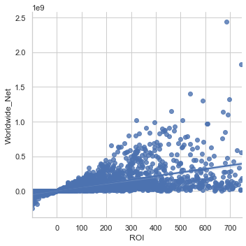
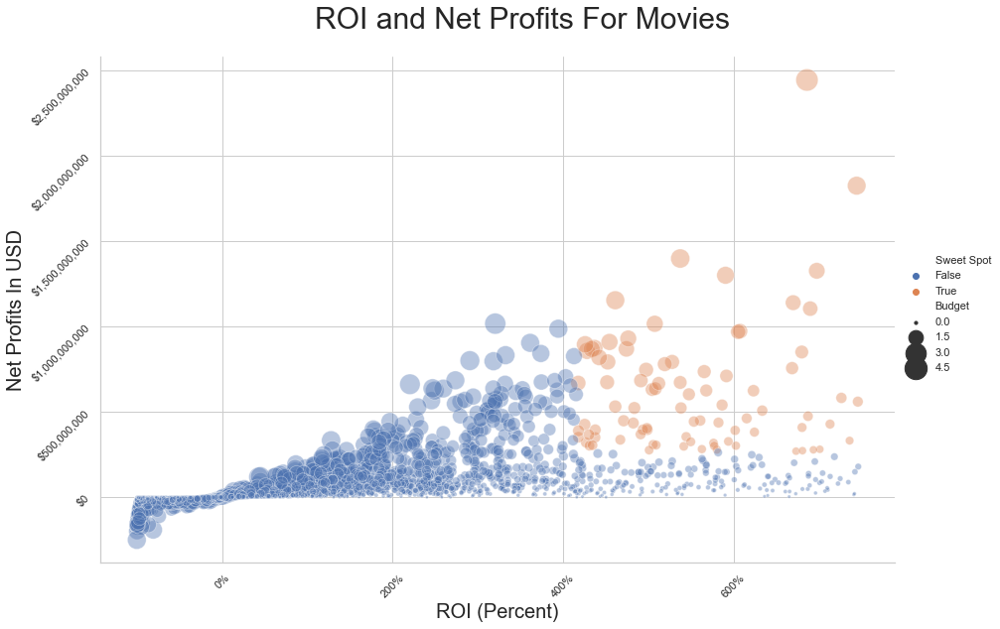
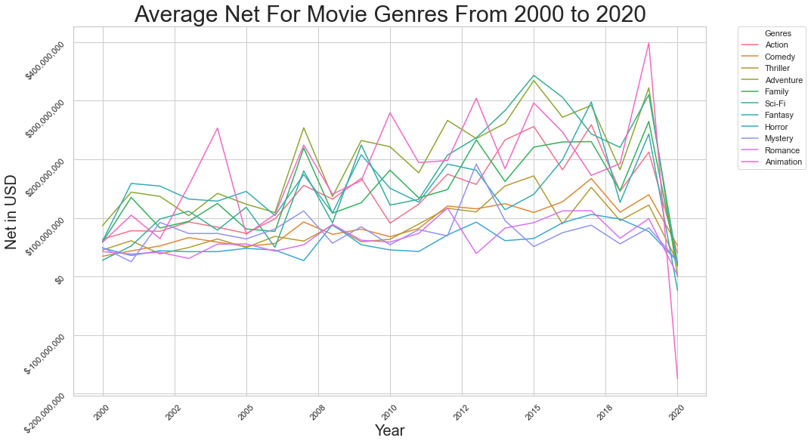
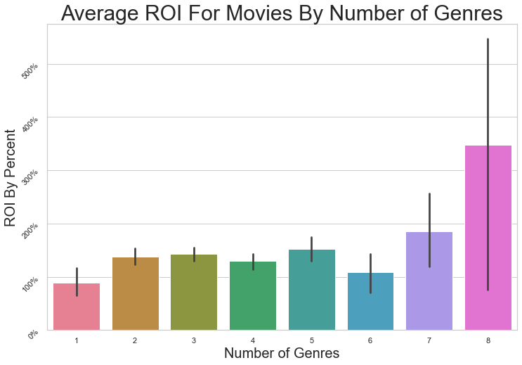
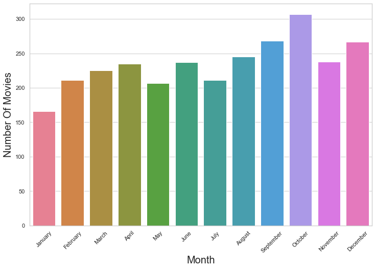
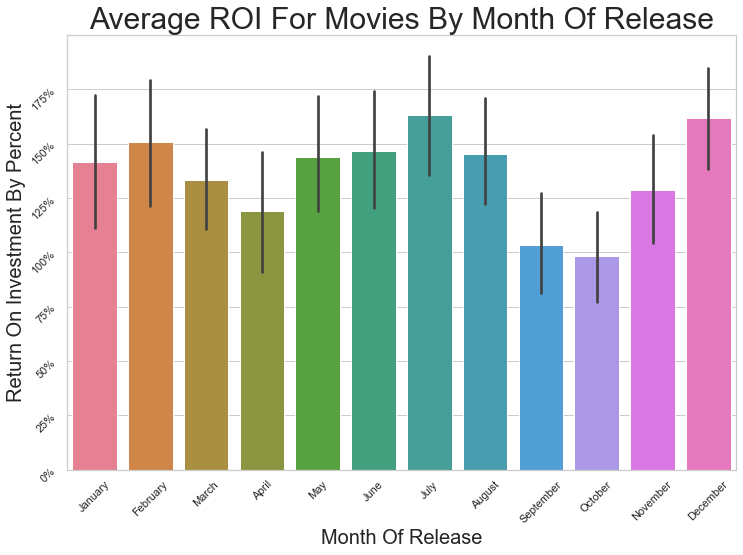

## Final Project Submission

* Student name: Vivienne DiFrancesco
* Student pace: Full Time
* Scheduled project review date/time: 8/4/20 @ 5:30 PM EDT 
* Instructor name: James Irving


# Introduction: Analysis of Movie Trends


The movie industry can feel like playing a game of chance. Movies can be a great investment or totally flop. [With the average major studio movie costing around $100 million to make](https://www.investopedia.com/financial-edge/0611/why-movies-cost-so-much-to-make.aspx#:~:text=The%20average%20cost%20to%20produce,to%20right%20about%20%24100%20million.), producing a movie should not be entered into lightly. It can be difficult for new studios to come to the market without some knowledge on how to maximize the chance of a hit.

I set out on this project to make concrete recommendations for how to make a profitable movie. Of course there is no guarantee of success, but with good data making a profitable movie can feel less like luck and more like skill. There are seemingly endless metrics to analyze; many more, at least, than what I lay out here. But my goal is to make useful and actionable recommendations. I share my process from beginning to end for critique of my findings, further analysis, or simply testing if my results could be replicated.

# Data to DataFrame

I got my data from [Box Office Mojo](https://www.boxofficemojo.com). The site had great information for the gross profits of the movies and each page was neatly organized by year. The URL was also simple to break down for the different years which made it possible to write into a function for scraping. 

For more information on how I scraped my data, I put that code and explanation in a separate notebook in this same folder of work.


```python
# Importing necessary libraries
import numpy as np
import pandas as pd
```


```python
# Turning my data into a dataframe
df = pd.read_csv('BoxOfficeMojoScrapeFinal.csv')
df.head()
```


<div>
<style scoped>
    .dataframe tbody tr th:only-of-type {
        vertical-align: middle;
    }

    .dataframe tbody tr th {
        vertical-align: top;
    }

    .dataframe thead th {
        text-align: right;
    }
</style>
<table border="1" class="dataframe">
  <thead>
    <tr style="text-align: right;">
      <th></th>
      <th>Unnamed: 0</th>
      <th>Unnamed: 0.1</th>
      <th>Year_Rank</th>
      <th>Title</th>
      <th>Worldwide_Gross</th>
      <th>Domestic</th>
      <th>Percent_Domestic</th>
      <th>Foreign</th>
      <th>Percent_Foreign</th>
      <th>Year</th>
      <th>Domestic Distributor</th>
      <th>Domestic Opening</th>
      <th>Budget</th>
      <th>Earliest Release Date</th>
      <th>MPAA</th>
      <th>Running Time</th>
      <th>Genres</th>
      <th>\n                        IMDbPro\n</th>
    </tr>
  </thead>
  <tbody>
    <tr>
      <td>0</td>
      <td>0</td>
      <td>0</td>
      <td>1</td>
      <td>Bad Boys for Life</td>
      <td>$419,074,646</td>
      <td>$204,417,855</td>
      <td>48.8%</td>
      <td>$214,656,791</td>
      <td>51.2%</td>
      <td>2020</td>
      <td>Sony Pictures Entertainment (SPE)See full comp...</td>
      <td>$62,504,105</td>
      <td>$90,000,000</td>
      <td>January 15, 2020\n            (LATAM, APAC)</td>
      <td>R</td>
      <td>2 hr 4 min</td>
      <td>Action\n    \n        Comedy\n    \n        Cr...</td>
      <td>See more details at IMDbPro\n\n</td>
    </tr>
    <tr>
      <td>1</td>
      <td>1</td>
      <td>1</td>
      <td>2</td>
      <td>Sonic the Hedgehog</td>
      <td>$306,766,470</td>
      <td>$146,066,470</td>
      <td>47.6%</td>
      <td>$160,700,000</td>
      <td>52.4%</td>
      <td>2020</td>
      <td>Paramount PicturesSee full company information...</td>
      <td>$58,018,348</td>
      <td>$85,000,000</td>
      <td>February 12, 2020\n            (APAC, EMEA)</td>
      <td>PG</td>
      <td>1 hr 39 min</td>
      <td>Action\n    \n        Adventure\n    \n       ...</td>
      <td>See more details at IMDbPro\n\n</td>
    </tr>
    <tr>
      <td>2</td>
      <td>2</td>
      <td>2</td>
      <td>3</td>
      <td>Dolittle</td>
      <td>$224,752,486</td>
      <td>$77,047,065</td>
      <td>34.3%</td>
      <td>$147,705,421</td>
      <td>65.7%</td>
      <td>2020</td>
      <td>Universal PicturesSee full company information...</td>
      <td>$21,844,045</td>
      <td>$175,000,000</td>
      <td>January 8, 2020\n            (South Korea)</td>
      <td>PG</td>
      <td>1 hr 41 min</td>
      <td>Adventure\n    \n        Comedy\n    \n       ...</td>
      <td>See more details at IMDbPro\n\n</td>
    </tr>
    <tr>
      <td>3</td>
      <td>3</td>
      <td>3</td>
      <td>4</td>
      <td>Birds of Prey: And the Fantabulous Emancipatio...</td>
      <td>$201,858,461</td>
      <td>$84,158,461</td>
      <td>41.7%</td>
      <td>$117,700,000</td>
      <td>58.3%</td>
      <td>2020</td>
      <td>Warner Bros.See full company information\n\n</td>
      <td>$33,010,017</td>
      <td>$84,500,000</td>
      <td>February 5, 2020\n            (APAC, EMEA)</td>
      <td>R</td>
      <td>1 hr 49 min</td>
      <td>Action\n    \n        Adventure\n    \n       ...</td>
      <td>See more details at IMDbPro\n\n</td>
    </tr>
    <tr>
      <td>4</td>
      <td>4</td>
      <td>4</td>
      <td>5</td>
      <td>The Invisible Man</td>
      <td>$128,251,913</td>
      <td>$64,914,050</td>
      <td>50.6%</td>
      <td>$63,337,863</td>
      <td>49.4%</td>
      <td>2020</td>
      <td>Universal PicturesSee full company information...</td>
      <td>$28,205,665</td>
      <td>$7,000,000</td>
      <td>February 26, 2020\n            (EMEA, APAC)</td>
      <td>R</td>
      <td>2 hr 4 min</td>
      <td>Horror\n    \n        Mystery\n    \n        S...</td>
      <td>See more details at IMDbPro\n\n</td>
    </tr>
  </tbody>
</table>
</div>


```python
# Setting pandas to display all the rows of my dataframes
pd.set_option('display.max_rows', None)
```


```python
# Setting pandas to NOT use scientific notation 
# when displaying the number values of my data
pd.set_option('display.float_format', lambda x: '%.3f' % x)
```


```python
# Checking number of columns and rows
df.shape
```


    (12728, 18)


```python
# Looking at my columns, data types, and null values
df.info()
```

    <class 'pandas.core.frame.DataFrame'>
    RangeIndex: 12728 entries, 0 to 12727
    Data columns (total 18 columns):
    Unnamed: 0                                               12728 non-null int64
    Unnamed: 0.1                                             12728 non-null int64
    Year_Rank                                                12728 non-null int64
    Title                                                    12728 non-null object
    Worldwide_Gross                                          12728 non-null object
    Domestic                                                 12728 non-null object
    Percent_Domestic                                         12728 non-null object
    Foreign                                                  12728 non-null object
    Percent_Foreign                                          12728 non-null object
    Year                                                     12728 non-null int64
    Domestic Distributor                                     12298 non-null object
    Domestic Opening                                         11142 non-null object
    Budget                                                   2817 non-null object
    Earliest Release Date                                    12728 non-null object
    MPAA                                                     7322 non-null object
    Running Time                                             12671 non-null object
    Genres                                                   12694 non-null object
    
                            IMDbPro
                            12728 non-null object
    dtypes: int64(4), object(14)
    memory usage: 1.7+ MB
    

I created a new column before cleaning so that in the cleaning process as I fill empty values and change data types, I wouldn't lose the ability to filter by what entries have budget information.


```python
# Creating new column for filtering by what entries have budget information
df['Budget_notna'] = df['Budget'].notna()
df.head()
```


<div>
<style scoped>
    .dataframe tbody tr th:only-of-type {
        vertical-align: middle;
    }

    .dataframe tbody tr th {
        vertical-align: top;
    }

    .dataframe thead th {
        text-align: right;
    }
</style>
<table border="1" class="dataframe">
  <thead>
    <tr style="text-align: right;">
      <th></th>
      <th>Unnamed: 0</th>
      <th>Unnamed: 0.1</th>
      <th>Year_Rank</th>
      <th>Title</th>
      <th>Worldwide_Gross</th>
      <th>Domestic</th>
      <th>Percent_Domestic</th>
      <th>Foreign</th>
      <th>Percent_Foreign</th>
      <th>Year</th>
      <th>Domestic Distributor</th>
      <th>Domestic Opening</th>
      <th>Budget</th>
      <th>Earliest Release Date</th>
      <th>MPAA</th>
      <th>Running Time</th>
      <th>Genres</th>
      <th>\n                        IMDbPro\n</th>
      <th>Budget_notna</th>
    </tr>
  </thead>
  <tbody>
    <tr>
      <td>0</td>
      <td>0</td>
      <td>0</td>
      <td>1</td>
      <td>Bad Boys for Life</td>
      <td>$419,074,646</td>
      <td>$204,417,855</td>
      <td>48.8%</td>
      <td>$214,656,791</td>
      <td>51.2%</td>
      <td>2020</td>
      <td>Sony Pictures Entertainment (SPE)See full comp...</td>
      <td>$62,504,105</td>
      <td>$90,000,000</td>
      <td>January 15, 2020\n            (LATAM, APAC)</td>
      <td>R</td>
      <td>2 hr 4 min</td>
      <td>Action\n    \n        Comedy\n    \n        Cr...</td>
      <td>See more details at IMDbPro\n\n</td>
      <td>True</td>
    </tr>
    <tr>
      <td>1</td>
      <td>1</td>
      <td>1</td>
      <td>2</td>
      <td>Sonic the Hedgehog</td>
      <td>$306,766,470</td>
      <td>$146,066,470</td>
      <td>47.6%</td>
      <td>$160,700,000</td>
      <td>52.4%</td>
      <td>2020</td>
      <td>Paramount PicturesSee full company information...</td>
      <td>$58,018,348</td>
      <td>$85,000,000</td>
      <td>February 12, 2020\n            (APAC, EMEA)</td>
      <td>PG</td>
      <td>1 hr 39 min</td>
      <td>Action\n    \n        Adventure\n    \n       ...</td>
      <td>See more details at IMDbPro\n\n</td>
      <td>True</td>
    </tr>
    <tr>
      <td>2</td>
      <td>2</td>
      <td>2</td>
      <td>3</td>
      <td>Dolittle</td>
      <td>$224,752,486</td>
      <td>$77,047,065</td>
      <td>34.3%</td>
      <td>$147,705,421</td>
      <td>65.7%</td>
      <td>2020</td>
      <td>Universal PicturesSee full company information...</td>
      <td>$21,844,045</td>
      <td>$175,000,000</td>
      <td>January 8, 2020\n            (South Korea)</td>
      <td>PG</td>
      <td>1 hr 41 min</td>
      <td>Adventure\n    \n        Comedy\n    \n       ...</td>
      <td>See more details at IMDbPro\n\n</td>
      <td>True</td>
    </tr>
    <tr>
      <td>3</td>
      <td>3</td>
      <td>3</td>
      <td>4</td>
      <td>Birds of Prey: And the Fantabulous Emancipatio...</td>
      <td>$201,858,461</td>
      <td>$84,158,461</td>
      <td>41.7%</td>
      <td>$117,700,000</td>
      <td>58.3%</td>
      <td>2020</td>
      <td>Warner Bros.See full company information\n\n</td>
      <td>$33,010,017</td>
      <td>$84,500,000</td>
      <td>February 5, 2020\n            (APAC, EMEA)</td>
      <td>R</td>
      <td>1 hr 49 min</td>
      <td>Action\n    \n        Adventure\n    \n       ...</td>
      <td>See more details at IMDbPro\n\n</td>
      <td>True</td>
    </tr>
    <tr>
      <td>4</td>
      <td>4</td>
      <td>4</td>
      <td>5</td>
      <td>The Invisible Man</td>
      <td>$128,251,913</td>
      <td>$64,914,050</td>
      <td>50.6%</td>
      <td>$63,337,863</td>
      <td>49.4%</td>
      <td>2020</td>
      <td>Universal PicturesSee full company information...</td>
      <td>$28,205,665</td>
      <td>$7,000,000</td>
      <td>February 26, 2020\n            (EMEA, APAC)</td>
      <td>R</td>
      <td>2 hr 4 min</td>
      <td>Horror\n    \n        Mystery\n    \n        S...</td>
      <td>See more details at IMDbPro\n\n</td>
      <td>True</td>
    </tr>
  </tbody>
</table>
</div>


#  Cleaning the Data

## Cleaning Money Value Columns

The money values from my scrape started as strings and have '$' and ',' characters. Those characters need to be removed before casting them as an integer data type.


```python
# Making a list of the money columns to iterate through.
money_columns = ['Worldwide_Gross', 'Domestic', 'Foreign', 'Domestic Opening', 'Budget']
# Filling the null values with 0 as a string to keep the data types consistent in the column.
for column in money_columns:
    df[column] = df[column].fillna('0')

```

I made sure to cast each column as string values because I was getting errors when I tried to go on before doing this. There must have been some rogue values that were imported into the dataframe as a different data type.


```python
# Making sure every value is a string.
df['Worldwide_Gross'] = df['Worldwide_Gross'].astype('str')
df['Domestic'] = df['Domestic'].astype('str')
df['Foreign'] = df['Foreign'].astype('str')
df['Domestic Opening'] = df['Domestic Opening'].astype('str')
df['Budget'] = df['Budget'].astype('str')
```

I created a function to replace all the non-numeric characters with nothing. Some of my columns contained '-' characters from the scrape when there was no information. I filled those in with zeros as strings like I did before when I used .fillna().


```python
# Iterates through each item to replace all the characters with nothing
# or with zeros as string type.
def clean_money(x):
    return x.replace('$', '').replace(',', '').replace('-', '0')
```


```python
# Looping through the same list of money columns as before to apply
# the clean money function to each one. 
for column in money_columns:
    df[column] = df[column].map(clean_money)
```


```python
# Checking out if the function worked. All looks good
df.head()
```


<div>
<style scoped>
    .dataframe tbody tr th:only-of-type {
        vertical-align: middle;
    }

    .dataframe tbody tr th {
        vertical-align: top;
    }

    .dataframe thead th {
        text-align: right;
    }
</style>
<table border="1" class="dataframe">
  <thead>
    <tr style="text-align: right;">
      <th></th>
      <th>Unnamed: 0</th>
      <th>Unnamed: 0.1</th>
      <th>Year_Rank</th>
      <th>Title</th>
      <th>Worldwide_Gross</th>
      <th>Domestic</th>
      <th>Percent_Domestic</th>
      <th>Foreign</th>
      <th>Percent_Foreign</th>
      <th>Year</th>
      <th>Domestic Distributor</th>
      <th>Domestic Opening</th>
      <th>Budget</th>
      <th>Earliest Release Date</th>
      <th>MPAA</th>
      <th>Running Time</th>
      <th>Genres</th>
      <th>\n                        IMDbPro\n</th>
      <th>Budget_notna</th>
    </tr>
  </thead>
  <tbody>
    <tr>
      <td>0</td>
      <td>0</td>
      <td>0</td>
      <td>1</td>
      <td>Bad Boys for Life</td>
      <td>419074646</td>
      <td>204417855</td>
      <td>48.8%</td>
      <td>214656791</td>
      <td>51.2%</td>
      <td>2020</td>
      <td>Sony Pictures Entertainment (SPE)See full comp...</td>
      <td>62504105</td>
      <td>90000000</td>
      <td>January 15, 2020\n            (LATAM, APAC)</td>
      <td>R</td>
      <td>2 hr 4 min</td>
      <td>Action\n    \n        Comedy\n    \n        Cr...</td>
      <td>See more details at IMDbPro\n\n</td>
      <td>True</td>
    </tr>
    <tr>
      <td>1</td>
      <td>1</td>
      <td>1</td>
      <td>2</td>
      <td>Sonic the Hedgehog</td>
      <td>306766470</td>
      <td>146066470</td>
      <td>47.6%</td>
      <td>160700000</td>
      <td>52.4%</td>
      <td>2020</td>
      <td>Paramount PicturesSee full company information...</td>
      <td>58018348</td>
      <td>85000000</td>
      <td>February 12, 2020\n            (APAC, EMEA)</td>
      <td>PG</td>
      <td>1 hr 39 min</td>
      <td>Action\n    \n        Adventure\n    \n       ...</td>
      <td>See more details at IMDbPro\n\n</td>
      <td>True</td>
    </tr>
    <tr>
      <td>2</td>
      <td>2</td>
      <td>2</td>
      <td>3</td>
      <td>Dolittle</td>
      <td>224752486</td>
      <td>77047065</td>
      <td>34.3%</td>
      <td>147705421</td>
      <td>65.7%</td>
      <td>2020</td>
      <td>Universal PicturesSee full company information...</td>
      <td>21844045</td>
      <td>175000000</td>
      <td>January 8, 2020\n            (South Korea)</td>
      <td>PG</td>
      <td>1 hr 41 min</td>
      <td>Adventure\n    \n        Comedy\n    \n       ...</td>
      <td>See more details at IMDbPro\n\n</td>
      <td>True</td>
    </tr>
    <tr>
      <td>3</td>
      <td>3</td>
      <td>3</td>
      <td>4</td>
      <td>Birds of Prey: And the Fantabulous Emancipatio...</td>
      <td>201858461</td>
      <td>84158461</td>
      <td>41.7%</td>
      <td>117700000</td>
      <td>58.3%</td>
      <td>2020</td>
      <td>Warner Bros.See full company information\n\n</td>
      <td>33010017</td>
      <td>84500000</td>
      <td>February 5, 2020\n            (APAC, EMEA)</td>
      <td>R</td>
      <td>1 hr 49 min</td>
      <td>Action\n    \n        Adventure\n    \n       ...</td>
      <td>See more details at IMDbPro\n\n</td>
      <td>True</td>
    </tr>
    <tr>
      <td>4</td>
      <td>4</td>
      <td>4</td>
      <td>5</td>
      <td>The Invisible Man</td>
      <td>128251913</td>
      <td>64914050</td>
      <td>50.6%</td>
      <td>63337863</td>
      <td>49.4%</td>
      <td>2020</td>
      <td>Universal PicturesSee full company information...</td>
      <td>28205665</td>
      <td>7000000</td>
      <td>February 26, 2020\n            (EMEA, APAC)</td>
      <td>R</td>
      <td>2 hr 4 min</td>
      <td>Horror\n    \n        Mystery\n    \n        S...</td>
      <td>See more details at IMDbPro\n\n</td>
      <td>True</td>
    </tr>
  </tbody>
</table>
</div>


When I tried to go straight from string to integer, I was getting errors. I had to change the types to float first and then to int64. By default the 'int' type was trying to change to int32 and was causing errors as they were already in a 64-bit type object. 


```python
# Changing each column to float type and then to int64
for column in money_columns:
    df[column] = df[column].astype('float')
    df[column] = df[column].astype('int64')
```


```python
# Checking that all data types are as they should be.
df.info()
```

    <class 'pandas.core.frame.DataFrame'>
    RangeIndex: 12728 entries, 0 to 12727
    Data columns (total 19 columns):
    Unnamed: 0                                               12728 non-null int64
    Unnamed: 0.1                                             12728 non-null int64
    Year_Rank                                                12728 non-null int64
    Title                                                    12728 non-null object
    Worldwide_Gross                                          12728 non-null int64
    Domestic                                                 12728 non-null int64
    Percent_Domestic                                         12728 non-null object
    Foreign                                                  12728 non-null int64
    Percent_Foreign                                          12728 non-null object
    Year                                                     12728 non-null int64
    Domestic Distributor                                     12298 non-null object
    Domestic Opening                                         12728 non-null int64
    Budget                                                   12728 non-null int64
    Earliest Release Date                                    12728 non-null object
    MPAA                                                     7322 non-null object
    Running Time                                             12671 non-null object
    Genres                                                   12694 non-null object
    
                            IMDbPro
                            12728 non-null object
    Budget_notna                                             12728 non-null bool
    dtypes: bool(1), int64(9), object(9)
    memory usage: 1.8+ MB
    

## Cleaning Genres

The genres got scraped as strings with all the genres of that movie listed. The goal was to use .split() and have each entry be a clean list.


```python
# Checking for null values
df['Genres'].isna().sum()
```


    34


```python
# Filling nulls with the word 'none'
df['Genres'] = df['Genres'].fillna('none')
```


```python
# Making sure that every entry is a string so that errors do not occur.
df['Genres'] = df['Genres'].astype('str')
```


```python
# Iterating through each entry to split the items into a tidy list.
df['Genres'] = df['Genres'].map(lambda x: x.split())
```


```python
# Checking to make sure the entries look right.
df['Genres'].head(10)
```


    0                  [Action, Comedy, Crime, Thriller]
    1        [Action, Adventure, Comedy, Family, Sci-Fi]
    2               [Adventure, Comedy, Family, Fantasy]
    3                         [Action, Adventure, Crime]
    4                [Horror, Mystery, Sci-Fi, Thriller]
    5    [Adventure, Animation, Comedy, Family, Fantasy]
    6                         [Adventure, Drama, Family]
    7    [Adventure, Fantasy, Horror, Mystery, Thriller]
    8                 [Action, Horror, Sci-Fi, Thriller]
    9                                [History, Thriller]
    Name: Genres, dtype: object


## Cleaning Running Time

The running time for each movie was listed in a 'x hr y min' format. Some entries that were even hours did not contain a min entry and some entries that were very short had no hr entry. The goal was to turn this into an integer type column. I turned each entry into a dictionary with 'hr' and 'min' keys so that I could do the simple math on the values of turning each entry into the length of the movie in minutes. Then I could turn each entry into an integer.


```python
# Checking for null values
df['Running Time'].isna().sum()
```


    57


```python
# Filling the null values with zero time keeping the regularity of
# how the values are already listed in the column.
df['Running Time'] = df['Running Time'].fillna('0 min')
```


```python
# Making sure that each entry is a string type.
df['Running Time'] = df['Running Time'].astype('str')
```


```python
# Double checking that nulls got filled and the type is a string.
df.info()
```

    <class 'pandas.core.frame.DataFrame'>
    RangeIndex: 12728 entries, 0 to 12727
    Data columns (total 19 columns):
    Unnamed: 0                                               12728 non-null int64
    Unnamed: 0.1                                             12728 non-null int64
    Year_Rank                                                12728 non-null int64
    Title                                                    12728 non-null object
    Worldwide_Gross                                          12728 non-null int64
    Domestic                                                 12728 non-null int64
    Percent_Domestic                                         12728 non-null object
    Foreign                                                  12728 non-null int64
    Percent_Foreign                                          12728 non-null object
    Year                                                     12728 non-null int64
    Domestic Distributor                                     12298 non-null object
    Domestic Opening                                         12728 non-null int64
    Budget                                                   12728 non-null int64
    Earliest Release Date                                    12728 non-null object
    MPAA                                                     7322 non-null object
    Running Time                                             12728 non-null object
    Genres                                                   12728 non-null object
    
                            IMDbPro
                            12728 non-null object
    Budget_notna                                             12728 non-null bool
    dtypes: bool(1), int64(9), object(9)
    memory usage: 1.8+ MB
    


```python
# Creating the function to turn the values into a dictionary and then to
# an integer value of the length of the movie in minutes.
def time_change(x):
    # Split each item so that entries would be a list of ['x', 'hr', 'y', 'min']
    time_list = x.split()
    # Turning the lists into dictionaries with the even entries of the list being
    # the keys and the odd being the values.
    time_dict = dict(zip(time_list[1::2], time_list[::2]))
    # Making accomodations for entries that did not have an 'hr' or 'min' entry
    if 'hr' not in time_dict:
        time_dict['hr'] = '0'
    if 'min' not in time_dict:
        time_dict['min'] = '0'
    # Doing the math to turn it into minutes and make each entry an integer
    time = (int(time_dict['hr']) *60) + (int(time_dict['min']))

    return time
```


```python
# Running the function on the column
df['Running Time'] = df['Running Time'].map(time_change)

```


```python
# Checking that everything worked
df.info()
```

    <class 'pandas.core.frame.DataFrame'>
    RangeIndex: 12728 entries, 0 to 12727
    Data columns (total 19 columns):
    Unnamed: 0                                               12728 non-null int64
    Unnamed: 0.1                                             12728 non-null int64
    Year_Rank                                                12728 non-null int64
    Title                                                    12728 non-null object
    Worldwide_Gross                                          12728 non-null int64
    Domestic                                                 12728 non-null int64
    Percent_Domestic                                         12728 non-null object
    Foreign                                                  12728 non-null int64
    Percent_Foreign                                          12728 non-null object
    Year                                                     12728 non-null int64
    Domestic Distributor                                     12298 non-null object
    Domestic Opening                                         12728 non-null int64
    Budget                                                   12728 non-null int64
    Earliest Release Date                                    12728 non-null object
    MPAA                                                     7322 non-null object
    Running Time                                             12728 non-null int64
    Genres                                                   12728 non-null object
    
                            IMDbPro
                            12728 non-null object
    Budget_notna                                             12728 non-null bool
    dtypes: bool(1), int64(10), object(8)
    memory usage: 1.8+ MB
    

## Earliest Release Month Column

I wanted to be able to look at what month movies were released as part of my analysis. I had a column that contained the earliest release date so the goal was to take the month value only from the column and put it into a new column.


```python
# Checking for null values
df['Earliest Release Date'].isna().sum()
```


    0


```python
# Making sure that all entries are strings.
df['Earliest Release Date'] = df['Earliest Release Date'].astype('str')
```


```python
# Checking the format of the entries
df['Earliest Release Date'].head()
```


    0    January 15, 2020\n            (LATAM, APAC)
    1    February 12, 2020\n            (APAC, EMEA)
    2     January 8, 2020\n            (South Korea)
    3     February 5, 2020\n            (APAC, EMEA)
    4    February 26, 2020\n            (EMEA, APAC)
    Name: Earliest Release Date, dtype: object


```python
# Creating a function the take the month from the entries
def release_month(x):
    # Split the text
    text = x.split()
    # Take the first item which was always the month
    month = text[0]
    return month
```


```python
# Create the new column with the months only.
df['Earliest Release Month'] = df['Earliest Release Date'].map(release_month)
```


```python
# Check that everything worked.
df.head()
```


<div>
<style scoped>
    .dataframe tbody tr th:only-of-type {
        vertical-align: middle;
    }

    .dataframe tbody tr th {
        vertical-align: top;
    }

    .dataframe thead th {
        text-align: right;
    }
</style>
<table border="1" class="dataframe">
  <thead>
    <tr style="text-align: right;">
      <th></th>
      <th>Unnamed: 0</th>
      <th>Unnamed: 0.1</th>
      <th>Year_Rank</th>
      <th>Title</th>
      <th>Worldwide_Gross</th>
      <th>Domestic</th>
      <th>Percent_Domestic</th>
      <th>Foreign</th>
      <th>Percent_Foreign</th>
      <th>Year</th>
      <th>Domestic Distributor</th>
      <th>Domestic Opening</th>
      <th>Budget</th>
      <th>Earliest Release Date</th>
      <th>MPAA</th>
      <th>Running Time</th>
      <th>Genres</th>
      <th>\n                        IMDbPro\n</th>
      <th>Budget_notna</th>
      <th>Earliest Release Month</th>
    </tr>
  </thead>
  <tbody>
    <tr>
      <td>0</td>
      <td>0</td>
      <td>0</td>
      <td>1</td>
      <td>Bad Boys for Life</td>
      <td>419074646</td>
      <td>204417855</td>
      <td>48.8%</td>
      <td>214656791</td>
      <td>51.2%</td>
      <td>2020</td>
      <td>Sony Pictures Entertainment (SPE)See full comp...</td>
      <td>62504105</td>
      <td>90000000</td>
      <td>January 15, 2020\n            (LATAM, APAC)</td>
      <td>R</td>
      <td>124</td>
      <td>[Action, Comedy, Crime, Thriller]</td>
      <td>See more details at IMDbPro\n\n</td>
      <td>True</td>
      <td>January</td>
    </tr>
    <tr>
      <td>1</td>
      <td>1</td>
      <td>1</td>
      <td>2</td>
      <td>Sonic the Hedgehog</td>
      <td>306766470</td>
      <td>146066470</td>
      <td>47.6%</td>
      <td>160700000</td>
      <td>52.4%</td>
      <td>2020</td>
      <td>Paramount PicturesSee full company information...</td>
      <td>58018348</td>
      <td>85000000</td>
      <td>February 12, 2020\n            (APAC, EMEA)</td>
      <td>PG</td>
      <td>99</td>
      <td>[Action, Adventure, Comedy, Family, Sci-Fi]</td>
      <td>See more details at IMDbPro\n\n</td>
      <td>True</td>
      <td>February</td>
    </tr>
    <tr>
      <td>2</td>
      <td>2</td>
      <td>2</td>
      <td>3</td>
      <td>Dolittle</td>
      <td>224752486</td>
      <td>77047065</td>
      <td>34.3%</td>
      <td>147705421</td>
      <td>65.7%</td>
      <td>2020</td>
      <td>Universal PicturesSee full company information...</td>
      <td>21844045</td>
      <td>175000000</td>
      <td>January 8, 2020\n            (South Korea)</td>
      <td>PG</td>
      <td>101</td>
      <td>[Adventure, Comedy, Family, Fantasy]</td>
      <td>See more details at IMDbPro\n\n</td>
      <td>True</td>
      <td>January</td>
    </tr>
    <tr>
      <td>3</td>
      <td>3</td>
      <td>3</td>
      <td>4</td>
      <td>Birds of Prey: And the Fantabulous Emancipatio...</td>
      <td>201858461</td>
      <td>84158461</td>
      <td>41.7%</td>
      <td>117700000</td>
      <td>58.3%</td>
      <td>2020</td>
      <td>Warner Bros.See full company information\n\n</td>
      <td>33010017</td>
      <td>84500000</td>
      <td>February 5, 2020\n            (APAC, EMEA)</td>
      <td>R</td>
      <td>109</td>
      <td>[Action, Adventure, Crime]</td>
      <td>See more details at IMDbPro\n\n</td>
      <td>True</td>
      <td>February</td>
    </tr>
    <tr>
      <td>4</td>
      <td>4</td>
      <td>4</td>
      <td>5</td>
      <td>The Invisible Man</td>
      <td>128251913</td>
      <td>64914050</td>
      <td>50.6%</td>
      <td>63337863</td>
      <td>49.4%</td>
      <td>2020</td>
      <td>Universal PicturesSee full company information...</td>
      <td>28205665</td>
      <td>7000000</td>
      <td>February 26, 2020\n            (EMEA, APAC)</td>
      <td>R</td>
      <td>124</td>
      <td>[Horror, Mystery, Sci-Fi, Thriller]</td>
      <td>See more details at IMDbPro\n\n</td>
      <td>True</td>
      <td>February</td>
    </tr>
  </tbody>
</table>
</div>


## Dropped Unnessecary Columns


```python
# You can see that I have some columns that provide no information
df.columns
```


    Index(['Unnamed: 0', 'Unnamed: 0.1', 'Year_Rank', 'Title', 'Worldwide_Gross',
           'Domestic', 'Percent_Domestic', 'Foreign', 'Percent_Foreign', 'Year',
           'Domestic Distributor', 'Domestic Opening', 'Budget',
           'Earliest Release Date', 'MPAA', 'Running Time', 'Genres',
           '\n                        IMDbPro\n                    ',
           'Budget_notna', 'Earliest Release Month'],
          dtype='object')


```python
# Getting rid of these columns from my dataframe
df.drop(columns=['Unnamed: 0', 'Unnamed: 0.1', '\n                        IMDbPro\n                    '], inplace=True)

```


```python
# Verifying that the columns are now gone
df.columns
```


    Index(['Year_Rank', 'Title', 'Worldwide_Gross', 'Domestic', 'Percent_Domestic',
           'Foreign', 'Percent_Foreign', 'Year', 'Domestic Distributor',
           'Domestic Opening', 'Budget', 'Earliest Release Date', 'MPAA',
           'Running Time', 'Genres', 'Budget_notna', 'Earliest Release Month'],
          dtype='object')


```python
# Looking to make sure that my dataframe is cleaned up and eveyrhting is how I want it.
df.head()
```


<div>
<style scoped>
    .dataframe tbody tr th:only-of-type {
        vertical-align: middle;
    }

    .dataframe tbody tr th {
        vertical-align: top;
    }

    .dataframe thead th {
        text-align: right;
    }
</style>
<table border="1" class="dataframe">
  <thead>
    <tr style="text-align: right;">
      <th></th>
      <th>Year_Rank</th>
      <th>Title</th>
      <th>Worldwide_Gross</th>
      <th>Domestic</th>
      <th>Percent_Domestic</th>
      <th>Foreign</th>
      <th>Percent_Foreign</th>
      <th>Year</th>
      <th>Domestic Distributor</th>
      <th>Domestic Opening</th>
      <th>Budget</th>
      <th>Earliest Release Date</th>
      <th>MPAA</th>
      <th>Running Time</th>
      <th>Genres</th>
      <th>Budget_notna</th>
      <th>Earliest Release Month</th>
    </tr>
  </thead>
  <tbody>
    <tr>
      <td>0</td>
      <td>1</td>
      <td>Bad Boys for Life</td>
      <td>419074646</td>
      <td>204417855</td>
      <td>48.8%</td>
      <td>214656791</td>
      <td>51.2%</td>
      <td>2020</td>
      <td>Sony Pictures Entertainment (SPE)See full comp...</td>
      <td>62504105</td>
      <td>90000000</td>
      <td>January 15, 2020\n            (LATAM, APAC)</td>
      <td>R</td>
      <td>124</td>
      <td>[Action, Comedy, Crime, Thriller]</td>
      <td>True</td>
      <td>January</td>
    </tr>
    <tr>
      <td>1</td>
      <td>2</td>
      <td>Sonic the Hedgehog</td>
      <td>306766470</td>
      <td>146066470</td>
      <td>47.6%</td>
      <td>160700000</td>
      <td>52.4%</td>
      <td>2020</td>
      <td>Paramount PicturesSee full company information...</td>
      <td>58018348</td>
      <td>85000000</td>
      <td>February 12, 2020\n            (APAC, EMEA)</td>
      <td>PG</td>
      <td>99</td>
      <td>[Action, Adventure, Comedy, Family, Sci-Fi]</td>
      <td>True</td>
      <td>February</td>
    </tr>
    <tr>
      <td>2</td>
      <td>3</td>
      <td>Dolittle</td>
      <td>224752486</td>
      <td>77047065</td>
      <td>34.3%</td>
      <td>147705421</td>
      <td>65.7%</td>
      <td>2020</td>
      <td>Universal PicturesSee full company information...</td>
      <td>21844045</td>
      <td>175000000</td>
      <td>January 8, 2020\n            (South Korea)</td>
      <td>PG</td>
      <td>101</td>
      <td>[Adventure, Comedy, Family, Fantasy]</td>
      <td>True</td>
      <td>January</td>
    </tr>
    <tr>
      <td>3</td>
      <td>4</td>
      <td>Birds of Prey: And the Fantabulous Emancipatio...</td>
      <td>201858461</td>
      <td>84158461</td>
      <td>41.7%</td>
      <td>117700000</td>
      <td>58.3%</td>
      <td>2020</td>
      <td>Warner Bros.See full company information\n\n</td>
      <td>33010017</td>
      <td>84500000</td>
      <td>February 5, 2020\n            (APAC, EMEA)</td>
      <td>R</td>
      <td>109</td>
      <td>[Action, Adventure, Crime]</td>
      <td>True</td>
      <td>February</td>
    </tr>
    <tr>
      <td>4</td>
      <td>5</td>
      <td>The Invisible Man</td>
      <td>128251913</td>
      <td>64914050</td>
      <td>50.6%</td>
      <td>63337863</td>
      <td>49.4%</td>
      <td>2020</td>
      <td>Universal PicturesSee full company information...</td>
      <td>28205665</td>
      <td>7000000</td>
      <td>February 26, 2020\n            (EMEA, APAC)</td>
      <td>R</td>
      <td>124</td>
      <td>[Horror, Mystery, Sci-Fi, Thriller]</td>
      <td>True</td>
      <td>February</td>
    </tr>
  </tbody>
</table>
</div>


# Creating a Budgets Sub DataFrame

The budget entries were crucial to how I wanted to do the majority of my analysis. How do you know much much a movie really made without knowing how much money was spent to make the movie? I wanted to create a dataframe using just the subset of entries that included the budget. Before doing that I had to make sure that the budget information was well distributed amongst my data so that I would not have glaring gaps in my data that would skew results. This is where the column I created earlier to show the entries where I had budget data came in handy. I checked the distribution of the budget entries across a few different values.


```python
# Checking to see if the budget data is distributed across the years
df.groupby(['Year'])['Budget_notna'].value_counts()
```


    Year  Budget_notna
    2000  False           220
          True            157
    2001  False           261
          True            146
    2002  False           350
          True            160
    2003  False           354
          True            152
    2004  False           403
          True            152
    2005  False           401
          True            154
    2006  False           481
          True            149
    2007  False           574
          True            107
    2008  False           474
          True            136
    2009  False           374
          True            145
    2010  False           391
          True            192
    2011  False           427
          True            170
    2012  False           568
          True            126
    2013  False           582
          True            125
    2014  False           598
          True            124
    2015  False           606
          True            124
    2016  False           646
          True            117
    2017  False           666
          True            113
    2018  False           769
          True            112
    2019  False           630
          True            132
    2020  False           136
          True             24
    Name: Budget_notna, dtype: int64


```python
# Checking to see if the budget data is distributed well across the year rankings of the movies.
# Here I actually wanted to see that I had more budget data for the bigger and
# and more well known movies that were ranked higher. 
df.groupby(['Year_Rank'])['Budget_notna'].value_counts()
```


    Year_Rank  Budget_notna
    1          True            19
               False            2
    2          True            19
               False            2
    3          True            19
               False            2
    4          True            17
               False            4
    5          True            19
               False            2
    6          True            19
               False            2
    7          True            20
               False            1
    8          True            21
    9          True            18
               False            3
    10         True            20
               False            1
    11         True            18
               False            3
    12         True            18
               False            3
    13         True            19
               False            2
    14         True            16
               False            5
    15         True            20
               False            1
    16         True            18
               False            3
    17         True            18
               False            3
    18         True            19
               False            2
    19         True            20
               False            1
    20         True            20
               False            1
    21         True            17
               False            4
    22         True            18
               False            3
    23         True            18
               False            3
    24         True            19
               False            2
    25         True            19
               False            2
    26         True            17
               False            4
    27         True            21
    28         True            19
               False            2
    29         True            17
               False            4
    30         True            19
               False            2
    31         True            19
               False            2
    32         True            16
               False            5
    33         True            20
               False            1
    34         True            17
               False            4
    35         True            15
               False            6
    36         True            16
               False            4
    37         True            15
               False            6
    38         True            17
               False            4
    39         True            15
               False            6
    40         True            15
               False            6
    41         True            14
               False            7
    42         True            17
               False            4
    43         True            18
               False            3
    44         True            17
               False            4
    45         True            18
               False            3
    46         True            20
               False            1
    47         True            17
               False            4
    48         True            13
               False            8
    49         True            17
               False            4
    50         True            16
               False            5
    51         True            15
               False            6
    52         True            13
               False            8
    53         True            16
               False            5
    54         True            14
               False            7
    55         True            17
               False            4
    56         True            16
               False            5
    57         True            14
               False            7
    58         True            17
               False            4
    59         True            13
               False            8
    60         True            17
               False            4
    61         True            17
               False            4
    62         True            15
               False            6
    63         True            17
               False            4
    64         True            16
               False            5
    65         True            12
               False            9
    66         True            17
               False            4
    67         True            13
               False            8
    68         True            12
               False            9
    69         True            15
               False            6
    70         True            16
               False            5
    71         True            15
               False            6
    72         True            14
               False            7
    73         True            17
               False            4
    74         True            16
               False            5
    75         True            12
               False            9
    76         True            14
               False            6
    77         True            14
               False            7
    78         True            12
               False            9
    79         True            17
               False            4
    80         True            13
               False            8
    81         True            14
               False            7
    82         True            17
               False            4
    83         True            14
               False            7
    84         True            13
               False            8
    85         True            16
               False            5
    86         True            17
               False            4
    87         False           11
               True            10
    88         True            11
               False           10
    89         True            14
               False            7
    90         True            15
               False            6
    91         True            14
               False            7
    92         True            15
               False            6
    93         True            16
               False            5
    94         True            12
               False            9
    95         True            12
               False            9
    96         True            12
               False            9
    97         True            13
               False            8
    98         True            14
               False            7
    99         True            14
               False            7
    100        True            15
               False            6
    101        True            14
               False            7
    102        True            13
               False            8
    103        True            15
               False            6
    104        True            14
               False            7
    105        True            16
               False            5
    106        True            12
               False            9
    107        False           11
               True            10
    108        True            13
               False            8
    109        False           12
               True             9
    110        True            13
               False            8
    111        False           12
               True             9
    112        True            13
               False            8
    113        True            15
               False            6
    114        True            14
               False            7
    115        False           12
               True             9
    116        False           12
               True             9
    117        True            11
               False           10
    118        True            11
               False           10
    119        True            12
               False            9
    120        True            13
               False            8
    121        True            12
               False            9
    122        False           13
               True             8
    123        True            12
               False            9
    124        False           12
               True             9
    125        False           14
               True             7
    126        True            12
               False            9
    127        True            14
               False            7
    128        True            15
               False            6
    129        False           14
               True             7
    130        False           13
               True             8
    131        False           12
               True             9
    132        False           14
               True             7
    133        False           11
               True            10
    134        True            11
               False            9
    135        False           17
               True             4
    136        False           13
               True             8
    137        False           12
               True             9
    138        False           13
               True             8
    139        False           12
               True             9
    140        False           12
               True             9
    141        True            11
               False           10
    142        False           12
               True             9
    143        False           14
               True             7
    144        False           13
               True             8
    145        True            11
               False           10
    146        False           13
               True             8
    147        False           13
               True             8
    148        False           13
               True             8
    149        False           11
               True            10
    150        False           12
               True             9
    151        False           13
               True             8
    152        False           16
               True             5
    153        False           13
               True             8
    154        False           14
               True             7
    155        False           17
               True             4
    156        False           17
               True             4
    157        False           16
               True             5
    158        False           11
               True            10
    159        False           13
               True             8
    160        False           13
               True             8
    161        False           14
               True             7
    162        False           14
               True             7
    163        False           14
               True             6
    164        False           15
               True             5
    165        True            11
               False            9
    166        False           16
               True             4
    167        False           16
               True             4
    168        False           14
               True             6
    169        False           16
               True             4
    170        False           16
               True             4
    171        False           13
               True             7
    172        False           13
               True             7
    173        False           13
               True             7
    174        False           14
               True             6
    175        False           15
               True             5
    176        False           16
               True             4
    177        False           15
               True             5
    178        False           15
               True             5
    179        False           15
               True             5
    180        False           14
               True             6
    181        False           15
               True             5
    182        False           17
               True             3
    183        False           16
               True             4
    184        False           17
               True             3
    185        False           16
               True             4
    186        False           15
               True             5
    187        False           18
               True             2
    188        False           18
               True             2
    189        False           15
               True             5
    190        False           15
               True             5
    191        False           17
               True             3
    192        False           19
               True             1
    193        False           18
               True             2
    194        False           13
               True             7
    195        False           17
               True             3
    196        False           17
               True             3
    197        False           17
               True             3
    198        False           17
               True             3
    199        False           14
               True             6
    200        False           17
               True             3
    201        False           15
               True             5
    202        False           17
               True             3
    203        False           16
               True             3
    204        False           18
               True             2
    205        False           15
               True             5
    206        False           13
               True             7
    207        False           19
               True             1
    208        False           16
               True             4
    209        False           14
               True             6
    210        False           15
               True             5
    211        False           19
               True             1
    212        False           17
               True             3
    213        False           16
               True             4
    214        False           19
               True             1
    215        False           17
               True             3
    216        False           19
               True             1
    217        False           20
    218        False           16
               True             4
    219        False           19
               True             1
    220        False           15
               True             5
    221        False           15
               True             5
    222        False           19
               True             1
    223        False           16
               True             4
    224        False           17
               True             3
    225        False           20
    226        False           18
               True             2
    227        False           20
    228        False           18
               True             2
    229        False           19
               True             1
    230        False           18
               True             2
    231        False           19
               True             1
    232        False           18
               True             2
    233        False           17
               True             3
    234        False           19
               True             1
    235        False           19
               True             1
    236        False           19
               True             1
    237        False           15
               True             5
    238        False           17
               True             3
    239        False           19
               True             1
    240        False           18
               True             2
    241        False           19
               True             1
    242        False           20
    243        False           19
               True             1
    244        False           16
               True             4
    245        False           17
               True             3
    246        False           20
    247        False           16
               True             4
    248        False           18
               True             2
    249        False           19
               True             1
    250        False           16
               True             4
    251        False           19
               True             1
    252        False           19
               True             1
    253        False           18
               True             2
    254        False           19
    255        False           15
               True             5
    256        False           15
               True             5
    257        False           18
               True             2
    258        False           19
               True             1
    259        False           18
               True             2
    260        False           19
               True             1
    261        False           19
               True             1
    262        False           20
    263        False           18
               True             2
    264        False           19
               True             1
    265        False           17
               True             3
    266        False           20
    267        False           16
               True             3
    268        False           19
               True             1
    269        False           18
               True             2
    270        False           18
               True             2
    271        False           16
               True             4
    272        False           19
               True             1
    273        False           19
               True             1
    274        False           17
               True             3
    275        False           18
               True             2
    276        False           20
    277        False           19
               True             1
    278        False           18
               True             2
    279        False           19
               True             1
    280        False           17
               True             3
    281        False           18
               True             2
    282        False           20
    283        False           18
               True             2
    284        False           19
               True             1
    285        False           18
               True             2
    286        False           16
               True             4
    287        False           19
               True             1
    288        False           20
    289        False           19
    290        False           18
               True             2
    291        False           18
               True             2
    292        False           18
               True             2
    293        False           20
    294        False           20
    295        False           19
               True             1
    296        False           18
               True             2
    297        False           18
               True             1
    298        False           19
               True             1
    299        False           19
               True             1
    300        False           19
               True             1
    301        False           20
    302        False           19
               True             1
    303        False           17
               True             3
    304        False           20
    305        False           20
    306        False           19
               True             1
    307        False           17
               True             3
    308        False           20
    309        False           19
               True             1
    310        False           19
               True             1
    311        False           20
    312        False           20
    313        False           19
               True             1
    314        False           18
               True             2
    315        False           18
               True             1
    316        False           19
               True             1
    317        False           19
               True             1
    318        False           18
               True             2
    319        False           20
    320        False           20
    321        False           18
               True             2
    322        False           18
               True             2
    323        False           18
               True             2
    324        False           16
               True             4
    325        False           20
    326        False           19
               True             1
    327        False           19
               True             1
    328        False           16
               True             4
    329        False           18
               True             2
    330        False           18
               True             2
    331        False           19
               True             1
    332        False           18
               True             2
    333        False           19
               True             1
    334        False           19
               True             1
    335        False           20
    336        False           20
    337        False           19
               True             1
    338        False           20
    339        False           19
               True             1
    340        False           19
               True             1
    341        False           16
               True             4
    342        False           19
               True             1
    343        False           18
               True             2
    344        False           18
               True             2
    345        False           20
    346        False           18
               True             1
    347        False           18
               True             2
    348        False           20
    349        False           19
               True             1
    350        False           19
               True             1
    351        False           20
    352        False           19
               True             1
    353        False           18
               True             2
    354        False           19
               True             1
    355        False           18
               True             2
    356        False           19
               True             1
    357        False           17
               True             3
    358        False           19
               True             1
    359        False           18
               True             1
    360        False           19
    361        False           18
               True             2
    362        False           20
    363        False           18
               True             2
    364        False           18
               True             1
    365        False           19
               True             1
    366        False           19
               True             1
    367        False           17
               True             3
    368        False           18
               True             2
    369        False           20
    370        False           20
    371        False           20
    372        False           19
               True             1
    373        False           19
               True             1
    374        False           19
               True             1
    375        False           19
               True             1
    376        False           18
               True             2
    377        False           19
               True             1
    378        False           19
    379        False           19
    380        False           16
               True             3
    381        False           19
    382        False           18
               True             1
    383        False           19
    384        False           19
    385        False           18
               True             1
    386        False           16
               True             3
    387        False           18
               True             1
    388        False           17
               True             2
    389        False           16
               True             3
    390        False           19
    391        False           18
               True             1
    392        False           16
               True             3
    393        False           18
               True             1
    394        False           18
               True             1
    395        False           19
    396        False           17
               True             2
    397        False           17
               True             2
    398        False           18
               True             1
    399        False           16
               True             3
    400        False           19
    401        False           18
               True             1
    402        False           19
    403        False           17
               True             2
    404        False           15
               True             4
    405        False           19
    406        False           17
               True             2
    407        False           18
               True             1
    408        False           17
               True             1
    409        False           15
               True             2
    410        False           17
               True             1
    411        False           17
               True             1
    412        False           18
    413        False           17
               True             1
    414        False           18
    415        False           18
    416        False           18
    417        False           17
               True             1
    418        False           17
               True             1
    419        False           18
    420        False           18
    421        False           16
               True             1
    422        False           17
               True             1
    423        False           18
    424        False           18
    425        False           16
               True             1
    426        False           18
    427        False           18
    428        False           18
    429        False           18
    430        False           18
    431        False           18
    432        False           16
               True             2
    433        False           18
    434        False           17
               True             1
    435        False           16
    436        False           18
    437        False           18
    438        False           18
    439        False           18
    440        False           18
    441        False           17
               True             1
    442        False           18
    443        False           18
    444        False           18
    445        False           17
               True             1
    446        False           17
               True             1
    447        False           18
    448        False           17
               True             1
    449        False           17
               True             1
    450        False           18
    451        False           17
               True             1
    452        False           18
    453        False           17
               True             1
    454        False           18
    455        False           17
    456        False           16
               True             2
    457        False           17
               True             1
    458        False           18
    459        False           17
               True             1
    460        False           18
    461        False           18
    462        False           18
    463        False           18
    464        False           18
    465        False           16
               True             1
    466        False           16
               True             2
    467        False           18
    468        False           18
    469        False           18
    470        False           16
               True             2
    471        False           18
    472        False           18
    473        False           18
    474        False           18
    475        False           17
               True             1
    476        False           15
               True             3
    477        False           18
    478        False           18
    479        False           16
               True             2
    480        False           15
               True             3
    481        False           18
    482        False           16
               True             1
    483        False           17
               True             1
    484        False           18
    485        False           17
               True             1
    486        False           16
               True             1
    487        False           18
    488        False           18
    489        False           18
    490        False           18
    491        False           17
               True             1
    492        False           18
    493        False           18
    494        False           18
    495        False           17
    496        False           18
    497        False           18
    498        False           18
    499        False           18
    500        False           18
    501        False           17
               True             1
    502        False           18
    503        False           17
               True             1
    504        False           17
               True             1
    505        False           18
    506        False           18
    507        False           18
    508        False           17
    509        False           17
    510        False           17
    511        False           17
    512        False           16
               True             1
    513        False           17
    514        False           15
               True             1
    515        False           16
    516        False           16
    517        False           16
    518        False           13
               True             2
    519        False           16
    520        False           16
    521        False           15
    522        False           15
    523        False           15
    524        False           14
               True             1
    525        False           15
    526        False           15
    527        False           15
    528        False           14
               True             1
    529        False           15
    530        False           14
               True             1
    531        False           14
               True             1
    532        False           14
               True             1
    533        False           15
    534        False           15
    535        False           15
    536        False           14
               True             1
    537        False           15
    538        False           15
    539        False           15
    540        False           14
               True             1
    541        False           14
               True             1
    542        False           15
    543        False           15
    544        False           15
    545        False           15
    546        False           15
    547        False           15
    548        False           14
    549        False           15
    550        False           14
               True             1
    551        False           14
               True             1
    552        False           15
    553        False           14
    554        False           14
               True             1
    555        False           15
    556        False           13
    557        False           12
               True             1
    558        False           13
    559        False           13
    560        False           13
    561        False           12
               True             1
    562        False           13
    563        False           13
    564        False           12
               True             1
    565        False           13
    566        False           13
    567        False           13
    568        False           13
    569        False           13
    570        False           13
    571        False           13
    572        False           12
               True             1
    573        False           13
    574        False           12
               True             1
    575        False           12
               True             1
    576        False           13
    577        False           12
               True             1
    578        False           12
               True             1
    579        False           13
    580        False           13
    581        False           13
    582        False           13
    583        False           12
               True             1
    584        False           13
    585        False           13
    586        False           11
               True             1
    587        False           12
    588        False           12
    589        False           12
    590        False           12
    591        False           11
    592        False           11
    593        False           10
               True             2
    594        False           12
    595        False           12
    596        False            9
               True             3
    597        False           12
    598        False           11
    599        False           11
    600        False           10
               True             1
    601        False           11
    602        False           11
    603        False           10
               True             1
    604        False           11
    605        False           11
    606        False           11
    607        False           10
               True             1
    608        False           11
    609        False           10
               True             1
    610        False            9
               True             1
    611        False           11
    612        False           10
    613        False           10
    614        False           10
    615        False           10
    616        False           10
    617        False           10
    618        False            9
               True             1
    619        False           10
    620        False            9
               True             1
    621        False           10
    622        False           10
    623        False           10
    624        False           10
    625        False           10
    626        False           10
    627        False            9
               True             1
    628        False           10
    629        False           10
    630        False            9
               True             1
    631        False           10
    632        False            9
               True             1
    633        False           10
    634        False            9
               True             1
    635        False            9
    636        False            9
    637        False            9
    638        False            9
    639        False            8
               True             1
    640        False            9
    641        False            9
    642        False            9
    643        False            9
    644        False            9
    645        False            9
    646        False            8
    647        False            9
    648        False            9
    649        False            9
    650        False            9
    651        False            9
    652        False            9
    653        False            9
    654        False            9
    655        False            9
    656        False            9
    657        False            9
    658        False            9
    659        False            9
    660        False            9
    661        False            9
    662        False            9
    663        False            9
    664        False            9
    665        False            9
    666        False            9
    667        False            9
    668        False            9
    669        False            9
    670        False            9
    671        False            9
    672        False            9
    673        False            9
    674        False            9
    675        False            9
    676        False            8
               True             1
    677        False            9
    678        False            9
    679        False            9
    680        False            9
    681        False            9
    682        False            9
    683        False            8
               True             1
    684        False            8
    685        False            8
    686        False            8
    687        False            8
    688        False            7
    689        False            8
    690        False            8
    691        False            8
    692        False            8
    693        False            8
    694        False            8
    695        False            7
    696        False            7
    697        False            7
    698        False            7
    699        False            7
    700        False            7
    701        False            6
    702        False            7
    703        False            7
    704        False            7
    705        False            7
    706        False            7
    707        False            7
    708        False            7
    709        False            6
    710        False            6
    711        False            6
    712        False            6
    713        False            6
    714        False            6
    715        False            6
    716        False            6
    717        False            6
    718        False            6
    719        False            6
    720        False            5
               True             1
    721        False            6
    722        False            6
    723        False            5
    724        False            5
    725        False            5
    726        False            5
    727        False            5
    728        False            5
    729        False            5
    730        False            5
    731        False            5
    732        False            5
    733        False            5
    734        False            4
    735        False            4
    736        False            4
    737        False            4
    738        False            4
    739        False            4
    740        False            4
    741        False            4
    742        False            4
    743        False            4
    744        False            4
    745        False            4
    746        False            4
    747        False            4
    748        False            4
    749        False            4
    750        False            4
    751        False            4
    752        False            4
    753        False            4
    754        False            4
    755        False            4
    756        False            4
    757        False            4
    758        False            4
    759        False            4
    760        False            4
    761        False            4
    762        False            4
    763        False            4
    764        False            3
    765        False            3
    766        False            3
    767        False            2
    768        False            2
    769        False            2
    770        False            2
    771        False            2
    772        False            2
    773        False            2
    774        False            2
    775        False            2
    776        False            2
    777        False            2
    778        False            2
    779        False            2
    780        False            2
    781        False            2
    782        False            1
    783        False            1
    785        False            1
    786        False            1
    787        False            1
    788        False            1
    789        False            1
    790        False            1
    791        False            1
    792        False            1
    793        False            1
    794        False            1
    795        False            1
    796        False            1
    797        False            1
    798        False            1
    799        False            1
    800        False            1
    801        False            1
    802        False            1
    803        False            1
    804        False            1
    805        False            1
    806        False            1
    807        False            1
    808        False            1
    809        False            1
    810        False            1
    811        False            1
    812        False            1
    813        False            1
    814        False            1
    815        False            1
    816        False            1
    817        False            1
    818        False            1
    819        False            1
    820        False            1
    821        False            1
    822        False            1
    823        False            1
    824        False            1
    825        False            1
    826        False            1
    827        False            1
    828        False            1
    829        False            1
    830        True             1
    831        False            1
    832        False            1
    833        False            1
    834        False            1
    835        False            1
    836        False            1
    837        False            1
    838        False            1
    839        False            1
    840        False            1
    841        False            1
    842        False            1
    843        False            1
    844        False            1
    845        False            1
    846        False            1
    847        False            1
    848        False            1
    849        False            1
    850        False            1
    851        False            1
    852        False            1
    853        False            1
    854        False            1
    855        False            1
    856        False            1
    857        False            1
    858        False            1
    859        False            1
    860        False            1
    861        False            1
    862        False            1
    863        False            1
    864        False            1
    865        False            1
    866        False            1
    867        False            1
    868        False            1
    869        False            1
    870        False            1
    871        False            1
    872        False            1
    873        False            1
    874        False            1
    875        False            1
    876        False            1
    877        False            1
    878        False            1
    879        False            1
    880        False            1
    881        False            1
    882        False            1
    883        False            1
    884        False            1
    885        False            1
    886        False            1
    887        False            1
    888        False            1
    Name: Budget_notna, dtype: int64


```python
# Checking to see that budget data is distributed across MPAA ratings
df.groupby(['MPAA'])['Budget_notna'].value_counts()
```


    MPAA       Budget_notna
    G          False             60
               True              25
    M/PG       False              2
    NC-17      False              7
               True               5
    Not Rated  False             36
    PG         False            591
               True             442
    PG-13      False           1214
               True            1118
    R          False           2744
               True            1073
    TV-PG      False              1
    Unrated    False              4
    Name: Budget_notna, dtype: int64


```python
# Checking to see that budget data is distributed across release months.
df.groupby(['Earliest Release Month'])['Budget_notna'].value_counts()
```


    Earliest Release Month  Budget_notna
    April                   False            866
                            True             235
    August                  False            865
                            True             245
    December                False            642
                            True             267
    February                False            682
                            True             211
    January                 False            627
                            True             166
    July                    False            693
                            True             211
    June                    False            761
                            True             237
    March                   False            890
                            True             225
    May                     False            804
                            True             207
    November                False            845
                            True             238
    October                 False           1093
                            True             307
    September               False           1143
                            True             268
    Name: Budget_notna, dtype: int64


## Creating the New DataFrame

I was satisfied with my checks that there were no glaring holes in how the budget data was distributed across the movies. It may not be completely perfectly distributed, but the value of being able to use the budget data far outweighs any minor dissatisfaction. I created a dataframe for the entries with budget information to be able to do my analyzing of trends on how much money movies make.


```python
# Creating the dataframe based on the criteria that the entries contain a budget
df_budgets = df[df['Budget_notna'] == True]
df_budgets.head()
```


<div>
<style scoped>
    .dataframe tbody tr th:only-of-type {
        vertical-align: middle;
    }

    .dataframe tbody tr th {
        vertical-align: top;
    }

    .dataframe thead th {
        text-align: right;
    }
</style>
<table border="1" class="dataframe">
  <thead>
    <tr style="text-align: right;">
      <th></th>
      <th>Year_Rank</th>
      <th>Title</th>
      <th>Worldwide_Gross</th>
      <th>Domestic</th>
      <th>Percent_Domestic</th>
      <th>Foreign</th>
      <th>Percent_Foreign</th>
      <th>Year</th>
      <th>Domestic Distributor</th>
      <th>Domestic Opening</th>
      <th>Budget</th>
      <th>Earliest Release Date</th>
      <th>MPAA</th>
      <th>Running Time</th>
      <th>Genres</th>
      <th>Budget_notna</th>
      <th>Earliest Release Month</th>
    </tr>
  </thead>
  <tbody>
    <tr>
      <td>0</td>
      <td>1</td>
      <td>Bad Boys for Life</td>
      <td>419074646</td>
      <td>204417855</td>
      <td>48.8%</td>
      <td>214656791</td>
      <td>51.2%</td>
      <td>2020</td>
      <td>Sony Pictures Entertainment (SPE)See full comp...</td>
      <td>62504105</td>
      <td>90000000</td>
      <td>January 15, 2020\n            (LATAM, APAC)</td>
      <td>R</td>
      <td>124</td>
      <td>[Action, Comedy, Crime, Thriller]</td>
      <td>True</td>
      <td>January</td>
    </tr>
    <tr>
      <td>1</td>
      <td>2</td>
      <td>Sonic the Hedgehog</td>
      <td>306766470</td>
      <td>146066470</td>
      <td>47.6%</td>
      <td>160700000</td>
      <td>52.4%</td>
      <td>2020</td>
      <td>Paramount PicturesSee full company information...</td>
      <td>58018348</td>
      <td>85000000</td>
      <td>February 12, 2020\n            (APAC, EMEA)</td>
      <td>PG</td>
      <td>99</td>
      <td>[Action, Adventure, Comedy, Family, Sci-Fi]</td>
      <td>True</td>
      <td>February</td>
    </tr>
    <tr>
      <td>2</td>
      <td>3</td>
      <td>Dolittle</td>
      <td>224752486</td>
      <td>77047065</td>
      <td>34.3%</td>
      <td>147705421</td>
      <td>65.7%</td>
      <td>2020</td>
      <td>Universal PicturesSee full company information...</td>
      <td>21844045</td>
      <td>175000000</td>
      <td>January 8, 2020\n            (South Korea)</td>
      <td>PG</td>
      <td>101</td>
      <td>[Adventure, Comedy, Family, Fantasy]</td>
      <td>True</td>
      <td>January</td>
    </tr>
    <tr>
      <td>3</td>
      <td>4</td>
      <td>Birds of Prey: And the Fantabulous Emancipatio...</td>
      <td>201858461</td>
      <td>84158461</td>
      <td>41.7%</td>
      <td>117700000</td>
      <td>58.3%</td>
      <td>2020</td>
      <td>Warner Bros.See full company information\n\n</td>
      <td>33010017</td>
      <td>84500000</td>
      <td>February 5, 2020\n            (APAC, EMEA)</td>
      <td>R</td>
      <td>109</td>
      <td>[Action, Adventure, Crime]</td>
      <td>True</td>
      <td>February</td>
    </tr>
    <tr>
      <td>4</td>
      <td>5</td>
      <td>The Invisible Man</td>
      <td>128251913</td>
      <td>64914050</td>
      <td>50.6%</td>
      <td>63337863</td>
      <td>49.4%</td>
      <td>2020</td>
      <td>Universal PicturesSee full company information...</td>
      <td>28205665</td>
      <td>7000000</td>
      <td>February 26, 2020\n            (EMEA, APAC)</td>
      <td>R</td>
      <td>124</td>
      <td>[Horror, Mystery, Sci-Fi, Thriller]</td>
      <td>True</td>
      <td>February</td>
    </tr>
  </tbody>
</table>
</div>


With the budget data, there were two metrics I was interested in looking at: net income and return on investment. I added these two metrics as new colunmns.


```python
 # Adding a net income column
df_budgets['Worldwide_Net'] = df_budgets['Worldwide_Gross'] - df_budgets['Budget']
```

    C:\Users\drudi\anaconda3\envs\learn-env\lib\site-packages\ipykernel_launcher.py:2: SettingWithCopyWarning: 
    A value is trying to be set on a copy of a slice from a DataFrame.
    Try using .loc[row_indexer,col_indexer] = value instead
    
    See the caveats in the documentation: http://pandas.pydata.org/pandas-docs/stable/user_guide/indexing.html#returning-a-view-versus-a-copy
      
    


```python
# Adding an return on investment column expressed as a percentage
df_budgets['ROI'] = (df_budgets['Worldwide_Gross']/df_budgets['Budget']) *100
```

    C:\Users\drudi\anaconda3\envs\learn-env\lib\site-packages\ipykernel_launcher.py:2: SettingWithCopyWarning: 
    A value is trying to be set on a copy of a slice from a DataFrame.
    Try using .loc[row_indexer,col_indexer] = value instead
    
    See the caveats in the documentation: http://pandas.pydata.org/pandas-docs/stable/user_guide/indexing.html#returning-a-view-versus-a-copy
      
    


```python
# Checking that everything looks as it should
df_budgets.head()
```


<div>
<style scoped>
    .dataframe tbody tr th:only-of-type {
        vertical-align: middle;
    }

    .dataframe tbody tr th {
        vertical-align: top;
    }

    .dataframe thead th {
        text-align: right;
    }
</style>
<table border="1" class="dataframe">
  <thead>
    <tr style="text-align: right;">
      <th></th>
      <th>Year_Rank</th>
      <th>Title</th>
      <th>Worldwide_Gross</th>
      <th>Domestic</th>
      <th>Percent_Domestic</th>
      <th>Foreign</th>
      <th>Percent_Foreign</th>
      <th>Year</th>
      <th>Domestic Distributor</th>
      <th>Domestic Opening</th>
      <th>Budget</th>
      <th>Earliest Release Date</th>
      <th>MPAA</th>
      <th>Running Time</th>
      <th>Genres</th>
      <th>Budget_notna</th>
      <th>Earliest Release Month</th>
      <th>Worldwide_Net</th>
      <th>ROI</th>
    </tr>
  </thead>
  <tbody>
    <tr>
      <td>0</td>
      <td>1</td>
      <td>Bad Boys for Life</td>
      <td>419074646</td>
      <td>204417855</td>
      <td>48.8%</td>
      <td>214656791</td>
      <td>51.2%</td>
      <td>2020</td>
      <td>Sony Pictures Entertainment (SPE)See full comp...</td>
      <td>62504105</td>
      <td>90000000</td>
      <td>January 15, 2020\n            (LATAM, APAC)</td>
      <td>R</td>
      <td>124</td>
      <td>[Action, Comedy, Crime, Thriller]</td>
      <td>True</td>
      <td>January</td>
      <td>329074646</td>
      <td>465.638</td>
    </tr>
    <tr>
      <td>1</td>
      <td>2</td>
      <td>Sonic the Hedgehog</td>
      <td>306766470</td>
      <td>146066470</td>
      <td>47.6%</td>
      <td>160700000</td>
      <td>52.4%</td>
      <td>2020</td>
      <td>Paramount PicturesSee full company information...</td>
      <td>58018348</td>
      <td>85000000</td>
      <td>February 12, 2020\n            (APAC, EMEA)</td>
      <td>PG</td>
      <td>99</td>
      <td>[Action, Adventure, Comedy, Family, Sci-Fi]</td>
      <td>True</td>
      <td>February</td>
      <td>221766470</td>
      <td>360.902</td>
    </tr>
    <tr>
      <td>2</td>
      <td>3</td>
      <td>Dolittle</td>
      <td>224752486</td>
      <td>77047065</td>
      <td>34.3%</td>
      <td>147705421</td>
      <td>65.7%</td>
      <td>2020</td>
      <td>Universal PicturesSee full company information...</td>
      <td>21844045</td>
      <td>175000000</td>
      <td>January 8, 2020\n            (South Korea)</td>
      <td>PG</td>
      <td>101</td>
      <td>[Adventure, Comedy, Family, Fantasy]</td>
      <td>True</td>
      <td>January</td>
      <td>49752486</td>
      <td>128.430</td>
    </tr>
    <tr>
      <td>3</td>
      <td>4</td>
      <td>Birds of Prey: And the Fantabulous Emancipatio...</td>
      <td>201858461</td>
      <td>84158461</td>
      <td>41.7%</td>
      <td>117700000</td>
      <td>58.3%</td>
      <td>2020</td>
      <td>Warner Bros.See full company information\n\n</td>
      <td>33010017</td>
      <td>84500000</td>
      <td>February 5, 2020\n            (APAC, EMEA)</td>
      <td>R</td>
      <td>109</td>
      <td>[Action, Adventure, Crime]</td>
      <td>True</td>
      <td>February</td>
      <td>117358461</td>
      <td>238.886</td>
    </tr>
    <tr>
      <td>4</td>
      <td>5</td>
      <td>The Invisible Man</td>
      <td>128251913</td>
      <td>64914050</td>
      <td>50.6%</td>
      <td>63337863</td>
      <td>49.4%</td>
      <td>2020</td>
      <td>Universal PicturesSee full company information...</td>
      <td>28205665</td>
      <td>7000000</td>
      <td>February 26, 2020\n            (EMEA, APAC)</td>
      <td>R</td>
      <td>124</td>
      <td>[Horror, Mystery, Sci-Fi, Thriller]</td>
      <td>True</td>
      <td>February</td>
      <td>121251913</td>
      <td>1832.170</td>
    </tr>
  </tbody>
</table>
</div>


```python
# Checking the shape of my new dataframe
df_budgets.shape
```


    (2817, 19)


# Early Visualizations


```python
# Importing the necessary libraries
import matplotlib.pyplot as plt
%matplotlib inline
import matplotlib.ticker as mtick
import plotly.express as px
import plotly.io as pio
import plotly.graph_objects as go
import seaborn as sns
# Setting my desired seaborn style
sns.set(style="whitegrid")
```

In the cell below, I looked at relationships between some of my columns using .scatter_matrix(). One thing I noticed is I can see that worldwide net has increase over the years of my data. That makes sense as I did not do any adjustment for inflation. I also noticed that there is a trend between budget and net. I will be looking more into this later. Another big thing I noticed is that there are some issues with ROI.


```python
# Exploring the relationships between integer columns that I was planning to use for analysis
pd.plotting.scatter_matrix(df_budgets[['Worldwide_Net', 'ROI', 'Year', 'Budget', 'Running Time']], figsize=(13,13));
```

    C:\Users\drudi\anaconda3\envs\learn-env\lib\site-packages\pandas\plotting\_matplotlib\tools.py:307: MatplotlibDeprecationWarning:
    
    
    The rowNum attribute was deprecated in Matplotlib 3.2 and will be removed two minor releases later. Use ax.get_subplotspec().rowspan.start instead.
    
    C:\Users\drudi\anaconda3\envs\learn-env\lib\site-packages\pandas\plotting\_matplotlib\tools.py:307: MatplotlibDeprecationWarning:
    
    
    The colNum attribute was deprecated in Matplotlib 3.2 and will be removed two minor releases later. Use ax.get_subplotspec().colspan.start instead.
    
    C:\Users\drudi\anaconda3\envs\learn-env\lib\site-packages\pandas\plotting\_matplotlib\tools.py:313: MatplotlibDeprecationWarning:
    
    
    The rowNum attribute was deprecated in Matplotlib 3.2 and will be removed two minor releases later. Use ax.get_subplotspec().rowspan.start instead.
    
    C:\Users\drudi\anaconda3\envs\learn-env\lib\site-packages\pandas\plotting\_matplotlib\tools.py:313: MatplotlibDeprecationWarning:
    
    
    The colNum attribute was deprecated in Matplotlib 3.2 and will be removed two minor releases later. Use ax.get_subplotspec().colspan.start instead.
    
    


I used a heatmap to high level visualize the correlations in my data. A few things I noticed: running time doesn't look like a promising column, there are some correlations between budget and the money columns, and once again I can see that my ROI column has some issues.


```python
# Checking for correlations in the data
sns.heatmap(df_budgets.corr(), cmap='Oranges', annot=True);
```


# Q1: What should the budget of the movie be?

## ROI and Worldwide Net

Return on investment (ROI) is a more meaningful metric than strict gross income of the movie as it is possible to have a movie that sells a lot of tickets but doesn't actually make any money. However, it is still important to look at how much the movie made in general. A movie with a large ROI but a small budget doesn't return that much money when looking at bulk of dollars. Ideally you would want to maximize your ROI and also the net amount that you make off of the movie.


```python
# Pulling out the fig and axes and setting the fig size
fig, ax = plt.subplots(figsize=(12,8))
# Plotting the actual graph
sns.regplot(x="Budget", y="Worldwide_Net", data=df_budgets, ax=ax, scatter_kws={'alpha':0.4}, color="#e01e55");

# Formatting the ticks so that the money will display with $ and commas
fmt_money = '${x:,.0f}'
tick_money = mtick.StrMethodFormatter(fmt_money)
ax.yaxis.set_major_formatter(tick_money) 
ax.xaxis.set_major_formatter(tick_money)

# Setting the labels, title, and font sizes
ax.set_ylabel('Net in USD', fontsize=20)
ax.set_xlabel('Budget in USD', fontsize=20)
ax.set_title('Movie Budget vs. Net Profits', fontsize=30)

# Rotating the ticks
plt.yticks(rotation=45)
plt.xticks(rotation=45);
```


```python
# Looking at budget vs ROI and there are some outliers that need to be removed
g = sns.lmplot(x="Budget", y="ROI",
               height=5, data=df_budgets)
```


```python
# Looking at my highest entries for ROI to see what is throwing off the data in that column
df_budgets.sort_values('ROI', ascending=False).head()
```


<div>
<style scoped>
    .dataframe tbody tr th:only-of-type {
        vertical-align: middle;
    }

    .dataframe tbody tr th {
        vertical-align: top;
    }

    .dataframe thead th {
        text-align: right;
    }
</style>
<table border="1" class="dataframe">
  <thead>
    <tr style="text-align: right;">
      <th></th>
      <th>Year_Rank</th>
      <th>Title</th>
      <th>Worldwide_Gross</th>
      <th>Domestic</th>
      <th>Percent_Domestic</th>
      <th>Foreign</th>
      <th>Percent_Foreign</th>
      <th>Year</th>
      <th>Domestic Distributor</th>
      <th>Domestic Opening</th>
      <th>Budget</th>
      <th>Earliest Release Date</th>
      <th>MPAA</th>
      <th>Running Time</th>
      <th>Genres</th>
      <th>Budget_notna</th>
      <th>Earliest Release Month</th>
      <th>Worldwide_Net</th>
      <th>ROI</th>
    </tr>
  </thead>
  <tbody>
    <tr>
      <td>9885</td>
      <td>32</td>
      <td>Paranormal Activity</td>
      <td>193355800</td>
      <td>107918810</td>
      <td>55.8%</td>
      <td>85436990</td>
      <td>44.2%</td>
      <td>2009</td>
      <td>Paramount PicturesSee full company information...</td>
      <td>77873</td>
      <td>15000</td>
      <td>September 25, 2009\n            (Domestic)</td>
      <td>R</td>
      <td>86</td>
      <td>[Horror, Mystery, Thriller]</td>
      <td>True</td>
      <td>September</td>
      <td>193340800</td>
      <td>1289038.667</td>
    </tr>
    <tr>
      <td>12481</td>
      <td>309</td>
      <td>Tarnation</td>
      <td>592014</td>
      <td>592014</td>
      <td>100%</td>
      <td>0</td>
      <td>-</td>
      <td>2004</td>
      <td>Wellspring MediaSee full company information\n\n</td>
      <td>12740</td>
      <td>220</td>
      <td>October 6, 2004\n            (Domestic)</td>
      <td>NaN</td>
      <td>88</td>
      <td>[Biography, Documentary]</td>
      <td>True</td>
      <td>October</td>
      <td>591794</td>
      <td>269097.273</td>
    </tr>
    <tr>
      <td>6777</td>
      <td>130</td>
      <td>The Gallows</td>
      <td>42964410</td>
      <td>22764410</td>
      <td>53%</td>
      <td>20200000</td>
      <td>47%</td>
      <td>2015</td>
      <td>Warner Bros.See full company information\n\n</td>
      <td>9808463</td>
      <td>100000</td>
      <td>July 9, 2015\n            (4 markets)</td>
      <td>R</td>
      <td>81</td>
      <td>[Horror, Mystery, Sci-Fi, Thriller]</td>
      <td>True</td>
      <td>July</td>
      <td>42864410</td>
      <td>42964.410</td>
    </tr>
    <tr>
      <td>12307</td>
      <td>135</td>
      <td>Super Size Me</td>
      <td>20645757</td>
      <td>11536423</td>
      <td>55.9%</td>
      <td>9109334</td>
      <td>44.1%</td>
      <td>2004</td>
      <td>IDP DistributionSee full company information\n\n</td>
      <td>516641</td>
      <td>65000</td>
      <td>May 7, 2004\n            (Domestic)</td>
      <td>PG-13</td>
      <td>100</td>
      <td>[Documentary]</td>
      <td>True</td>
      <td>May</td>
      <td>20580757</td>
      <td>31762.703</td>
    </tr>
    <tr>
      <td>7718</td>
      <td>341</td>
      <td>My Date with Drew</td>
      <td>262770</td>
      <td>181041</td>
      <td>68.9%</td>
      <td>81729</td>
      <td>31.1%</td>
      <td>2005</td>
      <td>Slowhand Cinema ReleasingSee full company info...</td>
      <td>85223</td>
      <td>1100</td>
      <td>August 5, 2005\n            (Domestic)</td>
      <td>PG</td>
      <td>90</td>
      <td>[Documentary]</td>
      <td>True</td>
      <td>August</td>
      <td>261670</td>
      <td>23888.182</td>
    </tr>
  </tbody>
</table>
</div>


## Removing Outliers From ROI


```python
# Identifying the first and third quartiles in my dataframe for ROI
q1_roi = np.percentile(df_budgets['ROI'], 25)
q3_roi = np.percentile(df_budgets['ROI'], 75)
# Calculating the interquartile range
IQR_roi = q3_roi - q1_roi
# Calculating the maximum and minimum ranges for ROI
minimum_roi = q1_roi - (IQR_roi * 1.5)
maximum_roi = q3_roi + (IQR_roi * 1.5)
```


```python
# Creating a new dataframe that has the removed outliers for the ROI column
df_roi_fixed = df_budgets[(df_budgets['ROI'] >= minimum_roi) & (df_budgets['ROI'] <= maximum_roi)]
```


```python
# Checking how many items I lost. This is still a good sized set of data.
df_roi_fixed.shape
```


    (2621, 19)


```python
# Rechecking the top ROI values to see that they are much more reasonable
df_roi_fixed.sort_values('ROI', ascending=False).head()
```


<div>
<style scoped>
    .dataframe tbody tr th:only-of-type {
        vertical-align: middle;
    }

    .dataframe tbody tr th {
        vertical-align: top;
    }

    .dataframe thead th {
        text-align: right;
    }
</style>
<table border="1" class="dataframe">
  <thead>
    <tr style="text-align: right;">
      <th></th>
      <th>Year_Rank</th>
      <th>Title</th>
      <th>Worldwide_Gross</th>
      <th>Domestic</th>
      <th>Percent_Domestic</th>
      <th>Foreign</th>
      <th>Percent_Foreign</th>
      <th>Year</th>
      <th>Domestic Distributor</th>
      <th>Domestic Opening</th>
      <th>Budget</th>
      <th>Earliest Release Date</th>
      <th>MPAA</th>
      <th>Running Time</th>
      <th>Genres</th>
      <th>Budget_notna</th>
      <th>Earliest Release Month</th>
      <th>Worldwide_Net</th>
      <th>ROI</th>
    </tr>
  </thead>
  <tbody>
    <tr>
      <td>199</td>
      <td>40</td>
      <td>The Addams Family</td>
      <td>203044905</td>
      <td>100044905</td>
      <td>49.3%</td>
      <td>103000000</td>
      <td>50.7%</td>
      <td>2019</td>
      <td>United Artists ReleasingSee full company infor...</td>
      <td>30300007</td>
      <td>24000000</td>
      <td>October 11, 2019\n            (Domestic, EMEA)</td>
      <td>PG</td>
      <td>86</td>
      <td>[Animation, Comedy, Family, Fantasy, Horror]</td>
      <td>True</td>
      <td>October</td>
      <td>179044905</td>
      <td>846.020</td>
    </tr>
    <tr>
      <td>2594</td>
      <td>13</td>
      <td>Sing</td>
      <td>634151679</td>
      <td>270395425</td>
      <td>42.6%</td>
      <td>363756254</td>
      <td>57.4%</td>
      <td>2016</td>
      <td>Universal PicturesSee full company information...</td>
      <td>35258145</td>
      <td>75000000</td>
      <td>December 2, 2016\n            (Norway)</td>
      <td>PG</td>
      <td>108</td>
      <td>[Animation, Comedy, Family, Musical]</td>
      <td>True</td>
      <td>December</td>
      <td>559151679</td>
      <td>845.536</td>
    </tr>
    <tr>
      <td>6648</td>
      <td>1</td>
      <td>Star Wars: Episode VII - The Force Awakens</td>
      <td>2068223624</td>
      <td>936662225</td>
      <td>45.3%</td>
      <td>1131561399</td>
      <td>54.7%</td>
      <td>2015</td>
      <td>Walt Disney Studios</td>
      <td>247966675</td>
      <td>245000000</td>
      <td>December 16, 2015\n            (EMEA, APAC)</td>
      <td>PG-13</td>
      <td>138</td>
      <td>[Action, Adventure, Sci-Fi]</td>
      <td>True</td>
      <td>December</td>
      <td>1823223624</td>
      <td>844.173</td>
    </tr>
    <tr>
      <td>12205</td>
      <td>33</td>
      <td>Dodgeball</td>
      <td>168423227</td>
      <td>114326736</td>
      <td>67.9%</td>
      <td>54096491</td>
      <td>32.1%</td>
      <td>2004</td>
      <td>Twentieth Century FoxSee full company informat...</td>
      <td>30070196</td>
      <td>20000000</td>
      <td>June 18, 2004\n            (Domestic)</td>
      <td>PG-13</td>
      <td>92</td>
      <td>[Comedy, Sport]</td>
      <td>True</td>
      <td>June</td>
      <td>148423227</td>
      <td>842.116</td>
    </tr>
    <tr>
      <td>7517</td>
      <td>140</td>
      <td>Hustle &amp; Flow</td>
      <td>23563727</td>
      <td>22202809</td>
      <td>94.2%</td>
      <td>1360918</td>
      <td>5.8%</td>
      <td>2005</td>
      <td>Paramount ClassicsSee full company information...</td>
      <td>8017808</td>
      <td>2800000</td>
      <td>July 22, 2005\n            (Domestic)</td>
      <td>R</td>
      <td>116</td>
      <td>[Crime, Drama, Music]</td>
      <td>True</td>
      <td>July</td>
      <td>20763727</td>
      <td>841.562</td>
    </tr>
  </tbody>
</table>
</div>


```python
# Rerunning the budget vs ROI plot now that the outliers are removed
# There is a positive trend between budget and ROI

# Pulling out the fig and axes and setting the fig size
fig, ax = plt.subplots(figsize=(12,8))
# Plotting the graph
sns.regplot(x="Budget", y="ROI", data=df_roi_fixed, ax=ax, scatter_kws={'alpha':0.4}, color="#e01e55")

# Formatting the xticks so that the money will display with $ and commas
fmt_money = '${x:,.0f}'
tick_money = mtick.StrMethodFormatter(fmt_money)
ax.xaxis.set_major_formatter(tick_money)

# Formatting the yticks so that the values will display with a %
fmt_per = '{x:.0f}%'
tick_per = mtick.StrMethodFormatter(fmt_per)
ax.yaxis.set_major_formatter(tick_per)

# Setting the labels, title, and font sizes
ax.set_ylabel('ROI (percent)', fontsize=20)
ax.set_xlabel('Budget in USD', fontsize=20)
ax.set_title('Movie Budget vs. Return On Investment', fontsize=30)
# Rotating the x ticks 
plt.xticks(rotation=25);
```


## Maximizing ROI and Net

The ultimate goal is for movies to maximize ROI and net. I then decided to slice out all the movies in the 90th percentile for both categories. That would represent the movies that fall in the top right of this graph because ideally you would want your movie to be high in both categories.


```python
# Plotting ROI vs net
g = sns.lmplot(x="ROI", y="Worldwide_Net",
               height=5, data=df_roi_fixed)
```





```python
# Finding the 90th percentile of both ROI and net
roi_90 = np.percentile(df_roi_fixed['ROI'], 90)
net_90 = np.percentile(df_budgets['Worldwide_Net'], 90)
```


```python
# Creating my "sweet spot" dataframe
df_sweetspot = df_roi_fixed[(df_roi_fixed['ROI'] >= roi_90) & (df_roi_fixed['Worldwide_Net'] >= net_90)]
```


```python
# Checking the entries of my new dataframe
df_sweetspot.shape
```


    (86, 20)


```python
# Adding a sweet spot boolean column to my fixed ROI dataframe for visualization
df_roi_fixed['Sweet Spot'] = ((df_roi_fixed['ROI'] >= roi_90 ) & (df_roi_fixed['Worldwide_Net'] >= net_90))
```

    C:\Users\drudi\anaconda3\envs\learn-env\lib\site-packages\ipykernel_launcher.py:1: SettingWithCopyWarning:
    
    
    A value is trying to be set on a copy of a slice from a DataFrame.
    Try using .loc[row_indexer,col_indexer] = value instead
    
    See the caveats in the documentation: http://pandas.pydata.org/pandas-docs/stable/user_guide/indexing.html#returning-a-view-versus-a-copy
    
    


```python
# Plotting the figure
g = sns.relplot(x="ROI", y="Worldwide_Net", hue="Sweet Spot", size="Budget", 
                data=df_roi_fixed, sizes=(10, 500), alpha=.4, height=8, aspect=1.5)

# Setting the title
g.fig.suptitle('ROI and Net Profits For Movies', y=1.05, fontsize=30)

# Pulling out the ax object to customize
ax = g.axes[0,0]

# Formatting the money ticks
fmt_money = '${x:,.0f}'
tick_money = mtick.StrMethodFormatter(fmt_money)
ax.yaxis.set_major_formatter(tick_money)

# Formating the percentage ticks
fmt_per = '{x:.0f}%'
tick_per = mtick.StrMethodFormatter(fmt_per)
ax.xaxis.set_major_formatter(tick_per)

# Setting the labels
ax.set_ylabel('Net Profits In USD', fontsize=20)
ax.set_xlabel('ROI (Percent)', fontsize=20)

# Rotating the ticks
plt.xticks(rotation=45)
plt.yticks(rotation=45);
```





```python
df_roi_fixed.sort_values('Worldwide_Net', ascending=False).head()
```


<div>
<style scoped>
    .dataframe tbody tr th:only-of-type {
        vertical-align: middle;
    }

    .dataframe tbody tr th {
        vertical-align: top;
    }

    .dataframe thead th {
        text-align: right;
    }
</style>
<table border="1" class="dataframe">
  <thead>
    <tr style="text-align: right;">
      <th></th>
      <th>Year_Rank</th>
      <th>Title</th>
      <th>Worldwide_Gross</th>
      <th>Domestic</th>
      <th>Percent_Domestic</th>
      <th>Foreign</th>
      <th>Percent_Foreign</th>
      <th>Year</th>
      <th>Domestic Distributor</th>
      <th>Domestic Opening</th>
      <th>Budget</th>
      <th>Earliest Release Date</th>
      <th>MPAA</th>
      <th>Running Time</th>
      <th>Genres</th>
      <th>Budget_notna</th>
      <th>Earliest Release Month</th>
      <th>Worldwide_Net</th>
      <th>ROI</th>
      <th>Sweet Spot</th>
    </tr>
  </thead>
  <tbody>
    <tr>
      <td>160</td>
      <td>1</td>
      <td>Avengers: Endgame</td>
      <td>2797800564</td>
      <td>858373000</td>
      <td>30.7%</td>
      <td>1939427564</td>
      <td>69.3%</td>
      <td>2019</td>
      <td>Walt Disney Studios</td>
      <td>357115007</td>
      <td>356000000</td>
      <td>April 24, 2019\n            (21 markets)</td>
      <td>PG-13</td>
      <td>181</td>
      <td>[Action, Adventure, Drama, Sci-Fi]</td>
      <td>True</td>
      <td>April</td>
      <td>2441800564</td>
      <td>785.899</td>
      <td>True</td>
    </tr>
    <tr>
      <td>6648</td>
      <td>1</td>
      <td>Star Wars: Episode VII - The Force Awakens</td>
      <td>2068223624</td>
      <td>936662225</td>
      <td>45.3%</td>
      <td>1131561399</td>
      <td>54.7%</td>
      <td>2015</td>
      <td>Walt Disney Studios</td>
      <td>247966675</td>
      <td>245000000</td>
      <td>December 16, 2015\n            (EMEA, APAC)</td>
      <td>PG-13</td>
      <td>138</td>
      <td>[Action, Adventure, Sci-Fi]</td>
      <td>True</td>
      <td>December</td>
      <td>1823223624</td>
      <td>844.173</td>
      <td>True</td>
    </tr>
    <tr>
      <td>161</td>
      <td>2</td>
      <td>The Lion King</td>
      <td>1656943394</td>
      <td>543638043</td>
      <td>32.8%</td>
      <td>1113305351</td>
      <td>67.2%</td>
      <td>2019</td>
      <td>Walt Disney Studios</td>
      <td>191770759</td>
      <td>260000000</td>
      <td>July 11, 2019\n            (Australia)</td>
      <td>PG</td>
      <td>118</td>
      <td>[Adventure, Animation, Drama, Family, Musical]</td>
      <td>True</td>
      <td>July</td>
      <td>1396943394</td>
      <td>637.286</td>
      <td>True</td>
    </tr>
    <tr>
      <td>6650</td>
      <td>3</td>
      <td>Furious 7</td>
      <td>1515047671</td>
      <td>353007020</td>
      <td>23.3%</td>
      <td>1162040651</td>
      <td>76.7%</td>
      <td>2015</td>
      <td>Universal PicturesSee full company information...</td>
      <td>147187040</td>
      <td>190000000</td>
      <td>April 1, 2015\n            (15 markets)</td>
      <td>PG-13</td>
      <td>137</td>
      <td>[Action, Adventure, Thriller]</td>
      <td>True</td>
      <td>April</td>
      <td>1325047671</td>
      <td>797.394</td>
      <td>True</td>
    </tr>
    <tr>
      <td>4525</td>
      <td>1</td>
      <td>The Avengers</td>
      <td>1518812988</td>
      <td>623357910</td>
      <td>41%</td>
      <td>895455078</td>
      <td>59%</td>
      <td>2012</td>
      <td>Walt Disney Studios</td>
      <td>207438708</td>
      <td>220000000</td>
      <td>April 25, 2012\n            (APAC, EMEA)</td>
      <td>PG-13</td>
      <td>143</td>
      <td>[Action, Adventure, Sci-Fi]</td>
      <td>True</td>
      <td>April</td>
      <td>1298812988</td>
      <td>690.370</td>
      <td>True</td>
    </tr>
  </tbody>
</table>
</div>


I now wanted to compare that stats for my "sweet spot" dataframe to my previous dataframes. Particularly I was looking at the median and mean budgets for all three. I was also looking at the ROI and net for all three to see how the "sweet spot" compares to the others before solidifying my budget range recommendation.


```python
# Looking at the stats for my new dataframe
df_sweetspot.describe()
```


<div>
<style scoped>
    .dataframe tbody tr th:only-of-type {
        vertical-align: middle;
    }

    .dataframe tbody tr th {
        vertical-align: top;
    }

    .dataframe thead th {
        text-align: right;
    }
</style>
<table border="1" class="dataframe">
  <thead>
    <tr style="text-align: right;">
      <th></th>
      <th>Year_Rank</th>
      <th>Worldwide_Gross</th>
      <th>Domestic</th>
      <th>Foreign</th>
      <th>Year</th>
      <th>Domestic Opening</th>
      <th>Budget</th>
      <th>Running Time</th>
      <th>Worldwide_Net</th>
      <th>ROI</th>
    </tr>
  </thead>
  <tbody>
    <tr>
      <td>count</td>
      <td>86.000</td>
      <td>86.000</td>
      <td>86.000</td>
      <td>86.000</td>
      <td>86.000</td>
      <td>86.000</td>
      <td>86.000</td>
      <td>86.000</td>
      <td>86.000</td>
      <td>86.000</td>
    </tr>
    <tr>
      <td>mean</td>
      <td>9.837</td>
      <td>730057884.977</td>
      <td>280501524.535</td>
      <td>449556360.442</td>
      <td>2011.674</td>
      <td>82680302.849</td>
      <td>113848837.209</td>
      <td>120.663</td>
      <td>616209047.767</td>
      <td>648.927</td>
    </tr>
    <tr>
      <td>std</td>
      <td>8.157</td>
      <td>424480544.182</td>
      <td>153002618.977</td>
      <td>292266432.326</td>
      <td>5.898</td>
      <td>57333420.002</td>
      <td>61912370.225</td>
      <td>22.470</td>
      <td>366084848.194</td>
      <td>94.465</td>
    </tr>
    <tr>
      <td>min</td>
      <td>1.000</td>
      <td>309232797.000</td>
      <td>26830068.000</td>
      <td>139614539.000</td>
      <td>2000.000</td>
      <td>0.000</td>
      <td>40000000.000</td>
      <td>81.000</td>
      <td>269232797.000</td>
      <td>517.701</td>
    </tr>
    <tr>
      <td>25%</td>
      <td>3.000</td>
      <td>431286765.500</td>
      <td>176480600.000</td>
      <td>246580748.500</td>
      <td>2007.000</td>
      <td>44134023.000</td>
      <td>69250000.000</td>
      <td>105.000</td>
      <td>351686217.500</td>
      <td>571.710</td>
    </tr>
    <tr>
      <td>50%</td>
      <td>8.000</td>
      <td>602892870.500</td>
      <td>250527527.000</td>
      <td>357176507.000</td>
      <td>2013.000</td>
      <td>67915345.500</td>
      <td>92500000.000</td>
      <td>118.000</td>
      <td>514392870.500</td>
      <td>637.726</td>
    </tr>
    <tr>
      <td>75%</td>
      <td>15.000</td>
      <td>938447824.750</td>
      <td>352852900.750</td>
      <td>545187451.750</td>
      <td>2017.000</td>
      <td>103258965.750</td>
      <td>150000000.000</td>
      <td>139.500</td>
      <td>788353142.500</td>
      <td>706.884</td>
    </tr>
    <tr>
      <td>max</td>
      <td>31.000</td>
      <td>2797800564.000</td>
      <td>936662225.000</td>
      <td>1939427564.000</td>
      <td>2019.000</td>
      <td>357115007.000</td>
      <td>356000000.000</td>
      <td>181.000</td>
      <td>2441800564.000</td>
      <td>845.536</td>
    </tr>
  </tbody>
</table>
</div>


```python
# Looking at the stats for all the movies with budget info
df_budgets.describe()
```


<div>
<style scoped>
    .dataframe tbody tr th:only-of-type {
        vertical-align: middle;
    }

    .dataframe tbody tr th {
        vertical-align: top;
    }

    .dataframe thead th {
        text-align: right;
    }
</style>
<table border="1" class="dataframe">
  <thead>
    <tr style="text-align: right;">
      <th></th>
      <th>Year_Rank</th>
      <th>Worldwide_Gross</th>
      <th>Domestic</th>
      <th>Foreign</th>
      <th>Year</th>
      <th>Domestic Opening</th>
      <th>Budget</th>
      <th>Running Time</th>
      <th>Worldwide_Net</th>
      <th>ROI</th>
    </tr>
  </thead>
  <tbody>
    <tr>
      <td>count</td>
      <td>2817.000</td>
      <td>2817.000</td>
      <td>2817.000</td>
      <td>2817.000</td>
      <td>2817.000</td>
      <td>2817.000</td>
      <td>2817.000</td>
      <td>2817.000</td>
      <td>2817.000</td>
      <td>2817.000</td>
    </tr>
    <tr>
      <td>mean</td>
      <td>116.239</td>
      <td>140311172.432</td>
      <td>60564152.871</td>
      <td>79747019.561</td>
      <td>2009.108</td>
      <td>18794527.474</td>
      <td>48748651.924</td>
      <td>109.363</td>
      <td>91562520.508</td>
      <td>947.336</td>
    </tr>
    <tr>
      <td>std</td>
      <td>114.124</td>
      <td>219925042.893</td>
      <td>81394004.674</td>
      <td>146011221.819</td>
      <td>5.754</td>
      <td>26161909.373</td>
      <td>50395889.057</td>
      <td>19.667</td>
      <td>188123041.375</td>
      <td>24834.876</td>
    </tr>
    <tr>
      <td>min</td>
      <td>1.000</td>
      <td>30.000</td>
      <td>0.000</td>
      <td>0.000</td>
      <td>2000.000</td>
      <td>0.000</td>
      <td>220.000</td>
      <td>41.000</td>
      <td>-249863919.000</td>
      <td>0.000</td>
    </tr>
    <tr>
      <td>25%</td>
      <td>39.000</td>
      <td>18637690.000</td>
      <td>11368012.000</td>
      <td>4205812.000</td>
      <td>2004.000</td>
      <td>2679027.000</td>
      <td>14000000.000</td>
      <td>96.000</td>
      <td>-653651.000</td>
      <td>91.672</td>
    </tr>
    <tr>
      <td>50%</td>
      <td>85.000</td>
      <td>62882090.000</td>
      <td>34432201.000</td>
      <td>25568985.000</td>
      <td>2009.000</td>
      <td>11200000.000</td>
      <td>30000000.000</td>
      <td>106.000</td>
      <td>30100369.000</td>
      <td>210.544</td>
    </tr>
    <tr>
      <td>75%</td>
      <td>148.000</td>
      <td>164874275.000</td>
      <td>75600072.000</td>
      <td>85400000.000</td>
      <td>2014.000</td>
      <td>23323463.000</td>
      <td>65000000.000</td>
      <td>119.000</td>
      <td>106714959.000</td>
      <td>394.454</td>
    </tr>
    <tr>
      <td>max</td>
      <td>830.000</td>
      <td>2797800564.000</td>
      <td>936662225.000</td>
      <td>1994570654.000</td>
      <td>2020.000</td>
      <td>357115007.000</td>
      <td>356000000.000</td>
      <td>334.000</td>
      <td>2507336793.000</td>
      <td>1289038.667</td>
    </tr>
  </tbody>
</table>
</div>


```python
# Looking at the stats for movies with the ROI outliers removed
df_roi_fixed.describe()
```


<div>
<style scoped>
    .dataframe tbody tr th:only-of-type {
        vertical-align: middle;
    }

    .dataframe tbody tr th {
        vertical-align: top;
    }

    .dataframe thead th {
        text-align: right;
    }
</style>
<table border="1" class="dataframe">
  <thead>
    <tr style="text-align: right;">
      <th></th>
      <th>Year_Rank</th>
      <th>Worldwide_Gross</th>
      <th>Domestic</th>
      <th>Foreign</th>
      <th>Year</th>
      <th>Domestic Opening</th>
      <th>Budget</th>
      <th>Running Time</th>
      <th>Worldwide_Net</th>
      <th>ROI</th>
    </tr>
  </thead>
  <tbody>
    <tr>
      <td>count</td>
      <td>2621.000</td>
      <td>2621.000</td>
      <td>2621.000</td>
      <td>2621.000</td>
      <td>2621.000</td>
      <td>2621.000</td>
      <td>2621.000</td>
      <td>2621.000</td>
      <td>2621.000</td>
      <td>2621.000</td>
    </tr>
    <tr>
      <td>mean</td>
      <td>120.070</td>
      <td>130711152.895</td>
      <td>56866789.149</td>
      <td>73844363.746</td>
      <td>2008.965</td>
      <td>18171675.978</td>
      <td>50811204.940</td>
      <td>109.544</td>
      <td>79899947.955</td>
      <td>234.785</td>
    </tr>
    <tr>
      <td>std</td>
      <td>116.135</td>
      <td>203503488.946</td>
      <td>76714022.422</td>
      <td>133432538.695</td>
      <td>5.730</td>
      <td>25500137.144</td>
      <td>50891460.861</td>
      <td>19.661</td>
      <td>168491676.797</td>
      <td>192.327</td>
    </tr>
    <tr>
      <td>min</td>
      <td>1.000</td>
      <td>30.000</td>
      <td>0.000</td>
      <td>0.000</td>
      <td>2000.000</td>
      <td>0.000</td>
      <td>2000.000</td>
      <td>41.000</td>
      <td>-249863919.000</td>
      <td>0.000</td>
    </tr>
    <tr>
      <td>25%</td>
      <td>42.000</td>
      <td>17347231.000</td>
      <td>10301706.000</td>
      <td>3647940.000</td>
      <td>2004.000</td>
      <td>2861903.000</td>
      <td>15000000.000</td>
      <td>96.000</td>
      <td>-1451835.000</td>
      <td>84.307</td>
    </tr>
    <tr>
      <td>50%</td>
      <td>89.000</td>
      <td>59389433.000</td>
      <td>32598931.000</td>
      <td>22760942.000</td>
      <td>2009.000</td>
      <td>10987006.000</td>
      <td>33000000.000</td>
      <td>106.000</td>
      <td>25401502.000</td>
      <td>190.874</td>
    </tr>
    <tr>
      <td>75%</td>
      <td>151.000</td>
      <td>155929020.000</td>
      <td>71756802.000</td>
      <td>80016949.000</td>
      <td>2014.000</td>
      <td>22413710.000</td>
      <td>70000000.000</td>
      <td>119.000</td>
      <td>94056873.000</td>
      <td>342.539</td>
    </tr>
    <tr>
      <td>max</td>
      <td>830.000</td>
      <td>2797800564.000</td>
      <td>936662225.000</td>
      <td>1939427564.000</td>
      <td>2020.000</td>
      <td>357115007.000</td>
      <td>356000000.000</td>
      <td>334.000</td>
      <td>2441800564.000</td>
      <td>846.020</td>
    </tr>
  </tbody>
</table>
</div>


As you can see in the comparison stats of these three datasets, the mean and median budget for the "sweet spot" is much higher. But the "sweet spot" has much higher mean and median net returns than the all the movies in the budgets dataframe or the fixed ROI dataframe. The "sweet spot" movies also have a much higher mean and median ROI than the movies in the fixed ROI dataframe (remember that this is the dataframe with the ROI outliers removed). This leads me to my first recommendation.

## Recommendation: The budget should be between 93 million and 114 million USD

For movies in the 90th percentile for both ROI and net, the median budgets were 93 million and the mean budgets were 114 million. To maximize net returns and ROI the movie budget should be between 93 and 114 million.

# Q2: What genre should the movie be?

## Genre and Profits

My dataframe had the genre values stored as a list for each entry. My methodology here was to use .explode() to create separate entries for each genre that a movie was listed as. Then I could plot the genres based on net profits and ROI to find out what genres were the most successful.

With most movies having multiple genres listed, I also wanted to find out if there was a relationship between the number of genres a movie had and its money making potential.


```python
# Created a new column that counted the number of genres a movie had listed from the budgets dataframe
df_budgets['Number Of Genres'] = df_budgets['Genres'].map(lambda x: len(x))
```

    C:\Users\drudi\anaconda3\envs\learn-env\lib\site-packages\ipykernel_launcher.py:2: SettingWithCopyWarning:
    
    
    A value is trying to be set on a copy of a slice from a DataFrame.
    Try using .loc[row_indexer,col_indexer] = value instead
    
    See the caveats in the documentation: http://pandas.pydata.org/pandas-docs/stable/user_guide/indexing.html#returning-a-view-versus-a-copy
    
    


```python
# Checked the new column
df_budgets.head()
```


<div>
<style scoped>
    .dataframe tbody tr th:only-of-type {
        vertical-align: middle;
    }

    .dataframe tbody tr th {
        vertical-align: top;
    }

    .dataframe thead th {
        text-align: right;
    }
</style>
<table border="1" class="dataframe">
  <thead>
    <tr style="text-align: right;">
      <th></th>
      <th>Year_Rank</th>
      <th>Title</th>
      <th>Worldwide_Gross</th>
      <th>Domestic</th>
      <th>Percent_Domestic</th>
      <th>Foreign</th>
      <th>Percent_Foreign</th>
      <th>Year</th>
      <th>Domestic Distributor</th>
      <th>Domestic Opening</th>
      <th>Budget</th>
      <th>Earliest Release Date</th>
      <th>MPAA</th>
      <th>Running Time</th>
      <th>Genres</th>
      <th>Budget_notna</th>
      <th>Earliest Release Month</th>
      <th>Worldwide_Net</th>
      <th>ROI</th>
      <th>Number Of Genres</th>
    </tr>
  </thead>
  <tbody>
    <tr>
      <td>0</td>
      <td>1</td>
      <td>Bad Boys for Life</td>
      <td>419074646</td>
      <td>204417855</td>
      <td>48.8%</td>
      <td>214656791</td>
      <td>51.2%</td>
      <td>2020</td>
      <td>Sony Pictures Entertainment (SPE)See full comp...</td>
      <td>62504105</td>
      <td>90000000</td>
      <td>January 15, 2020\n            (LATAM, APAC)</td>
      <td>R</td>
      <td>124</td>
      <td>[Action, Comedy, Crime, Thriller]</td>
      <td>True</td>
      <td>January</td>
      <td>329074646</td>
      <td>465.638</td>
      <td>4</td>
    </tr>
    <tr>
      <td>1</td>
      <td>2</td>
      <td>Sonic the Hedgehog</td>
      <td>306766470</td>
      <td>146066470</td>
      <td>47.6%</td>
      <td>160700000</td>
      <td>52.4%</td>
      <td>2020</td>
      <td>Paramount PicturesSee full company information...</td>
      <td>58018348</td>
      <td>85000000</td>
      <td>February 12, 2020\n            (APAC, EMEA)</td>
      <td>PG</td>
      <td>99</td>
      <td>[Action, Adventure, Comedy, Family, Sci-Fi]</td>
      <td>True</td>
      <td>February</td>
      <td>221766470</td>
      <td>360.902</td>
      <td>5</td>
    </tr>
    <tr>
      <td>2</td>
      <td>3</td>
      <td>Dolittle</td>
      <td>224752486</td>
      <td>77047065</td>
      <td>34.3%</td>
      <td>147705421</td>
      <td>65.7%</td>
      <td>2020</td>
      <td>Universal PicturesSee full company information...</td>
      <td>21844045</td>
      <td>175000000</td>
      <td>January 8, 2020\n            (South Korea)</td>
      <td>PG</td>
      <td>101</td>
      <td>[Adventure, Comedy, Family, Fantasy]</td>
      <td>True</td>
      <td>January</td>
      <td>49752486</td>
      <td>128.430</td>
      <td>4</td>
    </tr>
    <tr>
      <td>3</td>
      <td>4</td>
      <td>Birds of Prey: And the Fantabulous Emancipatio...</td>
      <td>201858461</td>
      <td>84158461</td>
      <td>41.7%</td>
      <td>117700000</td>
      <td>58.3%</td>
      <td>2020</td>
      <td>Warner Bros.See full company information\n\n</td>
      <td>33010017</td>
      <td>84500000</td>
      <td>February 5, 2020\n            (APAC, EMEA)</td>
      <td>R</td>
      <td>109</td>
      <td>[Action, Adventure, Crime]</td>
      <td>True</td>
      <td>February</td>
      <td>117358461</td>
      <td>238.886</td>
      <td>3</td>
    </tr>
    <tr>
      <td>4</td>
      <td>5</td>
      <td>The Invisible Man</td>
      <td>128251913</td>
      <td>64914050</td>
      <td>50.6%</td>
      <td>63337863</td>
      <td>49.4%</td>
      <td>2020</td>
      <td>Universal PicturesSee full company information...</td>
      <td>28205665</td>
      <td>7000000</td>
      <td>February 26, 2020\n            (EMEA, APAC)</td>
      <td>R</td>
      <td>124</td>
      <td>[Horror, Mystery, Sci-Fi, Thriller]</td>
      <td>True</td>
      <td>February</td>
      <td>121251913</td>
      <td>1832.170</td>
      <td>4</td>
    </tr>
  </tbody>
</table>
</div>


```python
# Created the same column in my dataframe with the fixed ROI values so that I could compared
# number of genres against the ROI column
df_roi_fixed['Number Of Genres'] = df_roi_fixed['Genres'].map(lambda x: len(x))
```

    C:\Users\drudi\anaconda3\envs\learn-env\lib\site-packages\ipykernel_launcher.py:3: SettingWithCopyWarning:
    
    
    A value is trying to be set on a copy of a slice from a DataFrame.
    Try using .loc[row_indexer,col_indexer] = value instead
    
    See the caveats in the documentation: http://pandas.pydata.org/pandas-docs/stable/user_guide/indexing.html#returning-a-view-versus-a-copy
    
    


```python
# Checked that my new column was added
df_roi_fixed.head()
```


<div>
<style scoped>
    .dataframe tbody tr th:only-of-type {
        vertical-align: middle;
    }

    .dataframe tbody tr th {
        vertical-align: top;
    }

    .dataframe thead th {
        text-align: right;
    }
</style>
<table border="1" class="dataframe">
  <thead>
    <tr style="text-align: right;">
      <th></th>
      <th>Year_Rank</th>
      <th>Title</th>
      <th>Worldwide_Gross</th>
      <th>Domestic</th>
      <th>Percent_Domestic</th>
      <th>Foreign</th>
      <th>Percent_Foreign</th>
      <th>Year</th>
      <th>Domestic Distributor</th>
      <th>Domestic Opening</th>
      <th>...</th>
      <th>Earliest Release Date</th>
      <th>MPAA</th>
      <th>Running Time</th>
      <th>Genres</th>
      <th>Budget_notna</th>
      <th>Earliest Release Month</th>
      <th>Worldwide_Net</th>
      <th>ROI</th>
      <th>Sweet Spot</th>
      <th>Number Of Genres</th>
    </tr>
  </thead>
  <tbody>
    <tr>
      <td>0</td>
      <td>1</td>
      <td>Bad Boys for Life</td>
      <td>419074646</td>
      <td>204417855</td>
      <td>48.8%</td>
      <td>214656791</td>
      <td>51.2%</td>
      <td>2020</td>
      <td>Sony Pictures Entertainment (SPE)See full comp...</td>
      <td>62504105</td>
      <td>...</td>
      <td>January 15, 2020\n            (LATAM, APAC)</td>
      <td>R</td>
      <td>124</td>
      <td>[Action, Comedy, Crime, Thriller]</td>
      <td>True</td>
      <td>January</td>
      <td>329074646</td>
      <td>465.638</td>
      <td>False</td>
      <td>4</td>
    </tr>
    <tr>
      <td>1</td>
      <td>2</td>
      <td>Sonic the Hedgehog</td>
      <td>306766470</td>
      <td>146066470</td>
      <td>47.6%</td>
      <td>160700000</td>
      <td>52.4%</td>
      <td>2020</td>
      <td>Paramount PicturesSee full company information...</td>
      <td>58018348</td>
      <td>...</td>
      <td>February 12, 2020\n            (APAC, EMEA)</td>
      <td>PG</td>
      <td>99</td>
      <td>[Action, Adventure, Comedy, Family, Sci-Fi]</td>
      <td>True</td>
      <td>February</td>
      <td>221766470</td>
      <td>360.902</td>
      <td>False</td>
      <td>5</td>
    </tr>
    <tr>
      <td>2</td>
      <td>3</td>
      <td>Dolittle</td>
      <td>224752486</td>
      <td>77047065</td>
      <td>34.3%</td>
      <td>147705421</td>
      <td>65.7%</td>
      <td>2020</td>
      <td>Universal PicturesSee full company information...</td>
      <td>21844045</td>
      <td>...</td>
      <td>January 8, 2020\n            (South Korea)</td>
      <td>PG</td>
      <td>101</td>
      <td>[Adventure, Comedy, Family, Fantasy]</td>
      <td>True</td>
      <td>January</td>
      <td>49752486</td>
      <td>128.430</td>
      <td>False</td>
      <td>4</td>
    </tr>
    <tr>
      <td>3</td>
      <td>4</td>
      <td>Birds of Prey: And the Fantabulous Emancipatio...</td>
      <td>201858461</td>
      <td>84158461</td>
      <td>41.7%</td>
      <td>117700000</td>
      <td>58.3%</td>
      <td>2020</td>
      <td>Warner Bros.See full company information\n\n</td>
      <td>33010017</td>
      <td>...</td>
      <td>February 5, 2020\n            (APAC, EMEA)</td>
      <td>R</td>
      <td>109</td>
      <td>[Action, Adventure, Crime]</td>
      <td>True</td>
      <td>February</td>
      <td>117358461</td>
      <td>238.886</td>
      <td>False</td>
      <td>3</td>
    </tr>
    <tr>
      <td>6</td>
      <td>7</td>
      <td>The Call of the Wild</td>
      <td>107604626</td>
      <td>62342368</td>
      <td>57.9%</td>
      <td>45262258</td>
      <td>42.1%</td>
      <td>2020</td>
      <td>Twentieth Century FoxSee full company informat...</td>
      <td>24791624</td>
      <td>...</td>
      <td>February 19, 2020\n            (EMEA, APAC)</td>
      <td>PG</td>
      <td>100</td>
      <td>[Adventure, Drama, Family]</td>
      <td>True</td>
      <td>February</td>
      <td>-27395374</td>
      <td>79.707</td>
      <td>False</td>
      <td>3</td>
    </tr>
  </tbody>
</table>
<p>5 rows  21 columns</p>
</div>


```python
# Used .explode() to create dataframes that assigned a new line for each entry per genre
df_genres_net = df_budgets.explode('Genres')
df_genres_roi = df_roi_fixed.explode('Genres')
```


```python
# Checking the exploded dataframe
df_genres_net.head()
```


<div>
<style scoped>
    .dataframe tbody tr th:only-of-type {
        vertical-align: middle;
    }

    .dataframe tbody tr th {
        vertical-align: top;
    }

    .dataframe thead th {
        text-align: right;
    }
</style>
<table border="1" class="dataframe">
  <thead>
    <tr style="text-align: right;">
      <th></th>
      <th>Year_Rank</th>
      <th>Title</th>
      <th>Worldwide_Gross</th>
      <th>Domestic</th>
      <th>Percent_Domestic</th>
      <th>Foreign</th>
      <th>Percent_Foreign</th>
      <th>Year</th>
      <th>Domestic Distributor</th>
      <th>Domestic Opening</th>
      <th>Budget</th>
      <th>Earliest Release Date</th>
      <th>MPAA</th>
      <th>Running Time</th>
      <th>Genres</th>
      <th>Budget_notna</th>
      <th>Earliest Release Month</th>
      <th>Worldwide_Net</th>
      <th>ROI</th>
      <th>Number Of Genres</th>
    </tr>
  </thead>
  <tbody>
    <tr>
      <td>0</td>
      <td>1</td>
      <td>Bad Boys for Life</td>
      <td>419074646</td>
      <td>204417855</td>
      <td>48.8%</td>
      <td>214656791</td>
      <td>51.2%</td>
      <td>2020</td>
      <td>Sony Pictures Entertainment (SPE)See full comp...</td>
      <td>62504105</td>
      <td>90000000</td>
      <td>January 15, 2020\n            (LATAM, APAC)</td>
      <td>R</td>
      <td>124</td>
      <td>Action</td>
      <td>True</td>
      <td>January</td>
      <td>329074646</td>
      <td>465.638</td>
      <td>4</td>
    </tr>
    <tr>
      <td>0</td>
      <td>1</td>
      <td>Bad Boys for Life</td>
      <td>419074646</td>
      <td>204417855</td>
      <td>48.8%</td>
      <td>214656791</td>
      <td>51.2%</td>
      <td>2020</td>
      <td>Sony Pictures Entertainment (SPE)See full comp...</td>
      <td>62504105</td>
      <td>90000000</td>
      <td>January 15, 2020\n            (LATAM, APAC)</td>
      <td>R</td>
      <td>124</td>
      <td>Comedy</td>
      <td>True</td>
      <td>January</td>
      <td>329074646</td>
      <td>465.638</td>
      <td>4</td>
    </tr>
    <tr>
      <td>0</td>
      <td>1</td>
      <td>Bad Boys for Life</td>
      <td>419074646</td>
      <td>204417855</td>
      <td>48.8%</td>
      <td>214656791</td>
      <td>51.2%</td>
      <td>2020</td>
      <td>Sony Pictures Entertainment (SPE)See full comp...</td>
      <td>62504105</td>
      <td>90000000</td>
      <td>January 15, 2020\n            (LATAM, APAC)</td>
      <td>R</td>
      <td>124</td>
      <td>Crime</td>
      <td>True</td>
      <td>January</td>
      <td>329074646</td>
      <td>465.638</td>
      <td>4</td>
    </tr>
    <tr>
      <td>0</td>
      <td>1</td>
      <td>Bad Boys for Life</td>
      <td>419074646</td>
      <td>204417855</td>
      <td>48.8%</td>
      <td>214656791</td>
      <td>51.2%</td>
      <td>2020</td>
      <td>Sony Pictures Entertainment (SPE)See full comp...</td>
      <td>62504105</td>
      <td>90000000</td>
      <td>January 15, 2020\n            (LATAM, APAC)</td>
      <td>R</td>
      <td>124</td>
      <td>Thriller</td>
      <td>True</td>
      <td>January</td>
      <td>329074646</td>
      <td>465.638</td>
      <td>4</td>
    </tr>
    <tr>
      <td>1</td>
      <td>2</td>
      <td>Sonic the Hedgehog</td>
      <td>306766470</td>
      <td>146066470</td>
      <td>47.6%</td>
      <td>160700000</td>
      <td>52.4%</td>
      <td>2020</td>
      <td>Paramount PicturesSee full company information...</td>
      <td>58018348</td>
      <td>85000000</td>
      <td>February 12, 2020\n            (APAC, EMEA)</td>
      <td>PG</td>
      <td>99</td>
      <td>Action</td>
      <td>True</td>
      <td>February</td>
      <td>221766470</td>
      <td>360.902</td>
      <td>5</td>
    </tr>
  </tbody>
</table>
</div>


```python
# Checking the exploded dataframe
df_genres_roi.head()
```


<div>
<style scoped>
    .dataframe tbody tr th:only-of-type {
        vertical-align: middle;
    }

    .dataframe tbody tr th {
        vertical-align: top;
    }

    .dataframe thead th {
        text-align: right;
    }
</style>
<table border="1" class="dataframe">
  <thead>
    <tr style="text-align: right;">
      <th></th>
      <th>Year_Rank</th>
      <th>Title</th>
      <th>Worldwide_Gross</th>
      <th>Domestic</th>
      <th>Percent_Domestic</th>
      <th>Foreign</th>
      <th>Percent_Foreign</th>
      <th>Year</th>
      <th>Domestic Distributor</th>
      <th>Domestic Opening</th>
      <th>Budget</th>
      <th>Earliest Release Date</th>
      <th>MPAA</th>
      <th>Running Time</th>
      <th>Genres</th>
      <th>Budget_notna</th>
      <th>Earliest Release Month</th>
      <th>Worldwide_Net</th>
      <th>ROI</th>
      <th>Sweet Spot</th>
    </tr>
  </thead>
  <tbody>
    <tr>
      <td>0</td>
      <td>1</td>
      <td>Bad Boys for Life</td>
      <td>419074646</td>
      <td>204417855</td>
      <td>48.8%</td>
      <td>214656791</td>
      <td>51.2%</td>
      <td>2020</td>
      <td>Sony Pictures Entertainment (SPE)See full comp...</td>
      <td>62504105</td>
      <td>90000000</td>
      <td>January 15, 2020\n            (LATAM, APAC)</td>
      <td>R</td>
      <td>124</td>
      <td>Action</td>
      <td>True</td>
      <td>January</td>
      <td>329074646</td>
      <td>465.638</td>
      <td>False</td>
    </tr>
    <tr>
      <td>0</td>
      <td>1</td>
      <td>Bad Boys for Life</td>
      <td>419074646</td>
      <td>204417855</td>
      <td>48.8%</td>
      <td>214656791</td>
      <td>51.2%</td>
      <td>2020</td>
      <td>Sony Pictures Entertainment (SPE)See full comp...</td>
      <td>62504105</td>
      <td>90000000</td>
      <td>January 15, 2020\n            (LATAM, APAC)</td>
      <td>R</td>
      <td>124</td>
      <td>Comedy</td>
      <td>True</td>
      <td>January</td>
      <td>329074646</td>
      <td>465.638</td>
      <td>False</td>
    </tr>
    <tr>
      <td>0</td>
      <td>1</td>
      <td>Bad Boys for Life</td>
      <td>419074646</td>
      <td>204417855</td>
      <td>48.8%</td>
      <td>214656791</td>
      <td>51.2%</td>
      <td>2020</td>
      <td>Sony Pictures Entertainment (SPE)See full comp...</td>
      <td>62504105</td>
      <td>90000000</td>
      <td>January 15, 2020\n            (LATAM, APAC)</td>
      <td>R</td>
      <td>124</td>
      <td>Crime</td>
      <td>True</td>
      <td>January</td>
      <td>329074646</td>
      <td>465.638</td>
      <td>False</td>
    </tr>
    <tr>
      <td>0</td>
      <td>1</td>
      <td>Bad Boys for Life</td>
      <td>419074646</td>
      <td>204417855</td>
      <td>48.8%</td>
      <td>214656791</td>
      <td>51.2%</td>
      <td>2020</td>
      <td>Sony Pictures Entertainment (SPE)See full comp...</td>
      <td>62504105</td>
      <td>90000000</td>
      <td>January 15, 2020\n            (LATAM, APAC)</td>
      <td>R</td>
      <td>124</td>
      <td>Thriller</td>
      <td>True</td>
      <td>January</td>
      <td>329074646</td>
      <td>465.638</td>
      <td>False</td>
    </tr>
    <tr>
      <td>1</td>
      <td>2</td>
      <td>Sonic the Hedgehog</td>
      <td>306766470</td>
      <td>146066470</td>
      <td>47.6%</td>
      <td>160700000</td>
      <td>52.4%</td>
      <td>2020</td>
      <td>Paramount PicturesSee full company information...</td>
      <td>58018348</td>
      <td>85000000</td>
      <td>February 12, 2020\n            (APAC, EMEA)</td>
      <td>PG</td>
      <td>99</td>
      <td>Action</td>
      <td>True</td>
      <td>February</td>
      <td>221766470</td>
      <td>360.902</td>
      <td>False</td>
    </tr>
  </tbody>
</table>
</div>


```python
# Checking just how many genres I'm working with here
df_genres_net['Genres'].value_counts()
```


    Drama          1344
    Comedy         1110
    Action          840
    Thriller        840
    Adventure       706
    Romance         596
    Crime           500
    Fantasy         467
    Family          430
    Sci-Fi          416
    Mystery         344
    Horror          325
    Animation       211
    Biography       179
    Music           114
    History         110
    War             110
    Musical         100
    Sport            97
    Western          36
    Documentary      36
    News              2
    Short             1
    Name: Genres, dtype: int64


```python
# Removing some genres that don't have many entries to clean it up a little
df_genres_net = df_genres_net[(df_genres_net['Genres'] != 'Short')]
df_genres_net = df_genres_net[(df_genres_net['Genres'] != 'News')]
df_genres_net = df_genres_net[(df_genres_net['Genres'] != 'Western')]
df_genres_net = df_genres_net[(df_genres_net['Genres'] != 'Documentary')]
df_genres_net = df_genres_net[(df_genres_net['Genres'] != 'Sport')]
```


```python
# Checking that the genres got removed
df_genres_net['Genres'].value_counts()
```


    Drama        1344
    Comedy       1110
    Thriller      840
    Action        840
    Adventure     706
    Romance       596
    Crime         500
    Fantasy       467
    Family        430
    Sci-Fi        416
    Mystery       344
    Horror        325
    Animation     211
    Biography     179
    Music         114
    History       110
    War           110
    Musical       100
    Name: Genres, dtype: int64


```python
# Checking the genres for my ROI dataframe. The values are nearly the same.
df_genres_roi['Genres'].value_counts()
```


    Drama          1246
    Comedy         1050
    Action          816
    Thriller        773
    Adventure       676
    Romance         556
    Crime           487
    Fantasy         442
    Family          412
    Sci-Fi          393
    Mystery         299
    Horror          261
    Animation       200
    Biography       167
    History         107
    War             107
    Music           103
    Musical          94
    Sport            94
    Western          36
    Documentary      29
    News              2
    Short             1
    Name: Genres, dtype: int64


```python
# Removing the same genres in this dataset so it will be even with the other.
df_genres_roi = df_genres_roi[(df_genres_roi['Genres'] != 'Short')]
df_genres_roi = df_genres_roi[(df_genres_roi['Genres'] != 'News')]
df_genres_roi = df_genres_roi[(df_genres_roi['Genres'] != 'Western')]
df_genres_roi = df_genres_roi[(df_genres_roi['Genres'] != 'Documentary')]
df_genres_roi = df_genres_roi[(df_genres_roi['Genres'] != 'Sport')]
```


```python
# Verifying that the genres got removed
df_genres_roi['Genres'].value_counts()
```


    Drama        1246
    Comedy       1050
    Action        816
    Thriller      773
    Adventure     676
    Romance       556
    Crime         487
    Fantasy       442
    Family        412
    Sci-Fi        393
    Mystery       299
    Horror        261
    Animation     200
    Biography     167
    War           107
    History       107
    Music         103
    Musical        94
    Name: Genres, dtype: int64


I started with bar plots of the averages over the whole data set for the genres. I needed to drop more genres to be able to plot the genres over the years to see the trends. With so many genres still in the mix the plots will be too messy to make any inferences from.


```python
# Creating figure and plotting
fig, ax = plt.subplots(figsize=(12,8))
sns.barplot(x='Genres', y='Worldwide_Net', data=df_genres_net, palette="husl")

# Formatting the money ticks
fmt_money = '${x:,.0f}'
tick_money = mtick.StrMethodFormatter(fmt_money)
ax.yaxis.set_major_formatter(tick_money)

# Setting labels and title
ax.set_ylabel('Net in USD', fontsize=20)
ax.set_xlabel('Genre', fontsize=20)
ax.set_title('Average Net Profits For Movie Genres', fontsize=30)

# Setting tick rotation
plt.xticks(rotation=45)
plt.yticks(rotation=45);
```


There is quite a large amount of difference here between the genres and the net. The obvious winners are action, adventure, animation, family, fantasy, and sci-fi. Based on this graph it looks like there are quite a few genres at the bottom so I will look at ROI and compare to decide what 5 or so could be dropped to be able to better look at the genre trends over time.


```python
#Creating an order to my plot so it matches the order above
plot_order =['Action', 'Comedy', 'Crime', 'Thriller', 'Adventure', 
             'Family', 'Sci-Fi', 'Fantasy', 'Horror', 'Mystery', 'Drama', 
             'Romance', 'Biography', 'Music', 'Animation', 'Musical', 'War', 
             'History']

# Plotting the figure
fig, ax = plt.subplots(figsize=(12,8))
sns.barplot(x='Genres', y='ROI', data=df_genres_roi, palette="husl", order=plot_order)

# Formating the percentage ticks
fmt_per = '{x:.0f}%'
tick_per = mtick.StrMethodFormatter(fmt_per)
ax.yaxis.set_major_formatter(tick_per)

# Setting labels and title
ax.set_ylabel('Return On Investment', fontsize=20)
ax.set_xlabel('Genre', fontsize=20)
ax.set_title('Average ROI For Movie Genres', fontsize=30)

# Setting tick rotation
plt.xticks(rotation=45)
plt.yticks(rotation=45); 
```


Overall there is more dramatic difference between genres in total net than from ROI. But ROI still shows us that war, history, musical, drama, and crime are below the others and that animation has the best ROI on average. 

From here I want to consider the lowest genres for net and ROI so I can remove them so the data will be less cluttered to consider. Based on the two factors, it makes sense to remove history, war, musical, biography, music, drama, and crime.


```python
# Removing more genres
df_genres_net = df_genres_net[(df_genres_net['Genres'] != 'War')]
df_genres_net = df_genres_net[(df_genres_net['Genres'] != 'History')]
df_genres_net = df_genres_net[(df_genres_net['Genres'] != 'Musical')]
df_genres_net = df_genres_net[(df_genres_net['Genres'] != 'Biography')]
df_genres_net = df_genres_net[(df_genres_net['Genres'] != 'Music')]
df_genres_net = df_genres_net[(df_genres_net['Genres'] != 'Drama')]
df_genres_net = df_genres_net[(df_genres_net['Genres'] != 'Crime')]
```


```python
# Removing the same genres
df_genres_roi = df_genres_roi[(df_genres_roi['Genres'] != 'War')]
df_genres_roi = df_genres_roi[(df_genres_roi['Genres'] != 'History')]
df_genres_roi = df_genres_roi[(df_genres_roi['Genres'] != 'Musical')]
df_genres_roi = df_genres_roi[(df_genres_roi['Genres'] != 'Biography')]
df_genres_roi = df_genres_roi[(df_genres_roi['Genres'] != 'Music')]
df_genres_roi = df_genres_roi[(df_genres_roi['Genres'] != 'Drama')]
df_genres_roi = df_genres_roi[(df_genres_roi['Genres'] != 'Crime')]
```


```python
# Checking that the values got dropped
df_genres_net['Genres'].value_counts()
```


    Comedy       1110
    Action        840
    Thriller      840
    Adventure     706
    Romance       596
    Fantasy       467
    Family        430
    Sci-Fi        416
    Mystery       344
    Horror        325
    Animation     211
    Name: Genres, dtype: int64


```python
# Checking that the values got dropped
df_genres_roi['Genres'].value_counts()
```


    Comedy       1050
    Action        816
    Thriller      773
    Adventure     676
    Romance       556
    Fantasy       442
    Family        412
    Sci-Fi        393
    Mystery       299
    Horror        261
    Animation     200
    Name: Genres, dtype: int64


```python
# Setting figure size
fig, ax = plt.subplots(figsize=(15,9))
# Plotting actual figure
sns.lineplot(x='Year', y='Worldwide_Net', hue='Genres', 
             data=df_genres_net, err_style=None, palette='husl')

# Formatting the y-axis ticks to show with $ and commas in the money values
fmt_money = '${x:,.0f}'
tick_money = mtick.StrMethodFormatter(fmt_money)
ax.yaxis.set_major_formatter(tick_money)

# Formating the x-axis ticks so that the years do not have decimal places
fmt_year = '{x:.0f}'
tick_year = mtick.StrMethodFormatter(fmt_year)
ax.xaxis.set_major_formatter(tick_year)

# Moving the legend to be outside of the plot
# (https://stackoverflow.com/questions/30490740/move-legend-outside-figure-in-seaborn-tsplot)
plt.legend(bbox_to_anchor=(1.05, 1), loc=2, borderaxespad=0.)

# Setting title and labels
ax.set_ylabel('Net in USD', fontsize=20)
ax.set_xlabel('Year', fontsize=20)
ax.set_title('Average Net For Movie Genres From 2000 to 2020', fontsize=30)

# Rotating the tick labels
plt.xticks(rotation=45)
plt.yticks(rotation=45); 
```





In the graph above there again are the same genres as from the bar graph that consistently perform well. These genres are action, animation, adventure, family, sci-fi, and fantasy.


```python
# Graphing the same plot as above but with ROI instead of net
fig, ax = plt.subplots(figsize=(15,9))
sns.lineplot(x='Year', y='ROI', hue='Genres', 
             data=df_genres_roi, err_style=None, palette='husl')

# Formatting the y-axis ticks to show with percentage signs
fmt_per = '{x:.0f}%'
tick_per = mtick.StrMethodFormatter(fmt_per)
ax.yaxis.set_major_formatter(tick_per)

# Formating the x-axis ticks so that the years do not have decimal places
fmt_year = '{x:.0f}'
tick_year = mtick.StrMethodFormatter(fmt_year)
ax.xaxis.set_major_formatter(tick_year)

# Moving the legend to be outside of the plot
# (https://stackoverflow.com/questions/30490740/move-legend-outside-figure-in-seaborn-tsplot)
plt.legend(bbox_to_anchor=(1.05, 1), loc=2, borderaxespad=0.)

# Setting title and labels
ax.set_ylabel('Return On Investment By Percent', fontsize=20)
ax.set_xlabel('Year', fontsize=20)
ax.set_title('Average ROI For Movie Genres From 2000 to 2020', fontsize=30)

# Rotating the tick labels
plt.xticks(rotation=45)
plt.yticks(rotation=45); 
```


As from the bar graph comparing overall ROI, there is less difference between the genres in ROI. But there still are some interesting points to note here. Like horror can be quite unpredictable. Animation has had some pretty big swings in the past but seems to have a more stable ROI for the past 10 years.

Next up I wanted to make some stacked bar charts to look at the genres over the years. The first one would total up the net profits for the year by genre. The second one would be similar to the line graph above and would be the average ROI per genre over the years.


```python
# Creating a dataframe to make my stacked bar graph
year_genres_net = df_genres_net.groupby(['Year', 'Genres'])['Worldwide_Net'].sum()
df_year_genres_net = year_genres_net.to_frame().reset_index()

# Naming the new columns
df_year_genres_net.columns = ['Year', 'Genres', 'Total Net']
df_year_genres_net.set_index('Year')
df_year_genres_net
```


<div>
<style scoped>
    .dataframe tbody tr th:only-of-type {
        vertical-align: middle;
    }

    .dataframe tbody tr th {
        vertical-align: top;
    }

    .dataframe thead th {
        text-align: right;
    }
</style>
<table border="1" class="dataframe">
  <thead>
    <tr style="text-align: right;">
      <th></th>
      <th>Year</th>
      <th>Genres</th>
      <th>Total Net</th>
    </tr>
  </thead>
  <tbody>
    <tr>
      <td>0</td>
      <td>2000</td>
      <td>Action</td>
      <td>2543637807</td>
    </tr>
    <tr>
      <td>1</td>
      <td>2000</td>
      <td>Adventure</td>
      <td>2943722879</td>
    </tr>
    <tr>
      <td>2</td>
      <td>2000</td>
      <td>Animation</td>
      <td>639725159</td>
    </tr>
    <tr>
      <td>3</td>
      <td>2000</td>
      <td>Comedy</td>
      <td>2622005916</td>
    </tr>
    <tr>
      <td>4</td>
      <td>2000</td>
      <td>Family</td>
      <td>1054242545</td>
    </tr>
    <tr>
      <td>5</td>
      <td>2000</td>
      <td>Fantasy</td>
      <td>1143456297</td>
    </tr>
    <tr>
      <td>6</td>
      <td>2000</td>
      <td>Horror</td>
      <td>632737026</td>
    </tr>
    <tr>
      <td>7</td>
      <td>2000</td>
      <td>Mystery</td>
      <td>641504445</td>
    </tr>
    <tr>
      <td>8</td>
      <td>2000</td>
      <td>Romance</td>
      <td>1778447951</td>
    </tr>
    <tr>
      <td>9</td>
      <td>2000</td>
      <td>Sci-Fi</td>
      <td>525507509</td>
    </tr>
    <tr>
      <td>10</td>
      <td>2000</td>
      <td>Thriller</td>
      <td>2030491691</td>
    </tr>
    <tr>
      <td>11</td>
      <td>2001</td>
      <td>Action</td>
      <td>3042649574</td>
    </tr>
    <tr>
      <td>12</td>
      <td>2001</td>
      <td>Adventure</td>
      <td>3743513553</td>
    </tr>
    <tr>
      <td>13</td>
      <td>2001</td>
      <td>Animation</td>
      <td>941248976</td>
    </tr>
    <tr>
      <td>14</td>
      <td>2001</td>
      <td>Comedy</td>
      <td>2929451200</td>
    </tr>
    <tr>
      <td>15</td>
      <td>2001</td>
      <td>Family</td>
      <td>2296251882</td>
    </tr>
    <tr>
      <td>16</td>
      <td>2001</td>
      <td>Fantasy</td>
      <td>3334364069</td>
    </tr>
    <tr>
      <td>17</td>
      <td>2001</td>
      <td>Horror</td>
      <td>465289060</td>
    </tr>
    <tr>
      <td>18</td>
      <td>2001</td>
      <td>Mystery</td>
      <td>554364049</td>
    </tr>
    <tr>
      <td>19</td>
      <td>2001</td>
      <td>Romance</td>
      <td>1493551389</td>
    </tr>
    <tr>
      <td>20</td>
      <td>2001</td>
      <td>Sci-Fi</td>
      <td>1040930259</td>
    </tr>
    <tr>
      <td>21</td>
      <td>2001</td>
      <td>Thriller</td>
      <td>2744397177</td>
    </tr>
    <tr>
      <td>22</td>
      <td>2002</td>
      <td>Action</td>
      <td>3320621511</td>
    </tr>
    <tr>
      <td>23</td>
      <td>2002</td>
      <td>Adventure</td>
      <td>5193355672</td>
    </tr>
    <tr>
      <td>24</td>
      <td>2002</td>
      <td>Animation</td>
      <td>708834391</td>
    </tr>
    <tr>
      <td>25</td>
      <td>2002</td>
      <td>Comedy</td>
      <td>3289488045</td>
    </tr>
    <tr>
      <td>26</td>
      <td>2002</td>
      <td>Family</td>
      <td>2067816094</td>
    </tr>
    <tr>
      <td>27</td>
      <td>2002</td>
      <td>Fantasy</td>
      <td>3240356695</td>
    </tr>
    <tr>
      <td>28</td>
      <td>2002</td>
      <td>Horror</td>
      <td>571213463</td>
    </tr>
    <tr>
      <td>29</td>
      <td>2002</td>
      <td>Mystery</td>
      <td>2123552632</td>
    </tr>
    <tr>
      <td>30</td>
      <td>2002</td>
      <td>Romance</td>
      <td>1324477100</td>
    </tr>
    <tr>
      <td>31</td>
      <td>2002</td>
      <td>Sci-Fi</td>
      <td>2453761891</td>
    </tr>
    <tr>
      <td>32</td>
      <td>2002</td>
      <td>Thriller</td>
      <td>2120809758</td>
    </tr>
    <tr>
      <td>33</td>
      <td>2003</td>
      <td>Action</td>
      <td>3999751052</td>
    </tr>
    <tr>
      <td>34</td>
      <td>2003</td>
      <td>Adventure</td>
      <td>3427649980</td>
    </tr>
    <tr>
      <td>35</td>
      <td>2003</td>
      <td>Animation</td>
      <td>930101520</td>
    </tr>
    <tr>
      <td>36</td>
      <td>2003</td>
      <td>Comedy</td>
      <td>4310788178</td>
    </tr>
    <tr>
      <td>37</td>
      <td>2003</td>
      <td>Family</td>
      <td>2069797385</td>
    </tr>
    <tr>
      <td>38</td>
      <td>2003</td>
      <td>Fantasy</td>
      <td>2643541332</td>
    </tr>
    <tr>
      <td>39</td>
      <td>2003</td>
      <td>Horror</td>
      <td>676986972</td>
    </tr>
    <tr>
      <td>40</td>
      <td>2003</td>
      <td>Mystery</td>
      <td>733241873</td>
    </tr>
    <tr>
      <td>41</td>
      <td>2003</td>
      <td>Romance</td>
      <td>1074958424</td>
    </tr>
    <tr>
      <td>42</td>
      <td>2003</td>
      <td>Sci-Fi</td>
      <td>1671048574</td>
    </tr>
    <tr>
      <td>43</td>
      <td>2003</td>
      <td>Thriller</td>
      <td>1927639542</td>
    </tr>
    <tr>
      <td>44</td>
      <td>2004</td>
      <td>Action</td>
      <td>3364501875</td>
    </tr>
    <tr>
      <td>45</td>
      <td>2004</td>
      <td>Adventure</td>
      <td>4253854425</td>
    </tr>
    <tr>
      <td>46</td>
      <td>2004</td>
      <td>Animation</td>
      <td>2026380916</td>
    </tr>
    <tr>
      <td>47</td>
      <td>2004</td>
      <td>Comedy</td>
      <td>3867324485</td>
    </tr>
    <tr>
      <td>48</td>
      <td>2004</td>
      <td>Family</td>
      <td>2867162815</td>
    </tr>
    <tr>
      <td>49</td>
      <td>2004</td>
      <td>Fantasy</td>
      <td>2444063677</td>
    </tr>
    <tr>
      <td>50</td>
      <td>2004</td>
      <td>Horror</td>
      <td>763979615</td>
    </tr>
    <tr>
      <td>51</td>
      <td>2004</td>
      <td>Mystery</td>
      <td>1467970011</td>
    </tr>
    <tr>
      <td>52</td>
      <td>2004</td>
      <td>Romance</td>
      <td>2539876445</td>
    </tr>
    <tr>
      <td>53</td>
      <td>2004</td>
      <td>Sci-Fi</td>
      <td>1740614555</td>
    </tr>
    <tr>
      <td>54</td>
      <td>2004</td>
      <td>Thriller</td>
      <td>2625890915</td>
    </tr>
    <tr>
      <td>55</td>
      <td>2005</td>
      <td>Action</td>
      <td>2280056788</td>
    </tr>
    <tr>
      <td>56</td>
      <td>2005</td>
      <td>Adventure</td>
      <td>4071164756</td>
    </tr>
    <tr>
      <td>57</td>
      <td>2005</td>
      <td>Animation</td>
      <td>502584466</td>
    </tr>
    <tr>
      <td>58</td>
      <td>2005</td>
      <td>Comedy</td>
      <td>3238181814</td>
    </tr>
    <tr>
      <td>59</td>
      <td>2005</td>
      <td>Family</td>
      <td>2431126665</td>
    </tr>
    <tr>
      <td>60</td>
      <td>2005</td>
      <td>Fantasy</td>
      <td>3195711536</td>
    </tr>
    <tr>
      <td>61</td>
      <td>2005</td>
      <td>Horror</td>
      <td>815252681</td>
    </tr>
    <tr>
      <td>62</td>
      <td>2005</td>
      <td>Mystery</td>
      <td>1474273128</td>
    </tr>
    <tr>
      <td>63</td>
      <td>2005</td>
      <td>Romance</td>
      <td>2331054393</td>
    </tr>
    <tr>
      <td>64</td>
      <td>2005</td>
      <td>Sci-Fi</td>
      <td>2008983229</td>
    </tr>
    <tr>
      <td>65</td>
      <td>2005</td>
      <td>Thriller</td>
      <td>1881030763</td>
    </tr>
    <tr>
      <td>66</td>
      <td>2006</td>
      <td>Action</td>
      <td>2751029865</td>
    </tr>
    <tr>
      <td>67</td>
      <td>2006</td>
      <td>Adventure</td>
      <td>3492370359</td>
    </tr>
    <tr>
      <td>68</td>
      <td>2006</td>
      <td>Animation</td>
      <td>1376953242</td>
    </tr>
    <tr>
      <td>69</td>
      <td>2006</td>
      <td>Comedy</td>
      <td>3601415317</td>
    </tr>
    <tr>
      <td>70</td>
      <td>2006</td>
      <td>Family</td>
      <td>1999805145</td>
    </tr>
    <tr>
      <td>71</td>
      <td>2006</td>
      <td>Fantasy</td>
      <td>2393711866</td>
    </tr>
    <tr>
      <td>72</td>
      <td>2006</td>
      <td>Horror</td>
      <td>810613249</td>
    </tr>
    <tr>
      <td>73</td>
      <td>2006</td>
      <td>Mystery</td>
      <td>1298520373</td>
    </tr>
    <tr>
      <td>74</td>
      <td>2006</td>
      <td>Romance</td>
      <td>1429438139</td>
    </tr>
    <tr>
      <td>75</td>
      <td>2006</td>
      <td>Sci-Fi</td>
      <td>695969993</td>
    </tr>
    <tr>
      <td>76</td>
      <td>2006</td>
      <td>Thriller</td>
      <td>3013485857</td>
    </tr>
    <tr>
      <td>77</td>
      <td>2007</td>
      <td>Action</td>
      <td>4669020529</td>
    </tr>
    <tr>
      <td>78</td>
      <td>2007</td>
      <td>Adventure</td>
      <td>5330720804</td>
    </tr>
    <tr>
      <td>79</td>
      <td>2007</td>
      <td>Animation</td>
      <td>2243404201</td>
    </tr>
    <tr>
      <td>80</td>
      <td>2007</td>
      <td>Comedy</td>
      <td>3536258484</td>
    </tr>
    <tr>
      <td>81</td>
      <td>2007</td>
      <td>Family</td>
      <td>2631831083</td>
    </tr>
    <tr>
      <td>82</td>
      <td>2007</td>
      <td>Fantasy</td>
      <td>3652965875</td>
    </tr>
    <tr>
      <td>83</td>
      <td>2007</td>
      <td>Horror</td>
      <td>378981893</td>
    </tr>
    <tr>
      <td>84</td>
      <td>2007</td>
      <td>Mystery</td>
      <td>1454070684</td>
    </tr>
    <tr>
      <td>85</td>
      <td>2007</td>
      <td>Romance</td>
      <td>1083969608</td>
    </tr>
    <tr>
      <td>86</td>
      <td>2007</td>
      <td>Sci-Fi</td>
      <td>1983032424</td>
    </tr>
    <tr>
      <td>87</td>
      <td>2007</td>
      <td>Thriller</td>
      <td>2294345709</td>
    </tr>
    <tr>
      <td>88</td>
      <td>2008</td>
      <td>Action</td>
      <td>5543530679</td>
    </tr>
    <tr>
      <td>89</td>
      <td>2008</td>
      <td>Adventure</td>
      <td>4634934009</td>
    </tr>
    <tr>
      <td>90</td>
      <td>2008</td>
      <td>Animation</td>
      <td>1545580315</td>
    </tr>
    <tr>
      <td>91</td>
      <td>2008</td>
      <td>Comedy</td>
      <td>4166528839</td>
    </tr>
    <tr>
      <td>92</td>
      <td>2008</td>
      <td>Family</td>
      <td>2375213674</td>
    </tr>
    <tr>
      <td>93</td>
      <td>2008</td>
      <td>Fantasy</td>
      <td>2489380719</td>
    </tr>
    <tr>
      <td>94</td>
      <td>2008</td>
      <td>Horror</td>
      <td>797366682</td>
    </tr>
    <tr>
      <td>95</td>
      <td>2008</td>
      <td>Mystery</td>
      <td>794664213</td>
    </tr>
    <tr>
      <td>96</td>
      <td>2008</td>
      <td>Romance</td>
      <td>3290966469</td>
    </tr>
    <tr>
      <td>97</td>
      <td>2008</td>
      <td>Sci-Fi</td>
      <td>1735024194</td>
    </tr>
    <tr>
      <td>98</td>
      <td>2008</td>
      <td>Thriller</td>
      <td>3310777785</td>
    </tr>
    <tr>
      <td>99</td>
      <td>2009</td>
      <td>Action</td>
      <td>7036384811</td>
    </tr>
    <tr>
      <td>100</td>
      <td>2009</td>
      <td>Adventure</td>
      <td>8585430918</td>
    </tr>
    <tr>
      <td>101</td>
      <td>2009</td>
      <td>Animation</td>
      <td>2291122088</td>
    </tr>
    <tr>
      <td>102</td>
      <td>2009</td>
      <td>Comedy</td>
      <td>4283623129</td>
    </tr>
    <tr>
      <td>103</td>
      <td>2009</td>
      <td>Family</td>
      <td>3399500561</td>
    </tr>
    <tr>
      <td>104</td>
      <td>2009</td>
      <td>Fantasy</td>
      <td>6032761880</td>
    </tr>
    <tr>
      <td>105</td>
      <td>2009</td>
      <td>Horror</td>
      <td>703841907</td>
    </tr>
    <tr>
      <td>106</td>
      <td>2009</td>
      <td>Mystery</td>
      <td>1867933828</td>
    </tr>
    <tr>
      <td>107</td>
      <td>2009</td>
      <td>Romance</td>
      <td>1978443672</td>
    </tr>
    <tr>
      <td>108</td>
      <td>2009</td>
      <td>Sci-Fi</td>
      <td>5385651881</td>
    </tr>
    <tr>
      <td>109</td>
      <td>2009</td>
      <td>Thriller</td>
      <td>2307923757</td>
    </tr>
    <tr>
      <td>110</td>
      <td>2010</td>
      <td>Action</td>
      <td>4730777904</td>
    </tr>
    <tr>
      <td>111</td>
      <td>2010</td>
      <td>Adventure</td>
      <td>7087862744</td>
    </tr>
    <tr>
      <td>112</td>
      <td>2010</td>
      <td>Animation</td>
      <td>2792299043</td>
    </tr>
    <tr>
      <td>113</td>
      <td>2010</td>
      <td>Comedy</td>
      <td>5089434805</td>
    </tr>
    <tr>
      <td>114</td>
      <td>2010</td>
      <td>Family</td>
      <td>4900343298</td>
    </tr>
    <tr>
      <td>115</td>
      <td>2010</td>
      <td>Fantasy</td>
      <td>4969092767</td>
    </tr>
    <tr>
      <td>116</td>
      <td>2010</td>
      <td>Horror</td>
      <td>816731852</td>
    </tr>
    <tr>
      <td>117</td>
      <td>2010</td>
      <td>Mystery</td>
      <td>920146120</td>
    </tr>
    <tr>
      <td>118</td>
      <td>2010</td>
      <td>Romance</td>
      <td>3520390181</td>
    </tr>
    <tr>
      <td>119</td>
      <td>2010</td>
      <td>Sci-Fi</td>
      <td>1828297803</td>
    </tr>
    <tr>
      <td>120</td>
      <td>2010</td>
      <td>Thriller</td>
      <td>3173517953</td>
    </tr>
    <tr>
      <td>121</td>
      <td>2011</td>
      <td>Action</td>
      <td>5794968898</td>
    </tr>
    <tr>
      <td>122</td>
      <td>2011</td>
      <td>Adventure</td>
      <td>7073564489</td>
    </tr>
    <tr>
      <td>123</td>
      <td>2011</td>
      <td>Animation</td>
      <td>2526047876</td>
    </tr>
    <tr>
      <td>124</td>
      <td>2011</td>
      <td>Comedy</td>
      <td>5656971737</td>
    </tr>
    <tr>
      <td>125</td>
      <td>2011</td>
      <td>Family</td>
      <td>3084768014</td>
    </tr>
    <tr>
      <td>126</td>
      <td>2011</td>
      <td>Fantasy</td>
      <td>3555128998</td>
    </tr>
    <tr>
      <td>127</td>
      <td>2011</td>
      <td>Horror</td>
      <td>725209007</td>
    </tr>
    <tr>
      <td>128</td>
      <td>2011</td>
      <td>Mystery</td>
      <td>1518067144</td>
    </tr>
    <tr>
      <td>129</td>
      <td>2011</td>
      <td>Romance</td>
      <td>2645622370</td>
    </tr>
    <tr>
      <td>130</td>
      <td>2011</td>
      <td>Sci-Fi</td>
      <td>2631345064</td>
    </tr>
    <tr>
      <td>131</td>
      <td>2011</td>
      <td>Thriller</td>
      <td>3937486803</td>
    </tr>
    <tr>
      <td>132</td>
      <td>2012</td>
      <td>Action</td>
      <td>7508469440</td>
    </tr>
    <tr>
      <td>133</td>
      <td>2012</td>
      <td>Adventure</td>
      <td>9856402950</td>
    </tr>
    <tr>
      <td>134</td>
      <td>2012</td>
      <td>Animation</td>
      <td>2771405705</td>
    </tr>
    <tr>
      <td>135</td>
      <td>2012</td>
      <td>Comedy</td>
      <td>6009733025</td>
    </tr>
    <tr>
      <td>136</td>
      <td>2012</td>
      <td>Family</td>
      <td>3263309060</td>
    </tr>
    <tr>
      <td>137</td>
      <td>2012</td>
      <td>Fantasy</td>
      <td>4221478743</td>
    </tr>
    <tr>
      <td>138</td>
      <td>2012</td>
      <td>Horror</td>
      <td>850637590</td>
    </tr>
    <tr>
      <td>139</td>
      <td>2012</td>
      <td>Mystery</td>
      <td>622603530</td>
    </tr>
    <tr>
      <td>140</td>
      <td>2012</td>
      <td>Romance</td>
      <td>2337174966</td>
    </tr>
    <tr>
      <td>141</td>
      <td>2012</td>
      <td>Sci-Fi</td>
      <td>4142839744</td>
    </tr>
    <tr>
      <td>142</td>
      <td>2012</td>
      <td>Thriller</td>
      <td>4191874643</td>
    </tr>
    <tr>
      <td>143</td>
      <td>2013</td>
      <td>Action</td>
      <td>6755185831</td>
    </tr>
    <tr>
      <td>144</td>
      <td>2013</td>
      <td>Adventure</td>
      <td>8949211275</td>
    </tr>
    <tr>
      <td>145</td>
      <td>2013</td>
      <td>Animation</td>
      <td>3347378783</td>
    </tr>
    <tr>
      <td>146</td>
      <td>2013</td>
      <td>Comedy</td>
      <td>5083312398</td>
    </tr>
    <tr>
      <td>147</td>
      <td>2013</td>
      <td>Family</td>
      <td>3728541313</td>
    </tr>
    <tr>
      <td>148</td>
      <td>2013</td>
      <td>Fantasy</td>
      <td>4169883399</td>
    </tr>
    <tr>
      <td>149</td>
      <td>2013</td>
      <td>Horror</td>
      <td>1669923362</td>
    </tr>
    <tr>
      <td>150</td>
      <td>2013</td>
      <td>Mystery</td>
      <td>1727547921</td>
    </tr>
    <tr>
      <td>151</td>
      <td>2013</td>
      <td>Romance</td>
      <td>626753117</td>
    </tr>
    <tr>
      <td>152</td>
      <td>2013</td>
      <td>Sci-Fi</td>
      <td>6151517953</td>
    </tr>
    <tr>
      <td>153</td>
      <td>2013</td>
      <td>Thriller</td>
      <td>4846652174</td>
    </tr>
    <tr>
      <td>154</td>
      <td>2014</td>
      <td>Action</td>
      <td>10721141655</td>
    </tr>
    <tr>
      <td>155</td>
      <td>2014</td>
      <td>Adventure</td>
      <td>9670908078</td>
    </tr>
    <tr>
      <td>156</td>
      <td>2014</td>
      <td>Animation</td>
      <td>2206205929</td>
    </tr>
    <tr>
      <td>157</td>
      <td>2014</td>
      <td>Comedy</td>
      <td>4969982520</td>
    </tr>
    <tr>
      <td>158</td>
      <td>2014</td>
      <td>Family</td>
      <td>3567005563</td>
    </tr>
    <tr>
      <td>159</td>
      <td>2014</td>
      <td>Fantasy</td>
      <td>2507450577</td>
    </tr>
    <tr>
      <td>160</td>
      <td>2014</td>
      <td>Horror</td>
      <td>855422764</td>
    </tr>
    <tr>
      <td>161</td>
      <td>2014</td>
      <td>Mystery</td>
      <td>1621888351</td>
    </tr>
    <tr>
      <td>162</td>
      <td>2014</td>
      <td>Romance</td>
      <td>1899083767</td>
    </tr>
    <tr>
      <td>163</td>
      <td>2014</td>
      <td>Sci-Fi</td>
      <td>7365914753</td>
    </tr>
    <tr>
      <td>164</td>
      <td>2014</td>
      <td>Thriller</td>
      <td>5561126358</td>
    </tr>
    <tr>
      <td>165</td>
      <td>2015</td>
      <td>Action</td>
      <td>11777726697</td>
    </tr>
    <tr>
      <td>166</td>
      <td>2015</td>
      <td>Adventure</td>
      <td>13381224000</td>
    </tr>
    <tr>
      <td>167</td>
      <td>2015</td>
      <td>Animation</td>
      <td>2666368772</td>
    </tr>
    <tr>
      <td>168</td>
      <td>2015</td>
      <td>Comedy</td>
      <td>5572604798</td>
    </tr>
    <tr>
      <td>169</td>
      <td>2015</td>
      <td>Family</td>
      <td>3312634943</td>
    </tr>
    <tr>
      <td>170</td>
      <td>2015</td>
      <td>Fantasy</td>
      <td>2524680599</td>
    </tr>
    <tr>
      <td>171</td>
      <td>2015</td>
      <td>Horror</td>
      <td>1037776608</td>
    </tr>
    <tr>
      <td>172</td>
      <td>2015</td>
      <td>Mystery</td>
      <td>1121238071</td>
    </tr>
    <tr>
      <td>173</td>
      <td>2015</td>
      <td>Romance</td>
      <td>1378059778</td>
    </tr>
    <tr>
      <td>174</td>
      <td>2015</td>
      <td>Sci-Fi</td>
      <td>8923138421</td>
    </tr>
    <tr>
      <td>175</td>
      <td>2015</td>
      <td>Thriller</td>
      <td>7038387328</td>
    </tr>
    <tr>
      <td>176</td>
      <td>2016</td>
      <td>Action</td>
      <td>8557870285</td>
    </tr>
    <tr>
      <td>177</td>
      <td>2016</td>
      <td>Adventure</td>
      <td>10059231358</td>
    </tr>
    <tr>
      <td>178</td>
      <td>2016</td>
      <td>Animation</td>
      <td>2710458784</td>
    </tr>
    <tr>
      <td>179</td>
      <td>2016</td>
      <td>Comedy</td>
      <td>5223907379</td>
    </tr>
    <tr>
      <td>180</td>
      <td>2016</td>
      <td>Family</td>
      <td>4590986243</td>
    </tr>
    <tr>
      <td>181</td>
      <td>2016</td>
      <td>Fantasy</td>
      <td>4786135873</td>
    </tr>
    <tr>
      <td>182</td>
      <td>2016</td>
      <td>Horror</td>
      <td>1741185424</td>
    </tr>
    <tr>
      <td>183</td>
      <td>2016</td>
      <td>Mystery</td>
      <td>1196037491</td>
    </tr>
    <tr>
      <td>184</td>
      <td>2016</td>
      <td>Romance</td>
      <td>1678395953</td>
    </tr>
    <tr>
      <td>185</td>
      <td>2016</td>
      <td>Sci-Fi</td>
      <td>6422959966</td>
    </tr>
    <tr>
      <td>186</td>
      <td>2016</td>
      <td>Thriller</td>
      <td>3229573240</td>
    </tr>
    <tr>
      <td>187</td>
      <td>2017</td>
      <td>Action</td>
      <td>11396658201</td>
    </tr>
    <tr>
      <td>188</td>
      <td>2017</td>
      <td>Adventure</td>
      <td>10223309361</td>
    </tr>
    <tr>
      <td>189</td>
      <td>2017</td>
      <td>Animation</td>
      <td>1725469307</td>
    </tr>
    <tr>
      <td>190</td>
      <td>2017</td>
      <td>Comedy</td>
      <td>5682344365</td>
    </tr>
    <tr>
      <td>191</td>
      <td>2017</td>
      <td>Family</td>
      <td>3222910240</td>
    </tr>
    <tr>
      <td>192</td>
      <td>2017</td>
      <td>Fantasy</td>
      <td>7448573912</td>
    </tr>
    <tr>
      <td>193</td>
      <td>2017</td>
      <td>Horror</td>
      <td>2118742317</td>
    </tr>
    <tr>
      <td>194</td>
      <td>2017</td>
      <td>Mystery</td>
      <td>1487761881</td>
    </tr>
    <tr>
      <td>195</td>
      <td>2017</td>
      <td>Romance</td>
      <td>1346873394</td>
    </tr>
    <tr>
      <td>196</td>
      <td>2017</td>
      <td>Sci-Fi</td>
      <td>6810138372</td>
    </tr>
    <tr>
      <td>197</td>
      <td>2017</td>
      <td>Thriller</td>
      <td>6237999783</td>
    </tr>
    <tr>
      <td>198</td>
      <td>2018</td>
      <td>Action</td>
      <td>6256103830</td>
    </tr>
    <tr>
      <td>199</td>
      <td>2018</td>
      <td>Adventure</td>
      <td>7106078599</td>
    </tr>
    <tr>
      <td>200</td>
      <td>2018</td>
      <td>Animation</td>
      <td>1541424166</td>
    </tr>
    <tr>
      <td>201</td>
      <td>2018</td>
      <td>Comedy</td>
      <td>4277639276</td>
    </tr>
    <tr>
      <td>202</td>
      <td>2018</td>
      <td>Family</td>
      <td>2925286577</td>
    </tr>
    <tr>
      <td>203</td>
      <td>2018</td>
      <td>Fantasy</td>
      <td>2652456314</td>
    </tr>
    <tr>
      <td>204</td>
      <td>2018</td>
      <td>Horror</td>
      <td>1470494868</td>
    </tr>
    <tr>
      <td>205</td>
      <td>2018</td>
      <td>Mystery</td>
      <td>834886266</td>
    </tr>
    <tr>
      <td>206</td>
      <td>2018</td>
      <td>Romance</td>
      <td>1435617544</td>
    </tr>
    <tr>
      <td>207</td>
      <td>2018</td>
      <td>Sci-Fi</td>
      <td>4846581695</td>
    </tr>
    <tr>
      <td>208</td>
      <td>2018</td>
      <td>Thriller</td>
      <td>4099024042</td>
    </tr>
    <tr>
      <td>209</td>
      <td>2019</td>
      <td>Action</td>
      <td>8912569334</td>
    </tr>
    <tr>
      <td>210</td>
      <td>2019</td>
      <td>Adventure</td>
      <td>14170457774</td>
    </tr>
    <tr>
      <td>211</td>
      <td>2019</td>
      <td>Animation</td>
      <td>4782410900</td>
    </tr>
    <tr>
      <td>212</td>
      <td>2019</td>
      <td>Comedy</td>
      <td>6415981931</td>
    </tr>
    <tr>
      <td>213</td>
      <td>2019</td>
      <td>Family</td>
      <td>6616677655</td>
    </tr>
    <tr>
      <td>214</td>
      <td>2019</td>
      <td>Fantasy</td>
      <td>6813674487</td>
    </tr>
    <tr>
      <td>215</td>
      <td>2019</td>
      <td>Horror</td>
      <td>1997896003</td>
    </tr>
    <tr>
      <td>216</td>
      <td>2019</td>
      <td>Mystery</td>
      <td>1826508188</td>
    </tr>
    <tr>
      <td>217</td>
      <td>2019</td>
      <td>Romance</td>
      <td>1678930268</td>
    </tr>
    <tr>
      <td>218</td>
      <td>2019</td>
      <td>Sci-Fi</td>
      <td>6512329334</td>
    </tr>
    <tr>
      <td>219</td>
      <td>2019</td>
      <td>Thriller</td>
      <td>4632978289</td>
    </tr>
    <tr>
      <td>220</td>
      <td>2020</td>
      <td>Action</td>
      <td>352042573</td>
    </tr>
    <tr>
      <td>221</td>
      <td>2020</td>
      <td>Adventure</td>
      <td>-1463644</td>
    </tr>
    <tr>
      <td>222</td>
      <td>2020</td>
      <td>Animation</td>
      <td>-174660000</td>
    </tr>
    <tr>
      <td>223</td>
      <td>2020</td>
      <td>Comedy</td>
      <td>420148026</td>
    </tr>
    <tr>
      <td>224</td>
      <td>2020</td>
      <td>Family</td>
      <td>69463582</td>
    </tr>
    <tr>
      <td>225</td>
      <td>2020</td>
      <td>Fantasy</td>
      <td>-119948037</td>
    </tr>
    <tr>
      <td>226</td>
      <td>2020</td>
      <td>Horror</td>
      <td>151866954</td>
    </tr>
    <tr>
      <td>227</td>
      <td>2020</td>
      <td>Mystery</td>
      <td>132463333</td>
    </tr>
    <tr>
      <td>228</td>
      <td>2020</td>
      <td>Romance</td>
      <td>3999553</td>
    </tr>
    <tr>
      <td>229</td>
      <td>2020</td>
      <td>Sci-Fi</td>
      <td>105994552</td>
    </tr>
    <tr>
      <td>230</td>
      <td>2020</td>
      <td>Thriller</td>
      <td>222719235</td>
    </tr>
  </tbody>
</table>
</div>


```python
# Plotting my figure
fig = px.bar(df_year_genres_net, x="Year", y="Total Net", color="Genres", 
             title="Total Net Profits Per Genre From 2000 To 2020", 
             color_discrete_sequence=px.colors.qualitative.Prism, template="plotly_white")
fig.show()

```


<div>


            <div id="e370a923-18ad-4b66-96cd-c1dd0890939b" class="plotly-graph-div" style="height:525px; width:100%;"></div>
            <script type="text/javascript">
                require(["plotly"], function(Plotly) {
                    window.PLOTLYENV=window.PLOTLYENV || {};

                if (document.getElementById("e370a923-18ad-4b66-96cd-c1dd0890939b")) {
                    Plotly.newPlot(
                        'e370a923-18ad-4b66-96cd-c1dd0890939b',
                        [{"alignmentgroup": "True", "hovertemplate": "Genres=Action<br>Year=%{x}<br>Total Net=%{y}<extra></extra>", "legendgroup": "Action", "marker": {"color": "rgb(95, 70, 144)"}, "name": "Action", "offsetgroup": "Action", "orientation": "v", "showlegend": true, "textposition": "auto", "type": "bar", "x": [2000, 2001, 2002, 2003, 2004, 2005, 2006, 2007, 2008, 2009, 2010, 2011, 2012, 2013, 2014, 2015, 2016, 2017, 2018, 2019, 2020], "xaxis": "x", "y": [2543637807, 3042649574, 3320621511, 3999751052, 3364501875, 2280056788, 2751029865, 4669020529, 5543530679, 7036384811, 4730777904, 5794968898, 7508469440, 6755185831, 10721141655, 11777726697, 8557870285, 11396658201, 6256103830, 8912569334, 352042573], "yaxis": "y"}, {"alignmentgroup": "True", "hovertemplate": "Genres=Adventure<br>Year=%{x}<br>Total Net=%{y}<extra></extra>", "legendgroup": "Adventure", "marker": {"color": "rgb(29, 105, 150)"}, "name": "Adventure", "offsetgroup": "Adventure", "orientation": "v", "showlegend": true, "textposition": "auto", "type": "bar", "x": [2000, 2001, 2002, 2003, 2004, 2005, 2006, 2007, 2008, 2009, 2010, 2011, 2012, 2013, 2014, 2015, 2016, 2017, 2018, 2019, 2020], "xaxis": "x", "y": [2943722879, 3743513553, 5193355672, 3427649980, 4253854425, 4071164756, 3492370359, 5330720804, 4634934009, 8585430918, 7087862744, 7073564489, 9856402950, 8949211275, 9670908078, 13381224000, 10059231358, 10223309361, 7106078599, 14170457774, -1463644], "yaxis": "y"}, {"alignmentgroup": "True", "hovertemplate": "Genres=Animation<br>Year=%{x}<br>Total Net=%{y}<extra></extra>", "legendgroup": "Animation", "marker": {"color": "rgb(56, 166, 165)"}, "name": "Animation", "offsetgroup": "Animation", "orientation": "v", "showlegend": true, "textposition": "auto", "type": "bar", "x": [2000, 2001, 2002, 2003, 2004, 2005, 2006, 2007, 2008, 2009, 2010, 2011, 2012, 2013, 2014, 2015, 2016, 2017, 2018, 2019, 2020], "xaxis": "x", "y": [639725159, 941248976, 708834391, 930101520, 2026380916, 502584466, 1376953242, 2243404201, 1545580315, 2291122088, 2792299043, 2526047876, 2771405705, 3347378783, 2206205929, 2666368772, 2710458784, 1725469307, 1541424166, 4782410900, -174660000], "yaxis": "y"}, {"alignmentgroup": "True", "hovertemplate": "Genres=Comedy<br>Year=%{x}<br>Total Net=%{y}<extra></extra>", "legendgroup": "Comedy", "marker": {"color": "rgb(15, 133, 84)"}, "name": "Comedy", "offsetgroup": "Comedy", "orientation": "v", "showlegend": true, "textposition": "auto", "type": "bar", "x": [2000, 2001, 2002, 2003, 2004, 2005, 2006, 2007, 2008, 2009, 2010, 2011, 2012, 2013, 2014, 2015, 2016, 2017, 2018, 2019, 2020], "xaxis": "x", "y": [2622005916, 2929451200, 3289488045, 4310788178, 3867324485, 3238181814, 3601415317, 3536258484, 4166528839, 4283623129, 5089434805, 5656971737, 6009733025, 5083312398, 4969982520, 5572604798, 5223907379, 5682344365, 4277639276, 6415981931, 420148026], "yaxis": "y"}, {"alignmentgroup": "True", "hovertemplate": "Genres=Family<br>Year=%{x}<br>Total Net=%{y}<extra></extra>", "legendgroup": "Family", "marker": {"color": "rgb(115, 175, 72)"}, "name": "Family", "offsetgroup": "Family", "orientation": "v", "showlegend": true, "textposition": "auto", "type": "bar", "x": [2000, 2001, 2002, 2003, 2004, 2005, 2006, 2007, 2008, 2009, 2010, 2011, 2012, 2013, 2014, 2015, 2016, 2017, 2018, 2019, 2020], "xaxis": "x", "y": [1054242545, 2296251882, 2067816094, 2069797385, 2867162815, 2431126665, 1999805145, 2631831083, 2375213674, 3399500561, 4900343298, 3084768014, 3263309060, 3728541313, 3567005563, 3312634943, 4590986243, 3222910240, 2925286577, 6616677655, 69463582], "yaxis": "y"}, {"alignmentgroup": "True", "hovertemplate": "Genres=Fantasy<br>Year=%{x}<br>Total Net=%{y}<extra></extra>", "legendgroup": "Fantasy", "marker": {"color": "rgb(237, 173, 8)"}, "name": "Fantasy", "offsetgroup": "Fantasy", "orientation": "v", "showlegend": true, "textposition": "auto", "type": "bar", "x": [2000, 2001, 2002, 2003, 2004, 2005, 2006, 2007, 2008, 2009, 2010, 2011, 2012, 2013, 2014, 2015, 2016, 2017, 2018, 2019, 2020], "xaxis": "x", "y": [1143456297, 3334364069, 3240356695, 2643541332, 2444063677, 3195711536, 2393711866, 3652965875, 2489380719, 6032761880, 4969092767, 3555128998, 4221478743, 4169883399, 2507450577, 2524680599, 4786135873, 7448573912, 2652456314, 6813674487, -119948037], "yaxis": "y"}, {"alignmentgroup": "True", "hovertemplate": "Genres=Horror<br>Year=%{x}<br>Total Net=%{y}<extra></extra>", "legendgroup": "Horror", "marker": {"color": "rgb(225, 124, 5)"}, "name": "Horror", "offsetgroup": "Horror", "orientation": "v", "showlegend": true, "textposition": "auto", "type": "bar", "x": [2000, 2001, 2002, 2003, 2004, 2005, 2006, 2007, 2008, 2009, 2010, 2011, 2012, 2013, 2014, 2015, 2016, 2017, 2018, 2019, 2020], "xaxis": "x", "y": [632737026, 465289060, 571213463, 676986972, 763979615, 815252681, 810613249, 378981893, 797366682, 703841907, 816731852, 725209007, 850637590, 1669923362, 855422764, 1037776608, 1741185424, 2118742317, 1470494868, 1997896003, 151866954], "yaxis": "y"}, {"alignmentgroup": "True", "hovertemplate": "Genres=Mystery<br>Year=%{x}<br>Total Net=%{y}<extra></extra>", "legendgroup": "Mystery", "marker": {"color": "rgb(204, 80, 62)"}, "name": "Mystery", "offsetgroup": "Mystery", "orientation": "v", "showlegend": true, "textposition": "auto", "type": "bar", "x": [2000, 2001, 2002, 2003, 2004, 2005, 2006, 2007, 2008, 2009, 2010, 2011, 2012, 2013, 2014, 2015, 2016, 2017, 2018, 2019, 2020], "xaxis": "x", "y": [641504445, 554364049, 2123552632, 733241873, 1467970011, 1474273128, 1298520373, 1454070684, 794664213, 1867933828, 920146120, 1518067144, 622603530, 1727547921, 1621888351, 1121238071, 1196037491, 1487761881, 834886266, 1826508188, 132463333], "yaxis": "y"}, {"alignmentgroup": "True", "hovertemplate": "Genres=Romance<br>Year=%{x}<br>Total Net=%{y}<extra></extra>", "legendgroup": "Romance", "marker": {"color": "rgb(148, 52, 110)"}, "name": "Romance", "offsetgroup": "Romance", "orientation": "v", "showlegend": true, "textposition": "auto", "type": "bar", "x": [2000, 2001, 2002, 2003, 2004, 2005, 2006, 2007, 2008, 2009, 2010, 2011, 2012, 2013, 2014, 2015, 2016, 2017, 2018, 2019, 2020], "xaxis": "x", "y": [1778447951, 1493551389, 1324477100, 1074958424, 2539876445, 2331054393, 1429438139, 1083969608, 3290966469, 1978443672, 3520390181, 2645622370, 2337174966, 626753117, 1899083767, 1378059778, 1678395953, 1346873394, 1435617544, 1678930268, 3999553], "yaxis": "y"}, {"alignmentgroup": "True", "hovertemplate": "Genres=Sci-Fi<br>Year=%{x}<br>Total Net=%{y}<extra></extra>", "legendgroup": "Sci-Fi", "marker": {"color": "rgb(111, 64, 112)"}, "name": "Sci-Fi", "offsetgroup": "Sci-Fi", "orientation": "v", "showlegend": true, "textposition": "auto", "type": "bar", "x": [2000, 2001, 2002, 2003, 2004, 2005, 2006, 2007, 2008, 2009, 2010, 2011, 2012, 2013, 2014, 2015, 2016, 2017, 2018, 2019, 2020], "xaxis": "x", "y": [525507509, 1040930259, 2453761891, 1671048574, 1740614555, 2008983229, 695969993, 1983032424, 1735024194, 5385651881, 1828297803, 2631345064, 4142839744, 6151517953, 7365914753, 8923138421, 6422959966, 6810138372, 4846581695, 6512329334, 105994552], "yaxis": "y"}, {"alignmentgroup": "True", "hovertemplate": "Genres=Thriller<br>Year=%{x}<br>Total Net=%{y}<extra></extra>", "legendgroup": "Thriller", "marker": {"color": "rgb(102, 102, 102)"}, "name": "Thriller", "offsetgroup": "Thriller", "orientation": "v", "showlegend": true, "textposition": "auto", "type": "bar", "x": [2000, 2001, 2002, 2003, 2004, 2005, 2006, 2007, 2008, 2009, 2010, 2011, 2012, 2013, 2014, 2015, 2016, 2017, 2018, 2019, 2020], "xaxis": "x", "y": [2030491691, 2744397177, 2120809758, 1927639542, 2625890915, 1881030763, 3013485857, 2294345709, 3310777785, 2307923757, 3173517953, 3937486803, 4191874643, 4846652174, 5561126358, 7038387328, 3229573240, 6237999783, 4099024042, 4632978289, 222719235], "yaxis": "y"}],
                        {"barmode": "relative", "legend": {"title": {"text": "Genres"}, "tracegroupgap": 0}, "template": {"data": {"bar": [{"error_x": {"color": "#2a3f5f"}, "error_y": {"color": "#2a3f5f"}, "marker": {"line": {"color": "white", "width": 0.5}}, "type": "bar"}], "barpolar": [{"marker": {"line": {"color": "white", "width": 0.5}}, "type": "barpolar"}], "carpet": [{"aaxis": {"endlinecolor": "#2a3f5f", "gridcolor": "#C8D4E3", "linecolor": "#C8D4E3", "minorgridcolor": "#C8D4E3", "startlinecolor": "#2a3f5f"}, "baxis": {"endlinecolor": "#2a3f5f", "gridcolor": "#C8D4E3", "linecolor": "#C8D4E3", "minorgridcolor": "#C8D4E3", "startlinecolor": "#2a3f5f"}, "type": "carpet"}], "choropleth": [{"colorbar": {"outlinewidth": 0, "ticks": ""}, "type": "choropleth"}], "contour": [{"colorbar": {"outlinewidth": 0, "ticks": ""}, "colorscale": [[0.0, "#0d0887"], [0.1111111111111111, "#46039f"], [0.2222222222222222, "#7201a8"], [0.3333333333333333, "#9c179e"], [0.4444444444444444, "#bd3786"], [0.5555555555555556, "#d8576b"], [0.6666666666666666, "#ed7953"], [0.7777777777777778, "#fb9f3a"], [0.8888888888888888, "#fdca26"], [1.0, "#f0f921"]], "type": "contour"}], "contourcarpet": [{"colorbar": {"outlinewidth": 0, "ticks": ""}, "type": "contourcarpet"}], "heatmap": [{"colorbar": {"outlinewidth": 0, "ticks": ""}, "colorscale": [[0.0, "#0d0887"], [0.1111111111111111, "#46039f"], [0.2222222222222222, "#7201a8"], [0.3333333333333333, "#9c179e"], [0.4444444444444444, "#bd3786"], [0.5555555555555556, "#d8576b"], [0.6666666666666666, "#ed7953"], [0.7777777777777778, "#fb9f3a"], [0.8888888888888888, "#fdca26"], [1.0, "#f0f921"]], "type": "heatmap"}], "heatmapgl": [{"colorbar": {"outlinewidth": 0, "ticks": ""}, "colorscale": [[0.0, "#0d0887"], [0.1111111111111111, "#46039f"], [0.2222222222222222, "#7201a8"], [0.3333333333333333, "#9c179e"], [0.4444444444444444, "#bd3786"], [0.5555555555555556, "#d8576b"], [0.6666666666666666, "#ed7953"], [0.7777777777777778, "#fb9f3a"], [0.8888888888888888, "#fdca26"], [1.0, "#f0f921"]], "type": "heatmapgl"}], "histogram": [{"marker": {"colorbar": {"outlinewidth": 0, "ticks": ""}}, "type": "histogram"}], "histogram2d": [{"colorbar": {"outlinewidth": 0, "ticks": ""}, "colorscale": [[0.0, "#0d0887"], [0.1111111111111111, "#46039f"], [0.2222222222222222, "#7201a8"], [0.3333333333333333, "#9c179e"], [0.4444444444444444, "#bd3786"], [0.5555555555555556, "#d8576b"], [0.6666666666666666, "#ed7953"], [0.7777777777777778, "#fb9f3a"], [0.8888888888888888, "#fdca26"], [1.0, "#f0f921"]], "type": "histogram2d"}], "histogram2dcontour": [{"colorbar": {"outlinewidth": 0, "ticks": ""}, "colorscale": [[0.0, "#0d0887"], [0.1111111111111111, "#46039f"], [0.2222222222222222, "#7201a8"], [0.3333333333333333, "#9c179e"], [0.4444444444444444, "#bd3786"], [0.5555555555555556, "#d8576b"], [0.6666666666666666, "#ed7953"], [0.7777777777777778, "#fb9f3a"], [0.8888888888888888, "#fdca26"], [1.0, "#f0f921"]], "type": "histogram2dcontour"}], "mesh3d": [{"colorbar": {"outlinewidth": 0, "ticks": ""}, "type": "mesh3d"}], "parcoords": [{"line": {"colorbar": {"outlinewidth": 0, "ticks": ""}}, "type": "parcoords"}], "pie": [{"automargin": true, "type": "pie"}], "scatter": [{"marker": {"colorbar": {"outlinewidth": 0, "ticks": ""}}, "type": "scatter"}], "scatter3d": [{"line": {"colorbar": {"outlinewidth": 0, "ticks": ""}}, "marker": {"colorbar": {"outlinewidth": 0, "ticks": ""}}, "type": "scatter3d"}], "scattercarpet": [{"marker": {"colorbar": {"outlinewidth": 0, "ticks": ""}}, "type": "scattercarpet"}], "scattergeo": [{"marker": {"colorbar": {"outlinewidth": 0, "ticks": ""}}, "type": "scattergeo"}], "scattergl": [{"marker": {"colorbar": {"outlinewidth": 0, "ticks": ""}}, "type": "scattergl"}], "scattermapbox": [{"marker": {"colorbar": {"outlinewidth": 0, "ticks": ""}}, "type": "scattermapbox"}], "scatterpolar": [{"marker": {"colorbar": {"outlinewidth": 0, "ticks": ""}}, "type": "scatterpolar"}], "scatterpolargl": [{"marker": {"colorbar": {"outlinewidth": 0, "ticks": ""}}, "type": "scatterpolargl"}], "scatterternary": [{"marker": {"colorbar": {"outlinewidth": 0, "ticks": ""}}, "type": "scatterternary"}], "surface": [{"colorbar": {"outlinewidth": 0, "ticks": ""}, "colorscale": [[0.0, "#0d0887"], [0.1111111111111111, "#46039f"], [0.2222222222222222, "#7201a8"], [0.3333333333333333, "#9c179e"], [0.4444444444444444, "#bd3786"], [0.5555555555555556, "#d8576b"], [0.6666666666666666, "#ed7953"], [0.7777777777777778, "#fb9f3a"], [0.8888888888888888, "#fdca26"], [1.0, "#f0f921"]], "type": "surface"}], "table": [{"cells": {"fill": {"color": "#EBF0F8"}, "line": {"color": "white"}}, "header": {"fill": {"color": "#C8D4E3"}, "line": {"color": "white"}}, "type": "table"}]}, "layout": {"annotationdefaults": {"arrowcolor": "#2a3f5f", "arrowhead": 0, "arrowwidth": 1}, "coloraxis": {"colorbar": {"outlinewidth": 0, "ticks": ""}}, "colorscale": {"diverging": [[0, "#8e0152"], [0.1, "#c51b7d"], [0.2, "#de77ae"], [0.3, "#f1b6da"], [0.4, "#fde0ef"], [0.5, "#f7f7f7"], [0.6, "#e6f5d0"], [0.7, "#b8e186"], [0.8, "#7fbc41"], [0.9, "#4d9221"], [1, "#276419"]], "sequential": [[0.0, "#0d0887"], [0.1111111111111111, "#46039f"], [0.2222222222222222, "#7201a8"], [0.3333333333333333, "#9c179e"], [0.4444444444444444, "#bd3786"], [0.5555555555555556, "#d8576b"], [0.6666666666666666, "#ed7953"], [0.7777777777777778, "#fb9f3a"], [0.8888888888888888, "#fdca26"], [1.0, "#f0f921"]], "sequentialminus": [[0.0, "#0d0887"], [0.1111111111111111, "#46039f"], [0.2222222222222222, "#7201a8"], [0.3333333333333333, "#9c179e"], [0.4444444444444444, "#bd3786"], [0.5555555555555556, "#d8576b"], [0.6666666666666666, "#ed7953"], [0.7777777777777778, "#fb9f3a"], [0.8888888888888888, "#fdca26"], [1.0, "#f0f921"]]}, "colorway": ["#636efa", "#EF553B", "#00cc96", "#ab63fa", "#FFA15A", "#19d3f3", "#FF6692", "#B6E880", "#FF97FF", "#FECB52"], "font": {"color": "#2a3f5f"}, "geo": {"bgcolor": "white", "lakecolor": "white", "landcolor": "white", "showlakes": true, "showland": true, "subunitcolor": "#C8D4E3"}, "hoverlabel": {"align": "left"}, "hovermode": "closest", "mapbox": {"style": "light"}, "paper_bgcolor": "white", "plot_bgcolor": "white", "polar": {"angularaxis": {"gridcolor": "#EBF0F8", "linecolor": "#EBF0F8", "ticks": ""}, "bgcolor": "white", "radialaxis": {"gridcolor": "#EBF0F8", "linecolor": "#EBF0F8", "ticks": ""}}, "scene": {"xaxis": {"backgroundcolor": "white", "gridcolor": "#DFE8F3", "gridwidth": 2, "linecolor": "#EBF0F8", "showbackground": true, "ticks": "", "zerolinecolor": "#EBF0F8"}, "yaxis": {"backgroundcolor": "white", "gridcolor": "#DFE8F3", "gridwidth": 2, "linecolor": "#EBF0F8", "showbackground": true, "ticks": "", "zerolinecolor": "#EBF0F8"}, "zaxis": {"backgroundcolor": "white", "gridcolor": "#DFE8F3", "gridwidth": 2, "linecolor": "#EBF0F8", "showbackground": true, "ticks": "", "zerolinecolor": "#EBF0F8"}}, "shapedefaults": {"line": {"color": "#2a3f5f"}}, "ternary": {"aaxis": {"gridcolor": "#DFE8F3", "linecolor": "#A2B1C6", "ticks": ""}, "baxis": {"gridcolor": "#DFE8F3", "linecolor": "#A2B1C6", "ticks": ""}, "bgcolor": "white", "caxis": {"gridcolor": "#DFE8F3", "linecolor": "#A2B1C6", "ticks": ""}}, "title": {"x": 0.05}, "xaxis": {"automargin": true, "gridcolor": "#EBF0F8", "linecolor": "#EBF0F8", "ticks": "", "title": {"standoff": 15}, "zerolinecolor": "#EBF0F8", "zerolinewidth": 2}, "yaxis": {"automargin": true, "gridcolor": "#EBF0F8", "linecolor": "#EBF0F8", "ticks": "", "title": {"standoff": 15}, "zerolinecolor": "#EBF0F8", "zerolinewidth": 2}}}, "title": {"text": "Total Net Profits Per Genre From 2000 To 2020"}, "xaxis": {"anchor": "y", "domain": [0.0, 1.0], "title": {"text": "Year"}}, "yaxis": {"anchor": "x", "domain": [0.0, 1.0], "title": {"text": "Total Net"}}},
                        {"responsive": true}
                    ).then(function(){

var gd = document.getElementById('e370a923-18ad-4b66-96cd-c1dd0890939b');
var x = new MutationObserver(function (mutations, observer) {{
        var display = window.getComputedStyle(gd).display;
        if (!display || display === 'none') {{
            console.log([gd, 'removed!']);
            Plotly.purge(gd);
            observer.disconnect();
        }}
}});

// Listen for the removal of the full notebook cells
var notebookContainer = gd.closest('#notebook-container');
if (notebookContainer) {{
    x.observe(notebookContainer, {childList: true});
}}

// Listen for the clearing of the current output cell
var outputEl = gd.closest('.output');
if (outputEl) {{
    x.observe(outputEl, {childList: true});
}}

                        })
                };
                });
            </script>
        </div>


It's important to remember in this graph that the y axis is the sum of the net profits for each genre category. So the more movies that were made in that genre, the larger the bar will be. Also, the numbers have not been adjusted for inflation which would account for some of the general growth of all the bars over time. But you can still see that a genre like comedy has not grown while genres like sci-fi, action, and adventure have grown a lot. Looking at our other top genres from the previous visuals, fantasy and family have grown slowly, and animation has grown a little. It would be more advantageous to make a movie that is part of the high growth genres. I would say that sci-fi, action, and adventure are the winners here.


```python
# Creating a dataframe to make a similar stacked bar graph with the mean net profits
year_genres_net_mean = df_genres_net.groupby(['Year', 'Genres'])['Worldwide_Net'].mean()
df_year_genres_net_mean = year_genres_net_mean.to_frame().reset_index()

# Naming the new columns
df_year_genres_net_mean.columns = ['Year', 'Genres', 'Average Net']
df_year_genres_net_mean.set_index('Year')
df_year_genres_net_mean
```


<div>
<style scoped>
    .dataframe tbody tr th:only-of-type {
        vertical-align: middle;
    }

    .dataframe tbody tr th {
        vertical-align: top;
    }

    .dataframe thead th {
        text-align: right;
    }
</style>
<table border="1" class="dataframe">
  <thead>
    <tr style="text-align: right;">
      <th></th>
      <th>Year</th>
      <th>Genres</th>
      <th>Average Net</th>
    </tr>
  </thead>
  <tbody>
    <tr>
      <td>0</td>
      <td>2000</td>
      <td>Action</td>
      <td>63590945.175</td>
    </tr>
    <tr>
      <td>1</td>
      <td>2000</td>
      <td>Adventure</td>
      <td>86580084.676</td>
    </tr>
    <tr>
      <td>2</td>
      <td>2000</td>
      <td>Animation</td>
      <td>58156832.636</td>
    </tr>
    <tr>
      <td>3</td>
      <td>2000</td>
      <td>Comedy</td>
      <td>34500077.842</td>
    </tr>
    <tr>
      <td>4</td>
      <td>2000</td>
      <td>Family</td>
      <td>58569030.278</td>
    </tr>
    <tr>
      <td>5</td>
      <td>2000</td>
      <td>Fantasy</td>
      <td>60181910.368</td>
    </tr>
    <tr>
      <td>6</td>
      <td>2000</td>
      <td>Horror</td>
      <td>48672078.923</td>
    </tr>
    <tr>
      <td>7</td>
      <td>2000</td>
      <td>Mystery</td>
      <td>49346495.769</td>
    </tr>
    <tr>
      <td>8</td>
      <td>2000</td>
      <td>Romance</td>
      <td>42343998.833</td>
    </tr>
    <tr>
      <td>9</td>
      <td>2000</td>
      <td>Sci-Fi</td>
      <td>27658289.947</td>
    </tr>
    <tr>
      <td>10</td>
      <td>2000</td>
      <td>Thriller</td>
      <td>45122037.578</td>
    </tr>
    <tr>
      <td>11</td>
      <td>2001</td>
      <td>Action</td>
      <td>78016655.744</td>
    </tr>
    <tr>
      <td>12</td>
      <td>2001</td>
      <td>Adventure</td>
      <td>143981290.500</td>
    </tr>
    <tr>
      <td>13</td>
      <td>2001</td>
      <td>Animation</td>
      <td>104583219.556</td>
    </tr>
    <tr>
      <td>14</td>
      <td>2001</td>
      <td>Comedy</td>
      <td>43723152.239</td>
    </tr>
    <tr>
      <td>15</td>
      <td>2001</td>
      <td>Family</td>
      <td>135073640.118</td>
    </tr>
    <tr>
      <td>16</td>
      <td>2001</td>
      <td>Fantasy</td>
      <td>158779241.381</td>
    </tr>
    <tr>
      <td>17</td>
      <td>2001</td>
      <td>Horror</td>
      <td>35791466.154</td>
    </tr>
    <tr>
      <td>18</td>
      <td>2001</td>
      <td>Mystery</td>
      <td>25198365.864</td>
    </tr>
    <tr>
      <td>19</td>
      <td>2001</td>
      <td>Romance</td>
      <td>38296189.462</td>
    </tr>
    <tr>
      <td>20</td>
      <td>2001</td>
      <td>Sci-Fi</td>
      <td>52046512.950</td>
    </tr>
    <tr>
      <td>21</td>
      <td>2001</td>
      <td>Thriller</td>
      <td>60986603.933</td>
    </tr>
    <tr>
      <td>22</td>
      <td>2002</td>
      <td>Action</td>
      <td>77223756.070</td>
    </tr>
    <tr>
      <td>23</td>
      <td>2002</td>
      <td>Adventure</td>
      <td>136667254.526</td>
    </tr>
    <tr>
      <td>24</td>
      <td>2002</td>
      <td>Animation</td>
      <td>64439490.091</td>
    </tr>
    <tr>
      <td>25</td>
      <td>2002</td>
      <td>Comedy</td>
      <td>52214095.952</td>
    </tr>
    <tr>
      <td>26</td>
      <td>2002</td>
      <td>Family</td>
      <td>82712643.760</td>
    </tr>
    <tr>
      <td>27</td>
      <td>2002</td>
      <td>Fantasy</td>
      <td>154302699.762</td>
    </tr>
    <tr>
      <td>28</td>
      <td>2002</td>
      <td>Horror</td>
      <td>43939497.154</td>
    </tr>
    <tr>
      <td>29</td>
      <td>2002</td>
      <td>Mystery</td>
      <td>92328375.304</td>
    </tr>
    <tr>
      <td>30</td>
      <td>2002</td>
      <td>Romance</td>
      <td>41389909.375</td>
    </tr>
    <tr>
      <td>31</td>
      <td>2002</td>
      <td>Sci-Fi</td>
      <td>98150475.640</td>
    </tr>
    <tr>
      <td>32</td>
      <td>2002</td>
      <td>Thriller</td>
      <td>38560177.418</td>
    </tr>
    <tr>
      <td>33</td>
      <td>2003</td>
      <td>Action</td>
      <td>93017466.326</td>
    </tr>
    <tr>
      <td>34</td>
      <td>2003</td>
      <td>Adventure</td>
      <td>103868181.212</td>
    </tr>
    <tr>
      <td>35</td>
      <td>2003</td>
      <td>Animation</td>
      <td>155016920.000</td>
    </tr>
    <tr>
      <td>36</td>
      <td>2003</td>
      <td>Comedy</td>
      <td>66319818.123</td>
    </tr>
    <tr>
      <td>37</td>
      <td>2003</td>
      <td>Family</td>
      <td>94081699.318</td>
    </tr>
    <tr>
      <td>38</td>
      <td>2003</td>
      <td>Fantasy</td>
      <td>132177066.600</td>
    </tr>
    <tr>
      <td>39</td>
      <td>2003</td>
      <td>Horror</td>
      <td>42311685.750</td>
    </tr>
    <tr>
      <td>40</td>
      <td>2003</td>
      <td>Mystery</td>
      <td>73324187.300</td>
    </tr>
    <tr>
      <td>41</td>
      <td>2003</td>
      <td>Romance</td>
      <td>30713097.829</td>
    </tr>
    <tr>
      <td>42</td>
      <td>2003</td>
      <td>Sci-Fi</td>
      <td>111403238.267</td>
    </tr>
    <tr>
      <td>43</td>
      <td>2003</td>
      <td>Thriller</td>
      <td>49426654.923</td>
    </tr>
    <tr>
      <td>44</td>
      <td>2004</td>
      <td>Action</td>
      <td>84112546.875</td>
    </tr>
    <tr>
      <td>45</td>
      <td>2004</td>
      <td>Adventure</td>
      <td>141795147.500</td>
    </tr>
    <tr>
      <td>46</td>
      <td>2004</td>
      <td>Animation</td>
      <td>253297614.500</td>
    </tr>
    <tr>
      <td>47</td>
      <td>2004</td>
      <td>Comedy</td>
      <td>58595825.530</td>
    </tr>
    <tr>
      <td>48</td>
      <td>2004</td>
      <td>Family</td>
      <td>124659252.826</td>
    </tr>
    <tr>
      <td>49</td>
      <td>2004</td>
      <td>Fantasy</td>
      <td>128634930.368</td>
    </tr>
    <tr>
      <td>50</td>
      <td>2004</td>
      <td>Horror</td>
      <td>42443311.944</td>
    </tr>
    <tr>
      <td>51</td>
      <td>2004</td>
      <td>Mystery</td>
      <td>73398500.550</td>
    </tr>
    <tr>
      <td>52</td>
      <td>2004</td>
      <td>Romance</td>
      <td>55214705.326</td>
    </tr>
    <tr>
      <td>53</td>
      <td>2004</td>
      <td>Sci-Fi</td>
      <td>79118843.409</td>
    </tr>
    <tr>
      <td>54</td>
      <td>2004</td>
      <td>Thriller</td>
      <td>64046119.878</td>
    </tr>
    <tr>
      <td>55</td>
      <td>2005</td>
      <td>Action</td>
      <td>73550218.968</td>
    </tr>
    <tr>
      <td>56</td>
      <td>2005</td>
      <td>Adventure</td>
      <td>123368628.970</td>
    </tr>
    <tr>
      <td>57</td>
      <td>2005</td>
      <td>Animation</td>
      <td>71797780.857</td>
    </tr>
    <tr>
      <td>58</td>
      <td>2005</td>
      <td>Comedy</td>
      <td>51399711.333</td>
    </tr>
    <tr>
      <td>59</td>
      <td>2005</td>
      <td>Family</td>
      <td>81037555.500</td>
    </tr>
    <tr>
      <td>60</td>
      <td>2005</td>
      <td>Fantasy</td>
      <td>145259615.273</td>
    </tr>
    <tr>
      <td>61</td>
      <td>2005</td>
      <td>Horror</td>
      <td>47956040.059</td>
    </tr>
    <tr>
      <td>62</td>
      <td>2005</td>
      <td>Mystery</td>
      <td>64098831.652</td>
    </tr>
    <tr>
      <td>63</td>
      <td>2005</td>
      <td>Romance</td>
      <td>55501295.071</td>
    </tr>
    <tr>
      <td>64</td>
      <td>2005</td>
      <td>Sci-Fi</td>
      <td>118175484.059</td>
    </tr>
    <tr>
      <td>65</td>
      <td>2005</td>
      <td>Thriller</td>
      <td>49500809.553</td>
    </tr>
    <tr>
      <td>66</td>
      <td>2006</td>
      <td>Action</td>
      <td>98251066.607</td>
    </tr>
    <tr>
      <td>67</td>
      <td>2006</td>
      <td>Adventure</td>
      <td>109136573.719</td>
    </tr>
    <tr>
      <td>68</td>
      <td>2006</td>
      <td>Animation</td>
      <td>105919480.154</td>
    </tr>
    <tr>
      <td>69</td>
      <td>2006</td>
      <td>Comedy</td>
      <td>56272114.328</td>
    </tr>
    <tr>
      <td>70</td>
      <td>2006</td>
      <td>Family</td>
      <td>76915582.500</td>
    </tr>
    <tr>
      <td>71</td>
      <td>2006</td>
      <td>Fantasy</td>
      <td>104074428.957</td>
    </tr>
    <tr>
      <td>72</td>
      <td>2006</td>
      <td>Horror</td>
      <td>45034069.389</td>
    </tr>
    <tr>
      <td>73</td>
      <td>2006</td>
      <td>Mystery</td>
      <td>81157523.312</td>
    </tr>
    <tr>
      <td>74</td>
      <td>2006</td>
      <td>Romance</td>
      <td>43316307.242</td>
    </tr>
    <tr>
      <td>75</td>
      <td>2006</td>
      <td>Sci-Fi</td>
      <td>49712142.357</td>
    </tr>
    <tr>
      <td>76</td>
      <td>2006</td>
      <td>Thriller</td>
      <td>68488314.932</td>
    </tr>
    <tr>
      <td>77</td>
      <td>2007</td>
      <td>Action</td>
      <td>155634017.633</td>
    </tr>
    <tr>
      <td>78</td>
      <td>2007</td>
      <td>Adventure</td>
      <td>253843847.810</td>
    </tr>
    <tr>
      <td>79</td>
      <td>2007</td>
      <td>Animation</td>
      <td>224340420.100</td>
    </tr>
    <tr>
      <td>80</td>
      <td>2007</td>
      <td>Comedy</td>
      <td>93059433.789</td>
    </tr>
    <tr>
      <td>81</td>
      <td>2007</td>
      <td>Family</td>
      <td>219319256.917</td>
    </tr>
    <tr>
      <td>82</td>
      <td>2007</td>
      <td>Fantasy</td>
      <td>173950755.952</td>
    </tr>
    <tr>
      <td>83</td>
      <td>2007</td>
      <td>Horror</td>
      <td>27070135.214</td>
    </tr>
    <tr>
      <td>84</td>
      <td>2007</td>
      <td>Mystery</td>
      <td>111851591.077</td>
    </tr>
    <tr>
      <td>85</td>
      <td>2007</td>
      <td>Romance</td>
      <td>54198480.400</td>
    </tr>
    <tr>
      <td>86</td>
      <td>2007</td>
      <td>Sci-Fi</td>
      <td>180275674.909</td>
    </tr>
    <tr>
      <td>87</td>
      <td>2007</td>
      <td>Thriller</td>
      <td>60377518.658</td>
    </tr>
    <tr>
      <td>88</td>
      <td>2008</td>
      <td>Action</td>
      <td>131988825.690</td>
    </tr>
    <tr>
      <td>89</td>
      <td>2008</td>
      <td>Adventure</td>
      <td>136321588.500</td>
    </tr>
    <tr>
      <td>90</td>
      <td>2008</td>
      <td>Animation</td>
      <td>140507301.364</td>
    </tr>
    <tr>
      <td>91</td>
      <td>2008</td>
      <td>Comedy</td>
      <td>71836704.121</td>
    </tr>
    <tr>
      <td>92</td>
      <td>2008</td>
      <td>Family</td>
      <td>107964257.909</td>
    </tr>
    <tr>
      <td>93</td>
      <td>2008</td>
      <td>Fantasy</td>
      <td>108233944.304</td>
    </tr>
    <tr>
      <td>94</td>
      <td>2008</td>
      <td>Horror</td>
      <td>88596298.000</td>
    </tr>
    <tr>
      <td>95</td>
      <td>2008</td>
      <td>Mystery</td>
      <td>56761729.500</td>
    </tr>
    <tr>
      <td>96</td>
      <td>2008</td>
      <td>Romance</td>
      <td>88945039.703</td>
    </tr>
    <tr>
      <td>97</td>
      <td>2008</td>
      <td>Sci-Fi</td>
      <td>91317062.842</td>
    </tr>
    <tr>
      <td>98</td>
      <td>2008</td>
      <td>Thriller</td>
      <td>87125731.184</td>
    </tr>
    <tr>
      <td>99</td>
      <td>2009</td>
      <td>Action</td>
      <td>167532971.690</td>
    </tr>
    <tr>
      <td>100</td>
      <td>2009</td>
      <td>Adventure</td>
      <td>232038673.459</td>
    </tr>
    <tr>
      <td>101</td>
      <td>2009</td>
      <td>Animation</td>
      <td>163651577.714</td>
    </tr>
    <tr>
      <td>102</td>
      <td>2009</td>
      <td>Comedy</td>
      <td>80823077.906</td>
    </tr>
    <tr>
      <td>103</td>
      <td>2009</td>
      <td>Family</td>
      <td>125907428.185</td>
    </tr>
    <tr>
      <td>104</td>
      <td>2009</td>
      <td>Fantasy</td>
      <td>208026271.724</td>
    </tr>
    <tr>
      <td>105</td>
      <td>2009</td>
      <td>Horror</td>
      <td>54141685.154</td>
    </tr>
    <tr>
      <td>106</td>
      <td>2009</td>
      <td>Mystery</td>
      <td>84906083.091</td>
    </tr>
    <tr>
      <td>107</td>
      <td>2009</td>
      <td>Romance</td>
      <td>61826364.750</td>
    </tr>
    <tr>
      <td>108</td>
      <td>2009</td>
      <td>Sci-Fi</td>
      <td>224402161.708</td>
    </tr>
    <tr>
      <td>109</td>
      <td>2009</td>
      <td>Thriller</td>
      <td>59177532.231</td>
    </tr>
    <tr>
      <td>110</td>
      <td>2010</td>
      <td>Action</td>
      <td>90976498.154</td>
    </tr>
    <tr>
      <td>111</td>
      <td>2010</td>
      <td>Adventure</td>
      <td>221495710.750</td>
    </tr>
    <tr>
      <td>112</td>
      <td>2010</td>
      <td>Animation</td>
      <td>279229904.300</td>
    </tr>
    <tr>
      <td>113</td>
      <td>2010</td>
      <td>Comedy</td>
      <td>67859130.733</td>
    </tr>
    <tr>
      <td>114</td>
      <td>2010</td>
      <td>Family</td>
      <td>181494196.222</td>
    </tr>
    <tr>
      <td>115</td>
      <td>2010</td>
      <td>Fantasy</td>
      <td>150578568.697</td>
    </tr>
    <tr>
      <td>116</td>
      <td>2010</td>
      <td>Horror</td>
      <td>45373991.778</td>
    </tr>
    <tr>
      <td>117</td>
      <td>2010</td>
      <td>Mystery</td>
      <td>54126242.353</td>
    </tr>
    <tr>
      <td>118</td>
      <td>2010</td>
      <td>Romance</td>
      <td>58673169.683</td>
    </tr>
    <tr>
      <td>119</td>
      <td>2010</td>
      <td>Sci-Fi</td>
      <td>121886520.200</td>
    </tr>
    <tr>
      <td>120</td>
      <td>2010</td>
      <td>Thriller</td>
      <td>63470359.060</td>
    </tr>
    <tr>
      <td>121</td>
      <td>2011</td>
      <td>Action</td>
      <td>123297210.596</td>
    </tr>
    <tr>
      <td>122</td>
      <td>2011</td>
      <td>Adventure</td>
      <td>176839112.225</td>
    </tr>
    <tr>
      <td>123</td>
      <td>2011</td>
      <td>Animation</td>
      <td>194311375.077</td>
    </tr>
    <tr>
      <td>124</td>
      <td>2011</td>
      <td>Comedy</td>
      <td>81985097.638</td>
    </tr>
    <tr>
      <td>125</td>
      <td>2011</td>
      <td>Family</td>
      <td>134120348.435</td>
    </tr>
    <tr>
      <td>126</td>
      <td>2011</td>
      <td>Fantasy</td>
      <td>126968892.786</td>
    </tr>
    <tr>
      <td>127</td>
      <td>2011</td>
      <td>Horror</td>
      <td>42659353.353</td>
    </tr>
    <tr>
      <td>128</td>
      <td>2011</td>
      <td>Mystery</td>
      <td>79898270.737</td>
    </tr>
    <tr>
      <td>129</td>
      <td>2011</td>
      <td>Romance</td>
      <td>73489510.278</td>
    </tr>
    <tr>
      <td>130</td>
      <td>2011</td>
      <td>Sci-Fi</td>
      <td>131567253.200</td>
    </tr>
    <tr>
      <td>131</td>
      <td>2011</td>
      <td>Thriller</td>
      <td>89488336.432</td>
    </tr>
    <tr>
      <td>132</td>
      <td>2012</td>
      <td>Action</td>
      <td>174615568.372</td>
    </tr>
    <tr>
      <td>133</td>
      <td>2012</td>
      <td>Adventure</td>
      <td>266389268.919</td>
    </tr>
    <tr>
      <td>134</td>
      <td>2012</td>
      <td>Animation</td>
      <td>197957550.357</td>
    </tr>
    <tr>
      <td>135</td>
      <td>2012</td>
      <td>Comedy</td>
      <td>120194660.500</td>
    </tr>
    <tr>
      <td>136</td>
      <td>2012</td>
      <td>Family</td>
      <td>148332230.000</td>
    </tr>
    <tr>
      <td>137</td>
      <td>2012</td>
      <td>Fantasy</td>
      <td>191885397.409</td>
    </tr>
    <tr>
      <td>138</td>
      <td>2012</td>
      <td>Horror</td>
      <td>70886465.833</td>
    </tr>
    <tr>
      <td>139</td>
      <td>2012</td>
      <td>Mystery</td>
      <td>69178170.000</td>
    </tr>
    <tr>
      <td>140</td>
      <td>2012</td>
      <td>Romance</td>
      <td>116858748.300</td>
    </tr>
    <tr>
      <td>141</td>
      <td>2012</td>
      <td>Sci-Fi</td>
      <td>207141987.200</td>
    </tr>
    <tr>
      <td>142</td>
      <td>2012</td>
      <td>Thriller</td>
      <td>116440962.306</td>
    </tr>
    <tr>
      <td>143</td>
      <td>2013</td>
      <td>Action</td>
      <td>157097344.907</td>
    </tr>
    <tr>
      <td>144</td>
      <td>2013</td>
      <td>Adventure</td>
      <td>235505559.868</td>
    </tr>
    <tr>
      <td>145</td>
      <td>2013</td>
      <td>Animation</td>
      <td>304307162.091</td>
    </tr>
    <tr>
      <td>146</td>
      <td>2013</td>
      <td>Comedy</td>
      <td>115529827.227</td>
    </tr>
    <tr>
      <td>147</td>
      <td>2013</td>
      <td>Family</td>
      <td>233033832.062</td>
    </tr>
    <tr>
      <td>148</td>
      <td>2013</td>
      <td>Fantasy</td>
      <td>181299278.217</td>
    </tr>
    <tr>
      <td>149</td>
      <td>2013</td>
      <td>Horror</td>
      <td>92773520.111</td>
    </tr>
    <tr>
      <td>150</td>
      <td>2013</td>
      <td>Mystery</td>
      <td>191949769.000</td>
    </tr>
    <tr>
      <td>151</td>
      <td>2013</td>
      <td>Romance</td>
      <td>39172069.812</td>
    </tr>
    <tr>
      <td>152</td>
      <td>2013</td>
      <td>Sci-Fi</td>
      <td>236596844.346</td>
    </tr>
    <tr>
      <td>153</td>
      <td>2013</td>
      <td>Thriller</td>
      <td>110151185.773</td>
    </tr>
    <tr>
      <td>154</td>
      <td>2014</td>
      <td>Action</td>
      <td>233068296.848</td>
    </tr>
    <tr>
      <td>155</td>
      <td>2014</td>
      <td>Adventure</td>
      <td>261375894.000</td>
    </tr>
    <tr>
      <td>156</td>
      <td>2014</td>
      <td>Animation</td>
      <td>183850494.083</td>
    </tr>
    <tr>
      <td>157</td>
      <td>2014</td>
      <td>Comedy</td>
      <td>124249563.000</td>
    </tr>
    <tr>
      <td>158</td>
      <td>2014</td>
      <td>Family</td>
      <td>162136616.500</td>
    </tr>
    <tr>
      <td>159</td>
      <td>2014</td>
      <td>Fantasy</td>
      <td>113975026.227</td>
    </tr>
    <tr>
      <td>160</td>
      <td>2014</td>
      <td>Horror</td>
      <td>61101626.000</td>
    </tr>
    <tr>
      <td>161</td>
      <td>2014</td>
      <td>Mystery</td>
      <td>95405197.118</td>
    </tr>
    <tr>
      <td>162</td>
      <td>2014</td>
      <td>Romance</td>
      <td>82568859.435</td>
    </tr>
    <tr>
      <td>163</td>
      <td>2014</td>
      <td>Sci-Fi</td>
      <td>283304413.577</td>
    </tr>
    <tr>
      <td>164</td>
      <td>2014</td>
      <td>Thriller</td>
      <td>154475732.167</td>
    </tr>
    <tr>
      <td>165</td>
      <td>2015</td>
      <td>Action</td>
      <td>256037536.891</td>
    </tr>
    <tr>
      <td>166</td>
      <td>2015</td>
      <td>Adventure</td>
      <td>334530600.000</td>
    </tr>
    <tr>
      <td>167</td>
      <td>2015</td>
      <td>Animation</td>
      <td>296263196.889</td>
    </tr>
    <tr>
      <td>168</td>
      <td>2015</td>
      <td>Comedy</td>
      <td>109266760.745</td>
    </tr>
    <tr>
      <td>169</td>
      <td>2015</td>
      <td>Family</td>
      <td>220842329.533</td>
    </tr>
    <tr>
      <td>170</td>
      <td>2015</td>
      <td>Fantasy</td>
      <td>140260033.278</td>
    </tr>
    <tr>
      <td>171</td>
      <td>2015</td>
      <td>Horror</td>
      <td>64861038.000</td>
    </tr>
    <tr>
      <td>172</td>
      <td>2015</td>
      <td>Mystery</td>
      <td>50965366.864</td>
    </tr>
    <tr>
      <td>173</td>
      <td>2015</td>
      <td>Romance</td>
      <td>91870651.867</td>
    </tr>
    <tr>
      <td>174</td>
      <td>2015</td>
      <td>Sci-Fi</td>
      <td>343197631.577</td>
    </tr>
    <tr>
      <td>175</td>
      <td>2015</td>
      <td>Thriller</td>
      <td>171667983.610</td>
    </tr>
    <tr>
      <td>176</td>
      <td>2016</td>
      <td>Action</td>
      <td>182082346.489</td>
    </tr>
    <tr>
      <td>177</td>
      <td>2016</td>
      <td>Adventure</td>
      <td>271871117.784</td>
    </tr>
    <tr>
      <td>178</td>
      <td>2016</td>
      <td>Animation</td>
      <td>246405344.000</td>
    </tr>
    <tr>
      <td>179</td>
      <td>2016</td>
      <td>Comedy</td>
      <td>127412375.098</td>
    </tr>
    <tr>
      <td>180</td>
      <td>2016</td>
      <td>Family</td>
      <td>229549312.150</td>
    </tr>
    <tr>
      <td>181</td>
      <td>2016</td>
      <td>Fantasy</td>
      <td>199422328.042</td>
    </tr>
    <tr>
      <td>182</td>
      <td>2016</td>
      <td>Horror</td>
      <td>91641338.105</td>
    </tr>
    <tr>
      <td>183</td>
      <td>2016</td>
      <td>Mystery</td>
      <td>74752343.188</td>
    </tr>
    <tr>
      <td>184</td>
      <td>2016</td>
      <td>Romance</td>
      <td>111893063.533</td>
    </tr>
    <tr>
      <td>185</td>
      <td>2016</td>
      <td>Sci-Fi</td>
      <td>305855236.476</td>
    </tr>
    <tr>
      <td>186</td>
      <td>2016</td>
      <td>Thriller</td>
      <td>89710367.778</td>
    </tr>
    <tr>
      <td>187</td>
      <td>2017</td>
      <td>Action</td>
      <td>259014959.114</td>
    </tr>
    <tr>
      <td>188</td>
      <td>2017</td>
      <td>Adventure</td>
      <td>292094553.171</td>
    </tr>
    <tr>
      <td>189</td>
      <td>2017</td>
      <td>Animation</td>
      <td>172546930.700</td>
    </tr>
    <tr>
      <td>190</td>
      <td>2017</td>
      <td>Comedy</td>
      <td>167127775.441</td>
    </tr>
    <tr>
      <td>191</td>
      <td>2017</td>
      <td>Family</td>
      <td>230207874.286</td>
    </tr>
    <tr>
      <td>192</td>
      <td>2017</td>
      <td>Fantasy</td>
      <td>297942956.480</td>
    </tr>
    <tr>
      <td>193</td>
      <td>2017</td>
      <td>Horror</td>
      <td>105937115.850</td>
    </tr>
    <tr>
      <td>194</td>
      <td>2017</td>
      <td>Mystery</td>
      <td>87515404.765</td>
    </tr>
    <tr>
      <td>195</td>
      <td>2017</td>
      <td>Romance</td>
      <td>112239449.500</td>
    </tr>
    <tr>
      <td>196</td>
      <td>2017</td>
      <td>Sci-Fi</td>
      <td>243219227.571</td>
    </tr>
    <tr>
      <td>197</td>
      <td>2017</td>
      <td>Thriller</td>
      <td>152146336.171</td>
    </tr>
    <tr>
      <td>198</td>
      <td>2018</td>
      <td>Action</td>
      <td>145490786.744</td>
    </tr>
    <tr>
      <td>199</td>
      <td>2018</td>
      <td>Adventure</td>
      <td>182207143.564</td>
    </tr>
    <tr>
      <td>200</td>
      <td>2018</td>
      <td>Animation</td>
      <td>192678020.750</td>
    </tr>
    <tr>
      <td>201</td>
      <td>2018</td>
      <td>Comedy</td>
      <td>109683058.359</td>
    </tr>
    <tr>
      <td>202</td>
      <td>2018</td>
      <td>Family</td>
      <td>146264328.850</td>
    </tr>
    <tr>
      <td>203</td>
      <td>2018</td>
      <td>Fantasy</td>
      <td>126307443.524</td>
    </tr>
    <tr>
      <td>204</td>
      <td>2018</td>
      <td>Horror</td>
      <td>98032991.200</td>
    </tr>
    <tr>
      <td>205</td>
      <td>2018</td>
      <td>Mystery</td>
      <td>55659084.400</td>
    </tr>
    <tr>
      <td>206</td>
      <td>2018</td>
      <td>Romance</td>
      <td>65255342.909</td>
    </tr>
    <tr>
      <td>207</td>
      <td>2018</td>
      <td>Sci-Fi</td>
      <td>220299167.955</td>
    </tr>
    <tr>
      <td>208</td>
      <td>2018</td>
      <td>Thriller</td>
      <td>95326140.512</td>
    </tr>
    <tr>
      <td>209</td>
      <td>2019</td>
      <td>Action</td>
      <td>212204031.762</td>
    </tr>
    <tr>
      <td>210</td>
      <td>2019</td>
      <td>Adventure</td>
      <td>322055858.500</td>
    </tr>
    <tr>
      <td>211</td>
      <td>2019</td>
      <td>Animation</td>
      <td>398534241.667</td>
    </tr>
    <tr>
      <td>212</td>
      <td>2019</td>
      <td>Comedy</td>
      <td>139477868.065</td>
    </tr>
    <tr>
      <td>213</td>
      <td>2019</td>
      <td>Family</td>
      <td>264667106.200</td>
    </tr>
    <tr>
      <td>214</td>
      <td>2019</td>
      <td>Fantasy</td>
      <td>243345517.393</td>
    </tr>
    <tr>
      <td>215</td>
      <td>2019</td>
      <td>Horror</td>
      <td>76842153.962</td>
    </tr>
    <tr>
      <td>216</td>
      <td>2019</td>
      <td>Mystery</td>
      <td>83023099.455</td>
    </tr>
    <tr>
      <td>217</td>
      <td>2019</td>
      <td>Romance</td>
      <td>98760604.000</td>
    </tr>
    <tr>
      <td>218</td>
      <td>2019</td>
      <td>Sci-Fi</td>
      <td>310110920.667</td>
    </tr>
    <tr>
      <td>219</td>
      <td>2019</td>
      <td>Thriller</td>
      <td>121920481.289</td>
    </tr>
    <tr>
      <td>220</td>
      <td>2020</td>
      <td>Action</td>
      <td>39115841.444</td>
    </tr>
    <tr>
      <td>221</td>
      <td>2020</td>
      <td>Adventure</td>
      <td>-162627.111</td>
    </tr>
    <tr>
      <td>222</td>
      <td>2020</td>
      <td>Animation</td>
      <td>-174660000.000</td>
    </tr>
    <tr>
      <td>223</td>
      <td>2020</td>
      <td>Comedy</td>
      <td>52518503.250</td>
    </tr>
    <tr>
      <td>224</td>
      <td>2020</td>
      <td>Family</td>
      <td>17365895.500</td>
    </tr>
    <tr>
      <td>225</td>
      <td>2020</td>
      <td>Fantasy</td>
      <td>-23989607.400</td>
    </tr>
    <tr>
      <td>226</td>
      <td>2020</td>
      <td>Horror</td>
      <td>25311159.000</td>
    </tr>
    <tr>
      <td>227</td>
      <td>2020</td>
      <td>Mystery</td>
      <td>26492666.600</td>
    </tr>
    <tr>
      <td>228</td>
      <td>2020</td>
      <td>Romance</td>
      <td>1999776.500</td>
    </tr>
    <tr>
      <td>229</td>
      <td>2020</td>
      <td>Sci-Fi</td>
      <td>21198910.400</td>
    </tr>
    <tr>
      <td>230</td>
      <td>2020</td>
      <td>Thriller</td>
      <td>24746581.667</td>
    </tr>
  </tbody>
</table>
</div>


```python
# Plotting my figure
fig = px.bar(df_year_genres_net_mean, x="Year", y="Average Net", color="Genres", 
             title="Average Net Profits Per Genre From 2000 To 2020", 
             color_discrete_sequence=px.colors.qualitative.Prism, template="plotly_white")
fig.show()
```


<div>


            <div id="ec0edd45-75ba-49e7-8479-657b834a2ca4" class="plotly-graph-div" style="height:525px; width:100%;"></div>
            <script type="text/javascript">
                require(["plotly"], function(Plotly) {
                    window.PLOTLYENV=window.PLOTLYENV || {};

                if (document.getElementById("ec0edd45-75ba-49e7-8479-657b834a2ca4")) {
                    Plotly.newPlot(
                        'ec0edd45-75ba-49e7-8479-657b834a2ca4',
                        [{"alignmentgroup": "True", "hovertemplate": "Genres=Action<br>Year=%{x}<br>Average Net=%{y}<extra></extra>", "legendgroup": "Action", "marker": {"color": "rgb(95, 70, 144)"}, "name": "Action", "offsetgroup": "Action", "orientation": "v", "showlegend": true, "textposition": "auto", "type": "bar", "x": [2000, 2001, 2002, 2003, 2004, 2005, 2006, 2007, 2008, 2009, 2010, 2011, 2012, 2013, 2014, 2015, 2016, 2017, 2018, 2019, 2020], "xaxis": "x", "y": [63590945.175, 78016655.74358974, 77223756.06976745, 93017466.3255814, 84112546.875, 73550218.96774194, 98251066.60714285, 155634017.63333333, 131988825.6904762, 167532971.69047618, 90976498.15384616, 123297210.59574468, 174615568.37209302, 157097344.90697673, 233068296.8478261, 256037536.89130434, 182082346.4893617, 259014959.11363637, 145490786.74418604, 212204031.76190478, 39115841.44444445], "yaxis": "y"}, {"alignmentgroup": "True", "hovertemplate": "Genres=Adventure<br>Year=%{x}<br>Average Net=%{y}<extra></extra>", "legendgroup": "Adventure", "marker": {"color": "rgb(29, 105, 150)"}, "name": "Adventure", "offsetgroup": "Adventure", "orientation": "v", "showlegend": true, "textposition": "auto", "type": "bar", "x": [2000, 2001, 2002, 2003, 2004, 2005, 2006, 2007, 2008, 2009, 2010, 2011, 2012, 2013, 2014, 2015, 2016, 2017, 2018, 2019, 2020], "xaxis": "x", "y": [86580084.6764706, 143981290.5, 136667254.52631578, 103868181.21212122, 141795147.5, 123368628.96969697, 109136573.71875, 253843847.80952382, 136321588.5, 232038673.45945945, 221495710.75, 176839112.225, 266389268.9189189, 235505559.86842105, 261375894.0, 334530600.0, 271871117.7837838, 292094553.17142856, 182207143.56410256, 322055858.5, -162627.11111111112], "yaxis": "y"}, {"alignmentgroup": "True", "hovertemplate": "Genres=Animation<br>Year=%{x}<br>Average Net=%{y}<extra></extra>", "legendgroup": "Animation", "marker": {"color": "rgb(56, 166, 165)"}, "name": "Animation", "offsetgroup": "Animation", "orientation": "v", "showlegend": true, "textposition": "auto", "type": "bar", "x": [2000, 2001, 2002, 2003, 2004, 2005, 2006, 2007, 2008, 2009, 2010, 2011, 2012, 2013, 2014, 2015, 2016, 2017, 2018, 2019, 2020], "xaxis": "x", "y": [58156832.63636363, 104583219.55555555, 64439490.09090909, 155016920.0, 253297614.5, 71797780.85714285, 105919480.15384616, 224340420.1, 140507301.36363637, 163651577.7142857, 279229904.3, 194311375.07692307, 197957550.35714287, 304307162.09090906, 183850494.08333334, 296263196.8888889, 246405344.0, 172546930.7, 192678020.75, 398534241.6666667, -174660000.0], "yaxis": "y"}, {"alignmentgroup": "True", "hovertemplate": "Genres=Comedy<br>Year=%{x}<br>Average Net=%{y}<extra></extra>", "legendgroup": "Comedy", "marker": {"color": "rgb(15, 133, 84)"}, "name": "Comedy", "offsetgroup": "Comedy", "orientation": "v", "showlegend": true, "textposition": "auto", "type": "bar", "x": [2000, 2001, 2002, 2003, 2004, 2005, 2006, 2007, 2008, 2009, 2010, 2011, 2012, 2013, 2014, 2015, 2016, 2017, 2018, 2019, 2020], "xaxis": "x", "y": [34500077.84210526, 43723152.23880597, 52214095.952380955, 66319818.12307692, 58595825.53030303, 51399711.333333336, 56272114.328125, 93059433.78947368, 71836704.12068966, 80823077.90566038, 67859130.73333333, 81985097.63768116, 120194660.5, 115529827.22727273, 124249563.0, 109266760.74509804, 127412375.09756097, 167127775.44117647, 109683058.35897435, 139477868.0652174, 52518503.25], "yaxis": "y"}, {"alignmentgroup": "True", "hovertemplate": "Genres=Family<br>Year=%{x}<br>Average Net=%{y}<extra></extra>", "legendgroup": "Family", "marker": {"color": "rgb(115, 175, 72)"}, "name": "Family", "offsetgroup": "Family", "orientation": "v", "showlegend": true, "textposition": "auto", "type": "bar", "x": [2000, 2001, 2002, 2003, 2004, 2005, 2006, 2007, 2008, 2009, 2010, 2011, 2012, 2013, 2014, 2015, 2016, 2017, 2018, 2019, 2020], "xaxis": "x", "y": [58569030.277777776, 135073640.11764705, 82712643.76, 94081699.31818181, 124659252.82608695, 81037555.5, 76915582.5, 219319256.91666666, 107964257.9090909, 125907428.18518518, 181494196.2222222, 134120348.43478261, 148332230.0, 233033832.0625, 162136616.5, 220842329.53333333, 229549312.15, 230207874.2857143, 146264328.85, 264667106.2, 17365895.5], "yaxis": "y"}, {"alignmentgroup": "True", "hovertemplate": "Genres=Fantasy<br>Year=%{x}<br>Average Net=%{y}<extra></extra>", "legendgroup": "Fantasy", "marker": {"color": "rgb(237, 173, 8)"}, "name": "Fantasy", "offsetgroup": "Fantasy", "orientation": "v", "showlegend": true, "textposition": "auto", "type": "bar", "x": [2000, 2001, 2002, 2003, 2004, 2005, 2006, 2007, 2008, 2009, 2010, 2011, 2012, 2013, 2014, 2015, 2016, 2017, 2018, 2019, 2020], "xaxis": "x", "y": [60181910.368421055, 158779241.3809524, 154302699.76190478, 132177066.6, 128634930.36842105, 145259615.27272728, 104074428.95652173, 173950755.95238096, 108233944.30434783, 208026271.72413793, 150578568.6969697, 126968892.78571428, 191885397.4090909, 181299278.2173913, 113975026.22727273, 140260033.2777778, 199422328.04166666, 297942956.48, 126307443.52380952, 243345517.39285713, -23989607.4], "yaxis": "y"}, {"alignmentgroup": "True", "hovertemplate": "Genres=Horror<br>Year=%{x}<br>Average Net=%{y}<extra></extra>", "legendgroup": "Horror", "marker": {"color": "rgb(225, 124, 5)"}, "name": "Horror", "offsetgroup": "Horror", "orientation": "v", "showlegend": true, "textposition": "auto", "type": "bar", "x": [2000, 2001, 2002, 2003, 2004, 2005, 2006, 2007, 2008, 2009, 2010, 2011, 2012, 2013, 2014, 2015, 2016, 2017, 2018, 2019, 2020], "xaxis": "x", "y": [48672078.92307692, 35791466.15384615, 43939497.15384615, 42311685.75, 42443311.94444445, 47956040.058823526, 45034069.38888889, 27070135.214285713, 88596298.0, 54141685.15384615, 45373991.777777776, 42659353.35294118, 70886465.83333333, 92773520.1111111, 61101626.0, 64861038.0, 91641338.10526316, 105937115.85, 98032991.2, 76842153.96153846, 25311159.0], "yaxis": "y"}, {"alignmentgroup": "True", "hovertemplate": "Genres=Mystery<br>Year=%{x}<br>Average Net=%{y}<extra></extra>", "legendgroup": "Mystery", "marker": {"color": "rgb(204, 80, 62)"}, "name": "Mystery", "offsetgroup": "Mystery", "orientation": "v", "showlegend": true, "textposition": "auto", "type": "bar", "x": [2000, 2001, 2002, 2003, 2004, 2005, 2006, 2007, 2008, 2009, 2010, 2011, 2012, 2013, 2014, 2015, 2016, 2017, 2018, 2019, 2020], "xaxis": "x", "y": [49346495.76923077, 25198365.863636363, 92328375.30434783, 73324187.3, 73398500.55, 64098831.652173914, 81157523.3125, 111851591.07692307, 56761729.5, 84906083.0909091, 54126242.35294118, 79898270.73684211, 69178170.0, 191949769.0, 95405197.11764705, 50965366.86363637, 74752343.1875, 87515404.76470588, 55659084.4, 83023099.45454545, 26492666.6], "yaxis": "y"}, {"alignmentgroup": "True", "hovertemplate": "Genres=Romance<br>Year=%{x}<br>Average Net=%{y}<extra></extra>", "legendgroup": "Romance", "marker": {"color": "rgb(148, 52, 110)"}, "name": "Romance", "offsetgroup": "Romance", "orientation": "v", "showlegend": true, "textposition": "auto", "type": "bar", "x": [2000, 2001, 2002, 2003, 2004, 2005, 2006, 2007, 2008, 2009, 2010, 2011, 2012, 2013, 2014, 2015, 2016, 2017, 2018, 2019, 2020], "xaxis": "x", "y": [42343998.833333336, 38296189.461538464, 41389909.375, 30713097.828571428, 55214705.32608695, 55501295.071428575, 43316307.24242424, 54198480.4, 88945039.7027027, 61826364.75, 58673169.68333333, 73489510.27777778, 116858748.3, 39172069.8125, 82568859.43478261, 91870651.86666666, 111893063.53333333, 112239449.5, 65255342.90909091, 98760604.0, 1999776.5], "yaxis": "y"}, {"alignmentgroup": "True", "hovertemplate": "Genres=Sci-Fi<br>Year=%{x}<br>Average Net=%{y}<extra></extra>", "legendgroup": "Sci-Fi", "marker": {"color": "rgb(111, 64, 112)"}, "name": "Sci-Fi", "offsetgroup": "Sci-Fi", "orientation": "v", "showlegend": true, "textposition": "auto", "type": "bar", "x": [2000, 2001, 2002, 2003, 2004, 2005, 2006, 2007, 2008, 2009, 2010, 2011, 2012, 2013, 2014, 2015, 2016, 2017, 2018, 2019, 2020], "xaxis": "x", "y": [27658289.94736842, 52046512.95, 98150475.64, 111403238.26666667, 79118843.4090909, 118175484.05882353, 49712142.35714286, 180275674.9090909, 91317062.84210527, 224402161.70833334, 121886520.2, 131567253.2, 207141987.2, 236596844.34615386, 283304413.5769231, 343197631.5769231, 305855236.47619045, 243219227.57142857, 220299167.95454547, 310110920.6666667, 21198910.4], "yaxis": "y"}, {"alignmentgroup": "True", "hovertemplate": "Genres=Thriller<br>Year=%{x}<br>Average Net=%{y}<extra></extra>", "legendgroup": "Thriller", "marker": {"color": "rgb(102, 102, 102)"}, "name": "Thriller", "offsetgroup": "Thriller", "orientation": "v", "showlegend": true, "textposition": "auto", "type": "bar", "x": [2000, 2001, 2002, 2003, 2004, 2005, 2006, 2007, 2008, 2009, 2010, 2011, 2012, 2013, 2014, 2015, 2016, 2017, 2018, 2019, 2020], "xaxis": "x", "y": [45122037.57777778, 60986603.93333333, 38560177.41818182, 49426654.92307692, 64046119.87804878, 49500809.55263158, 68488314.93181819, 60377518.65789474, 87125731.18421052, 59177532.23076923, 63470359.06, 89488336.43181819, 116440962.30555555, 110151185.77272727, 154475732.16666666, 171667983.6097561, 89710367.77777778, 152146336.1707317, 95326140.51162791, 121920481.28947368, 24746581.666666668], "yaxis": "y"}],
                        {"barmode": "relative", "legend": {"title": {"text": "Genres"}, "tracegroupgap": 0}, "template": {"data": {"bar": [{"error_x": {"color": "#2a3f5f"}, "error_y": {"color": "#2a3f5f"}, "marker": {"line": {"color": "white", "width": 0.5}}, "type": "bar"}], "barpolar": [{"marker": {"line": {"color": "white", "width": 0.5}}, "type": "barpolar"}], "carpet": [{"aaxis": {"endlinecolor": "#2a3f5f", "gridcolor": "#C8D4E3", "linecolor": "#C8D4E3", "minorgridcolor": "#C8D4E3", "startlinecolor": "#2a3f5f"}, "baxis": {"endlinecolor": "#2a3f5f", "gridcolor": "#C8D4E3", "linecolor": "#C8D4E3", "minorgridcolor": "#C8D4E3", "startlinecolor": "#2a3f5f"}, "type": "carpet"}], "choropleth": [{"colorbar": {"outlinewidth": 0, "ticks": ""}, "type": "choropleth"}], "contour": [{"colorbar": {"outlinewidth": 0, "ticks": ""}, "colorscale": [[0.0, "#0d0887"], [0.1111111111111111, "#46039f"], [0.2222222222222222, "#7201a8"], [0.3333333333333333, "#9c179e"], [0.4444444444444444, "#bd3786"], [0.5555555555555556, "#d8576b"], [0.6666666666666666, "#ed7953"], [0.7777777777777778, "#fb9f3a"], [0.8888888888888888, "#fdca26"], [1.0, "#f0f921"]], "type": "contour"}], "contourcarpet": [{"colorbar": {"outlinewidth": 0, "ticks": ""}, "type": "contourcarpet"}], "heatmap": [{"colorbar": {"outlinewidth": 0, "ticks": ""}, "colorscale": [[0.0, "#0d0887"], [0.1111111111111111, "#46039f"], [0.2222222222222222, "#7201a8"], [0.3333333333333333, "#9c179e"], [0.4444444444444444, "#bd3786"], [0.5555555555555556, "#d8576b"], [0.6666666666666666, "#ed7953"], [0.7777777777777778, "#fb9f3a"], [0.8888888888888888, "#fdca26"], [1.0, "#f0f921"]], "type": "heatmap"}], "heatmapgl": [{"colorbar": {"outlinewidth": 0, "ticks": ""}, "colorscale": [[0.0, "#0d0887"], [0.1111111111111111, "#46039f"], [0.2222222222222222, "#7201a8"], [0.3333333333333333, "#9c179e"], [0.4444444444444444, "#bd3786"], [0.5555555555555556, "#d8576b"], [0.6666666666666666, "#ed7953"], [0.7777777777777778, "#fb9f3a"], [0.8888888888888888, "#fdca26"], [1.0, "#f0f921"]], "type": "heatmapgl"}], "histogram": [{"marker": {"colorbar": {"outlinewidth": 0, "ticks": ""}}, "type": "histogram"}], "histogram2d": [{"colorbar": {"outlinewidth": 0, "ticks": ""}, "colorscale": [[0.0, "#0d0887"], [0.1111111111111111, "#46039f"], [0.2222222222222222, "#7201a8"], [0.3333333333333333, "#9c179e"], [0.4444444444444444, "#bd3786"], [0.5555555555555556, "#d8576b"], [0.6666666666666666, "#ed7953"], [0.7777777777777778, "#fb9f3a"], [0.8888888888888888, "#fdca26"], [1.0, "#f0f921"]], "type": "histogram2d"}], "histogram2dcontour": [{"colorbar": {"outlinewidth": 0, "ticks": ""}, "colorscale": [[0.0, "#0d0887"], [0.1111111111111111, "#46039f"], [0.2222222222222222, "#7201a8"], [0.3333333333333333, "#9c179e"], [0.4444444444444444, "#bd3786"], [0.5555555555555556, "#d8576b"], [0.6666666666666666, "#ed7953"], [0.7777777777777778, "#fb9f3a"], [0.8888888888888888, "#fdca26"], [1.0, "#f0f921"]], "type": "histogram2dcontour"}], "mesh3d": [{"colorbar": {"outlinewidth": 0, "ticks": ""}, "type": "mesh3d"}], "parcoords": [{"line": {"colorbar": {"outlinewidth": 0, "ticks": ""}}, "type": "parcoords"}], "pie": [{"automargin": true, "type": "pie"}], "scatter": [{"marker": {"colorbar": {"outlinewidth": 0, "ticks": ""}}, "type": "scatter"}], "scatter3d": [{"line": {"colorbar": {"outlinewidth": 0, "ticks": ""}}, "marker": {"colorbar": {"outlinewidth": 0, "ticks": ""}}, "type": "scatter3d"}], "scattercarpet": [{"marker": {"colorbar": {"outlinewidth": 0, "ticks": ""}}, "type": "scattercarpet"}], "scattergeo": [{"marker": {"colorbar": {"outlinewidth": 0, "ticks": ""}}, "type": "scattergeo"}], "scattergl": [{"marker": {"colorbar": {"outlinewidth": 0, "ticks": ""}}, "type": "scattergl"}], "scattermapbox": [{"marker": {"colorbar": {"outlinewidth": 0, "ticks": ""}}, "type": "scattermapbox"}], "scatterpolar": [{"marker": {"colorbar": {"outlinewidth": 0, "ticks": ""}}, "type": "scatterpolar"}], "scatterpolargl": [{"marker": {"colorbar": {"outlinewidth": 0, "ticks": ""}}, "type": "scatterpolargl"}], "scatterternary": [{"marker": {"colorbar": {"outlinewidth": 0, "ticks": ""}}, "type": "scatterternary"}], "surface": [{"colorbar": {"outlinewidth": 0, "ticks": ""}, "colorscale": [[0.0, "#0d0887"], [0.1111111111111111, "#46039f"], [0.2222222222222222, "#7201a8"], [0.3333333333333333, "#9c179e"], [0.4444444444444444, "#bd3786"], [0.5555555555555556, "#d8576b"], [0.6666666666666666, "#ed7953"], [0.7777777777777778, "#fb9f3a"], [0.8888888888888888, "#fdca26"], [1.0, "#f0f921"]], "type": "surface"}], "table": [{"cells": {"fill": {"color": "#EBF0F8"}, "line": {"color": "white"}}, "header": {"fill": {"color": "#C8D4E3"}, "line": {"color": "white"}}, "type": "table"}]}, "layout": {"annotationdefaults": {"arrowcolor": "#2a3f5f", "arrowhead": 0, "arrowwidth": 1}, "coloraxis": {"colorbar": {"outlinewidth": 0, "ticks": ""}}, "colorscale": {"diverging": [[0, "#8e0152"], [0.1, "#c51b7d"], [0.2, "#de77ae"], [0.3, "#f1b6da"], [0.4, "#fde0ef"], [0.5, "#f7f7f7"], [0.6, "#e6f5d0"], [0.7, "#b8e186"], [0.8, "#7fbc41"], [0.9, "#4d9221"], [1, "#276419"]], "sequential": [[0.0, "#0d0887"], [0.1111111111111111, "#46039f"], [0.2222222222222222, "#7201a8"], [0.3333333333333333, "#9c179e"], [0.4444444444444444, "#bd3786"], [0.5555555555555556, "#d8576b"], [0.6666666666666666, "#ed7953"], [0.7777777777777778, "#fb9f3a"], [0.8888888888888888, "#fdca26"], [1.0, "#f0f921"]], "sequentialminus": [[0.0, "#0d0887"], [0.1111111111111111, "#46039f"], [0.2222222222222222, "#7201a8"], [0.3333333333333333, "#9c179e"], [0.4444444444444444, "#bd3786"], [0.5555555555555556, "#d8576b"], [0.6666666666666666, "#ed7953"], [0.7777777777777778, "#fb9f3a"], [0.8888888888888888, "#fdca26"], [1.0, "#f0f921"]]}, "colorway": ["#636efa", "#EF553B", "#00cc96", "#ab63fa", "#FFA15A", "#19d3f3", "#FF6692", "#B6E880", "#FF97FF", "#FECB52"], "font": {"color": "#2a3f5f"}, "geo": {"bgcolor": "white", "lakecolor": "white", "landcolor": "white", "showlakes": true, "showland": true, "subunitcolor": "#C8D4E3"}, "hoverlabel": {"align": "left"}, "hovermode": "closest", "mapbox": {"style": "light"}, "paper_bgcolor": "white", "plot_bgcolor": "white", "polar": {"angularaxis": {"gridcolor": "#EBF0F8", "linecolor": "#EBF0F8", "ticks": ""}, "bgcolor": "white", "radialaxis": {"gridcolor": "#EBF0F8", "linecolor": "#EBF0F8", "ticks": ""}}, "scene": {"xaxis": {"backgroundcolor": "white", "gridcolor": "#DFE8F3", "gridwidth": 2, "linecolor": "#EBF0F8", "showbackground": true, "ticks": "", "zerolinecolor": "#EBF0F8"}, "yaxis": {"backgroundcolor": "white", "gridcolor": "#DFE8F3", "gridwidth": 2, "linecolor": "#EBF0F8", "showbackground": true, "ticks": "", "zerolinecolor": "#EBF0F8"}, "zaxis": {"backgroundcolor": "white", "gridcolor": "#DFE8F3", "gridwidth": 2, "linecolor": "#EBF0F8", "showbackground": true, "ticks": "", "zerolinecolor": "#EBF0F8"}}, "shapedefaults": {"line": {"color": "#2a3f5f"}}, "ternary": {"aaxis": {"gridcolor": "#DFE8F3", "linecolor": "#A2B1C6", "ticks": ""}, "baxis": {"gridcolor": "#DFE8F3", "linecolor": "#A2B1C6", "ticks": ""}, "bgcolor": "white", "caxis": {"gridcolor": "#DFE8F3", "linecolor": "#A2B1C6", "ticks": ""}}, "title": {"x": 0.05}, "xaxis": {"automargin": true, "gridcolor": "#EBF0F8", "linecolor": "#EBF0F8", "ticks": "", "title": {"standoff": 15}, "zerolinecolor": "#EBF0F8", "zerolinewidth": 2}, "yaxis": {"automargin": true, "gridcolor": "#EBF0F8", "linecolor": "#EBF0F8", "ticks": "", "title": {"standoff": 15}, "zerolinecolor": "#EBF0F8", "zerolinewidth": 2}}}, "title": {"text": "Average Net Profits Per Genre From 2000 To 2020"}, "xaxis": {"anchor": "y", "domain": [0.0, 1.0], "title": {"text": "Year"}}, "yaxis": {"anchor": "x", "domain": [0.0, 1.0], "title": {"text": "Average Net"}}},
                        {"responsive": true}
                    ).then(function(){

var gd = document.getElementById('ec0edd45-75ba-49e7-8479-657b834a2ca4');
var x = new MutationObserver(function (mutations, observer) {{
        var display = window.getComputedStyle(gd).display;
        if (!display || display === 'none') {{
            console.log([gd, 'removed!']);
            Plotly.purge(gd);
            observer.disconnect();
        }}
}});

// Listen for the removal of the full notebook cells
var notebookContainer = gd.closest('#notebook-container');
if (notebookContainer) {{
    x.observe(notebookContainer, {childList: true});
}}

// Listen for the clearing of the current output cell
var outputEl = gd.closest('.output');
if (outputEl) {{
    x.observe(outputEl, {childList: true});
}}

                        })
                };
                });
            </script>
        </div>


I decided to make the same graph as above but with the average net instead of total net. This means that the number of movies in a genre has no effect on the size of the bar. This really is the same as the line plot made above but another way to visualize it.

I can see that action, adventure, animation, family, and sci-fi have grown a lot with fantasy having grown a little over the years. However, I have to keep in mind that these numbers have not been adjusted for inflation.


```python
# Making another dataframe similar to above but this one would take the mean ROI by genre and year
year_genres_roi = df_genres_roi.groupby(['Year', 'Genres'])['ROI'].mean()
df_year_genres_roi = year_genres_roi.to_frame().reset_index()

# Naming the columns
df_year_genres_roi.columns = ['Year', 'Genres', 'Average ROI']
df_year_genres_roi.set_index('Year')
df_year_genres_roi
```


<div>
<style scoped>
    .dataframe tbody tr th:only-of-type {
        vertical-align: middle;
    }

    .dataframe tbody tr th {
        vertical-align: top;
    }

    .dataframe thead th {
        text-align: right;
    }
</style>
<table border="1" class="dataframe">
  <thead>
    <tr style="text-align: right;">
      <th></th>
      <th>Year</th>
      <th>Genres</th>
      <th>Average ROI</th>
    </tr>
  </thead>
  <tbody>
    <tr>
      <td>0</td>
      <td>2000</td>
      <td>Action</td>
      <td>187.752</td>
    </tr>
    <tr>
      <td>1</td>
      <td>2000</td>
      <td>Adventure</td>
      <td>227.325</td>
    </tr>
    <tr>
      <td>2</td>
      <td>2000</td>
      <td>Animation</td>
      <td>243.347</td>
    </tr>
    <tr>
      <td>3</td>
      <td>2000</td>
      <td>Comedy</td>
      <td>200.822</td>
    </tr>
    <tr>
      <td>4</td>
      <td>2000</td>
      <td>Family</td>
      <td>253.759</td>
    </tr>
    <tr>
      <td>5</td>
      <td>2000</td>
      <td>Fantasy</td>
      <td>184.308</td>
    </tr>
    <tr>
      <td>6</td>
      <td>2000</td>
      <td>Horror</td>
      <td>229.684</td>
    </tr>
    <tr>
      <td>7</td>
      <td>2000</td>
      <td>Mystery</td>
      <td>226.855</td>
    </tr>
    <tr>
      <td>8</td>
      <td>2000</td>
      <td>Romance</td>
      <td>190.091</td>
    </tr>
    <tr>
      <td>9</td>
      <td>2000</td>
      <td>Sci-Fi</td>
      <td>180.040</td>
    </tr>
    <tr>
      <td>10</td>
      <td>2000</td>
      <td>Thriller</td>
      <td>169.880</td>
    </tr>
    <tr>
      <td>11</td>
      <td>2001</td>
      <td>Action</td>
      <td>183.897</td>
    </tr>
    <tr>
      <td>12</td>
      <td>2001</td>
      <td>Adventure</td>
      <td>242.981</td>
    </tr>
    <tr>
      <td>13</td>
      <td>2001</td>
      <td>Animation</td>
      <td>287.602</td>
    </tr>
    <tr>
      <td>14</td>
      <td>2001</td>
      <td>Comedy</td>
      <td>188.378</td>
    </tr>
    <tr>
      <td>15</td>
      <td>2001</td>
      <td>Family</td>
      <td>323.778</td>
    </tr>
    <tr>
      <td>16</td>
      <td>2001</td>
      <td>Fantasy</td>
      <td>260.494</td>
    </tr>
    <tr>
      <td>17</td>
      <td>2001</td>
      <td>Horror</td>
      <td>201.800</td>
    </tr>
    <tr>
      <td>18</td>
      <td>2001</td>
      <td>Mystery</td>
      <td>189.712</td>
    </tr>
    <tr>
      <td>19</td>
      <td>2001</td>
      <td>Romance</td>
      <td>175.926</td>
    </tr>
    <tr>
      <td>20</td>
      <td>2001</td>
      <td>Sci-Fi</td>
      <td>175.039</td>
    </tr>
    <tr>
      <td>21</td>
      <td>2001</td>
      <td>Thriller</td>
      <td>191.980</td>
    </tr>
    <tr>
      <td>22</td>
      <td>2002</td>
      <td>Action</td>
      <td>205.470</td>
    </tr>
    <tr>
      <td>23</td>
      <td>2002</td>
      <td>Adventure</td>
      <td>264.856</td>
    </tr>
    <tr>
      <td>24</td>
      <td>2002</td>
      <td>Animation</td>
      <td>276.375</td>
    </tr>
    <tr>
      <td>25</td>
      <td>2002</td>
      <td>Comedy</td>
      <td>261.125</td>
    </tr>
    <tr>
      <td>26</td>
      <td>2002</td>
      <td>Family</td>
      <td>270.332</td>
    </tr>
    <tr>
      <td>27</td>
      <td>2002</td>
      <td>Fantasy</td>
      <td>245.599</td>
    </tr>
    <tr>
      <td>28</td>
      <td>2002</td>
      <td>Horror</td>
      <td>227.295</td>
    </tr>
    <tr>
      <td>29</td>
      <td>2002</td>
      <td>Mystery</td>
      <td>210.834</td>
    </tr>
    <tr>
      <td>30</td>
      <td>2002</td>
      <td>Romance</td>
      <td>242.189</td>
    </tr>
    <tr>
      <td>31</td>
      <td>2002</td>
      <td>Sci-Fi</td>
      <td>233.244</td>
    </tr>
    <tr>
      <td>32</td>
      <td>2002</td>
      <td>Thriller</td>
      <td>171.914</td>
    </tr>
    <tr>
      <td>33</td>
      <td>2003</td>
      <td>Action</td>
      <td>224.662</td>
    </tr>
    <tr>
      <td>34</td>
      <td>2003</td>
      <td>Adventure</td>
      <td>197.226</td>
    </tr>
    <tr>
      <td>35</td>
      <td>2003</td>
      <td>Animation</td>
      <td>243.498</td>
    </tr>
    <tr>
      <td>36</td>
      <td>2003</td>
      <td>Comedy</td>
      <td>230.387</td>
    </tr>
    <tr>
      <td>37</td>
      <td>2003</td>
      <td>Family</td>
      <td>303.130</td>
    </tr>
    <tr>
      <td>38</td>
      <td>2003</td>
      <td>Fantasy</td>
      <td>274.178</td>
    </tr>
    <tr>
      <td>39</td>
      <td>2003</td>
      <td>Horror</td>
      <td>214.450</td>
    </tr>
    <tr>
      <td>40</td>
      <td>2003</td>
      <td>Mystery</td>
      <td>303.666</td>
    </tr>
    <tr>
      <td>41</td>
      <td>2003</td>
      <td>Romance</td>
      <td>201.123</td>
    </tr>
    <tr>
      <td>42</td>
      <td>2003</td>
      <td>Sci-Fi</td>
      <td>210.741</td>
    </tr>
    <tr>
      <td>43</td>
      <td>2003</td>
      <td>Thriller</td>
      <td>234.532</td>
    </tr>
    <tr>
      <td>44</td>
      <td>2004</td>
      <td>Action</td>
      <td>227.264</td>
    </tr>
    <tr>
      <td>45</td>
      <td>2004</td>
      <td>Adventure</td>
      <td>250.167</td>
    </tr>
    <tr>
      <td>46</td>
      <td>2004</td>
      <td>Animation</td>
      <td>379.189</td>
    </tr>
    <tr>
      <td>47</td>
      <td>2004</td>
      <td>Comedy</td>
      <td>240.915</td>
    </tr>
    <tr>
      <td>48</td>
      <td>2004</td>
      <td>Family</td>
      <td>259.954</td>
    </tr>
    <tr>
      <td>49</td>
      <td>2004</td>
      <td>Fantasy</td>
      <td>258.167</td>
    </tr>
    <tr>
      <td>50</td>
      <td>2004</td>
      <td>Horror</td>
      <td>184.239</td>
    </tr>
    <tr>
      <td>51</td>
      <td>2004</td>
      <td>Mystery</td>
      <td>181.042</td>
    </tr>
    <tr>
      <td>52</td>
      <td>2004</td>
      <td>Romance</td>
      <td>215.859</td>
    </tr>
    <tr>
      <td>53</td>
      <td>2004</td>
      <td>Sci-Fi</td>
      <td>231.405</td>
    </tr>
    <tr>
      <td>54</td>
      <td>2004</td>
      <td>Thriller</td>
      <td>205.205</td>
    </tr>
    <tr>
      <td>55</td>
      <td>2005</td>
      <td>Action</td>
      <td>171.459</td>
    </tr>
    <tr>
      <td>56</td>
      <td>2005</td>
      <td>Adventure</td>
      <td>216.382</td>
    </tr>
    <tr>
      <td>57</td>
      <td>2005</td>
      <td>Animation</td>
      <td>288.759</td>
    </tr>
    <tr>
      <td>58</td>
      <td>2005</td>
      <td>Comedy</td>
      <td>236.755</td>
    </tr>
    <tr>
      <td>59</td>
      <td>2005</td>
      <td>Family</td>
      <td>209.824</td>
    </tr>
    <tr>
      <td>60</td>
      <td>2005</td>
      <td>Fantasy</td>
      <td>264.330</td>
    </tr>
    <tr>
      <td>61</td>
      <td>2005</td>
      <td>Horror</td>
      <td>277.640</td>
    </tr>
    <tr>
      <td>62</td>
      <td>2005</td>
      <td>Mystery</td>
      <td>195.692</td>
    </tr>
    <tr>
      <td>63</td>
      <td>2005</td>
      <td>Romance</td>
      <td>221.648</td>
    </tr>
    <tr>
      <td>64</td>
      <td>2005</td>
      <td>Sci-Fi</td>
      <td>245.715</td>
    </tr>
    <tr>
      <td>65</td>
      <td>2005</td>
      <td>Thriller</td>
      <td>206.264</td>
    </tr>
    <tr>
      <td>66</td>
      <td>2006</td>
      <td>Action</td>
      <td>246.036</td>
    </tr>
    <tr>
      <td>67</td>
      <td>2006</td>
      <td>Adventure</td>
      <td>217.332</td>
    </tr>
    <tr>
      <td>68</td>
      <td>2006</td>
      <td>Animation</td>
      <td>221.965</td>
    </tr>
    <tr>
      <td>69</td>
      <td>2006</td>
      <td>Comedy</td>
      <td>209.194</td>
    </tr>
    <tr>
      <td>70</td>
      <td>2006</td>
      <td>Family</td>
      <td>206.740</td>
    </tr>
    <tr>
      <td>71</td>
      <td>2006</td>
      <td>Fantasy</td>
      <td>261.970</td>
    </tr>
    <tr>
      <td>72</td>
      <td>2006</td>
      <td>Horror</td>
      <td>255.202</td>
    </tr>
    <tr>
      <td>73</td>
      <td>2006</td>
      <td>Mystery</td>
      <td>213.397</td>
    </tr>
    <tr>
      <td>74</td>
      <td>2006</td>
      <td>Romance</td>
      <td>207.998</td>
    </tr>
    <tr>
      <td>75</td>
      <td>2006</td>
      <td>Sci-Fi</td>
      <td>165.870</td>
    </tr>
    <tr>
      <td>76</td>
      <td>2006</td>
      <td>Thriller</td>
      <td>236.779</td>
    </tr>
    <tr>
      <td>77</td>
      <td>2007</td>
      <td>Action</td>
      <td>246.740</td>
    </tr>
    <tr>
      <td>78</td>
      <td>2007</td>
      <td>Adventure</td>
      <td>309.876</td>
    </tr>
    <tr>
      <td>79</td>
      <td>2007</td>
      <td>Animation</td>
      <td>399.487</td>
    </tr>
    <tr>
      <td>80</td>
      <td>2007</td>
      <td>Comedy</td>
      <td>254.054</td>
    </tr>
    <tr>
      <td>81</td>
      <td>2007</td>
      <td>Family</td>
      <td>295.290</td>
    </tr>
    <tr>
      <td>82</td>
      <td>2007</td>
      <td>Fantasy</td>
      <td>293.781</td>
    </tr>
    <tr>
      <td>83</td>
      <td>2007</td>
      <td>Horror</td>
      <td>213.636</td>
    </tr>
    <tr>
      <td>84</td>
      <td>2007</td>
      <td>Mystery</td>
      <td>294.595</td>
    </tr>
    <tr>
      <td>85</td>
      <td>2007</td>
      <td>Romance</td>
      <td>271.187</td>
    </tr>
    <tr>
      <td>86</td>
      <td>2007</td>
      <td>Sci-Fi</td>
      <td>298.897</td>
    </tr>
    <tr>
      <td>87</td>
      <td>2007</td>
      <td>Thriller</td>
      <td>228.697</td>
    </tr>
    <tr>
      <td>88</td>
      <td>2008</td>
      <td>Action</td>
      <td>249.875</td>
    </tr>
    <tr>
      <td>89</td>
      <td>2008</td>
      <td>Adventure</td>
      <td>238.560</td>
    </tr>
    <tr>
      <td>90</td>
      <td>2008</td>
      <td>Animation</td>
      <td>213.654</td>
    </tr>
    <tr>
      <td>91</td>
      <td>2008</td>
      <td>Comedy</td>
      <td>217.181</td>
    </tr>
    <tr>
      <td>92</td>
      <td>2008</td>
      <td>Family</td>
      <td>197.168</td>
    </tr>
    <tr>
      <td>93</td>
      <td>2008</td>
      <td>Fantasy</td>
      <td>196.763</td>
    </tr>
    <tr>
      <td>94</td>
      <td>2008</td>
      <td>Horror</td>
      <td>322.373</td>
    </tr>
    <tr>
      <td>95</td>
      <td>2008</td>
      <td>Mystery</td>
      <td>250.909</td>
    </tr>
    <tr>
      <td>96</td>
      <td>2008</td>
      <td>Romance</td>
      <td>212.732</td>
    </tr>
    <tr>
      <td>97</td>
      <td>2008</td>
      <td>Sci-Fi</td>
      <td>230.994</td>
    </tr>
    <tr>
      <td>98</td>
      <td>2008</td>
      <td>Thriller</td>
      <td>239.336</td>
    </tr>
    <tr>
      <td>99</td>
      <td>2009</td>
      <td>Action</td>
      <td>203.511</td>
    </tr>
    <tr>
      <td>100</td>
      <td>2009</td>
      <td>Adventure</td>
      <td>196.359</td>
    </tr>
    <tr>
      <td>101</td>
      <td>2009</td>
      <td>Animation</td>
      <td>200.716</td>
    </tr>
    <tr>
      <td>102</td>
      <td>2009</td>
      <td>Comedy</td>
      <td>220.372</td>
    </tr>
    <tr>
      <td>103</td>
      <td>2009</td>
      <td>Family</td>
      <td>201.953</td>
    </tr>
    <tr>
      <td>104</td>
      <td>2009</td>
      <td>Fantasy</td>
      <td>193.793</td>
    </tr>
    <tr>
      <td>105</td>
      <td>2009</td>
      <td>Horror</td>
      <td>326.665</td>
    </tr>
    <tr>
      <td>106</td>
      <td>2009</td>
      <td>Mystery</td>
      <td>276.239</td>
    </tr>
    <tr>
      <td>107</td>
      <td>2009</td>
      <td>Romance</td>
      <td>257.518</td>
    </tr>
    <tr>
      <td>108</td>
      <td>2009</td>
      <td>Sci-Fi</td>
      <td>212.629</td>
    </tr>
    <tr>
      <td>109</td>
      <td>2009</td>
      <td>Thriller</td>
      <td>234.913</td>
    </tr>
    <tr>
      <td>110</td>
      <td>2010</td>
      <td>Action</td>
      <td>203.818</td>
    </tr>
    <tr>
      <td>111</td>
      <td>2010</td>
      <td>Adventure</td>
      <td>267.396</td>
    </tr>
    <tr>
      <td>112</td>
      <td>2010</td>
      <td>Animation</td>
      <td>301.803</td>
    </tr>
    <tr>
      <td>113</td>
      <td>2010</td>
      <td>Comedy</td>
      <td>194.844</td>
    </tr>
    <tr>
      <td>114</td>
      <td>2010</td>
      <td>Family</td>
      <td>249.550</td>
    </tr>
    <tr>
      <td>115</td>
      <td>2010</td>
      <td>Fantasy</td>
      <td>204.940</td>
    </tr>
    <tr>
      <td>116</td>
      <td>2010</td>
      <td>Horror</td>
      <td>197.451</td>
    </tr>
    <tr>
      <td>117</td>
      <td>2010</td>
      <td>Mystery</td>
      <td>226.003</td>
    </tr>
    <tr>
      <td>118</td>
      <td>2010</td>
      <td>Romance</td>
      <td>189.044</td>
    </tr>
    <tr>
      <td>119</td>
      <td>2010</td>
      <td>Sci-Fi</td>
      <td>266.133</td>
    </tr>
    <tr>
      <td>120</td>
      <td>2010</td>
      <td>Thriller</td>
      <td>197.907</td>
    </tr>
    <tr>
      <td>121</td>
      <td>2011</td>
      <td>Action</td>
      <td>221.201</td>
    </tr>
    <tr>
      <td>122</td>
      <td>2011</td>
      <td>Adventure</td>
      <td>262.642</td>
    </tr>
    <tr>
      <td>123</td>
      <td>2011</td>
      <td>Animation</td>
      <td>293.390</td>
    </tr>
    <tr>
      <td>124</td>
      <td>2011</td>
      <td>Comedy</td>
      <td>237.935</td>
    </tr>
    <tr>
      <td>125</td>
      <td>2011</td>
      <td>Family</td>
      <td>275.156</td>
    </tr>
    <tr>
      <td>126</td>
      <td>2011</td>
      <td>Fantasy</td>
      <td>225.226</td>
    </tr>
    <tr>
      <td>127</td>
      <td>2011</td>
      <td>Horror</td>
      <td>191.902</td>
    </tr>
    <tr>
      <td>128</td>
      <td>2011</td>
      <td>Mystery</td>
      <td>248.129</td>
    </tr>
    <tr>
      <td>129</td>
      <td>2011</td>
      <td>Romance</td>
      <td>237.298</td>
    </tr>
    <tr>
      <td>130</td>
      <td>2011</td>
      <td>Sci-Fi</td>
      <td>292.292</td>
    </tr>
    <tr>
      <td>131</td>
      <td>2011</td>
      <td>Thriller</td>
      <td>251.716</td>
    </tr>
    <tr>
      <td>132</td>
      <td>2012</td>
      <td>Action</td>
      <td>290.208</td>
    </tr>
    <tr>
      <td>133</td>
      <td>2012</td>
      <td>Adventure</td>
      <td>275.971</td>
    </tr>
    <tr>
      <td>134</td>
      <td>2012</td>
      <td>Animation</td>
      <td>252.944</td>
    </tr>
    <tr>
      <td>135</td>
      <td>2012</td>
      <td>Comedy</td>
      <td>285.555</td>
    </tr>
    <tr>
      <td>136</td>
      <td>2012</td>
      <td>Family</td>
      <td>238.503</td>
    </tr>
    <tr>
      <td>137</td>
      <td>2012</td>
      <td>Fantasy</td>
      <td>254.476</td>
    </tr>
    <tr>
      <td>138</td>
      <td>2012</td>
      <td>Horror</td>
      <td>251.487</td>
    </tr>
    <tr>
      <td>139</td>
      <td>2012</td>
      <td>Mystery</td>
      <td>239.827</td>
    </tr>
    <tr>
      <td>140</td>
      <td>2012</td>
      <td>Romance</td>
      <td>364.717</td>
    </tr>
    <tr>
      <td>141</td>
      <td>2012</td>
      <td>Sci-Fi</td>
      <td>243.399</td>
    </tr>
    <tr>
      <td>142</td>
      <td>2012</td>
      <td>Thriller</td>
      <td>319.914</td>
    </tr>
    <tr>
      <td>143</td>
      <td>2013</td>
      <td>Action</td>
      <td>233.651</td>
    </tr>
    <tr>
      <td>144</td>
      <td>2013</td>
      <td>Adventure</td>
      <td>250.761</td>
    </tr>
    <tr>
      <td>145</td>
      <td>2013</td>
      <td>Animation</td>
      <td>273.491</td>
    </tr>
    <tr>
      <td>146</td>
      <td>2013</td>
      <td>Comedy</td>
      <td>273.543</td>
    </tr>
    <tr>
      <td>147</td>
      <td>2013</td>
      <td>Family</td>
      <td>237.028</td>
    </tr>
    <tr>
      <td>148</td>
      <td>2013</td>
      <td>Fantasy</td>
      <td>223.947</td>
    </tr>
    <tr>
      <td>149</td>
      <td>2013</td>
      <td>Horror</td>
      <td>389.609</td>
    </tr>
    <tr>
      <td>150</td>
      <td>2013</td>
      <td>Mystery</td>
      <td>280.839</td>
    </tr>
    <tr>
      <td>151</td>
      <td>2013</td>
      <td>Romance</td>
      <td>173.292</td>
    </tr>
    <tr>
      <td>152</td>
      <td>2013</td>
      <td>Sci-Fi</td>
      <td>292.614</td>
    </tr>
    <tr>
      <td>153</td>
      <td>2013</td>
      <td>Thriller</td>
      <td>271.159</td>
    </tr>
    <tr>
      <td>154</td>
      <td>2014</td>
      <td>Action</td>
      <td>332.142</td>
    </tr>
    <tr>
      <td>155</td>
      <td>2014</td>
      <td>Adventure</td>
      <td>337.410</td>
    </tr>
    <tr>
      <td>156</td>
      <td>2014</td>
      <td>Animation</td>
      <td>296.475</td>
    </tr>
    <tr>
      <td>157</td>
      <td>2014</td>
      <td>Comedy</td>
      <td>367.939</td>
    </tr>
    <tr>
      <td>158</td>
      <td>2014</td>
      <td>Family</td>
      <td>287.012</td>
    </tr>
    <tr>
      <td>159</td>
      <td>2014</td>
      <td>Fantasy</td>
      <td>276.594</td>
    </tr>
    <tr>
      <td>160</td>
      <td>2014</td>
      <td>Horror</td>
      <td>202.207</td>
    </tr>
    <tr>
      <td>161</td>
      <td>2014</td>
      <td>Mystery</td>
      <td>255.570</td>
    </tr>
    <tr>
      <td>162</td>
      <td>2014</td>
      <td>Romance</td>
      <td>298.340</td>
    </tr>
    <tr>
      <td>163</td>
      <td>2014</td>
      <td>Sci-Fi</td>
      <td>313.564</td>
    </tr>
    <tr>
      <td>164</td>
      <td>2014</td>
      <td>Thriller</td>
      <td>292.945</td>
    </tr>
    <tr>
      <td>165</td>
      <td>2015</td>
      <td>Action</td>
      <td>294.586</td>
    </tr>
    <tr>
      <td>166</td>
      <td>2015</td>
      <td>Adventure</td>
      <td>326.891</td>
    </tr>
    <tr>
      <td>167</td>
      <td>2015</td>
      <td>Animation</td>
      <td>327.184</td>
    </tr>
    <tr>
      <td>168</td>
      <td>2015</td>
      <td>Comedy</td>
      <td>284.173</td>
    </tr>
    <tr>
      <td>169</td>
      <td>2015</td>
      <td>Family</td>
      <td>300.803</td>
    </tr>
    <tr>
      <td>170</td>
      <td>2015</td>
      <td>Fantasy</td>
      <td>305.761</td>
    </tr>
    <tr>
      <td>171</td>
      <td>2015</td>
      <td>Horror</td>
      <td>448.426</td>
    </tr>
    <tr>
      <td>172</td>
      <td>2015</td>
      <td>Mystery</td>
      <td>355.209</td>
    </tr>
    <tr>
      <td>173</td>
      <td>2015</td>
      <td>Romance</td>
      <td>265.284</td>
    </tr>
    <tr>
      <td>174</td>
      <td>2015</td>
      <td>Sci-Fi</td>
      <td>307.177</td>
    </tr>
    <tr>
      <td>175</td>
      <td>2015</td>
      <td>Thriller</td>
      <td>356.871</td>
    </tr>
    <tr>
      <td>176</td>
      <td>2016</td>
      <td>Action</td>
      <td>255.648</td>
    </tr>
    <tr>
      <td>177</td>
      <td>2016</td>
      <td>Adventure</td>
      <td>286.942</td>
    </tr>
    <tr>
      <td>178</td>
      <td>2016</td>
      <td>Animation</td>
      <td>371.168</td>
    </tr>
    <tr>
      <td>179</td>
      <td>2016</td>
      <td>Comedy</td>
      <td>267.678</td>
    </tr>
    <tr>
      <td>180</td>
      <td>2016</td>
      <td>Family</td>
      <td>316.773</td>
    </tr>
    <tr>
      <td>181</td>
      <td>2016</td>
      <td>Fantasy</td>
      <td>262.024</td>
    </tr>
    <tr>
      <td>182</td>
      <td>2016</td>
      <td>Horror</td>
      <td>346.030</td>
    </tr>
    <tr>
      <td>183</td>
      <td>2016</td>
      <td>Mystery</td>
      <td>318.815</td>
    </tr>
    <tr>
      <td>184</td>
      <td>2016</td>
      <td>Romance</td>
      <td>237.698</td>
    </tr>
    <tr>
      <td>185</td>
      <td>2016</td>
      <td>Sci-Fi</td>
      <td>291.987</td>
    </tr>
    <tr>
      <td>186</td>
      <td>2016</td>
      <td>Thriller</td>
      <td>268.077</td>
    </tr>
    <tr>
      <td>187</td>
      <td>2017</td>
      <td>Action</td>
      <td>298.722</td>
    </tr>
    <tr>
      <td>188</td>
      <td>2017</td>
      <td>Adventure</td>
      <td>308.570</td>
    </tr>
    <tr>
      <td>189</td>
      <td>2017</td>
      <td>Animation</td>
      <td>279.673</td>
    </tr>
    <tr>
      <td>190</td>
      <td>2017</td>
      <td>Comedy</td>
      <td>306.194</td>
    </tr>
    <tr>
      <td>191</td>
      <td>2017</td>
      <td>Family</td>
      <td>327.825</td>
    </tr>
    <tr>
      <td>192</td>
      <td>2017</td>
      <td>Fantasy</td>
      <td>309.811</td>
    </tr>
    <tr>
      <td>193</td>
      <td>2017</td>
      <td>Horror</td>
      <td>195.556</td>
    </tr>
    <tr>
      <td>194</td>
      <td>2017</td>
      <td>Mystery</td>
      <td>249.921</td>
    </tr>
    <tr>
      <td>195</td>
      <td>2017</td>
      <td>Romance</td>
      <td>281.500</td>
    </tr>
    <tr>
      <td>196</td>
      <td>2017</td>
      <td>Sci-Fi</td>
      <td>237.241</td>
    </tr>
    <tr>
      <td>197</td>
      <td>2017</td>
      <td>Thriller</td>
      <td>283.010</td>
    </tr>
    <tr>
      <td>198</td>
      <td>2018</td>
      <td>Action</td>
      <td>242.078</td>
    </tr>
    <tr>
      <td>199</td>
      <td>2018</td>
      <td>Adventure</td>
      <td>279.391</td>
    </tr>
    <tr>
      <td>200</td>
      <td>2018</td>
      <td>Animation</td>
      <td>391.047</td>
    </tr>
    <tr>
      <td>201</td>
      <td>2018</td>
      <td>Comedy</td>
      <td>318.543</td>
    </tr>
    <tr>
      <td>202</td>
      <td>2018</td>
      <td>Family</td>
      <td>291.033</td>
    </tr>
    <tr>
      <td>203</td>
      <td>2018</td>
      <td>Fantasy</td>
      <td>265.598</td>
    </tr>
    <tr>
      <td>204</td>
      <td>2018</td>
      <td>Horror</td>
      <td>280.423</td>
    </tr>
    <tr>
      <td>205</td>
      <td>2018</td>
      <td>Mystery</td>
      <td>247.392</td>
    </tr>
    <tr>
      <td>206</td>
      <td>2018</td>
      <td>Romance</td>
      <td>251.780</td>
    </tr>
    <tr>
      <td>207</td>
      <td>2018</td>
      <td>Sci-Fi</td>
      <td>277.571</td>
    </tr>
    <tr>
      <td>208</td>
      <td>2018</td>
      <td>Thriller</td>
      <td>232.157</td>
    </tr>
    <tr>
      <td>209</td>
      <td>2019</td>
      <td>Action</td>
      <td>263.151</td>
    </tr>
    <tr>
      <td>210</td>
      <td>2019</td>
      <td>Adventure</td>
      <td>301.845</td>
    </tr>
    <tr>
      <td>211</td>
      <td>2019</td>
      <td>Animation</td>
      <td>352.971</td>
    </tr>
    <tr>
      <td>212</td>
      <td>2019</td>
      <td>Comedy</td>
      <td>338.835</td>
    </tr>
    <tr>
      <td>213</td>
      <td>2019</td>
      <td>Family</td>
      <td>311.727</td>
    </tr>
    <tr>
      <td>214</td>
      <td>2019</td>
      <td>Fantasy</td>
      <td>294.837</td>
    </tr>
    <tr>
      <td>215</td>
      <td>2019</td>
      <td>Horror</td>
      <td>441.050</td>
    </tr>
    <tr>
      <td>216</td>
      <td>2019</td>
      <td>Mystery</td>
      <td>404.050</td>
    </tr>
    <tr>
      <td>217</td>
      <td>2019</td>
      <td>Romance</td>
      <td>270.275</td>
    </tr>
    <tr>
      <td>218</td>
      <td>2019</td>
      <td>Sci-Fi</td>
      <td>309.580</td>
    </tr>
    <tr>
      <td>219</td>
      <td>2019</td>
      <td>Thriller</td>
      <td>379.030</td>
    </tr>
    <tr>
      <td>220</td>
      <td>2020</td>
      <td>Action</td>
      <td>134.142</td>
    </tr>
    <tr>
      <td>221</td>
      <td>2020</td>
      <td>Adventure</td>
      <td>166.068</td>
    </tr>
    <tr>
      <td>222</td>
      <td>2020</td>
      <td>Animation</td>
      <td>0.194</td>
    </tr>
    <tr>
      <td>223</td>
      <td>2020</td>
      <td>Comedy</td>
      <td>208.562</td>
    </tr>
    <tr>
      <td>224</td>
      <td>2020</td>
      <td>Family</td>
      <td>142.308</td>
    </tr>
    <tr>
      <td>225</td>
      <td>2020</td>
      <td>Fantasy</td>
      <td>161.725</td>
    </tr>
    <tr>
      <td>226</td>
      <td>2020</td>
      <td>Horror</td>
      <td>214.359</td>
    </tr>
    <tr>
      <td>227</td>
      <td>2020</td>
      <td>Mystery</td>
      <td>255.963</td>
    </tr>
    <tr>
      <td>228</td>
      <td>2020</td>
      <td>Romance</td>
      <td>111.818</td>
    </tr>
    <tr>
      <td>229</td>
      <td>2020</td>
      <td>Sci-Fi</td>
      <td>107.317</td>
    </tr>
    <tr>
      <td>230</td>
      <td>2020</td>
      <td>Thriller</td>
      <td>178.383</td>
    </tr>
  </tbody>
</table>
</div>


```python
# Plotting my figure
fig = px.bar(df_year_genres_roi, x="Year", y="Average ROI", color="Genres", 
             title="Average ROI Per Genre From 2000 To 2020", 
             color_discrete_sequence=px.colors.qualitative.Prism, template="plotly_white")
fig.show()
```


<div>


            <div id="dec6b7db-c6c5-44fb-8cb6-7dc6471e6bd7" class="plotly-graph-div" style="height:525px; width:100%;"></div>
            <script type="text/javascript">
                require(["plotly"], function(Plotly) {
                    window.PLOTLYENV=window.PLOTLYENV || {};

                if (document.getElementById("dec6b7db-c6c5-44fb-8cb6-7dc6471e6bd7")) {
                    Plotly.newPlot(
                        'dec6b7db-c6c5-44fb-8cb6-7dc6471e6bd7',
                        [{"alignmentgroup": "True", "hovertemplate": "Genres=Action<br>Year=%{x}<br>Average ROI=%{y}<extra></extra>", "legendgroup": "Action", "marker": {"color": "rgb(95, 70, 144)"}, "name": "Action", "offsetgroup": "Action", "orientation": "v", "showlegend": true, "textposition": "auto", "type": "bar", "x": [2000, 2001, 2002, 2003, 2004, 2005, 2006, 2007, 2008, 2009, 2010, 2011, 2012, 2013, 2014, 2015, 2016, 2017, 2018, 2019, 2020], "xaxis": "x", "y": [187.751502351537, 183.8970228760374, 205.4697275986287, 224.66205266249275, 227.26444190127782, 171.45897634626982, 246.03607041731772, 246.73972480128583, 249.8748858131927, 203.51064496754208, 203.81843609677108, 221.20091272237354, 290.2084330223173, 233.65083986806047, 332.1423287897048, 294.5864275248558, 255.64825948318304, 298.72162260100737, 242.07818233422242, 263.15089675882007, 134.14152480920222], "yaxis": "y"}, {"alignmentgroup": "True", "hovertemplate": "Genres=Adventure<br>Year=%{x}<br>Average ROI=%{y}<extra></extra>", "legendgroup": "Adventure", "marker": {"color": "rgb(29, 105, 150)"}, "name": "Adventure", "offsetgroup": "Adventure", "orientation": "v", "showlegend": true, "textposition": "auto", "type": "bar", "x": [2000, 2001, 2002, 2003, 2004, 2005, 2006, 2007, 2008, 2009, 2010, 2011, 2012, 2013, 2014, 2015, 2016, 2017, 2018, 2019, 2020], "xaxis": "x", "y": [227.32541795282214, 242.98128389210592, 264.8560522729325, 197.22647776916585, 250.16740784636443, 216.38157131074445, 217.33217563677445, 309.87631843570455, 238.5603778074366, 196.35941031358743, 267.39612512963237, 262.6423536591472, 275.9713933298771, 250.76054707250626, 337.41046751633223, 326.891178112435, 286.9417865167874, 308.57036380674543, 279.39099739655904, 301.8450484872081, 166.06835752760315], "yaxis": "y"}, {"alignmentgroup": "True", "hovertemplate": "Genres=Animation<br>Year=%{x}<br>Average ROI=%{y}<extra></extra>", "legendgroup": "Animation", "marker": {"color": "rgb(56, 166, 165)"}, "name": "Animation", "offsetgroup": "Animation", "orientation": "v", "showlegend": true, "textposition": "auto", "type": "bar", "x": [2000, 2001, 2002, 2003, 2004, 2005, 2006, 2007, 2008, 2009, 2010, 2011, 2012, 2013, 2014, 2015, 2016, 2017, 2018, 2019, 2020], "xaxis": "x", "y": [243.34669004035712, 287.6023096347809, 276.3751406670569, 243.49845431063832, 379.18890654545453, 288.7593317705628, 221.9646725462277, 399.4873931027629, 213.65374103638908, 200.71566010954433, 301.8033911936005, 293.38964998527973, 252.94356981985678, 273.4905270621498, 296.47490142453603, 327.1842784731239, 371.168445916482, 279.6732930772097, 391.04679303059123, 352.9713147755753, 0.19428571428571428], "yaxis": "y"}, {"alignmentgroup": "True", "hovertemplate": "Genres=Comedy<br>Year=%{x}<br>Average ROI=%{y}<extra></extra>", "legendgroup": "Comedy", "marker": {"color": "rgb(15, 133, 84)"}, "name": "Comedy", "offsetgroup": "Comedy", "orientation": "v", "showlegend": true, "textposition": "auto", "type": "bar", "x": [2000, 2001, 2002, 2003, 2004, 2005, 2006, 2007, 2008, 2009, 2010, 2011, 2012, 2013, 2014, 2015, 2016, 2017, 2018, 2019, 2020], "xaxis": "x", "y": [200.82237212149664, 188.37792917292194, 261.125417947724, 230.3866896651854, 240.91469272001524, 236.75452853068577, 209.19369537567323, 254.0540234130111, 217.18139279083758, 220.37183900478746, 194.84415033249033, 237.93533840319643, 285.55495407148044, 273.5434997521252, 367.9390935374926, 284.1728701277491, 267.67775079835076, 306.19359231432793, 318.5427752445891, 338.83541623593686, 208.56247677198238], "yaxis": "y"}, {"alignmentgroup": "True", "hovertemplate": "Genres=Family<br>Year=%{x}<br>Average ROI=%{y}<extra></extra>", "legendgroup": "Family", "marker": {"color": "rgb(115, 175, 72)"}, "name": "Family", "offsetgroup": "Family", "orientation": "v", "showlegend": true, "textposition": "auto", "type": "bar", "x": [2000, 2001, 2002, 2003, 2004, 2005, 2006, 2007, 2008, 2009, 2010, 2011, 2012, 2013, 2014, 2015, 2016, 2017, 2018, 2019, 2020], "xaxis": "x", "y": [253.75895382330907, 323.7776458324724, 270.3319675754954, 303.1296273499998, 259.9543703061511, 209.82431071562544, 206.73980958874884, 295.2900660618262, 197.16794285237484, 201.95327086552945, 249.54984851741048, 275.1563761714939, 238.502877865046, 237.0284811191103, 287.01202549342264, 300.80295584385925, 316.7728726771702, 327.8248844479198, 291.03289687553456, 311.7271420171209, 142.3082843741052], "yaxis": "y"}, {"alignmentgroup": "True", "hovertemplate": "Genres=Fantasy<br>Year=%{x}<br>Average ROI=%{y}<extra></extra>", "legendgroup": "Fantasy", "marker": {"color": "rgb(237, 173, 8)"}, "name": "Fantasy", "offsetgroup": "Fantasy", "orientation": "v", "showlegend": true, "textposition": "auto", "type": "bar", "x": [2000, 2001, 2002, 2003, 2004, 2005, 2006, 2007, 2008, 2009, 2010, 2011, 2012, 2013, 2014, 2015, 2016, 2017, 2018, 2019, 2020], "xaxis": "x", "y": [184.3079838309917, 260.49405944447483, 245.59932125801544, 274.1775989622454, 258.16691530944365, 264.3295948359612, 261.9697592589437, 293.78072923484996, 196.76330926059035, 193.79313985837723, 204.93991188254014, 225.2260761247623, 254.4762388428673, 223.94656293928557, 276.5935091267882, 305.7606220903652, 262.02381573274675, 309.8109419045289, 265.597849844252, 294.8374383328164, 161.72503649523807], "yaxis": "y"}, {"alignmentgroup": "True", "hovertemplate": "Genres=Horror<br>Year=%{x}<br>Average ROI=%{y}<extra></extra>", "legendgroup": "Horror", "marker": {"color": "rgb(225, 124, 5)"}, "name": "Horror", "offsetgroup": "Horror", "orientation": "v", "showlegend": true, "textposition": "auto", "type": "bar", "x": [2000, 2001, 2002, 2003, 2004, 2005, 2006, 2007, 2008, 2009, 2010, 2011, 2012, 2013, 2014, 2015, 2016, 2017, 2018, 2019, 2020], "xaxis": "x", "y": [229.6842791175145, 201.8001035055621, 227.29459719867052, 214.45044301915462, 184.23911637739232, 277.63950716991326, 255.20200242808752, 213.63554589617883, 322.37322512749927, 326.66533315989744, 197.45141690244128, 191.90171347075176, 251.48664934993354, 389.6090092084083, 202.20704287764863, 448.4256350274043, 346.03039841238575, 195.55628036943853, 280.4226038789445, 441.0496399020277, 214.35916342857143], "yaxis": "y"}, {"alignmentgroup": "True", "hovertemplate": "Genres=Mystery<br>Year=%{x}<br>Average ROI=%{y}<extra></extra>", "legendgroup": "Mystery", "marker": {"color": "rgb(204, 80, 62)"}, "name": "Mystery", "offsetgroup": "Mystery", "orientation": "v", "showlegend": true, "textposition": "auto", "type": "bar", "x": [2000, 2001, 2002, 2003, 2004, 2005, 2006, 2007, 2008, 2009, 2010, 2011, 2012, 2013, 2014, 2015, 2016, 2017, 2018, 2019, 2020], "xaxis": "x", "y": [226.85507130102658, 189.71160929118042, 210.83374589297384, 303.66616843506495, 181.04247525776765, 195.69197389785967, 213.39679972796844, 294.59488359383386, 250.90939571922942, 276.2393195954836, 226.00333068008206, 248.12915375428315, 239.82687821559392, 280.83853684695015, 255.57048825547352, 355.20851434862146, 318.81507278660627, 249.92079452473095, 247.39199436695966, 404.0502998654283, 255.9633815], "yaxis": "y"}, {"alignmentgroup": "True", "hovertemplate": "Genres=Romance<br>Year=%{x}<br>Average ROI=%{y}<extra></extra>", "legendgroup": "Romance", "marker": {"color": "rgb(148, 52, 110)"}, "name": "Romance", "offsetgroup": "Romance", "orientation": "v", "showlegend": true, "textposition": "auto", "type": "bar", "x": [2000, 2001, 2002, 2003, 2004, 2005, 2006, 2007, 2008, 2009, 2010, 2011, 2012, 2013, 2014, 2015, 2016, 2017, 2018, 2019, 2020], "xaxis": "x", "y": [190.09138496974447, 175.9262615087497, 242.18906615974137, 201.12315837772613, 215.85868000327827, 221.64786547926806, 207.9984204123838, 271.1873449241522, 212.73242404826087, 257.51768832671235, 189.04405718494888, 237.29843385693042, 364.7166710127543, 173.2917957361124, 298.3401631930938, 265.28398008131853, 237.69762499501604, 281.500494540499, 251.77991146910367, 270.27492545990543, 111.81771666666667], "yaxis": "y"}, {"alignmentgroup": "True", "hovertemplate": "Genres=Sci-Fi<br>Year=%{x}<br>Average ROI=%{y}<extra></extra>", "legendgroup": "Sci-Fi", "marker": {"color": "rgb(111, 64, 112)"}, "name": "Sci-Fi", "offsetgroup": "Sci-Fi", "orientation": "v", "showlegend": true, "textposition": "auto", "type": "bar", "x": [2000, 2001, 2002, 2003, 2004, 2005, 2006, 2007, 2008, 2009, 2010, 2011, 2012, 2013, 2014, 2015, 2016, 2017, 2018, 2019, 2020], "xaxis": "x", "y": [180.04021181070974, 175.03943158267768, 233.24441748848366, 210.74053218363116, 231.40522978558778, 245.71491001605634, 165.87004917517396, 298.89671201476574, 230.99356512242358, 212.6288817098667, 266.1330001878715, 292.2924666235665, 243.39899144055846, 292.6136648141125, 313.5637071397799, 307.17721689637534, 291.98714446122904, 237.24089419547184, 277.57075084067253, 309.58010653938277, 107.31654631375467], "yaxis": "y"}, {"alignmentgroup": "True", "hovertemplate": "Genres=Thriller<br>Year=%{x}<br>Average ROI=%{y}<extra></extra>", "legendgroup": "Thriller", "marker": {"color": "rgb(102, 102, 102)"}, "name": "Thriller", "offsetgroup": "Thriller", "orientation": "v", "showlegend": true, "textposition": "auto", "type": "bar", "x": [2000, 2001, 2002, 2003, 2004, 2005, 2006, 2007, 2008, 2009, 2010, 2011, 2012, 2013, 2014, 2015, 2016, 2017, 2018, 2019, 2020], "xaxis": "x", "y": [169.88031072234085, 191.98038262961015, 171.91400161277744, 234.53166894567883, 205.20493733908668, 206.26405164045084, 236.77900967443935, 228.6968961678999, 239.3358945767325, 234.9131456031333, 197.90654999402992, 251.71562241235446, 319.9139489909414, 271.15949014998154, 292.94450880534947, 356.8707545291315, 268.0772548173342, 283.01016636204025, 232.15664260840742, 379.0300033245032, 178.3833507859623], "yaxis": "y"}],
                        {"barmode": "relative", "legend": {"title": {"text": "Genres"}, "tracegroupgap": 0}, "template": {"data": {"bar": [{"error_x": {"color": "#2a3f5f"}, "error_y": {"color": "#2a3f5f"}, "marker": {"line": {"color": "white", "width": 0.5}}, "type": "bar"}], "barpolar": [{"marker": {"line": {"color": "white", "width": 0.5}}, "type": "barpolar"}], "carpet": [{"aaxis": {"endlinecolor": "#2a3f5f", "gridcolor": "#C8D4E3", "linecolor": "#C8D4E3", "minorgridcolor": "#C8D4E3", "startlinecolor": "#2a3f5f"}, "baxis": {"endlinecolor": "#2a3f5f", "gridcolor": "#C8D4E3", "linecolor": "#C8D4E3", "minorgridcolor": "#C8D4E3", "startlinecolor": "#2a3f5f"}, "type": "carpet"}], "choropleth": [{"colorbar": {"outlinewidth": 0, "ticks": ""}, "type": "choropleth"}], "contour": [{"colorbar": {"outlinewidth": 0, "ticks": ""}, "colorscale": [[0.0, "#0d0887"], [0.1111111111111111, "#46039f"], [0.2222222222222222, "#7201a8"], [0.3333333333333333, "#9c179e"], [0.4444444444444444, "#bd3786"], [0.5555555555555556, "#d8576b"], [0.6666666666666666, "#ed7953"], [0.7777777777777778, "#fb9f3a"], [0.8888888888888888, "#fdca26"], [1.0, "#f0f921"]], "type": "contour"}], "contourcarpet": [{"colorbar": {"outlinewidth": 0, "ticks": ""}, "type": "contourcarpet"}], "heatmap": [{"colorbar": {"outlinewidth": 0, "ticks": ""}, "colorscale": [[0.0, "#0d0887"], [0.1111111111111111, "#46039f"], [0.2222222222222222, "#7201a8"], [0.3333333333333333, "#9c179e"], [0.4444444444444444, "#bd3786"], [0.5555555555555556, "#d8576b"], [0.6666666666666666, "#ed7953"], [0.7777777777777778, "#fb9f3a"], [0.8888888888888888, "#fdca26"], [1.0, "#f0f921"]], "type": "heatmap"}], "heatmapgl": [{"colorbar": {"outlinewidth": 0, "ticks": ""}, "colorscale": [[0.0, "#0d0887"], [0.1111111111111111, "#46039f"], [0.2222222222222222, "#7201a8"], [0.3333333333333333, "#9c179e"], [0.4444444444444444, "#bd3786"], [0.5555555555555556, "#d8576b"], [0.6666666666666666, "#ed7953"], [0.7777777777777778, "#fb9f3a"], [0.8888888888888888, "#fdca26"], [1.0, "#f0f921"]], "type": "heatmapgl"}], "histogram": [{"marker": {"colorbar": {"outlinewidth": 0, "ticks": ""}}, "type": "histogram"}], "histogram2d": [{"colorbar": {"outlinewidth": 0, "ticks": ""}, "colorscale": [[0.0, "#0d0887"], [0.1111111111111111, "#46039f"], [0.2222222222222222, "#7201a8"], [0.3333333333333333, "#9c179e"], [0.4444444444444444, "#bd3786"], [0.5555555555555556, "#d8576b"], [0.6666666666666666, "#ed7953"], [0.7777777777777778, "#fb9f3a"], [0.8888888888888888, "#fdca26"], [1.0, "#f0f921"]], "type": "histogram2d"}], "histogram2dcontour": [{"colorbar": {"outlinewidth": 0, "ticks": ""}, "colorscale": [[0.0, "#0d0887"], [0.1111111111111111, "#46039f"], [0.2222222222222222, "#7201a8"], [0.3333333333333333, "#9c179e"], [0.4444444444444444, "#bd3786"], [0.5555555555555556, "#d8576b"], [0.6666666666666666, "#ed7953"], [0.7777777777777778, "#fb9f3a"], [0.8888888888888888, "#fdca26"], [1.0, "#f0f921"]], "type": "histogram2dcontour"}], "mesh3d": [{"colorbar": {"outlinewidth": 0, "ticks": ""}, "type": "mesh3d"}], "parcoords": [{"line": {"colorbar": {"outlinewidth": 0, "ticks": ""}}, "type": "parcoords"}], "pie": [{"automargin": true, "type": "pie"}], "scatter": [{"marker": {"colorbar": {"outlinewidth": 0, "ticks": ""}}, "type": "scatter"}], "scatter3d": [{"line": {"colorbar": {"outlinewidth": 0, "ticks": ""}}, "marker": {"colorbar": {"outlinewidth": 0, "ticks": ""}}, "type": "scatter3d"}], "scattercarpet": [{"marker": {"colorbar": {"outlinewidth": 0, "ticks": ""}}, "type": "scattercarpet"}], "scattergeo": [{"marker": {"colorbar": {"outlinewidth": 0, "ticks": ""}}, "type": "scattergeo"}], "scattergl": [{"marker": {"colorbar": {"outlinewidth": 0, "ticks": ""}}, "type": "scattergl"}], "scattermapbox": [{"marker": {"colorbar": {"outlinewidth": 0, "ticks": ""}}, "type": "scattermapbox"}], "scatterpolar": [{"marker": {"colorbar": {"outlinewidth": 0, "ticks": ""}}, "type": "scatterpolar"}], "scatterpolargl": [{"marker": {"colorbar": {"outlinewidth": 0, "ticks": ""}}, "type": "scatterpolargl"}], "scatterternary": [{"marker": {"colorbar": {"outlinewidth": 0, "ticks": ""}}, "type": "scatterternary"}], "surface": [{"colorbar": {"outlinewidth": 0, "ticks": ""}, "colorscale": [[0.0, "#0d0887"], [0.1111111111111111, "#46039f"], [0.2222222222222222, "#7201a8"], [0.3333333333333333, "#9c179e"], [0.4444444444444444, "#bd3786"], [0.5555555555555556, "#d8576b"], [0.6666666666666666, "#ed7953"], [0.7777777777777778, "#fb9f3a"], [0.8888888888888888, "#fdca26"], [1.0, "#f0f921"]], "type": "surface"}], "table": [{"cells": {"fill": {"color": "#EBF0F8"}, "line": {"color": "white"}}, "header": {"fill": {"color": "#C8D4E3"}, "line": {"color": "white"}}, "type": "table"}]}, "layout": {"annotationdefaults": {"arrowcolor": "#2a3f5f", "arrowhead": 0, "arrowwidth": 1}, "coloraxis": {"colorbar": {"outlinewidth": 0, "ticks": ""}}, "colorscale": {"diverging": [[0, "#8e0152"], [0.1, "#c51b7d"], [0.2, "#de77ae"], [0.3, "#f1b6da"], [0.4, "#fde0ef"], [0.5, "#f7f7f7"], [0.6, "#e6f5d0"], [0.7, "#b8e186"], [0.8, "#7fbc41"], [0.9, "#4d9221"], [1, "#276419"]], "sequential": [[0.0, "#0d0887"], [0.1111111111111111, "#46039f"], [0.2222222222222222, "#7201a8"], [0.3333333333333333, "#9c179e"], [0.4444444444444444, "#bd3786"], [0.5555555555555556, "#d8576b"], [0.6666666666666666, "#ed7953"], [0.7777777777777778, "#fb9f3a"], [0.8888888888888888, "#fdca26"], [1.0, "#f0f921"]], "sequentialminus": [[0.0, "#0d0887"], [0.1111111111111111, "#46039f"], [0.2222222222222222, "#7201a8"], [0.3333333333333333, "#9c179e"], [0.4444444444444444, "#bd3786"], [0.5555555555555556, "#d8576b"], [0.6666666666666666, "#ed7953"], [0.7777777777777778, "#fb9f3a"], [0.8888888888888888, "#fdca26"], [1.0, "#f0f921"]]}, "colorway": ["#636efa", "#EF553B", "#00cc96", "#ab63fa", "#FFA15A", "#19d3f3", "#FF6692", "#B6E880", "#FF97FF", "#FECB52"], "font": {"color": "#2a3f5f"}, "geo": {"bgcolor": "white", "lakecolor": "white", "landcolor": "white", "showlakes": true, "showland": true, "subunitcolor": "#C8D4E3"}, "hoverlabel": {"align": "left"}, "hovermode": "closest", "mapbox": {"style": "light"}, "paper_bgcolor": "white", "plot_bgcolor": "white", "polar": {"angularaxis": {"gridcolor": "#EBF0F8", "linecolor": "#EBF0F8", "ticks": ""}, "bgcolor": "white", "radialaxis": {"gridcolor": "#EBF0F8", "linecolor": "#EBF0F8", "ticks": ""}}, "scene": {"xaxis": {"backgroundcolor": "white", "gridcolor": "#DFE8F3", "gridwidth": 2, "linecolor": "#EBF0F8", "showbackground": true, "ticks": "", "zerolinecolor": "#EBF0F8"}, "yaxis": {"backgroundcolor": "white", "gridcolor": "#DFE8F3", "gridwidth": 2, "linecolor": "#EBF0F8", "showbackground": true, "ticks": "", "zerolinecolor": "#EBF0F8"}, "zaxis": {"backgroundcolor": "white", "gridcolor": "#DFE8F3", "gridwidth": 2, "linecolor": "#EBF0F8", "showbackground": true, "ticks": "", "zerolinecolor": "#EBF0F8"}}, "shapedefaults": {"line": {"color": "#2a3f5f"}}, "ternary": {"aaxis": {"gridcolor": "#DFE8F3", "linecolor": "#A2B1C6", "ticks": ""}, "baxis": {"gridcolor": "#DFE8F3", "linecolor": "#A2B1C6", "ticks": ""}, "bgcolor": "white", "caxis": {"gridcolor": "#DFE8F3", "linecolor": "#A2B1C6", "ticks": ""}}, "title": {"x": 0.05}, "xaxis": {"automargin": true, "gridcolor": "#EBF0F8", "linecolor": "#EBF0F8", "ticks": "", "title": {"standoff": 15}, "zerolinecolor": "#EBF0F8", "zerolinewidth": 2}, "yaxis": {"automargin": true, "gridcolor": "#EBF0F8", "linecolor": "#EBF0F8", "ticks": "", "title": {"standoff": 15}, "zerolinecolor": "#EBF0F8", "zerolinewidth": 2}}}, "title": {"text": "Average ROI Per Genre From 2000 To 2020"}, "xaxis": {"anchor": "y", "domain": [0.0, 1.0], "title": {"text": "Year"}}, "yaxis": {"anchor": "x", "domain": [0.0, 1.0], "title": {"text": "Average ROI"}}},
                        {"responsive": true}
                    ).then(function(){

var gd = document.getElementById('dec6b7db-c6c5-44fb-8cb6-7dc6471e6bd7');
var x = new MutationObserver(function (mutations, observer) {{
        var display = window.getComputedStyle(gd).display;
        if (!display || display === 'none') {{
            console.log([gd, 'removed!']);
            Plotly.purge(gd);
            observer.disconnect();
        }}
}});

// Listen for the removal of the full notebook cells
var notebookContainer = gd.closest('#notebook-container');
if (notebookContainer) {{
    x.observe(notebookContainer, {childList: true});
}}

// Listen for the clearing of the current output cell
var outputEl = gd.closest('.output');
if (outputEl) {{
    x.observe(outputEl, {childList: true});
}}

                        })
                };
                });
            </script>
        </div>


This graph really is just another way to visualize the line graph from above. However, it does make it a little easier to see some interesting points. Like how ROI has generally increased over the years. Also 2007, 2015, and 2019 were great years for ROI. 

## Summary Of Top Genres

The net averages showed us that adventure, sci-fi, animation, fantasy, family, and action are the top genres. Looking at ROI, animation would be the best genre with horror having a high average ROI across all the years, but also having swings of being high and low from year to year which makes it riskier. 

Animation is the best genre when looking at average ROI and average net profits. Sci-fi, action, and adventure are genres that are the best for growth over time.

## Number of Genres

Most movies have many genres listed. I wanted to see if the number of genres that a movie was part of had an affect on the net profits or ROI.


```python
# Plotting the graph
fig, ax = plt.subplots(figsize=(12,8))
sns.barplot(data=df_budgets, x='Number Of Genres', y='Worldwide_Net', palette="husl")

# Formatting the y-axis ticks to show with $ and commas in the money values
fmt_money = '${x:,.0f}'
tick_money = mtick.StrMethodFormatter(fmt_money)
ax.yaxis.set_major_formatter(tick_money)

# Setting title and labels
ax.set_ylabel('Net in USD', fontsize=20)
ax.set_xlabel('Number of Genres', fontsize=20)
ax.set_title('Average Net For Movies By Number of Genres', fontsize=30)

# Rotating the y-axis tick labels
plt.yticks(rotation=45);
```


```python
# Plotting the graph
fig, ax = plt.subplots(figsize=(12,8))
sns.barplot(data=df_roi_fixed, x='Number Of Genres', y='ROI', palette="husl")

# Formatting the y-axis ticks to show with percentage signs
fmt_per = '{x:.0f}%'
tick_per = mtick.StrMethodFormatter(fmt_per)
ax.yaxis.set_major_formatter(tick_per)

# Setting title and labels
ax.set_ylabel('ROI By Percent', fontsize=20)
ax.set_xlabel('Number of Genres', fontsize=20)
ax.set_title('Average ROI For Movies By Number of Genres', fontsize=30)

# Rotating the y-axis tick labels
plt.yticks(rotation=45);
```





The two visuals above show that when it comes to having multiple genres for a movie, increasing the number of genres can increase net particularly. However, the error bars show that there is quite a bit of variance here. So 5 genres would probably be a good compromise to increase net greatly and ROI a little bit while also having the greatest confidence.

## Recommendation: The movie should have 5 genres that include animation, sci-fi, fantasy, and adventure.

The other best genres to choose from would be action and  family.

# Q3: What month should the movie be released?

The data I scraped included the earliest release date for each movie. I wanted to look at ROI and net profits based on what month movies are released. I also thought it would be worth looking to see what the most common months of release are to judge potential competition in crowded months.

I already created an earliest release month column in my dataset during the cleaning process.

## Frequency of Movie Releases Each Month

I started with looking at how many movies have been released each month. I started with original dataframe that has almost 13,000 entries.


```python
# Grabbing the counts of movies released per month
counts = df['Earliest Release Month'].value_counts()

# Turning the counts into a dataframe
counts_df = counts.to_frame().reset_index()

# Naming my columns and setting the index
counts_df.columns =  ['Month', 'Number of Movies']
counts_df.set_index('Month')
counts_df

```


<div>
<style scoped>
    .dataframe tbody tr th:only-of-type {
        vertical-align: middle;
    }

    .dataframe tbody tr th {
        vertical-align: top;
    }

    .dataframe thead th {
        text-align: right;
    }
</style>
<table border="1" class="dataframe">
  <thead>
    <tr style="text-align: right;">
      <th></th>
      <th>Month</th>
      <th>Number of Movies</th>
    </tr>
  </thead>
  <tbody>
    <tr>
      <td>0</td>
      <td>September</td>
      <td>1411</td>
    </tr>
    <tr>
      <td>1</td>
      <td>October</td>
      <td>1400</td>
    </tr>
    <tr>
      <td>2</td>
      <td>March</td>
      <td>1115</td>
    </tr>
    <tr>
      <td>3</td>
      <td>August</td>
      <td>1110</td>
    </tr>
    <tr>
      <td>4</td>
      <td>April</td>
      <td>1101</td>
    </tr>
    <tr>
      <td>5</td>
      <td>November</td>
      <td>1083</td>
    </tr>
    <tr>
      <td>6</td>
      <td>May</td>
      <td>1011</td>
    </tr>
    <tr>
      <td>7</td>
      <td>June</td>
      <td>998</td>
    </tr>
    <tr>
      <td>8</td>
      <td>December</td>
      <td>909</td>
    </tr>
    <tr>
      <td>9</td>
      <td>July</td>
      <td>904</td>
    </tr>
    <tr>
      <td>10</td>
      <td>February</td>
      <td>893</td>
    </tr>
    <tr>
      <td>11</td>
      <td>January</td>
      <td>793</td>
    </tr>
  </tbody>
</table>
</div>


```python
# Creating a list of the months in order to feed into my plots so they show up in order
month_order = ['January', 'February', 'March', 'April', 'May', 'June', 'July', 'August',
              'September', 'October', 'November', 'December']
```


```python
# Plotting my figure
fig, ax = plt.subplots(figsize=(12,8))
sns.barplot(data=counts_df, x='Month', y='Number of Movies', order=month_order, palette="husl")

# Setting my labels and title
ax.set_ylabel('Number Of Movies', fontsize=20)
ax.set_xlabel('Month', fontsize=20)
ax.set_title('Frequency Of Movie Releases By Month', fontsize=30)

# Rotating the month labels so that they don't overlap each other
plt.xticks(rotation=45);
```


I was really surprised to see that September and October were the most common release months. I would have thought it would be the summer months. I decided to plot the same histogram using my dataframe that only contains entries with budget information to see if the trend is the same.


```python
# Grabbing the counts of movies released per month from my dataframe
# that has budget information
counts_sub = df_budgets['Earliest Release Month'].value_counts()

# Turning the counts into a dataframe
counts_sub_df = counts_sub.to_frame().reset_index()

# Naming my columns and setting the index
counts_sub_df.columns = ['Month', 'Number of Movies']
counts_sub_df.set_index('Month')
```


<div>
<style scoped>
    .dataframe tbody tr th:only-of-type {
        vertical-align: middle;
    }

    .dataframe tbody tr th {
        vertical-align: top;
    }

    .dataframe thead th {
        text-align: right;
    }
</style>
<table border="1" class="dataframe">
  <thead>
    <tr style="text-align: right;">
      <th></th>
      <th>Number of Movies</th>
    </tr>
    <tr>
      <th>Month</th>
      <th></th>
    </tr>
  </thead>
  <tbody>
    <tr>
      <td>October</td>
      <td>307</td>
    </tr>
    <tr>
      <td>September</td>
      <td>268</td>
    </tr>
    <tr>
      <td>December</td>
      <td>267</td>
    </tr>
    <tr>
      <td>August</td>
      <td>245</td>
    </tr>
    <tr>
      <td>November</td>
      <td>238</td>
    </tr>
    <tr>
      <td>June</td>
      <td>237</td>
    </tr>
    <tr>
      <td>April</td>
      <td>235</td>
    </tr>
    <tr>
      <td>March</td>
      <td>225</td>
    </tr>
    <tr>
      <td>February</td>
      <td>211</td>
    </tr>
    <tr>
      <td>July</td>
      <td>211</td>
    </tr>
    <tr>
      <td>May</td>
      <td>207</td>
    </tr>
    <tr>
      <td>January</td>
      <td>166</td>
    </tr>
  </tbody>
</table>
</div>


```python
fig, ax = plt.subplots(figsize=(12,8))
sns.barplot(data=counts_sub_df, x='Month', y='Number of Movies', order=month_order, palette="husl")

# Setting my labels
ax.set_ylabel('Number Of Movies', fontsize=20)
ax.set_xlabel('Month', fontsize=20)


# Rotating the month labels so that they don't overlap each other
plt.xticks(rotation=45);
```





Still the trend holds that fall is when the most movies are released. A quick Google search came up with results saying that movies are more likely to get noticed for award season in winter when movies are released in the fall. Since I don't have any data about award winners, I can't look into that relationship for this current project, but that would be a good follow up project.

## Release Month and Profits

My methodology here is to compare release month to ROI and net to see what the relationships are.


```python
# Plotting my figure
fig, ax = plt.subplots(figsize=(12,8))
sns.barplot(x='Earliest Release Month', y='Worldwide_Net', data=df_budgets, order=month_order, palette="husl")

# Formatting the y-axis ticks to show with $ and commas in the money values
fmt_money = '${x:,.0f}'
tick_money = mtick.StrMethodFormatter(fmt_money)
ax.yaxis.set_major_formatter(tick_money)

# Setting title and labels
ax.set_ylabel('Net Profits In USD', fontsize=20)
ax.set_xlabel('Month Of Release', fontsize=20)
ax.set_title('Average Net For Movies By Month Of Release', fontsize=30)

# Rotating the tick labels
plt.xticks(rotation=45)
plt.yticks(rotation=45);
```


There is a dramatic difference in average net profits by month of release. The movies with the best net profits are those released in the summer months of May, June, and July. December is also a strong contender. This all makes sense because people like to go see movies in the summer and during the holiday season.


```python

fig, ax = plt.subplots(figsize=(12,8))
sns.barplot(x='Earliest Release Month', y='ROI', data=df_roi_fixed, order=month_order, palette="husl")

# Formatting the y-axis ticks to show with percentage signs
fmt_per = '{x:.0f}%'
tick_per = mtick.StrMethodFormatter(fmt_per)
ax.yaxis.set_major_formatter(tick_per)

# Setting title and labels
ax.set_ylabel('Return On Investment By Percent', fontsize=20)
ax.set_xlabel('Month Of Release', fontsize=20)
ax.set_title('Average ROI For Movies By Month Of Release', fontsize=30)

# Rotating the tick labels
plt.xticks(rotation=45)
plt.yticks(rotation=45); 
```





August is the worst month and March is the best for average ROI. It looks like there is a general dip as summer goes on for both net and ROI.


```python
# Creating a new dataframe to look at trends of total net per month by genre
month_genres_net = df_genres_net.groupby(['Earliest Release Month', 'Genres'])['Worldwide_Net'].mean()
df_month_genres_net = month_genres_net.to_frame().reset_index()

# Setting my column titles
df_month_genres_net.columns = ['Month', 'Genres', 'Average Net']
df_month_genres_net.set_index('Month')
df_month_genres_net
```


<div>
<style scoped>
    .dataframe tbody tr th:only-of-type {
        vertical-align: middle;
    }

    .dataframe tbody tr th {
        vertical-align: top;
    }

    .dataframe thead th {
        text-align: right;
    }
</style>
<table border="1" class="dataframe">
  <thead>
    <tr style="text-align: right;">
      <th></th>
      <th>Month</th>
      <th>Genres</th>
      <th>Average Net</th>
    </tr>
  </thead>
  <tbody>
    <tr>
      <td>0</td>
      <td>April</td>
      <td>Action</td>
      <td>258070200.571</td>
    </tr>
    <tr>
      <td>1</td>
      <td>April</td>
      <td>Adventure</td>
      <td>366191738.452</td>
    </tr>
    <tr>
      <td>2</td>
      <td>April</td>
      <td>Animation</td>
      <td>230573509.143</td>
    </tr>
    <tr>
      <td>3</td>
      <td>April</td>
      <td>Comedy</td>
      <td>53134777.010</td>
    </tr>
    <tr>
      <td>4</td>
      <td>April</td>
      <td>Family</td>
      <td>112351219.400</td>
    </tr>
    <tr>
      <td>5</td>
      <td>April</td>
      <td>Fantasy</td>
      <td>89756241.650</td>
    </tr>
    <tr>
      <td>6</td>
      <td>April</td>
      <td>Horror</td>
      <td>67806843.222</td>
    </tr>
    <tr>
      <td>7</td>
      <td>April</td>
      <td>Mystery</td>
      <td>38661176.042</td>
    </tr>
    <tr>
      <td>8</td>
      <td>April</td>
      <td>Romance</td>
      <td>35322513.130</td>
    </tr>
    <tr>
      <td>9</td>
      <td>April</td>
      <td>Sci-Fi</td>
      <td>324243157.800</td>
    </tr>
    <tr>
      <td>10</td>
      <td>April</td>
      <td>Thriller</td>
      <td>95779254.119</td>
    </tr>
    <tr>
      <td>11</td>
      <td>August</td>
      <td>Action</td>
      <td>68536026.846</td>
    </tr>
    <tr>
      <td>12</td>
      <td>August</td>
      <td>Adventure</td>
      <td>71821176.368</td>
    </tr>
    <tr>
      <td>13</td>
      <td>August</td>
      <td>Animation</td>
      <td>63484007.500</td>
    </tr>
    <tr>
      <td>14</td>
      <td>August</td>
      <td>Comedy</td>
      <td>49237465.760</td>
    </tr>
    <tr>
      <td>15</td>
      <td>August</td>
      <td>Family</td>
      <td>57074229.607</td>
    </tr>
    <tr>
      <td>16</td>
      <td>August</td>
      <td>Fantasy</td>
      <td>56434598.176</td>
    </tr>
    <tr>
      <td>17</td>
      <td>August</td>
      <td>Horror</td>
      <td>46934097.500</td>
    </tr>
    <tr>
      <td>18</td>
      <td>August</td>
      <td>Mystery</td>
      <td>66625848.242</td>
    </tr>
    <tr>
      <td>19</td>
      <td>August</td>
      <td>Romance</td>
      <td>39183040.646</td>
    </tr>
    <tr>
      <td>20</td>
      <td>August</td>
      <td>Sci-Fi</td>
      <td>88159648.387</td>
    </tr>
    <tr>
      <td>21</td>
      <td>August</td>
      <td>Thriller</td>
      <td>69859984.094</td>
    </tr>
    <tr>
      <td>22</td>
      <td>December</td>
      <td>Action</td>
      <td>219634176.429</td>
    </tr>
    <tr>
      <td>23</td>
      <td>December</td>
      <td>Adventure</td>
      <td>252869077.718</td>
    </tr>
    <tr>
      <td>24</td>
      <td>December</td>
      <td>Animation</td>
      <td>146151383.294</td>
    </tr>
    <tr>
      <td>25</td>
      <td>December</td>
      <td>Comedy</td>
      <td>101516841.717</td>
    </tr>
    <tr>
      <td>26</td>
      <td>December</td>
      <td>Family</td>
      <td>146123517.909</td>
    </tr>
    <tr>
      <td>27</td>
      <td>December</td>
      <td>Fantasy</td>
      <td>220575692.500</td>
    </tr>
    <tr>
      <td>28</td>
      <td>December</td>
      <td>Horror</td>
      <td>72803957.250</td>
    </tr>
    <tr>
      <td>29</td>
      <td>December</td>
      <td>Mystery</td>
      <td>72709185.067</td>
    </tr>
    <tr>
      <td>30</td>
      <td>December</td>
      <td>Romance</td>
      <td>89946428.623</td>
    </tr>
    <tr>
      <td>31</td>
      <td>December</td>
      <td>Sci-Fi</td>
      <td>343748556.815</td>
    </tr>
    <tr>
      <td>32</td>
      <td>December</td>
      <td>Thriller</td>
      <td>87654891.019</td>
    </tr>
    <tr>
      <td>33</td>
      <td>February</td>
      <td>Action</td>
      <td>79473716.709</td>
    </tr>
    <tr>
      <td>34</td>
      <td>February</td>
      <td>Adventure</td>
      <td>88649008.595</td>
    </tr>
    <tr>
      <td>35</td>
      <td>February</td>
      <td>Animation</td>
      <td>88253369.143</td>
    </tr>
    <tr>
      <td>36</td>
      <td>February</td>
      <td>Comedy</td>
      <td>66210177.067</td>
    </tr>
    <tr>
      <td>37</td>
      <td>February</td>
      <td>Family</td>
      <td>81094868.929</td>
    </tr>
    <tr>
      <td>38</td>
      <td>February</td>
      <td>Fantasy</td>
      <td>50490880.781</td>
    </tr>
    <tr>
      <td>39</td>
      <td>February</td>
      <td>Horror</td>
      <td>44299566.806</td>
    </tr>
    <tr>
      <td>40</td>
      <td>February</td>
      <td>Mystery</td>
      <td>52811679.821</td>
    </tr>
    <tr>
      <td>41</td>
      <td>February</td>
      <td>Romance</td>
      <td>65146852.456</td>
    </tr>
    <tr>
      <td>42</td>
      <td>February</td>
      <td>Sci-Fi</td>
      <td>84917428.083</td>
    </tr>
    <tr>
      <td>43</td>
      <td>February</td>
      <td>Thriller</td>
      <td>66598372.597</td>
    </tr>
    <tr>
      <td>44</td>
      <td>January</td>
      <td>Action</td>
      <td>83845220.508</td>
    </tr>
    <tr>
      <td>45</td>
      <td>January</td>
      <td>Adventure</td>
      <td>114701585.647</td>
    </tr>
    <tr>
      <td>46</td>
      <td>January</td>
      <td>Animation</td>
      <td>187772978.833</td>
    </tr>
    <tr>
      <td>47</td>
      <td>January</td>
      <td>Comedy</td>
      <td>70537420.932</td>
    </tr>
    <tr>
      <td>48</td>
      <td>January</td>
      <td>Family</td>
      <td>129830119.778</td>
    </tr>
    <tr>
      <td>49</td>
      <td>January</td>
      <td>Fantasy</td>
      <td>100971458.750</td>
    </tr>
    <tr>
      <td>50</td>
      <td>January</td>
      <td>Horror</td>
      <td>61227155.656</td>
    </tr>
    <tr>
      <td>51</td>
      <td>January</td>
      <td>Mystery</td>
      <td>47420649.844</td>
    </tr>
    <tr>
      <td>52</td>
      <td>January</td>
      <td>Romance</td>
      <td>28375502.700</td>
    </tr>
    <tr>
      <td>53</td>
      <td>January</td>
      <td>Sci-Fi</td>
      <td>79683623.706</td>
    </tr>
    <tr>
      <td>54</td>
      <td>January</td>
      <td>Thriller</td>
      <td>57266429.385</td>
    </tr>
    <tr>
      <td>55</td>
      <td>July</td>
      <td>Action</td>
      <td>182234467.969</td>
    </tr>
    <tr>
      <td>56</td>
      <td>July</td>
      <td>Adventure</td>
      <td>209778933.718</td>
    </tr>
    <tr>
      <td>57</td>
      <td>July</td>
      <td>Animation</td>
      <td>205578744.444</td>
    </tr>
    <tr>
      <td>58</td>
      <td>July</td>
      <td>Comedy</td>
      <td>92596153.719</td>
    </tr>
    <tr>
      <td>59</td>
      <td>July</td>
      <td>Family</td>
      <td>153836443.105</td>
    </tr>
    <tr>
      <td>60</td>
      <td>July</td>
      <td>Fantasy</td>
      <td>145729931.306</td>
    </tr>
    <tr>
      <td>61</td>
      <td>July</td>
      <td>Horror</td>
      <td>88886357.947</td>
    </tr>
    <tr>
      <td>62</td>
      <td>July</td>
      <td>Mystery</td>
      <td>106536145.481</td>
    </tr>
    <tr>
      <td>63</td>
      <td>July</td>
      <td>Romance</td>
      <td>51523040.868</td>
    </tr>
    <tr>
      <td>64</td>
      <td>July</td>
      <td>Sci-Fi</td>
      <td>142283850.037</td>
    </tr>
    <tr>
      <td>65</td>
      <td>July</td>
      <td>Thriller</td>
      <td>126717720.232</td>
    </tr>
    <tr>
      <td>66</td>
      <td>June</td>
      <td>Action</td>
      <td>178881580.432</td>
    </tr>
    <tr>
      <td>67</td>
      <td>June</td>
      <td>Adventure</td>
      <td>297446975.099</td>
    </tr>
    <tr>
      <td>68</td>
      <td>June</td>
      <td>Animation</td>
      <td>378004093.567</td>
    </tr>
    <tr>
      <td>69</td>
      <td>June</td>
      <td>Comedy</td>
      <td>147031324.735</td>
    </tr>
    <tr>
      <td>70</td>
      <td>June</td>
      <td>Family</td>
      <td>249533939.200</td>
    </tr>
    <tr>
      <td>71</td>
      <td>June</td>
      <td>Fantasy</td>
      <td>240660825.467</td>
    </tr>
    <tr>
      <td>72</td>
      <td>June</td>
      <td>Horror</td>
      <td>102150499.143</td>
    </tr>
    <tr>
      <td>73</td>
      <td>June</td>
      <td>Mystery</td>
      <td>145580677.182</td>
    </tr>
    <tr>
      <td>74</td>
      <td>June</td>
      <td>Romance</td>
      <td>79918855.220</td>
    </tr>
    <tr>
      <td>75</td>
      <td>June</td>
      <td>Sci-Fi</td>
      <td>272112865.585</td>
    </tr>
    <tr>
      <td>76</td>
      <td>June</td>
      <td>Thriller</td>
      <td>95542852.792</td>
    </tr>
    <tr>
      <td>77</td>
      <td>March</td>
      <td>Action</td>
      <td>127910185.250</td>
    </tr>
    <tr>
      <td>78</td>
      <td>March</td>
      <td>Adventure</td>
      <td>190984273.414</td>
    </tr>
    <tr>
      <td>79</td>
      <td>March</td>
      <td>Animation</td>
      <td>174362708.381</td>
    </tr>
    <tr>
      <td>80</td>
      <td>March</td>
      <td>Comedy</td>
      <td>62121468.442</td>
    </tr>
    <tr>
      <td>81</td>
      <td>March</td>
      <td>Family</td>
      <td>178702463.512</td>
    </tr>
    <tr>
      <td>82</td>
      <td>March</td>
      <td>Fantasy</td>
      <td>228707190.594</td>
    </tr>
    <tr>
      <td>83</td>
      <td>March</td>
      <td>Horror</td>
      <td>37194575.043</td>
    </tr>
    <tr>
      <td>84</td>
      <td>March</td>
      <td>Mystery</td>
      <td>49461035.952</td>
    </tr>
    <tr>
      <td>85</td>
      <td>March</td>
      <td>Romance</td>
      <td>59554025.413</td>
    </tr>
    <tr>
      <td>86</td>
      <td>March</td>
      <td>Sci-Fi</td>
      <td>141518702.426</td>
    </tr>
    <tr>
      <td>87</td>
      <td>March</td>
      <td>Thriller</td>
      <td>72401385.211</td>
    </tr>
    <tr>
      <td>88</td>
      <td>May</td>
      <td>Action</td>
      <td>238805425.644</td>
    </tr>
    <tr>
      <td>89</td>
      <td>May</td>
      <td>Adventure</td>
      <td>275881883.962</td>
    </tr>
    <tr>
      <td>90</td>
      <td>May</td>
      <td>Animation</td>
      <td>321780778.235</td>
    </tr>
    <tr>
      <td>91</td>
      <td>May</td>
      <td>Comedy</td>
      <td>142155886.152</td>
    </tr>
    <tr>
      <td>92</td>
      <td>May</td>
      <td>Family</td>
      <td>231564731.027</td>
    </tr>
    <tr>
      <td>93</td>
      <td>May</td>
      <td>Fantasy</td>
      <td>326213276.257</td>
    </tr>
    <tr>
      <td>94</td>
      <td>May</td>
      <td>Horror</td>
      <td>32788115.696</td>
    </tr>
    <tr>
      <td>95</td>
      <td>May</td>
      <td>Mystery</td>
      <td>164685152.333</td>
    </tr>
    <tr>
      <td>96</td>
      <td>May</td>
      <td>Romance</td>
      <td>118310551.600</td>
    </tr>
    <tr>
      <td>97</td>
      <td>May</td>
      <td>Sci-Fi</td>
      <td>235383508.135</td>
    </tr>
    <tr>
      <td>98</td>
      <td>May</td>
      <td>Thriller</td>
      <td>153388166.978</td>
    </tr>
    <tr>
      <td>99</td>
      <td>November</td>
      <td>Action</td>
      <td>115574166.125</td>
    </tr>
    <tr>
      <td>100</td>
      <td>November</td>
      <td>Adventure</td>
      <td>166471378.366</td>
    </tr>
    <tr>
      <td>101</td>
      <td>November</td>
      <td>Animation</td>
      <td>102115292.467</td>
    </tr>
    <tr>
      <td>102</td>
      <td>November</td>
      <td>Comedy</td>
      <td>75168696.245</td>
    </tr>
    <tr>
      <td>103</td>
      <td>November</td>
      <td>Family</td>
      <td>112623296.260</td>
    </tr>
    <tr>
      <td>104</td>
      <td>November</td>
      <td>Fantasy</td>
      <td>139389316.855</td>
    </tr>
    <tr>
      <td>105</td>
      <td>November</td>
      <td>Horror</td>
      <td>32519782.083</td>
    </tr>
    <tr>
      <td>106</td>
      <td>November</td>
      <td>Mystery</td>
      <td>138858770.040</td>
    </tr>
    <tr>
      <td>107</td>
      <td>November</td>
      <td>Romance</td>
      <td>105634103.000</td>
    </tr>
    <tr>
      <td>108</td>
      <td>November</td>
      <td>Sci-Fi</td>
      <td>165201665.962</td>
    </tr>
    <tr>
      <td>109</td>
      <td>November</td>
      <td>Thriller</td>
      <td>110085438.113</td>
    </tr>
    <tr>
      <td>110</td>
      <td>October</td>
      <td>Action</td>
      <td>108229029.308</td>
    </tr>
    <tr>
      <td>111</td>
      <td>October</td>
      <td>Adventure</td>
      <td>168714797.244</td>
    </tr>
    <tr>
      <td>112</td>
      <td>October</td>
      <td>Animation</td>
      <td>154523524.267</td>
    </tr>
    <tr>
      <td>113</td>
      <td>October</td>
      <td>Comedy</td>
      <td>52198692.072</td>
    </tr>
    <tr>
      <td>114</td>
      <td>October</td>
      <td>Family</td>
      <td>97714924.026</td>
    </tr>
    <tr>
      <td>115</td>
      <td>October</td>
      <td>Fantasy</td>
      <td>113587298.944</td>
    </tr>
    <tr>
      <td>116</td>
      <td>October</td>
      <td>Horror</td>
      <td>67170795.056</td>
    </tr>
    <tr>
      <td>117</td>
      <td>October</td>
      <td>Mystery</td>
      <td>65369520.269</td>
    </tr>
    <tr>
      <td>118</td>
      <td>October</td>
      <td>Romance</td>
      <td>30417650.549</td>
    </tr>
    <tr>
      <td>119</td>
      <td>October</td>
      <td>Sci-Fi</td>
      <td>115902135.353</td>
    </tr>
    <tr>
      <td>120</td>
      <td>October</td>
      <td>Thriller</td>
      <td>86722546.068</td>
    </tr>
    <tr>
      <td>121</td>
      <td>September</td>
      <td>Action</td>
      <td>48843848.875</td>
    </tr>
    <tr>
      <td>122</td>
      <td>September</td>
      <td>Adventure</td>
      <td>93233560.833</td>
    </tr>
    <tr>
      <td>123</td>
      <td>September</td>
      <td>Animation</td>
      <td>157432924.615</td>
    </tr>
    <tr>
      <td>124</td>
      <td>September</td>
      <td>Comedy</td>
      <td>54406327.025</td>
    </tr>
    <tr>
      <td>125</td>
      <td>September</td>
      <td>Family</td>
      <td>119429016.600</td>
    </tr>
    <tr>
      <td>126</td>
      <td>September</td>
      <td>Fantasy</td>
      <td>95121299.212</td>
    </tr>
    <tr>
      <td>127</td>
      <td>September</td>
      <td>Horror</td>
      <td>91608872.278</td>
    </tr>
    <tr>
      <td>128</td>
      <td>September</td>
      <td>Mystery</td>
      <td>48370341.532</td>
    </tr>
    <tr>
      <td>129</td>
      <td>September</td>
      <td>Romance</td>
      <td>20904684.236</td>
    </tr>
    <tr>
      <td>130</td>
      <td>September</td>
      <td>Sci-Fi</td>
      <td>81434745.871</td>
    </tr>
    <tr>
      <td>131</td>
      <td>September</td>
      <td>Thriller</td>
      <td>52295687.585</td>
    </tr>
  </tbody>
</table>
</div>


```python
# Plotting my figure
fig = px.bar(df_month_genres_net, x="Month", y="Average Net", color="Genres", template="plotly_white",
             color_discrete_sequence=px.colors.qualitative.Prism,
             category_orders={'Month': ['January', 'February', 'March', 'April', 
                                        'May', 'June', 'July', 'August', 'September', 
                                        'October', 'November', 'December']}, 
             title="Average Net Profits Per Genre By Month", labels={'Month': 'Release Month'})
fig.show()
```


<div>


            <div id="6e0edd96-871c-4770-91dd-ffcf09a74fd0" class="plotly-graph-div" style="height:525px; width:100%;"></div>
            <script type="text/javascript">
                require(["plotly"], function(Plotly) {
                    window.PLOTLYENV=window.PLOTLYENV || {};

                if (document.getElementById("6e0edd96-871c-4770-91dd-ffcf09a74fd0")) {
                    Plotly.newPlot(
                        '6e0edd96-871c-4770-91dd-ffcf09a74fd0',
                        [{"alignmentgroup": "True", "hovertemplate": "Genres=Action<br>Release Month=%{x}<br>Average Net=%{y}<extra></extra>", "legendgroup": "Action", "marker": {"color": "rgb(95, 70, 144)"}, "name": "Action", "offsetgroup": "Action", "orientation": "v", "showlegend": true, "textposition": "auto", "type": "bar", "x": ["April", "August", "December", "February", "January", "July", "June", "March", "May", "November", "October", "September"], "xaxis": "x", "y": [258070200.57142857, 68536026.84615384, 219634176.42857143, 79473716.7090909, 83845220.50793651, 182234467.96875, 178881580.4318182, 127910185.25, 238805425.6438356, 115574166.125, 108229029.3076923, 48843848.875], "yaxis": "y"}, {"alignmentgroup": "True", "hovertemplate": "Genres=Adventure<br>Release Month=%{x}<br>Average Net=%{y}<extra></extra>", "legendgroup": "Adventure", "marker": {"color": "rgb(29, 105, 150)"}, "name": "Adventure", "offsetgroup": "Adventure", "orientation": "v", "showlegend": true, "textposition": "auto", "type": "bar", "x": ["April", "August", "December", "February", "January", "July", "June", "March", "May", "November", "October", "September"], "xaxis": "x", "y": [366191738.45238096, 71821176.36842105, 252869077.71830985, 88649008.59523809, 114701585.64705883, 209778933.7179487, 297446975.09876543, 190984273.41379312, 275881883.9625, 166471378.36585367, 168714797.24444443, 93233560.83333333], "yaxis": "y"}, {"alignmentgroup": "True", "hovertemplate": "Genres=Animation<br>Release Month=%{x}<br>Average Net=%{y}<extra></extra>", "legendgroup": "Animation", "marker": {"color": "rgb(56, 166, 165)"}, "name": "Animation", "offsetgroup": "Animation", "orientation": "v", "showlegend": true, "textposition": "auto", "type": "bar", "x": ["April", "August", "December", "February", "January", "July", "June", "March", "May", "November", "October", "September"], "xaxis": "x", "y": [230573509.14285713, 63484007.5, 146151383.29411766, 88253369.14285715, 187772978.83333334, 205578744.44444445, 378004093.56666666, 174362708.3809524, 321780778.2352941, 102115292.46666667, 154523524.26666668, 157432924.6153846], "yaxis": "y"}, {"alignmentgroup": "True", "hovertemplate": "Genres=Comedy<br>Release Month=%{x}<br>Average Net=%{y}<extra></extra>", "legendgroup": "Comedy", "marker": {"color": "rgb(15, 133, 84)"}, "name": "Comedy", "offsetgroup": "Comedy", "orientation": "v", "showlegend": true, "textposition": "auto", "type": "bar", "x": ["April", "August", "December", "February", "January", "July", "June", "March", "May", "November", "October", "September"], "xaxis": "x", "y": [53134777.009615384, 49237465.76, 101516841.7173913, 66210177.06741573, 70537420.9322034, 92596153.71875, 147031324.73504272, 62121468.44186047, 142155886.15189874, 75168696.24545455, 52198692.072164945, 54406327.02469136], "yaxis": "y"}, {"alignmentgroup": "True", "hovertemplate": "Genres=Family<br>Release Month=%{x}<br>Average Net=%{y}<extra></extra>", "legendgroup": "Family", "marker": {"color": "rgb(115, 175, 72)"}, "name": "Family", "offsetgroup": "Family", "orientation": "v", "showlegend": true, "textposition": "auto", "type": "bar", "x": ["April", "August", "December", "February", "January", "July", "June", "March", "May", "November", "October", "September"], "xaxis": "x", "y": [112351219.4, 57074229.60714286, 146123517.9090909, 81094868.92857143, 129830119.77777778, 153836443.10526314, 249533939.2, 178702463.5121951, 231564731.02702704, 112623296.26027398, 97714924.02564102, 119429016.6], "yaxis": "y"}, {"alignmentgroup": "True", "hovertemplate": "Genres=Fantasy<br>Release Month=%{x}<br>Average Net=%{y}<extra></extra>", "legendgroup": "Fantasy", "marker": {"color": "rgb(237, 173, 8)"}, "name": "Fantasy", "offsetgroup": "Fantasy", "orientation": "v", "showlegend": true, "textposition": "auto", "type": "bar", "x": ["April", "August", "December", "February", "January", "July", "June", "March", "May", "November", "October", "September"], "xaxis": "x", "y": [89756241.65, 56434598.176470585, 220575692.5, 50490880.78125, 100971458.75, 145729931.30612245, 240660825.46666667, 228707190.59375, 326213276.25714284, 139389316.85507247, 113587298.94444445, 95121299.21212122], "yaxis": "y"}, {"alignmentgroup": "True", "hovertemplate": "Genres=Horror<br>Release Month=%{x}<br>Average Net=%{y}<extra></extra>", "legendgroup": "Horror", "marker": {"color": "rgb(225, 124, 5)"}, "name": "Horror", "offsetgroup": "Horror", "orientation": "v", "showlegend": true, "textposition": "auto", "type": "bar", "x": ["April", "August", "December", "February", "January", "July", "June", "March", "May", "November", "October", "September"], "xaxis": "x", "y": [67806843.22222222, 46934097.5, 72803957.25, 44299566.80645161, 61227155.65625, 88886357.94736843, 102150499.14285715, 37194575.04347826, 32788115.695652176, 32519782.083333332, 67170795.05555555, 91608872.27777778], "yaxis": "y"}, {"alignmentgroup": "True", "hovertemplate": "Genres=Mystery<br>Release Month=%{x}<br>Average Net=%{y}<extra></extra>", "legendgroup": "Mystery", "marker": {"color": "rgb(204, 80, 62)"}, "name": "Mystery", "offsetgroup": "Mystery", "orientation": "v", "showlegend": true, "textposition": "auto", "type": "bar", "x": ["April", "August", "December", "February", "January", "July", "June", "March", "May", "November", "October", "September"], "xaxis": "x", "y": [38661176.041666664, 66625848.24242424, 72709185.06666666, 52811679.820512824, 47420649.84375, 106536145.48148148, 145580677.1818182, 49461035.952380955, 164685152.33333334, 138858770.04, 65369520.26923077, 48370341.5319149], "yaxis": "y"}, {"alignmentgroup": "True", "hovertemplate": "Genres=Romance<br>Release Month=%{x}<br>Average Net=%{y}<extra></extra>", "legendgroup": "Romance", "marker": {"color": "rgb(148, 52, 110)"}, "name": "Romance", "offsetgroup": "Romance", "orientation": "v", "showlegend": true, "textposition": "auto", "type": "bar", "x": ["April", "August", "December", "February", "January", "July", "June", "March", "May", "November", "October", "September"], "xaxis": "x", "y": [35322513.12962963, 39183040.645833336, 89946428.6231884, 65146852.456140354, 28375502.7, 51523040.868421055, 79918855.22, 59554025.41304348, 118310551.6, 105634103.0, 30417650.54901961, 20904684.23636364], "yaxis": "y"}, {"alignmentgroup": "True", "hovertemplate": "Genres=Sci-Fi<br>Release Month=%{x}<br>Average Net=%{y}<extra></extra>", "legendgroup": "Sci-Fi", "marker": {"color": "rgb(111, 64, 112)"}, "name": "Sci-Fi", "offsetgroup": "Sci-Fi", "orientation": "v", "showlegend": true, "textposition": "auto", "type": "bar", "x": ["April", "August", "December", "February", "January", "July", "June", "March", "May", "November", "October", "September"], "xaxis": "x", "y": [324243157.8, 88159648.38709678, 343748556.8148148, 84917428.08333333, 79683623.70588236, 142283850.03703704, 272112865.5849057, 141518702.42553192, 235383508.13513514, 165201665.96153846, 115902135.35294117, 81434745.87096775], "yaxis": "y"}, {"alignmentgroup": "True", "hovertemplate": "Genres=Thriller<br>Release Month=%{x}<br>Average Net=%{y}<extra></extra>", "legendgroup": "Thriller", "marker": {"color": "rgb(102, 102, 102)"}, "name": "Thriller", "offsetgroup": "Thriller", "orientation": "v", "showlegend": true, "textposition": "auto", "type": "bar", "x": ["April", "August", "December", "February", "January", "July", "June", "March", "May", "November", "October", "September"], "xaxis": "x", "y": [95779254.11864407, 69859984.09411764, 87654891.01886792, 66598372.597222224, 57266429.384615384, 126717720.23188406, 95542852.79245283, 72401385.21052632, 153388166.97826087, 110085438.11320755, 86722546.06796117, 52295687.58490566], "yaxis": "y"}],
                        {"barmode": "relative", "legend": {"title": {"text": "Genres"}, "tracegroupgap": 0}, "template": {"data": {"bar": [{"error_x": {"color": "#2a3f5f"}, "error_y": {"color": "#2a3f5f"}, "marker": {"line": {"color": "white", "width": 0.5}}, "type": "bar"}], "barpolar": [{"marker": {"line": {"color": "white", "width": 0.5}}, "type": "barpolar"}], "carpet": [{"aaxis": {"endlinecolor": "#2a3f5f", "gridcolor": "#C8D4E3", "linecolor": "#C8D4E3", "minorgridcolor": "#C8D4E3", "startlinecolor": "#2a3f5f"}, "baxis": {"endlinecolor": "#2a3f5f", "gridcolor": "#C8D4E3", "linecolor": "#C8D4E3", "minorgridcolor": "#C8D4E3", "startlinecolor": "#2a3f5f"}, "type": "carpet"}], "choropleth": [{"colorbar": {"outlinewidth": 0, "ticks": ""}, "type": "choropleth"}], "contour": [{"colorbar": {"outlinewidth": 0, "ticks": ""}, "colorscale": [[0.0, "#0d0887"], [0.1111111111111111, "#46039f"], [0.2222222222222222, "#7201a8"], [0.3333333333333333, "#9c179e"], [0.4444444444444444, "#bd3786"], [0.5555555555555556, "#d8576b"], [0.6666666666666666, "#ed7953"], [0.7777777777777778, "#fb9f3a"], [0.8888888888888888, "#fdca26"], [1.0, "#f0f921"]], "type": "contour"}], "contourcarpet": [{"colorbar": {"outlinewidth": 0, "ticks": ""}, "type": "contourcarpet"}], "heatmap": [{"colorbar": {"outlinewidth": 0, "ticks": ""}, "colorscale": [[0.0, "#0d0887"], [0.1111111111111111, "#46039f"], [0.2222222222222222, "#7201a8"], [0.3333333333333333, "#9c179e"], [0.4444444444444444, "#bd3786"], [0.5555555555555556, "#d8576b"], [0.6666666666666666, "#ed7953"], [0.7777777777777778, "#fb9f3a"], [0.8888888888888888, "#fdca26"], [1.0, "#f0f921"]], "type": "heatmap"}], "heatmapgl": [{"colorbar": {"outlinewidth": 0, "ticks": ""}, "colorscale": [[0.0, "#0d0887"], [0.1111111111111111, "#46039f"], [0.2222222222222222, "#7201a8"], [0.3333333333333333, "#9c179e"], [0.4444444444444444, "#bd3786"], [0.5555555555555556, "#d8576b"], [0.6666666666666666, "#ed7953"], [0.7777777777777778, "#fb9f3a"], [0.8888888888888888, "#fdca26"], [1.0, "#f0f921"]], "type": "heatmapgl"}], "histogram": [{"marker": {"colorbar": {"outlinewidth": 0, "ticks": ""}}, "type": "histogram"}], "histogram2d": [{"colorbar": {"outlinewidth": 0, "ticks": ""}, "colorscale": [[0.0, "#0d0887"], [0.1111111111111111, "#46039f"], [0.2222222222222222, "#7201a8"], [0.3333333333333333, "#9c179e"], [0.4444444444444444, "#bd3786"], [0.5555555555555556, "#d8576b"], [0.6666666666666666, "#ed7953"], [0.7777777777777778, "#fb9f3a"], [0.8888888888888888, "#fdca26"], [1.0, "#f0f921"]], "type": "histogram2d"}], "histogram2dcontour": [{"colorbar": {"outlinewidth": 0, "ticks": ""}, "colorscale": [[0.0, "#0d0887"], [0.1111111111111111, "#46039f"], [0.2222222222222222, "#7201a8"], [0.3333333333333333, "#9c179e"], [0.4444444444444444, "#bd3786"], [0.5555555555555556, "#d8576b"], [0.6666666666666666, "#ed7953"], [0.7777777777777778, "#fb9f3a"], [0.8888888888888888, "#fdca26"], [1.0, "#f0f921"]], "type": "histogram2dcontour"}], "mesh3d": [{"colorbar": {"outlinewidth": 0, "ticks": ""}, "type": "mesh3d"}], "parcoords": [{"line": {"colorbar": {"outlinewidth": 0, "ticks": ""}}, "type": "parcoords"}], "pie": [{"automargin": true, "type": "pie"}], "scatter": [{"marker": {"colorbar": {"outlinewidth": 0, "ticks": ""}}, "type": "scatter"}], "scatter3d": [{"line": {"colorbar": {"outlinewidth": 0, "ticks": ""}}, "marker": {"colorbar": {"outlinewidth": 0, "ticks": ""}}, "type": "scatter3d"}], "scattercarpet": [{"marker": {"colorbar": {"outlinewidth": 0, "ticks": ""}}, "type": "scattercarpet"}], "scattergeo": [{"marker": {"colorbar": {"outlinewidth": 0, "ticks": ""}}, "type": "scattergeo"}], "scattergl": [{"marker": {"colorbar": {"outlinewidth": 0, "ticks": ""}}, "type": "scattergl"}], "scattermapbox": [{"marker": {"colorbar": {"outlinewidth": 0, "ticks": ""}}, "type": "scattermapbox"}], "scatterpolar": [{"marker": {"colorbar": {"outlinewidth": 0, "ticks": ""}}, "type": "scatterpolar"}], "scatterpolargl": [{"marker": {"colorbar": {"outlinewidth": 0, "ticks": ""}}, "type": "scatterpolargl"}], "scatterternary": [{"marker": {"colorbar": {"outlinewidth": 0, "ticks": ""}}, "type": "scatterternary"}], "surface": [{"colorbar": {"outlinewidth": 0, "ticks": ""}, "colorscale": [[0.0, "#0d0887"], [0.1111111111111111, "#46039f"], [0.2222222222222222, "#7201a8"], [0.3333333333333333, "#9c179e"], [0.4444444444444444, "#bd3786"], [0.5555555555555556, "#d8576b"], [0.6666666666666666, "#ed7953"], [0.7777777777777778, "#fb9f3a"], [0.8888888888888888, "#fdca26"], [1.0, "#f0f921"]], "type": "surface"}], "table": [{"cells": {"fill": {"color": "#EBF0F8"}, "line": {"color": "white"}}, "header": {"fill": {"color": "#C8D4E3"}, "line": {"color": "white"}}, "type": "table"}]}, "layout": {"annotationdefaults": {"arrowcolor": "#2a3f5f", "arrowhead": 0, "arrowwidth": 1}, "coloraxis": {"colorbar": {"outlinewidth": 0, "ticks": ""}}, "colorscale": {"diverging": [[0, "#8e0152"], [0.1, "#c51b7d"], [0.2, "#de77ae"], [0.3, "#f1b6da"], [0.4, "#fde0ef"], [0.5, "#f7f7f7"], [0.6, "#e6f5d0"], [0.7, "#b8e186"], [0.8, "#7fbc41"], [0.9, "#4d9221"], [1, "#276419"]], "sequential": [[0.0, "#0d0887"], [0.1111111111111111, "#46039f"], [0.2222222222222222, "#7201a8"], [0.3333333333333333, "#9c179e"], [0.4444444444444444, "#bd3786"], [0.5555555555555556, "#d8576b"], [0.6666666666666666, "#ed7953"], [0.7777777777777778, "#fb9f3a"], [0.8888888888888888, "#fdca26"], [1.0, "#f0f921"]], "sequentialminus": [[0.0, "#0d0887"], [0.1111111111111111, "#46039f"], [0.2222222222222222, "#7201a8"], [0.3333333333333333, "#9c179e"], [0.4444444444444444, "#bd3786"], [0.5555555555555556, "#d8576b"], [0.6666666666666666, "#ed7953"], [0.7777777777777778, "#fb9f3a"], [0.8888888888888888, "#fdca26"], [1.0, "#f0f921"]]}, "colorway": ["#636efa", "#EF553B", "#00cc96", "#ab63fa", "#FFA15A", "#19d3f3", "#FF6692", "#B6E880", "#FF97FF", "#FECB52"], "font": {"color": "#2a3f5f"}, "geo": {"bgcolor": "white", "lakecolor": "white", "landcolor": "white", "showlakes": true, "showland": true, "subunitcolor": "#C8D4E3"}, "hoverlabel": {"align": "left"}, "hovermode": "closest", "mapbox": {"style": "light"}, "paper_bgcolor": "white", "plot_bgcolor": "white", "polar": {"angularaxis": {"gridcolor": "#EBF0F8", "linecolor": "#EBF0F8", "ticks": ""}, "bgcolor": "white", "radialaxis": {"gridcolor": "#EBF0F8", "linecolor": "#EBF0F8", "ticks": ""}}, "scene": {"xaxis": {"backgroundcolor": "white", "gridcolor": "#DFE8F3", "gridwidth": 2, "linecolor": "#EBF0F8", "showbackground": true, "ticks": "", "zerolinecolor": "#EBF0F8"}, "yaxis": {"backgroundcolor": "white", "gridcolor": "#DFE8F3", "gridwidth": 2, "linecolor": "#EBF0F8", "showbackground": true, "ticks": "", "zerolinecolor": "#EBF0F8"}, "zaxis": {"backgroundcolor": "white", "gridcolor": "#DFE8F3", "gridwidth": 2, "linecolor": "#EBF0F8", "showbackground": true, "ticks": "", "zerolinecolor": "#EBF0F8"}}, "shapedefaults": {"line": {"color": "#2a3f5f"}}, "ternary": {"aaxis": {"gridcolor": "#DFE8F3", "linecolor": "#A2B1C6", "ticks": ""}, "baxis": {"gridcolor": "#DFE8F3", "linecolor": "#A2B1C6", "ticks": ""}, "bgcolor": "white", "caxis": {"gridcolor": "#DFE8F3", "linecolor": "#A2B1C6", "ticks": ""}}, "title": {"x": 0.05}, "xaxis": {"automargin": true, "gridcolor": "#EBF0F8", "linecolor": "#EBF0F8", "ticks": "", "title": {"standoff": 15}, "zerolinecolor": "#EBF0F8", "zerolinewidth": 2}, "yaxis": {"automargin": true, "gridcolor": "#EBF0F8", "linecolor": "#EBF0F8", "ticks": "", "title": {"standoff": 15}, "zerolinecolor": "#EBF0F8", "zerolinewidth": 2}}}, "title": {"text": "Average Net Profits Per Genre By Month"}, "xaxis": {"anchor": "y", "categoryarray": ["January", "February", "March", "April", "May", "June", "July", "August", "September", "October", "November", "December"], "categoryorder": "array", "domain": [0.0, 1.0], "title": {"text": "Release Month"}}, "yaxis": {"anchor": "x", "domain": [0.0, 1.0], "title": {"text": "Average Net"}}},
                        {"responsive": true}
                    ).then(function(){

var gd = document.getElementById('6e0edd96-871c-4770-91dd-ffcf09a74fd0');
var x = new MutationObserver(function (mutations, observer) {{
        var display = window.getComputedStyle(gd).display;
        if (!display || display === 'none') {{
            console.log([gd, 'removed!']);
            Plotly.purge(gd);
            observer.disconnect();
        }}
}});

// Listen for the removal of the full notebook cells
var notebookContainer = gd.closest('#notebook-container');
if (notebookContainer) {{
    x.observe(notebookContainer, {childList: true});
}}

// Listen for the clearing of the current output cell
var outputEl = gd.closest('.output');
if (outputEl) {{
    x.observe(outputEl, {childList: true});
}}

                        })
                };
                });
            </script>
        </div>


This graph shows us that our top genres identified from before really dominate. April, May, and June are particularly high for action, adventure, animation, and sci-fi. December is a good month for sci-fi as well. I would guess that the tradition of Star Wars movies coming out in December is part of why sci-fi is so high in that month. January, February, August, September, and October aren't really good for any genre. I am a little surprised that horror or thriller wouldn't see an increase in October.


```python
# Creating a new dataframe to look at trends of average ROI per month by genre
month_genres_roi = df_genres_roi.groupby(['Earliest Release Month', 'Genres'])['ROI'].mean()
df_month_genres_roi = month_genres_roi.to_frame().reset_index()

# Setting my column titles
df_month_genres_roi.columns = ['Month', 'Genres', 'Average ROI']
df_month_genres_roi.set_index('Month')
df_month_genres_roi
```


<div>
<style scoped>
    .dataframe tbody tr th:only-of-type {
        vertical-align: middle;
    }

    .dataframe tbody tr th {
        vertical-align: top;
    }

    .dataframe thead th {
        text-align: right;
    }
</style>
<table border="1" class="dataframe">
  <thead>
    <tr style="text-align: right;">
      <th></th>
      <th>Month</th>
      <th>Genres</th>
      <th>Average ROI</th>
    </tr>
  </thead>
  <tbody>
    <tr>
      <td>0</td>
      <td>April</td>
      <td>Action</td>
      <td>289.744</td>
    </tr>
    <tr>
      <td>1</td>
      <td>April</td>
      <td>Adventure</td>
      <td>320.141</td>
    </tr>
    <tr>
      <td>2</td>
      <td>April</td>
      <td>Animation</td>
      <td>354.592</td>
    </tr>
    <tr>
      <td>3</td>
      <td>April</td>
      <td>Comedy</td>
      <td>215.656</td>
    </tr>
    <tr>
      <td>4</td>
      <td>April</td>
      <td>Family</td>
      <td>224.000</td>
    </tr>
    <tr>
      <td>5</td>
      <td>April</td>
      <td>Fantasy</td>
      <td>270.083</td>
    </tr>
    <tr>
      <td>6</td>
      <td>April</td>
      <td>Horror</td>
      <td>246.641</td>
    </tr>
    <tr>
      <td>7</td>
      <td>April</td>
      <td>Mystery</td>
      <td>210.086</td>
    </tr>
    <tr>
      <td>8</td>
      <td>April</td>
      <td>Romance</td>
      <td>201.777</td>
    </tr>
    <tr>
      <td>9</td>
      <td>April</td>
      <td>Sci-Fi</td>
      <td>276.207</td>
    </tr>
    <tr>
      <td>10</td>
      <td>April</td>
      <td>Thriller</td>
      <td>238.540</td>
    </tr>
    <tr>
      <td>11</td>
      <td>August</td>
      <td>Action</td>
      <td>223.054</td>
    </tr>
    <tr>
      <td>12</td>
      <td>August</td>
      <td>Adventure</td>
      <td>228.293</td>
    </tr>
    <tr>
      <td>13</td>
      <td>August</td>
      <td>Animation</td>
      <td>321.934</td>
    </tr>
    <tr>
      <td>14</td>
      <td>August</td>
      <td>Comedy</td>
      <td>259.345</td>
    </tr>
    <tr>
      <td>15</td>
      <td>August</td>
      <td>Family</td>
      <td>271.355</td>
    </tr>
    <tr>
      <td>16</td>
      <td>August</td>
      <td>Fantasy</td>
      <td>238.189</td>
    </tr>
    <tr>
      <td>17</td>
      <td>August</td>
      <td>Horror</td>
      <td>234.963</td>
    </tr>
    <tr>
      <td>18</td>
      <td>August</td>
      <td>Mystery</td>
      <td>277.271</td>
    </tr>
    <tr>
      <td>19</td>
      <td>August</td>
      <td>Romance</td>
      <td>252.548</td>
    </tr>
    <tr>
      <td>20</td>
      <td>August</td>
      <td>Sci-Fi</td>
      <td>234.378</td>
    </tr>
    <tr>
      <td>21</td>
      <td>August</td>
      <td>Thriller</td>
      <td>245.635</td>
    </tr>
    <tr>
      <td>22</td>
      <td>December</td>
      <td>Action</td>
      <td>262.621</td>
    </tr>
    <tr>
      <td>23</td>
      <td>December</td>
      <td>Adventure</td>
      <td>247.710</td>
    </tr>
    <tr>
      <td>24</td>
      <td>December</td>
      <td>Animation</td>
      <td>313.473</td>
    </tr>
    <tr>
      <td>25</td>
      <td>December</td>
      <td>Comedy</td>
      <td>265.766</td>
    </tr>
    <tr>
      <td>26</td>
      <td>December</td>
      <td>Family</td>
      <td>278.543</td>
    </tr>
    <tr>
      <td>27</td>
      <td>December</td>
      <td>Fantasy</td>
      <td>221.287</td>
    </tr>
    <tr>
      <td>28</td>
      <td>December</td>
      <td>Horror</td>
      <td>317.363</td>
    </tr>
    <tr>
      <td>29</td>
      <td>December</td>
      <td>Mystery</td>
      <td>305.476</td>
    </tr>
    <tr>
      <td>30</td>
      <td>December</td>
      <td>Romance</td>
      <td>263.891</td>
    </tr>
    <tr>
      <td>31</td>
      <td>December</td>
      <td>Sci-Fi</td>
      <td>297.825</td>
    </tr>
    <tr>
      <td>32</td>
      <td>December</td>
      <td>Thriller</td>
      <td>239.527</td>
    </tr>
    <tr>
      <td>33</td>
      <td>February</td>
      <td>Action</td>
      <td>208.177</td>
    </tr>
    <tr>
      <td>34</td>
      <td>February</td>
      <td>Adventure</td>
      <td>266.598</td>
    </tr>
    <tr>
      <td>35</td>
      <td>February</td>
      <td>Animation</td>
      <td>294.784</td>
    </tr>
    <tr>
      <td>36</td>
      <td>February</td>
      <td>Comedy</td>
      <td>265.296</td>
    </tr>
    <tr>
      <td>37</td>
      <td>February</td>
      <td>Family</td>
      <td>280.156</td>
    </tr>
    <tr>
      <td>38</td>
      <td>February</td>
      <td>Fantasy</td>
      <td>213.896</td>
    </tr>
    <tr>
      <td>39</td>
      <td>February</td>
      <td>Horror</td>
      <td>327.650</td>
    </tr>
    <tr>
      <td>40</td>
      <td>February</td>
      <td>Mystery</td>
      <td>292.148</td>
    </tr>
    <tr>
      <td>41</td>
      <td>February</td>
      <td>Romance</td>
      <td>245.865</td>
    </tr>
    <tr>
      <td>42</td>
      <td>February</td>
      <td>Sci-Fi</td>
      <td>237.629</td>
    </tr>
    <tr>
      <td>43</td>
      <td>February</td>
      <td>Thriller</td>
      <td>272.079</td>
    </tr>
    <tr>
      <td>44</td>
      <td>January</td>
      <td>Action</td>
      <td>241.682</td>
    </tr>
    <tr>
      <td>45</td>
      <td>January</td>
      <td>Adventure</td>
      <td>274.123</td>
    </tr>
    <tr>
      <td>46</td>
      <td>January</td>
      <td>Animation</td>
      <td>295.278</td>
    </tr>
    <tr>
      <td>47</td>
      <td>January</td>
      <td>Comedy</td>
      <td>273.330</td>
    </tr>
    <tr>
      <td>48</td>
      <td>January</td>
      <td>Family</td>
      <td>344.008</td>
    </tr>
    <tr>
      <td>49</td>
      <td>January</td>
      <td>Fantasy</td>
      <td>263.962</td>
    </tr>
    <tr>
      <td>50</td>
      <td>January</td>
      <td>Horror</td>
      <td>287.548</td>
    </tr>
    <tr>
      <td>51</td>
      <td>January</td>
      <td>Mystery</td>
      <td>246.051</td>
    </tr>
    <tr>
      <td>52</td>
      <td>January</td>
      <td>Romance</td>
      <td>236.414</td>
    </tr>
    <tr>
      <td>53</td>
      <td>January</td>
      <td>Sci-Fi</td>
      <td>276.031</td>
    </tr>
    <tr>
      <td>54</td>
      <td>January</td>
      <td>Thriller</td>
      <td>232.938</td>
    </tr>
    <tr>
      <td>55</td>
      <td>July</td>
      <td>Action</td>
      <td>261.028</td>
    </tr>
    <tr>
      <td>56</td>
      <td>July</td>
      <td>Adventure</td>
      <td>291.346</td>
    </tr>
    <tr>
      <td>57</td>
      <td>July</td>
      <td>Animation</td>
      <td>327.883</td>
    </tr>
    <tr>
      <td>58</td>
      <td>July</td>
      <td>Comedy</td>
      <td>284.518</td>
    </tr>
    <tr>
      <td>59</td>
      <td>July</td>
      <td>Family</td>
      <td>273.927</td>
    </tr>
    <tr>
      <td>60</td>
      <td>July</td>
      <td>Fantasy</td>
      <td>243.155</td>
    </tr>
    <tr>
      <td>61</td>
      <td>July</td>
      <td>Horror</td>
      <td>305.470</td>
    </tr>
    <tr>
      <td>62</td>
      <td>July</td>
      <td>Mystery</td>
      <td>247.803</td>
    </tr>
    <tr>
      <td>63</td>
      <td>July</td>
      <td>Romance</td>
      <td>278.924</td>
    </tr>
    <tr>
      <td>64</td>
      <td>July</td>
      <td>Sci-Fi</td>
      <td>236.140</td>
    </tr>
    <tr>
      <td>65</td>
      <td>July</td>
      <td>Thriller</td>
      <td>223.384</td>
    </tr>
    <tr>
      <td>66</td>
      <td>June</td>
      <td>Action</td>
      <td>227.493</td>
    </tr>
    <tr>
      <td>67</td>
      <td>June</td>
      <td>Adventure</td>
      <td>271.535</td>
    </tr>
    <tr>
      <td>68</td>
      <td>June</td>
      <td>Animation</td>
      <td>336.786</td>
    </tr>
    <tr>
      <td>69</td>
      <td>June</td>
      <td>Comedy</td>
      <td>246.686</td>
    </tr>
    <tr>
      <td>70</td>
      <td>June</td>
      <td>Family</td>
      <td>285.583</td>
    </tr>
    <tr>
      <td>71</td>
      <td>June</td>
      <td>Fantasy</td>
      <td>264.103</td>
    </tr>
    <tr>
      <td>72</td>
      <td>June</td>
      <td>Horror</td>
      <td>418.564</td>
    </tr>
    <tr>
      <td>73</td>
      <td>June</td>
      <td>Mystery</td>
      <td>490.704</td>
    </tr>
    <tr>
      <td>74</td>
      <td>June</td>
      <td>Romance</td>
      <td>220.103</td>
    </tr>
    <tr>
      <td>75</td>
      <td>June</td>
      <td>Sci-Fi</td>
      <td>268.763</td>
    </tr>
    <tr>
      <td>76</td>
      <td>June</td>
      <td>Thriller</td>
      <td>257.740</td>
    </tr>
    <tr>
      <td>77</td>
      <td>March</td>
      <td>Action</td>
      <td>235.958</td>
    </tr>
    <tr>
      <td>78</td>
      <td>March</td>
      <td>Adventure</td>
      <td>275.578</td>
    </tr>
    <tr>
      <td>79</td>
      <td>March</td>
      <td>Animation</td>
      <td>299.341</td>
    </tr>
    <tr>
      <td>80</td>
      <td>March</td>
      <td>Comedy</td>
      <td>230.310</td>
    </tr>
    <tr>
      <td>81</td>
      <td>March</td>
      <td>Family</td>
      <td>315.518</td>
    </tr>
    <tr>
      <td>82</td>
      <td>March</td>
      <td>Fantasy</td>
      <td>328.993</td>
    </tr>
    <tr>
      <td>83</td>
      <td>March</td>
      <td>Horror</td>
      <td>221.834</td>
    </tr>
    <tr>
      <td>84</td>
      <td>March</td>
      <td>Mystery</td>
      <td>184.348</td>
    </tr>
    <tr>
      <td>85</td>
      <td>March</td>
      <td>Romance</td>
      <td>193.533</td>
    </tr>
    <tr>
      <td>86</td>
      <td>March</td>
      <td>Sci-Fi</td>
      <td>234.254</td>
    </tr>
    <tr>
      <td>87</td>
      <td>March</td>
      <td>Thriller</td>
      <td>225.361</td>
    </tr>
    <tr>
      <td>88</td>
      <td>May</td>
      <td>Action</td>
      <td>273.711</td>
    </tr>
    <tr>
      <td>89</td>
      <td>May</td>
      <td>Adventure</td>
      <td>293.386</td>
    </tr>
    <tr>
      <td>90</td>
      <td>May</td>
      <td>Animation</td>
      <td>358.438</td>
    </tr>
    <tr>
      <td>91</td>
      <td>May</td>
      <td>Comedy</td>
      <td>271.462</td>
    </tr>
    <tr>
      <td>92</td>
      <td>May</td>
      <td>Family</td>
      <td>281.850</td>
    </tr>
    <tr>
      <td>93</td>
      <td>May</td>
      <td>Fantasy</td>
      <td>338.220</td>
    </tr>
    <tr>
      <td>94</td>
      <td>May</td>
      <td>Horror</td>
      <td>147.756</td>
    </tr>
    <tr>
      <td>95</td>
      <td>May</td>
      <td>Mystery</td>
      <td>306.230</td>
    </tr>
    <tr>
      <td>96</td>
      <td>May</td>
      <td>Romance</td>
      <td>247.606</td>
    </tr>
    <tr>
      <td>97</td>
      <td>May</td>
      <td>Sci-Fi</td>
      <td>266.776</td>
    </tr>
    <tr>
      <td>98</td>
      <td>May</td>
      <td>Thriller</td>
      <td>282.400</td>
    </tr>
    <tr>
      <td>99</td>
      <td>November</td>
      <td>Action</td>
      <td>223.682</td>
    </tr>
    <tr>
      <td>100</td>
      <td>November</td>
      <td>Adventure</td>
      <td>212.943</td>
    </tr>
    <tr>
      <td>101</td>
      <td>November</td>
      <td>Animation</td>
      <td>174.294</td>
    </tr>
    <tr>
      <td>102</td>
      <td>November</td>
      <td>Comedy</td>
      <td>215.069</td>
    </tr>
    <tr>
      <td>103</td>
      <td>November</td>
      <td>Family</td>
      <td>185.034</td>
    </tr>
    <tr>
      <td>104</td>
      <td>November</td>
      <td>Fantasy</td>
      <td>203.257</td>
    </tr>
    <tr>
      <td>105</td>
      <td>November</td>
      <td>Horror</td>
      <td>252.327</td>
    </tr>
    <tr>
      <td>106</td>
      <td>November</td>
      <td>Mystery</td>
      <td>293.520</td>
    </tr>
    <tr>
      <td>107</td>
      <td>November</td>
      <td>Romance</td>
      <td>233.813</td>
    </tr>
    <tr>
      <td>108</td>
      <td>November</td>
      <td>Sci-Fi</td>
      <td>253.952</td>
    </tr>
    <tr>
      <td>109</td>
      <td>November</td>
      <td>Thriller</td>
      <td>265.204</td>
    </tr>
    <tr>
      <td>110</td>
      <td>October</td>
      <td>Action</td>
      <td>202.533</td>
    </tr>
    <tr>
      <td>111</td>
      <td>October</td>
      <td>Adventure</td>
      <td>221.633</td>
    </tr>
    <tr>
      <td>112</td>
      <td>October</td>
      <td>Animation</td>
      <td>296.473</td>
    </tr>
    <tr>
      <td>113</td>
      <td>October</td>
      <td>Comedy</td>
      <td>214.907</td>
    </tr>
    <tr>
      <td>114</td>
      <td>October</td>
      <td>Family</td>
      <td>225.586</td>
    </tr>
    <tr>
      <td>115</td>
      <td>October</td>
      <td>Fantasy</td>
      <td>241.770</td>
    </tr>
    <tr>
      <td>116</td>
      <td>October</td>
      <td>Horror</td>
      <td>274.911</td>
    </tr>
    <tr>
      <td>117</td>
      <td>October</td>
      <td>Mystery</td>
      <td>214.775</td>
    </tr>
    <tr>
      <td>118</td>
      <td>October</td>
      <td>Romance</td>
      <td>166.167</td>
    </tr>
    <tr>
      <td>119</td>
      <td>October</td>
      <td>Sci-Fi</td>
      <td>198.984</td>
    </tr>
    <tr>
      <td>120</td>
      <td>October</td>
      <td>Thriller</td>
      <td>215.618</td>
    </tr>
    <tr>
      <td>121</td>
      <td>September</td>
      <td>Action</td>
      <td>210.210</td>
    </tr>
    <tr>
      <td>122</td>
      <td>September</td>
      <td>Adventure</td>
      <td>249.626</td>
    </tr>
    <tr>
      <td>123</td>
      <td>September</td>
      <td>Animation</td>
      <td>318.351</td>
    </tr>
    <tr>
      <td>124</td>
      <td>September</td>
      <td>Comedy</td>
      <td>250.049</td>
    </tr>
    <tr>
      <td>125</td>
      <td>September</td>
      <td>Family</td>
      <td>272.474</td>
    </tr>
    <tr>
      <td>126</td>
      <td>September</td>
      <td>Fantasy</td>
      <td>248.259</td>
    </tr>
    <tr>
      <td>127</td>
      <td>September</td>
      <td>Horror</td>
      <td>279.631</td>
    </tr>
    <tr>
      <td>128</td>
      <td>September</td>
      <td>Mystery</td>
      <td>186.734</td>
    </tr>
    <tr>
      <td>129</td>
      <td>September</td>
      <td>Romance</td>
      <td>188.400</td>
    </tr>
    <tr>
      <td>130</td>
      <td>September</td>
      <td>Sci-Fi</td>
      <td>245.745</td>
    </tr>
    <tr>
      <td>131</td>
      <td>September</td>
      <td>Thriller</td>
      <td>234.488</td>
    </tr>
  </tbody>
</table>
</div>


```python
fig = px.bar(df_month_genres_roi, x="Month", y="Average ROI", color="Genres", template="plotly_white",
             color_discrete_sequence=px.colors.qualitative.Prism,
             category_orders={'Month': ['January', 'February', 'March', 'April', 
                                        'May', 'June', 'July', 'August', 'September', 
                                        'October', 'November', 'December']},
             title="Average ROI Per Genre By Month", labels={'Month': 'Release Month'})
fig.show()
```


<div>


            <div id="e61c07fe-635f-4015-8632-1b71413738fd" class="plotly-graph-div" style="height:525px; width:100%;"></div>
            <script type="text/javascript">
                require(["plotly"], function(Plotly) {
                    window.PLOTLYENV=window.PLOTLYENV || {};

                if (document.getElementById("e61c07fe-635f-4015-8632-1b71413738fd")) {
                    Plotly.newPlot(
                        'e61c07fe-635f-4015-8632-1b71413738fd',
                        [{"alignmentgroup": "True", "hovertemplate": "Genres=Action<br>Release Month=%{x}<br>Average ROI=%{y}<extra></extra>", "legendgroup": "Action", "marker": {"color": "rgb(95, 70, 144)"}, "name": "Action", "offsetgroup": "Action", "orientation": "v", "showlegend": true, "textposition": "auto", "type": "bar", "x": ["April", "August", "December", "February", "January", "July", "June", "March", "May", "November", "October", "September"], "xaxis": "x", "y": [289.7440802895024, 223.0541782597833, 262.6207380864147, 208.1769062576845, 241.68248378249262, 261.0284162809571, 227.49336331773065, 235.95797287618203, 273.71063910473526, 223.6820100743682, 202.53297614053173, 210.21040795228032], "yaxis": "y"}, {"alignmentgroup": "True", "hovertemplate": "Genres=Adventure<br>Release Month=%{x}<br>Average ROI=%{y}<extra></extra>", "legendgroup": "Adventure", "marker": {"color": "rgb(29, 105, 150)"}, "name": "Adventure", "offsetgroup": "Adventure", "orientation": "v", "showlegend": true, "textposition": "auto", "type": "bar", "x": ["April", "August", "December", "February", "January", "July", "June", "March", "May", "November", "October", "September"], "xaxis": "x", "y": [320.141216177418, 228.29340048866308, 247.70979907325523, 266.5977692001456, 274.12346604276655, 291.34605480882936, 271.5354981399546, 275.57774037069055, 293.3860089351598, 212.94337101792, 221.63263687790754, 249.62573541551006], "yaxis": "y"}, {"alignmentgroup": "True", "hovertemplate": "Genres=Animation<br>Release Month=%{x}<br>Average ROI=%{y}<extra></extra>", "legendgroup": "Animation", "marker": {"color": "rgb(56, 166, 165)"}, "name": "Animation", "offsetgroup": "Animation", "orientation": "v", "showlegend": true, "textposition": "auto", "type": "bar", "x": ["April", "August", "December", "February", "January", "July", "June", "March", "May", "November", "October", "September"], "xaxis": "x", "y": [354.5923221675084, 321.9344771691676, 313.47263459009, 294.784438850863, 295.27767184993473, 327.8834647843241, 336.7863775009684, 299.3407830791461, 358.4380940276823, 174.29442345711624, 296.4734437562707, 318.3510450799811], "yaxis": "y"}, {"alignmentgroup": "True", "hovertemplate": "Genres=Comedy<br>Release Month=%{x}<br>Average ROI=%{y}<extra></extra>", "legendgroup": "Comedy", "marker": {"color": "rgb(15, 133, 84)"}, "name": "Comedy", "offsetgroup": "Comedy", "orientation": "v", "showlegend": true, "textposition": "auto", "type": "bar", "x": ["April", "August", "December", "February", "January", "July", "June", "March", "May", "November", "October", "September"], "xaxis": "x", "y": [215.6563983224183, 259.3454429274056, 265.7664106803759, 265.29577560413196, 273.3300611628805, 284.5175774601949, 246.68643172933952, 230.3101070923759, 271.4619113632417, 215.06851170451068, 214.9070337672856, 250.0490693121053], "yaxis": "y"}, {"alignmentgroup": "True", "hovertemplate": "Genres=Family<br>Release Month=%{x}<br>Average ROI=%{y}<extra></extra>", "legendgroup": "Family", "marker": {"color": "rgb(115, 175, 72)"}, "name": "Family", "offsetgroup": "Family", "orientation": "v", "showlegend": true, "textposition": "auto", "type": "bar", "x": ["April", "August", "December", "February", "January", "July", "June", "March", "May", "November", "October", "September"], "xaxis": "x", "y": [224.0002508448202, 271.3548735060001, 278.54261472060944, 280.156125196662, 344.00815032792224, 273.92721278531917, 285.5830586201717, 315.5175837126431, 281.85027023633694, 185.03366344541294, 225.58629286989137, 272.4735205846697], "yaxis": "y"}, {"alignmentgroup": "True", "hovertemplate": "Genres=Fantasy<br>Release Month=%{x}<br>Average ROI=%{y}<extra></extra>", "legendgroup": "Fantasy", "marker": {"color": "rgb(237, 173, 8)"}, "name": "Fantasy", "offsetgroup": "Fantasy", "orientation": "v", "showlegend": true, "textposition": "auto", "type": "bar", "x": ["April", "August", "December", "February", "January", "July", "June", "March", "May", "November", "October", "September"], "xaxis": "x", "y": [270.08302187744226, 238.18855724092063, 221.2874568076706, 213.89569613782737, 263.9619427354251, 243.15530961514617, 264.10341726144344, 328.9927310183183, 338.2203323708376, 203.25742796286946, 241.76979798506196, 248.2594669443669], "yaxis": "y"}, {"alignmentgroup": "True", "hovertemplate": "Genres=Horror<br>Release Month=%{x}<br>Average ROI=%{y}<extra></extra>", "legendgroup": "Horror", "marker": {"color": "rgb(225, 124, 5)"}, "name": "Horror", "offsetgroup": "Horror", "orientation": "v", "showlegend": true, "textposition": "auto", "type": "bar", "x": ["April", "August", "December", "February", "January", "July", "June", "March", "May", "November", "October", "September"], "xaxis": "x", "y": [246.64138509993452, 234.96299686947475, 317.36280298262307, 327.6499725215305, 287.5476851949041, 305.46981609997067, 418.5641209935425, 221.83383960444633, 147.75603434856805, 252.32738443242124, 274.9106731720629, 279.6311314790599], "yaxis": "y"}, {"alignmentgroup": "True", "hovertemplate": "Genres=Mystery<br>Release Month=%{x}<br>Average ROI=%{y}<extra></extra>", "legendgroup": "Mystery", "marker": {"color": "rgb(204, 80, 62)"}, "name": "Mystery", "offsetgroup": "Mystery", "orientation": "v", "showlegend": true, "textposition": "auto", "type": "bar", "x": ["April", "August", "December", "February", "January", "July", "June", "March", "May", "November", "October", "September"], "xaxis": "x", "y": [210.0856293478811, 277.27108250060934, 305.47606545750415, 292.14811228449224, 246.05081795881154, 247.8025100517156, 490.7040513322828, 184.3480020247004, 306.22987979233045, 293.52017446373156, 214.77491321136637, 186.73446034011616], "yaxis": "y"}, {"alignmentgroup": "True", "hovertemplate": "Genres=Romance<br>Release Month=%{x}<br>Average ROI=%{y}<extra></extra>", "legendgroup": "Romance", "marker": {"color": "rgb(148, 52, 110)"}, "name": "Romance", "offsetgroup": "Romance", "orientation": "v", "showlegend": true, "textposition": "auto", "type": "bar", "x": ["April", "August", "December", "February", "January", "July", "June", "March", "May", "November", "October", "September"], "xaxis": "x", "y": [201.77684865042838, 252.54814602939433, 263.89057352627117, 245.8650656020688, 236.4143579391881, 278.9238004507546, 220.1030382414958, 193.53290688976114, 247.60630924626528, 233.8133723542893, 166.16733530417716, 188.39998515383664], "yaxis": "y"}, {"alignmentgroup": "True", "hovertemplate": "Genres=Sci-Fi<br>Release Month=%{x}<br>Average ROI=%{y}<extra></extra>", "legendgroup": "Sci-Fi", "marker": {"color": "rgb(111, 64, 112)"}, "name": "Sci-Fi", "offsetgroup": "Sci-Fi", "orientation": "v", "showlegend": true, "textposition": "auto", "type": "bar", "x": ["April", "August", "December", "February", "January", "July", "June", "March", "May", "November", "October", "September"], "xaxis": "x", "y": [276.20669299045744, 234.37802090456245, 297.8249119464647, 237.6294276125714, 276.030846127078, 236.13982154184927, 268.7634386227222, 234.25409792811044, 266.77634742226866, 253.95199591365477, 198.9840582139605, 245.74472031577017], "yaxis": "y"}, {"alignmentgroup": "True", "hovertemplate": "Genres=Thriller<br>Release Month=%{x}<br>Average ROI=%{y}<extra></extra>", "legendgroup": "Thriller", "marker": {"color": "rgb(102, 102, 102)"}, "name": "Thriller", "offsetgroup": "Thriller", "orientation": "v", "showlegend": true, "textposition": "auto", "type": "bar", "x": ["April", "August", "December", "February", "January", "July", "June", "March", "May", "November", "October", "September"], "xaxis": "x", "y": [238.54018597100278, 245.63484664112454, 239.5273857511506, 272.0785097397679, 232.9378134815454, 223.38440254491405, 257.740272013485, 225.3614027230118, 282.3999832031229, 265.20373081084114, 215.6180942674589, 234.48827531373308], "yaxis": "y"}],
                        {"barmode": "relative", "legend": {"title": {"text": "Genres"}, "tracegroupgap": 0}, "template": {"data": {"bar": [{"error_x": {"color": "#2a3f5f"}, "error_y": {"color": "#2a3f5f"}, "marker": {"line": {"color": "white", "width": 0.5}}, "type": "bar"}], "barpolar": [{"marker": {"line": {"color": "white", "width": 0.5}}, "type": "barpolar"}], "carpet": [{"aaxis": {"endlinecolor": "#2a3f5f", "gridcolor": "#C8D4E3", "linecolor": "#C8D4E3", "minorgridcolor": "#C8D4E3", "startlinecolor": "#2a3f5f"}, "baxis": {"endlinecolor": "#2a3f5f", "gridcolor": "#C8D4E3", "linecolor": "#C8D4E3", "minorgridcolor": "#C8D4E3", "startlinecolor": "#2a3f5f"}, "type": "carpet"}], "choropleth": [{"colorbar": {"outlinewidth": 0, "ticks": ""}, "type": "choropleth"}], "contour": [{"colorbar": {"outlinewidth": 0, "ticks": ""}, "colorscale": [[0.0, "#0d0887"], [0.1111111111111111, "#46039f"], [0.2222222222222222, "#7201a8"], [0.3333333333333333, "#9c179e"], [0.4444444444444444, "#bd3786"], [0.5555555555555556, "#d8576b"], [0.6666666666666666, "#ed7953"], [0.7777777777777778, "#fb9f3a"], [0.8888888888888888, "#fdca26"], [1.0, "#f0f921"]], "type": "contour"}], "contourcarpet": [{"colorbar": {"outlinewidth": 0, "ticks": ""}, "type": "contourcarpet"}], "heatmap": [{"colorbar": {"outlinewidth": 0, "ticks": ""}, "colorscale": [[0.0, "#0d0887"], [0.1111111111111111, "#46039f"], [0.2222222222222222, "#7201a8"], [0.3333333333333333, "#9c179e"], [0.4444444444444444, "#bd3786"], [0.5555555555555556, "#d8576b"], [0.6666666666666666, "#ed7953"], [0.7777777777777778, "#fb9f3a"], [0.8888888888888888, "#fdca26"], [1.0, "#f0f921"]], "type": "heatmap"}], "heatmapgl": [{"colorbar": {"outlinewidth": 0, "ticks": ""}, "colorscale": [[0.0, "#0d0887"], [0.1111111111111111, "#46039f"], [0.2222222222222222, "#7201a8"], [0.3333333333333333, "#9c179e"], [0.4444444444444444, "#bd3786"], [0.5555555555555556, "#d8576b"], [0.6666666666666666, "#ed7953"], [0.7777777777777778, "#fb9f3a"], [0.8888888888888888, "#fdca26"], [1.0, "#f0f921"]], "type": "heatmapgl"}], "histogram": [{"marker": {"colorbar": {"outlinewidth": 0, "ticks": ""}}, "type": "histogram"}], "histogram2d": [{"colorbar": {"outlinewidth": 0, "ticks": ""}, "colorscale": [[0.0, "#0d0887"], [0.1111111111111111, "#46039f"], [0.2222222222222222, "#7201a8"], [0.3333333333333333, "#9c179e"], [0.4444444444444444, "#bd3786"], [0.5555555555555556, "#d8576b"], [0.6666666666666666, "#ed7953"], [0.7777777777777778, "#fb9f3a"], [0.8888888888888888, "#fdca26"], [1.0, "#f0f921"]], "type": "histogram2d"}], "histogram2dcontour": [{"colorbar": {"outlinewidth": 0, "ticks": ""}, "colorscale": [[0.0, "#0d0887"], [0.1111111111111111, "#46039f"], [0.2222222222222222, "#7201a8"], [0.3333333333333333, "#9c179e"], [0.4444444444444444, "#bd3786"], [0.5555555555555556, "#d8576b"], [0.6666666666666666, "#ed7953"], [0.7777777777777778, "#fb9f3a"], [0.8888888888888888, "#fdca26"], [1.0, "#f0f921"]], "type": "histogram2dcontour"}], "mesh3d": [{"colorbar": {"outlinewidth": 0, "ticks": ""}, "type": "mesh3d"}], "parcoords": [{"line": {"colorbar": {"outlinewidth": 0, "ticks": ""}}, "type": "parcoords"}], "pie": [{"automargin": true, "type": "pie"}], "scatter": [{"marker": {"colorbar": {"outlinewidth": 0, "ticks": ""}}, "type": "scatter"}], "scatter3d": [{"line": {"colorbar": {"outlinewidth": 0, "ticks": ""}}, "marker": {"colorbar": {"outlinewidth": 0, "ticks": ""}}, "type": "scatter3d"}], "scattercarpet": [{"marker": {"colorbar": {"outlinewidth": 0, "ticks": ""}}, "type": "scattercarpet"}], "scattergeo": [{"marker": {"colorbar": {"outlinewidth": 0, "ticks": ""}}, "type": "scattergeo"}], "scattergl": [{"marker": {"colorbar": {"outlinewidth": 0, "ticks": ""}}, "type": "scattergl"}], "scattermapbox": [{"marker": {"colorbar": {"outlinewidth": 0, "ticks": ""}}, "type": "scattermapbox"}], "scatterpolar": [{"marker": {"colorbar": {"outlinewidth": 0, "ticks": ""}}, "type": "scatterpolar"}], "scatterpolargl": [{"marker": {"colorbar": {"outlinewidth": 0, "ticks": ""}}, "type": "scatterpolargl"}], "scatterternary": [{"marker": {"colorbar": {"outlinewidth": 0, "ticks": ""}}, "type": "scatterternary"}], "surface": [{"colorbar": {"outlinewidth": 0, "ticks": ""}, "colorscale": [[0.0, "#0d0887"], [0.1111111111111111, "#46039f"], [0.2222222222222222, "#7201a8"], [0.3333333333333333, "#9c179e"], [0.4444444444444444, "#bd3786"], [0.5555555555555556, "#d8576b"], [0.6666666666666666, "#ed7953"], [0.7777777777777778, "#fb9f3a"], [0.8888888888888888, "#fdca26"], [1.0, "#f0f921"]], "type": "surface"}], "table": [{"cells": {"fill": {"color": "#EBF0F8"}, "line": {"color": "white"}}, "header": {"fill": {"color": "#C8D4E3"}, "line": {"color": "white"}}, "type": "table"}]}, "layout": {"annotationdefaults": {"arrowcolor": "#2a3f5f", "arrowhead": 0, "arrowwidth": 1}, "coloraxis": {"colorbar": {"outlinewidth": 0, "ticks": ""}}, "colorscale": {"diverging": [[0, "#8e0152"], [0.1, "#c51b7d"], [0.2, "#de77ae"], [0.3, "#f1b6da"], [0.4, "#fde0ef"], [0.5, "#f7f7f7"], [0.6, "#e6f5d0"], [0.7, "#b8e186"], [0.8, "#7fbc41"], [0.9, "#4d9221"], [1, "#276419"]], "sequential": [[0.0, "#0d0887"], [0.1111111111111111, "#46039f"], [0.2222222222222222, "#7201a8"], [0.3333333333333333, "#9c179e"], [0.4444444444444444, "#bd3786"], [0.5555555555555556, "#d8576b"], [0.6666666666666666, "#ed7953"], [0.7777777777777778, "#fb9f3a"], [0.8888888888888888, "#fdca26"], [1.0, "#f0f921"]], "sequentialminus": [[0.0, "#0d0887"], [0.1111111111111111, "#46039f"], [0.2222222222222222, "#7201a8"], [0.3333333333333333, "#9c179e"], [0.4444444444444444, "#bd3786"], [0.5555555555555556, "#d8576b"], [0.6666666666666666, "#ed7953"], [0.7777777777777778, "#fb9f3a"], [0.8888888888888888, "#fdca26"], [1.0, "#f0f921"]]}, "colorway": ["#636efa", "#EF553B", "#00cc96", "#ab63fa", "#FFA15A", "#19d3f3", "#FF6692", "#B6E880", "#FF97FF", "#FECB52"], "font": {"color": "#2a3f5f"}, "geo": {"bgcolor": "white", "lakecolor": "white", "landcolor": "white", "showlakes": true, "showland": true, "subunitcolor": "#C8D4E3"}, "hoverlabel": {"align": "left"}, "hovermode": "closest", "mapbox": {"style": "light"}, "paper_bgcolor": "white", "plot_bgcolor": "white", "polar": {"angularaxis": {"gridcolor": "#EBF0F8", "linecolor": "#EBF0F8", "ticks": ""}, "bgcolor": "white", "radialaxis": {"gridcolor": "#EBF0F8", "linecolor": "#EBF0F8", "ticks": ""}}, "scene": {"xaxis": {"backgroundcolor": "white", "gridcolor": "#DFE8F3", "gridwidth": 2, "linecolor": "#EBF0F8", "showbackground": true, "ticks": "", "zerolinecolor": "#EBF0F8"}, "yaxis": {"backgroundcolor": "white", "gridcolor": "#DFE8F3", "gridwidth": 2, "linecolor": "#EBF0F8", "showbackground": true, "ticks": "", "zerolinecolor": "#EBF0F8"}, "zaxis": {"backgroundcolor": "white", "gridcolor": "#DFE8F3", "gridwidth": 2, "linecolor": "#EBF0F8", "showbackground": true, "ticks": "", "zerolinecolor": "#EBF0F8"}}, "shapedefaults": {"line": {"color": "#2a3f5f"}}, "ternary": {"aaxis": {"gridcolor": "#DFE8F3", "linecolor": "#A2B1C6", "ticks": ""}, "baxis": {"gridcolor": "#DFE8F3", "linecolor": "#A2B1C6", "ticks": ""}, "bgcolor": "white", "caxis": {"gridcolor": "#DFE8F3", "linecolor": "#A2B1C6", "ticks": ""}}, "title": {"x": 0.05}, "xaxis": {"automargin": true, "gridcolor": "#EBF0F8", "linecolor": "#EBF0F8", "ticks": "", "title": {"standoff": 15}, "zerolinecolor": "#EBF0F8", "zerolinewidth": 2}, "yaxis": {"automargin": true, "gridcolor": "#EBF0F8", "linecolor": "#EBF0F8", "ticks": "", "title": {"standoff": 15}, "zerolinecolor": "#EBF0F8", "zerolinewidth": 2}}}, "title": {"text": "Average ROI Per Genre By Month"}, "xaxis": {"anchor": "y", "categoryarray": ["January", "February", "March", "April", "May", "June", "July", "August", "September", "October", "November", "December"], "categoryorder": "array", "domain": [0.0, 1.0], "title": {"text": "Release Month"}}, "yaxis": {"anchor": "x", "domain": [0.0, 1.0], "title": {"text": "Average ROI"}}},
                        {"responsive": true}
                    ).then(function(){

var gd = document.getElementById('e61c07fe-635f-4015-8632-1b71413738fd');
var x = new MutationObserver(function (mutations, observer) {{
        var display = window.getComputedStyle(gd).display;
        if (!display || display === 'none') {{
            console.log([gd, 'removed!']);
            Plotly.purge(gd);
            observer.disconnect();
        }}
}});

// Listen for the removal of the full notebook cells
var notebookContainer = gd.closest('#notebook-container');
if (notebookContainer) {{
    x.observe(notebookContainer, {childList: true});
}}

// Listen for the clearing of the current output cell
var outputEl = gd.closest('.output');
if (outputEl) {{
    x.observe(outputEl, {childList: true});
}}

                        })
                };
                });
            </script>
        </div>


Mystery and horror movies do well in June. ROI in general slumps in October and November. Looking at our top genres of action, adventure, animation, family, fantasy, and sci-fi they are all pretty even throughout the year. Animation seems to get a bump in the summer and in December. Surprisingly, the best ROI month for family movies is in January which is unusual since January was one of the lowest months for net profits.

## Recommendation: The movie should be released in May or June.

Overall May and June are the best for net and ROI and should be considered the most ideal.

The most common month to release a movie is in the fall months but the months that are best for ROI and net profits are May, June, July, and December. Ideally this would mean there would be less competition from other movies. Looking at the ROI and net profits for genres by release month, these are also good months to release a movie in the genres identified as the best genres above.


# Summary and Conclusion

Here are the three questions I asked and the recommendations based on the analysis of data:

1. What should the budget of the movie be?

    **The budget should be between 93 million and 114 million USD.**


2. What genre should the movie be?

    **The movie should have 5 genres which include animation, sci-fi, action, and adventure. The options for the fifth genre include family and fantasy.**


3. When is the best release month for the movie?

    **The movie should be released in May or June.**

Here are some further aspects that I would have liked to look into:
1. How does MPAA rating affect profits?
2. Does the money made during the domestic opening have an impact on continued success of a movie?
3. Is it better to focus on having a high percent of domestic or foreign?

Here are some further aspects that I would have liked to look into that would require more gathering of data:
4. Does winning an award increase a movie's earnings? And how could you maximize your chances of winning?
5. What are the factors that make for a successful movie franchise?
