## Final Project Submission

Please fill out:
* Student name: Vivienne DiFrancesco
* Student pace: Full Time
* Scheduled project review date/time: 
* Instructor name: James Irving
* Blog post URL:


Introduction: 


```python
import re
import numpy as np
import pandas as pd
import requests
from bs4 import BeautifulSoup
import lxml
```

Box Office Mojo had great information for the gross profits of the movies and each page was neatly organized by year. The URL was also easy to break down for the different years which made it easy to write into a function. 

# Scraping: Exploring the HTML 

After creating my soup I tinkered around to find the right places where the data I wanted lived in the code. That's what is shown here in the next cell

## Scraping: Writing the Function


```python
# df = pd.DataFrame(scrape_movies('https://www.boxofficemojo.com/year/world/', range(2000,2021)))
# df.to_csv(r'C:\Users\drudi\DataScience\Module01\Final Project\Module-1-Final-Project\BoxOfficMojoScrapeFinal.csv')
# df
```

## Scraping: Got the Final File


```python
df = pd.read_csv('BoxOfficeMojoScrapeFinal.csv')
df.head()
```


<div>
<style scoped>
    .dataframe tbody tr th:only-of-type {
        vertical-align: middle;
    }

    .dataframe tbody tr th {
        vertical-align: top;
    }

    .dataframe thead th {
        text-align: right;
    }
</style>
<table border="1" class="dataframe">
  <thead>
    <tr style="text-align: right;">
      <th></th>
      <th>Unnamed: 0</th>
      <th>Unnamed: 0.1</th>
      <th>Year_Rank</th>
      <th>Title</th>
      <th>Worldwide_Gross</th>
      <th>Domestic</th>
      <th>Percent_Domestic</th>
      <th>Foreign</th>
      <th>Percent_Foreign</th>
      <th>Year</th>
      <th>Domestic Distributor</th>
      <th>Domestic Opening</th>
      <th>Budget</th>
      <th>Earliest Release Date</th>
      <th>MPAA</th>
      <th>Running Time</th>
      <th>Genres</th>
      <th>\n                        IMDbPro\n</th>
    </tr>
  </thead>
  <tbody>
    <tr>
      <td>0</td>
      <td>0</td>
      <td>0</td>
      <td>1</td>
      <td>Bad Boys for Life</td>
      <td>$419,074,646</td>
      <td>$204,417,855</td>
      <td>48.8%</td>
      <td>$214,656,791</td>
      <td>51.2%</td>
      <td>2020</td>
      <td>Sony Pictures Entertainment (SPE)See full comp...</td>
      <td>$62,504,105</td>
      <td>$90,000,000</td>
      <td>January 15, 2020\n            (LATAM, APAC)</td>
      <td>R</td>
      <td>2 hr 4 min</td>
      <td>Action\n    \n        Comedy\n    \n        Cr...</td>
      <td>See more details at IMDbPro\n\n</td>
    </tr>
    <tr>
      <td>1</td>
      <td>1</td>
      <td>1</td>
      <td>2</td>
      <td>Sonic the Hedgehog</td>
      <td>$306,766,470</td>
      <td>$146,066,470</td>
      <td>47.6%</td>
      <td>$160,700,000</td>
      <td>52.4%</td>
      <td>2020</td>
      <td>Paramount PicturesSee full company information...</td>
      <td>$58,018,348</td>
      <td>$85,000,000</td>
      <td>February 12, 2020\n            (APAC, EMEA)</td>
      <td>PG</td>
      <td>1 hr 39 min</td>
      <td>Action\n    \n        Adventure\n    \n       ...</td>
      <td>See more details at IMDbPro\n\n</td>
    </tr>
    <tr>
      <td>2</td>
      <td>2</td>
      <td>2</td>
      <td>3</td>
      <td>Dolittle</td>
      <td>$224,752,486</td>
      <td>$77,047,065</td>
      <td>34.3%</td>
      <td>$147,705,421</td>
      <td>65.7%</td>
      <td>2020</td>
      <td>Universal PicturesSee full company information...</td>
      <td>$21,844,045</td>
      <td>$175,000,000</td>
      <td>January 8, 2020\n            (South Korea)</td>
      <td>PG</td>
      <td>1 hr 41 min</td>
      <td>Adventure\n    \n        Comedy\n    \n       ...</td>
      <td>See more details at IMDbPro\n\n</td>
    </tr>
    <tr>
      <td>3</td>
      <td>3</td>
      <td>3</td>
      <td>4</td>
      <td>Birds of Prey: And the Fantabulous Emancipatio...</td>
      <td>$201,858,461</td>
      <td>$84,158,461</td>
      <td>41.7%</td>
      <td>$117,700,000</td>
      <td>58.3%</td>
      <td>2020</td>
      <td>Warner Bros.See full company information\n\n</td>
      <td>$33,010,017</td>
      <td>$84,500,000</td>
      <td>February 5, 2020\n            (APAC, EMEA)</td>
      <td>R</td>
      <td>1 hr 49 min</td>
      <td>Action\n    \n        Adventure\n    \n       ...</td>
      <td>See more details at IMDbPro\n\n</td>
    </tr>
    <tr>
      <td>4</td>
      <td>4</td>
      <td>4</td>
      <td>5</td>
      <td>The Invisible Man</td>
      <td>$128,251,913</td>
      <td>$64,914,050</td>
      <td>50.6%</td>
      <td>$63,337,863</td>
      <td>49.4%</td>
      <td>2020</td>
      <td>Universal PicturesSee full company information...</td>
      <td>$28,205,665</td>
      <td>$7,000,000</td>
      <td>February 26, 2020\n            (EMEA, APAC)</td>
      <td>R</td>
      <td>2 hr 4 min</td>
      <td>Horror\n    \n        Mystery\n    \n        S...</td>
      <td>See more details at IMDbPro\n\n</td>
    </tr>
  </tbody>
</table>
</div>


```python
pd.set_option('display.max_rows', None)
df.info()
```

    <class 'pandas.core.frame.DataFrame'>
    RangeIndex: 12728 entries, 0 to 12727
    Data columns (total 18 columns):
    Unnamed: 0                                               12728 non-null int64
    Unnamed: 0.1                                             12728 non-null int64
    Year_Rank                                                12728 non-null int64
    Title                                                    12728 non-null object
    Worldwide_Gross                                          12728 non-null object
    Domestic                                                 12728 non-null object
    Percent_Domestic                                         12728 non-null object
    Foreign                                                  12728 non-null object
    Percent_Foreign                                          12728 non-null object
    Year                                                     12728 non-null int64
    Domestic Distributor                                     12298 non-null object
    Domestic Opening                                         11142 non-null object
    Budget                                                   2817 non-null object
    Earliest Release Date                                    12728 non-null object
    MPAA                                                     7322 non-null object
    Running Time                                             12671 non-null object
    Genres                                                   12694 non-null object
    
                            IMDbPro
                            12728 non-null object
    dtypes: int64(4), object(14)
    memory usage: 1.7+ MB
    


```python
pd.set_option('display.float_format', lambda x: '%.3f' % x)
```


```python
df['Budget_notna'] = df['Budget'].notna()
df.head()
```


<div>
<style scoped>
    .dataframe tbody tr th:only-of-type {
        vertical-align: middle;
    }

    .dataframe tbody tr th {
        vertical-align: top;
    }

    .dataframe thead th {
        text-align: right;
    }
</style>
<table border="1" class="dataframe">
  <thead>
    <tr style="text-align: right;">
      <th></th>
      <th>Unnamed: 0</th>
      <th>Unnamed: 0.1</th>
      <th>Year_Rank</th>
      <th>Title</th>
      <th>Worldwide_Gross</th>
      <th>Domestic</th>
      <th>Percent_Domestic</th>
      <th>Foreign</th>
      <th>Percent_Foreign</th>
      <th>Year</th>
      <th>Domestic Distributor</th>
      <th>Domestic Opening</th>
      <th>Budget</th>
      <th>Earliest Release Date</th>
      <th>MPAA</th>
      <th>Running Time</th>
      <th>Genres</th>
      <th>\n                        IMDbPro\n</th>
      <th>Budget_notna</th>
    </tr>
  </thead>
  <tbody>
    <tr>
      <td>0</td>
      <td>0</td>
      <td>0</td>
      <td>1</td>
      <td>Bad Boys for Life</td>
      <td>$419,074,646</td>
      <td>$204,417,855</td>
      <td>48.8%</td>
      <td>$214,656,791</td>
      <td>51.2%</td>
      <td>2020</td>
      <td>Sony Pictures Entertainment (SPE)See full comp...</td>
      <td>$62,504,105</td>
      <td>$90,000,000</td>
      <td>January 15, 2020\n            (LATAM, APAC)</td>
      <td>R</td>
      <td>2 hr 4 min</td>
      <td>Action\n    \n        Comedy\n    \n        Cr...</td>
      <td>See more details at IMDbPro\n\n</td>
      <td>True</td>
    </tr>
    <tr>
      <td>1</td>
      <td>1</td>
      <td>1</td>
      <td>2</td>
      <td>Sonic the Hedgehog</td>
      <td>$306,766,470</td>
      <td>$146,066,470</td>
      <td>47.6%</td>
      <td>$160,700,000</td>
      <td>52.4%</td>
      <td>2020</td>
      <td>Paramount PicturesSee full company information...</td>
      <td>$58,018,348</td>
      <td>$85,000,000</td>
      <td>February 12, 2020\n            (APAC, EMEA)</td>
      <td>PG</td>
      <td>1 hr 39 min</td>
      <td>Action\n    \n        Adventure\n    \n       ...</td>
      <td>See more details at IMDbPro\n\n</td>
      <td>True</td>
    </tr>
    <tr>
      <td>2</td>
      <td>2</td>
      <td>2</td>
      <td>3</td>
      <td>Dolittle</td>
      <td>$224,752,486</td>
      <td>$77,047,065</td>
      <td>34.3%</td>
      <td>$147,705,421</td>
      <td>65.7%</td>
      <td>2020</td>
      <td>Universal PicturesSee full company information...</td>
      <td>$21,844,045</td>
      <td>$175,000,000</td>
      <td>January 8, 2020\n            (South Korea)</td>
      <td>PG</td>
      <td>1 hr 41 min</td>
      <td>Adventure\n    \n        Comedy\n    \n       ...</td>
      <td>See more details at IMDbPro\n\n</td>
      <td>True</td>
    </tr>
    <tr>
      <td>3</td>
      <td>3</td>
      <td>3</td>
      <td>4</td>
      <td>Birds of Prey: And the Fantabulous Emancipatio...</td>
      <td>$201,858,461</td>
      <td>$84,158,461</td>
      <td>41.7%</td>
      <td>$117,700,000</td>
      <td>58.3%</td>
      <td>2020</td>
      <td>Warner Bros.See full company information\n\n</td>
      <td>$33,010,017</td>
      <td>$84,500,000</td>
      <td>February 5, 2020\n            (APAC, EMEA)</td>
      <td>R</td>
      <td>1 hr 49 min</td>
      <td>Action\n    \n        Adventure\n    \n       ...</td>
      <td>See more details at IMDbPro\n\n</td>
      <td>True</td>
    </tr>
    <tr>
      <td>4</td>
      <td>4</td>
      <td>4</td>
      <td>5</td>
      <td>The Invisible Man</td>
      <td>$128,251,913</td>
      <td>$64,914,050</td>
      <td>50.6%</td>
      <td>$63,337,863</td>
      <td>49.4%</td>
      <td>2020</td>
      <td>Universal PicturesSee full company information...</td>
      <td>$28,205,665</td>
      <td>$7,000,000</td>
      <td>February 26, 2020\n            (EMEA, APAC)</td>
      <td>R</td>
      <td>2 hr 4 min</td>
      <td>Horror\n    \n        Mystery\n    \n        S...</td>
      <td>See more details at IMDbPro\n\n</td>
      <td>True</td>
    </tr>
  </tbody>
</table>
</div>


#  Cleaning the Data


```python
bad_cols = ['Worldwide_Gross', 'Domestic', 'Foreign', 'Domestic Opening', 'Budget']
for col in bad_cols:
    df[col] = df[col].fillna('0')

```


```python
df['Worldwide_Gross'] = df['Worldwide_Gross'].astype('str')
df['Domestic'] = df['Domestic'].astype('str')
df['Foreign'] = df['Foreign'].astype('str')
df['Domestic Opening'] = df['Domestic Opening'].astype('str')
df['Budget'] = df['Budget'].astype('str')
```


```python
def clean_money(x):
    return x.replace('$', '').replace(',', '').replace('-', '0')

money_columns = ['Worldwide_Gross', 'Domestic', 'Foreign', 'Domestic Opening', 'Budget']    
```


```python
for column in money_columns:
    df[column] = df[column].map(clean_money)
```


```python
df.head()
```


<div>
<style scoped>
    .dataframe tbody tr th:only-of-type {
        vertical-align: middle;
    }

    .dataframe tbody tr th {
        vertical-align: top;
    }

    .dataframe thead th {
        text-align: right;
    }
</style>
<table border="1" class="dataframe">
  <thead>
    <tr style="text-align: right;">
      <th></th>
      <th>Unnamed: 0</th>
      <th>Unnamed: 0.1</th>
      <th>Year_Rank</th>
      <th>Title</th>
      <th>Worldwide_Gross</th>
      <th>Domestic</th>
      <th>Percent_Domestic</th>
      <th>Foreign</th>
      <th>Percent_Foreign</th>
      <th>Year</th>
      <th>Domestic Distributor</th>
      <th>Domestic Opening</th>
      <th>Budget</th>
      <th>Earliest Release Date</th>
      <th>MPAA</th>
      <th>Running Time</th>
      <th>Genres</th>
      <th>\n                        IMDbPro\n</th>
      <th>Budget_notna</th>
    </tr>
  </thead>
  <tbody>
    <tr>
      <td>0</td>
      <td>0</td>
      <td>0</td>
      <td>1</td>
      <td>Bad Boys for Life</td>
      <td>419074646</td>
      <td>204417855</td>
      <td>48.8%</td>
      <td>214656791</td>
      <td>51.2%</td>
      <td>2020</td>
      <td>Sony Pictures Entertainment (SPE)See full comp...</td>
      <td>62504105</td>
      <td>90000000</td>
      <td>January 15, 2020\n            (LATAM, APAC)</td>
      <td>R</td>
      <td>2 hr 4 min</td>
      <td>Action\n    \n        Comedy\n    \n        Cr...</td>
      <td>See more details at IMDbPro\n\n</td>
      <td>True</td>
    </tr>
    <tr>
      <td>1</td>
      <td>1</td>
      <td>1</td>
      <td>2</td>
      <td>Sonic the Hedgehog</td>
      <td>306766470</td>
      <td>146066470</td>
      <td>47.6%</td>
      <td>160700000</td>
      <td>52.4%</td>
      <td>2020</td>
      <td>Paramount PicturesSee full company information...</td>
      <td>58018348</td>
      <td>85000000</td>
      <td>February 12, 2020\n            (APAC, EMEA)</td>
      <td>PG</td>
      <td>1 hr 39 min</td>
      <td>Action\n    \n        Adventure\n    \n       ...</td>
      <td>See more details at IMDbPro\n\n</td>
      <td>True</td>
    </tr>
    <tr>
      <td>2</td>
      <td>2</td>
      <td>2</td>
      <td>3</td>
      <td>Dolittle</td>
      <td>224752486</td>
      <td>77047065</td>
      <td>34.3%</td>
      <td>147705421</td>
      <td>65.7%</td>
      <td>2020</td>
      <td>Universal PicturesSee full company information...</td>
      <td>21844045</td>
      <td>175000000</td>
      <td>January 8, 2020\n            (South Korea)</td>
      <td>PG</td>
      <td>1 hr 41 min</td>
      <td>Adventure\n    \n        Comedy\n    \n       ...</td>
      <td>See more details at IMDbPro\n\n</td>
      <td>True</td>
    </tr>
    <tr>
      <td>3</td>
      <td>3</td>
      <td>3</td>
      <td>4</td>
      <td>Birds of Prey: And the Fantabulous Emancipatio...</td>
      <td>201858461</td>
      <td>84158461</td>
      <td>41.7%</td>
      <td>117700000</td>
      <td>58.3%</td>
      <td>2020</td>
      <td>Warner Bros.See full company information\n\n</td>
      <td>33010017</td>
      <td>84500000</td>
      <td>February 5, 2020\n            (APAC, EMEA)</td>
      <td>R</td>
      <td>1 hr 49 min</td>
      <td>Action\n    \n        Adventure\n    \n       ...</td>
      <td>See more details at IMDbPro\n\n</td>
      <td>True</td>
    </tr>
    <tr>
      <td>4</td>
      <td>4</td>
      <td>4</td>
      <td>5</td>
      <td>The Invisible Man</td>
      <td>128251913</td>
      <td>64914050</td>
      <td>50.6%</td>
      <td>63337863</td>
      <td>49.4%</td>
      <td>2020</td>
      <td>Universal PicturesSee full company information...</td>
      <td>28205665</td>
      <td>7000000</td>
      <td>February 26, 2020\n            (EMEA, APAC)</td>
      <td>R</td>
      <td>2 hr 4 min</td>
      <td>Horror\n    \n        Mystery\n    \n        S...</td>
      <td>See more details at IMDbPro\n\n</td>
      <td>True</td>
    </tr>
  </tbody>
</table>
</div>


```python
for column in money_columns:
    df[column] = df[column].astype('float')
    df[column] = df[column].astype('int64')
    
df.info()
```

    <class 'pandas.core.frame.DataFrame'>
    RangeIndex: 12728 entries, 0 to 12727
    Data columns (total 19 columns):
    Unnamed: 0                                               12728 non-null int64
    Unnamed: 0.1                                             12728 non-null int64
    Year_Rank                                                12728 non-null int64
    Title                                                    12728 non-null object
    Worldwide_Gross                                          12728 non-null int64
    Domestic                                                 12728 non-null int64
    Percent_Domestic                                         12728 non-null object
    Foreign                                                  12728 non-null int64
    Percent_Foreign                                          12728 non-null object
    Year                                                     12728 non-null int64
    Domestic Distributor                                     12298 non-null object
    Domestic Opening                                         12728 non-null int64
    Budget                                                   12728 non-null int64
    Earliest Release Date                                    12728 non-null object
    MPAA                                                     7322 non-null object
    Running Time                                             12671 non-null object
    Genres                                                   12694 non-null object
    
                            IMDbPro
                            12728 non-null object
    Budget_notna                                             12728 non-null bool
    dtypes: bool(1), int64(9), object(9)
    memory usage: 1.8+ MB
    

## Cleaning Genres


```python
df['Genres'].isna().sum()
```


    34


```python
df['Genres'] = df['Genres'].fillna('none')
```


```python
df['Genres'] = df['Genres'].astype('str')
```


```python
df['Genres'] = df['Genres'].map(lambda x: x.split())
```


```python
df['Genres'].head(10)
```


    0                  [Action, Comedy, Crime, Thriller]
    1        [Action, Adventure, Comedy, Family, Sci-Fi]
    2               [Adventure, Comedy, Family, Fantasy]
    3                         [Action, Adventure, Crime]
    4                [Horror, Mystery, Sci-Fi, Thriller]
    5    [Adventure, Animation, Comedy, Family, Fantasy]
    6                         [Adventure, Drama, Family]
    7    [Adventure, Fantasy, Horror, Mystery, Thriller]
    8                 [Action, Horror, Sci-Fi, Thriller]
    9                                [History, Thriller]
    Name: Genres, dtype: object


## Cleaning Running Time


```python
df['Running Time'].isna().sum()
```


    57


```python
df['Running Time'] = df['Running Time'].fillna('0 min')
```


```python
df['Running Time'] = df['Running Time'].astype('str')
```


```python
df.info()
```

    <class 'pandas.core.frame.DataFrame'>
    RangeIndex: 12728 entries, 0 to 12727
    Data columns (total 19 columns):
    Unnamed: 0                                               12728 non-null int64
    Unnamed: 0.1                                             12728 non-null int64
    Year_Rank                                                12728 non-null int64
    Title                                                    12728 non-null object
    Worldwide_Gross                                          12728 non-null int64
    Domestic                                                 12728 non-null int64
    Percent_Domestic                                         12728 non-null object
    Foreign                                                  12728 non-null int64
    Percent_Foreign                                          12728 non-null object
    Year                                                     12728 non-null int64
    Domestic Distributor                                     12298 non-null object
    Domestic Opening                                         12728 non-null int64
    Budget                                                   12728 non-null int64
    Earliest Release Date                                    12728 non-null object
    MPAA                                                     7322 non-null object
    Running Time                                             12728 non-null object
    Genres                                                   12728 non-null object
    
                            IMDbPro
                            12728 non-null object
    Budget_notna                                             12728 non-null bool
    dtypes: bool(1), int64(9), object(9)
    memory usage: 1.8+ MB
    


```python
def time_change(x):
    time_list = x.split()
    time_dict = dict(zip(time_list[1::2], time_list[::2]))

    if 'hr' not in time_dict:
        time_dict['hr'] = '0'
    if 'min' not in time_dict:
        time_dict['min'] = '0'
    time = (int(time_dict['hr']) *60) + (int(time_dict['min']))

    return time
```


```python
df['Running Time'] = df['Running Time'].map(time_change)

```


```python
df.info()
```

    <class 'pandas.core.frame.DataFrame'>
    RangeIndex: 12728 entries, 0 to 12727
    Data columns (total 19 columns):
    Unnamed: 0                                               12728 non-null int64
    Unnamed: 0.1                                             12728 non-null int64
    Year_Rank                                                12728 non-null int64
    Title                                                    12728 non-null object
    Worldwide_Gross                                          12728 non-null int64
    Domestic                                                 12728 non-null int64
    Percent_Domestic                                         12728 non-null object
    Foreign                                                  12728 non-null int64
    Percent_Foreign                                          12728 non-null object
    Year                                                     12728 non-null int64
    Domestic Distributor                                     12298 non-null object
    Domestic Opening                                         12728 non-null int64
    Budget                                                   12728 non-null int64
    Earliest Release Date                                    12728 non-null object
    MPAA                                                     7322 non-null object
    Running Time                                             12728 non-null int64
    Genres                                                   12728 non-null object
    
                            IMDbPro
                            12728 non-null object
    Budget_notna                                             12728 non-null bool
    dtypes: bool(1), int64(10), object(8)
    memory usage: 1.8+ MB
    

## Earliest Release Month Column


```python
df['Earliest Release Date'] = df['Earliest Release Date'].astype('str')
```


```python
df['Earliest Release Date'].head()
```


    0    January 15, 2020\n            (LATAM, APAC)
    1    February 12, 2020\n            (APAC, EMEA)
    2     January 8, 2020\n            (South Korea)
    3     February 5, 2020\n            (APAC, EMEA)
    4    February 26, 2020\n            (EMEA, APAC)
    Name: Earliest Release Date, dtype: object


```python
def release_month(x):
    text = x.split()
    month = text[0]
    return month
```


```python
df['Earliest Release Month'] = df['Earliest Release Date'].map(release_month)
```


```python
df.head()
```


<div>
<style scoped>
    .dataframe tbody tr th:only-of-type {
        vertical-align: middle;
    }

    .dataframe tbody tr th {
        vertical-align: top;
    }

    .dataframe thead th {
        text-align: right;
    }
</style>
<table border="1" class="dataframe">
  <thead>
    <tr style="text-align: right;">
      <th></th>
      <th>Unnamed: 0</th>
      <th>Unnamed: 0.1</th>
      <th>Year_Rank</th>
      <th>Title</th>
      <th>Worldwide_Gross</th>
      <th>Domestic</th>
      <th>Percent_Domestic</th>
      <th>Foreign</th>
      <th>Percent_Foreign</th>
      <th>Year</th>
      <th>Domestic Distributor</th>
      <th>Domestic Opening</th>
      <th>Budget</th>
      <th>Earliest Release Date</th>
      <th>MPAA</th>
      <th>Running Time</th>
      <th>Genres</th>
      <th>\n                        IMDbPro\n</th>
      <th>Budget_notna</th>
      <th>Earliest Release Month</th>
    </tr>
  </thead>
  <tbody>
    <tr>
      <td>0</td>
      <td>0</td>
      <td>0</td>
      <td>1</td>
      <td>Bad Boys for Life</td>
      <td>419074646</td>
      <td>204417855</td>
      <td>48.8%</td>
      <td>214656791</td>
      <td>51.2%</td>
      <td>2020</td>
      <td>Sony Pictures Entertainment (SPE)See full comp...</td>
      <td>62504105</td>
      <td>90000000</td>
      <td>January 15, 2020\n            (LATAM, APAC)</td>
      <td>R</td>
      <td>124</td>
      <td>[Action, Comedy, Crime, Thriller]</td>
      <td>See more details at IMDbPro\n\n</td>
      <td>True</td>
      <td>January</td>
    </tr>
    <tr>
      <td>1</td>
      <td>1</td>
      <td>1</td>
      <td>2</td>
      <td>Sonic the Hedgehog</td>
      <td>306766470</td>
      <td>146066470</td>
      <td>47.6%</td>
      <td>160700000</td>
      <td>52.4%</td>
      <td>2020</td>
      <td>Paramount PicturesSee full company information...</td>
      <td>58018348</td>
      <td>85000000</td>
      <td>February 12, 2020\n            (APAC, EMEA)</td>
      <td>PG</td>
      <td>99</td>
      <td>[Action, Adventure, Comedy, Family, Sci-Fi]</td>
      <td>See more details at IMDbPro\n\n</td>
      <td>True</td>
      <td>February</td>
    </tr>
    <tr>
      <td>2</td>
      <td>2</td>
      <td>2</td>
      <td>3</td>
      <td>Dolittle</td>
      <td>224752486</td>
      <td>77047065</td>
      <td>34.3%</td>
      <td>147705421</td>
      <td>65.7%</td>
      <td>2020</td>
      <td>Universal PicturesSee full company information...</td>
      <td>21844045</td>
      <td>175000000</td>
      <td>January 8, 2020\n            (South Korea)</td>
      <td>PG</td>
      <td>101</td>
      <td>[Adventure, Comedy, Family, Fantasy]</td>
      <td>See more details at IMDbPro\n\n</td>
      <td>True</td>
      <td>January</td>
    </tr>
    <tr>
      <td>3</td>
      <td>3</td>
      <td>3</td>
      <td>4</td>
      <td>Birds of Prey: And the Fantabulous Emancipatio...</td>
      <td>201858461</td>
      <td>84158461</td>
      <td>41.7%</td>
      <td>117700000</td>
      <td>58.3%</td>
      <td>2020</td>
      <td>Warner Bros.See full company information\n\n</td>
      <td>33010017</td>
      <td>84500000</td>
      <td>February 5, 2020\n            (APAC, EMEA)</td>
      <td>R</td>
      <td>109</td>
      <td>[Action, Adventure, Crime]</td>
      <td>See more details at IMDbPro\n\n</td>
      <td>True</td>
      <td>February</td>
    </tr>
    <tr>
      <td>4</td>
      <td>4</td>
      <td>4</td>
      <td>5</td>
      <td>The Invisible Man</td>
      <td>128251913</td>
      <td>64914050</td>
      <td>50.6%</td>
      <td>63337863</td>
      <td>49.4%</td>
      <td>2020</td>
      <td>Universal PicturesSee full company information...</td>
      <td>28205665</td>
      <td>7000000</td>
      <td>February 26, 2020\n            (EMEA, APAC)</td>
      <td>R</td>
      <td>124</td>
      <td>[Horror, Mystery, Sci-Fi, Thriller]</td>
      <td>See more details at IMDbPro\n\n</td>
      <td>True</td>
      <td>February</td>
    </tr>
  </tbody>
</table>
</div>


```python
df.shape
```


    (12728, 17)


## Dropped unnessecary columns.


```python
df.drop(columns=['Unnamed: 0', 'Unnamed: 0.1', '\n                        IMDbPro\n                    '], inplace=True)

```


```python
df.columns
```


    Index(['Year_Rank', 'Title', 'Worldwide_Gross', 'Domestic', 'Percent_Domestic',
           'Foreign', 'Percent_Foreign', 'Year', 'Domestic Distributor',
           'Domestic Opening', 'Budget', 'Earliest Release Date', 'MPAA',
           'Running Time', 'Genres', 'Budget_notna', 'Earliest Release Month'],
          dtype='object')


```python
df.head()
```


<div>
<style scoped>
    .dataframe tbody tr th:only-of-type {
        vertical-align: middle;
    }

    .dataframe tbody tr th {
        vertical-align: top;
    }

    .dataframe thead th {
        text-align: right;
    }
</style>
<table border="1" class="dataframe">
  <thead>
    <tr style="text-align: right;">
      <th></th>
      <th>Year_Rank</th>
      <th>Title</th>
      <th>Worldwide_Gross</th>
      <th>Domestic</th>
      <th>Percent_Domestic</th>
      <th>Foreign</th>
      <th>Percent_Foreign</th>
      <th>Year</th>
      <th>Domestic Distributor</th>
      <th>Domestic Opening</th>
      <th>Budget</th>
      <th>Earliest Release Date</th>
      <th>MPAA</th>
      <th>Running Time</th>
      <th>Genres</th>
      <th>Budget_notna</th>
      <th>Earliest Release Month</th>
    </tr>
  </thead>
  <tbody>
    <tr>
      <td>0</td>
      <td>1</td>
      <td>Bad Boys for Life</td>
      <td>419074646</td>
      <td>204417855</td>
      <td>48.8%</td>
      <td>214656791</td>
      <td>51.2%</td>
      <td>2020</td>
      <td>Sony Pictures Entertainment (SPE)See full comp...</td>
      <td>62504105</td>
      <td>90000000</td>
      <td>January 15, 2020\n            (LATAM, APAC)</td>
      <td>R</td>
      <td>124</td>
      <td>[Action, Comedy, Crime, Thriller]</td>
      <td>True</td>
      <td>January</td>
    </tr>
    <tr>
      <td>1</td>
      <td>2</td>
      <td>Sonic the Hedgehog</td>
      <td>306766470</td>
      <td>146066470</td>
      <td>47.6%</td>
      <td>160700000</td>
      <td>52.4%</td>
      <td>2020</td>
      <td>Paramount PicturesSee full company information...</td>
      <td>58018348</td>
      <td>85000000</td>
      <td>February 12, 2020\n            (APAC, EMEA)</td>
      <td>PG</td>
      <td>99</td>
      <td>[Action, Adventure, Comedy, Family, Sci-Fi]</td>
      <td>True</td>
      <td>February</td>
    </tr>
    <tr>
      <td>2</td>
      <td>3</td>
      <td>Dolittle</td>
      <td>224752486</td>
      <td>77047065</td>
      <td>34.3%</td>
      <td>147705421</td>
      <td>65.7%</td>
      <td>2020</td>
      <td>Universal PicturesSee full company information...</td>
      <td>21844045</td>
      <td>175000000</td>
      <td>January 8, 2020\n            (South Korea)</td>
      <td>PG</td>
      <td>101</td>
      <td>[Adventure, Comedy, Family, Fantasy]</td>
      <td>True</td>
      <td>January</td>
    </tr>
    <tr>
      <td>3</td>
      <td>4</td>
      <td>Birds of Prey: And the Fantabulous Emancipatio...</td>
      <td>201858461</td>
      <td>84158461</td>
      <td>41.7%</td>
      <td>117700000</td>
      <td>58.3%</td>
      <td>2020</td>
      <td>Warner Bros.See full company information\n\n</td>
      <td>33010017</td>
      <td>84500000</td>
      <td>February 5, 2020\n            (APAC, EMEA)</td>
      <td>R</td>
      <td>109</td>
      <td>[Action, Adventure, Crime]</td>
      <td>True</td>
      <td>February</td>
    </tr>
    <tr>
      <td>4</td>
      <td>5</td>
      <td>The Invisible Man</td>
      <td>128251913</td>
      <td>64914050</td>
      <td>50.6%</td>
      <td>63337863</td>
      <td>49.4%</td>
      <td>2020</td>
      <td>Universal PicturesSee full company information...</td>
      <td>28205665</td>
      <td>7000000</td>
      <td>February 26, 2020\n            (EMEA, APAC)</td>
      <td>R</td>
      <td>124</td>
      <td>[Horror, Mystery, Sci-Fi, Thriller]</td>
      <td>True</td>
      <td>February</td>
    </tr>
  </tbody>
</table>
</div>


# checked to see if the budgets are pretty evenly dispersed among the dataset so that I can justify moving to this smaller dataset.


```python
df.groupby(['Year'])['Budget_notna'].value_counts()
```


    Year  Budget_notna
    2000  False           220
          True            157
    2001  False           261
          True            146
    2002  False           350
          True            160
    2003  False           354
          True            152
    2004  False           403
          True            152
    2005  False           401
          True            154
    2006  False           481
          True            149
    2007  False           574
          True            107
    2008  False           474
          True            136
    2009  False           374
          True            145
    2010  False           391
          True            192
    2011  False           427
          True            170
    2012  False           568
          True            126
    2013  False           582
          True            125
    2014  False           598
          True            124
    2015  False           606
          True            124
    2016  False           646
          True            117
    2017  False           666
          True            113
    2018  False           769
          True            112
    2019  False           630
          True            132
    2020  False           136
          True             24
    Name: Budget_notna, dtype: int64


```python
df.groupby(['Year_Rank'])['Budget_notna'].value_counts()
```


    Year_Rank  Budget_notna
    1          True            19
               False            2
    2          True            19
               False            2
    3          True            19
               False            2
    4          True            17
               False            4
    5          True            19
               False            2
    6          True            19
               False            2
    7          True            20
               False            1
    8          True            21
    9          True            18
               False            3
    10         True            20
               False            1
    11         True            18
               False            3
    12         True            18
               False            3
    13         True            19
               False            2
    14         True            16
               False            5
    15         True            20
               False            1
    16         True            18
               False            3
    17         True            18
               False            3
    18         True            19
               False            2
    19         True            20
               False            1
    20         True            20
               False            1
    21         True            17
               False            4
    22         True            18
               False            3
    23         True            18
               False            3
    24         True            19
               False            2
    25         True            19
               False            2
    26         True            17
               False            4
    27         True            21
    28         True            19
               False            2
    29         True            17
               False            4
    30         True            19
               False            2
    31         True            19
               False            2
    32         True            16
               False            5
    33         True            20
               False            1
    34         True            17
               False            4
    35         True            15
               False            6
    36         True            16
               False            4
    37         True            15
               False            6
    38         True            17
               False            4
    39         True            15
               False            6
    40         True            15
               False            6
    41         True            14
               False            7
    42         True            17
               False            4
    43         True            18
               False            3
    44         True            17
               False            4
    45         True            18
               False            3
    46         True            20
               False            1
    47         True            17
               False            4
    48         True            13
               False            8
    49         True            17
               False            4
    50         True            16
               False            5
    51         True            15
               False            6
    52         True            13
               False            8
    53         True            16
               False            5
    54         True            14
               False            7
    55         True            17
               False            4
    56         True            16
               False            5
    57         True            14
               False            7
    58         True            17
               False            4
    59         True            13
               False            8
    60         True            17
               False            4
    61         True            17
               False            4
    62         True            15
               False            6
    63         True            17
               False            4
    64         True            16
               False            5
    65         True            12
               False            9
    66         True            17
               False            4
    67         True            13
               False            8
    68         True            12
               False            9
    69         True            15
               False            6
    70         True            16
               False            5
    71         True            15
               False            6
    72         True            14
               False            7
    73         True            17
               False            4
    74         True            16
               False            5
    75         True            12
               False            9
    76         True            14
               False            6
    77         True            14
               False            7
    78         True            12
               False            9
    79         True            17
               False            4
    80         True            13
               False            8
    81         True            14
               False            7
    82         True            17
               False            4
    83         True            14
               False            7
    84         True            13
               False            8
    85         True            16
               False            5
    86         True            17
               False            4
    87         False           11
               True            10
    88         True            11
               False           10
    89         True            14
               False            7
    90         True            15
               False            6
    91         True            14
               False            7
    92         True            15
               False            6
    93         True            16
               False            5
    94         True            12
               False            9
    95         True            12
               False            9
    96         True            12
               False            9
    97         True            13
               False            8
    98         True            14
               False            7
    99         True            14
               False            7
    100        True            15
               False            6
    101        True            14
               False            7
    102        True            13
               False            8
    103        True            15
               False            6
    104        True            14
               False            7
    105        True            16
               False            5
    106        True            12
               False            9
    107        False           11
               True            10
    108        True            13
               False            8
    109        False           12
               True             9
    110        True            13
               False            8
    111        False           12
               True             9
    112        True            13
               False            8
    113        True            15
               False            6
    114        True            14
               False            7
    115        False           12
               True             9
    116        False           12
               True             9
    117        True            11
               False           10
    118        True            11
               False           10
    119        True            12
               False            9
    120        True            13
               False            8
    121        True            12
               False            9
    122        False           13
               True             8
    123        True            12
               False            9
    124        False           12
               True             9
    125        False           14
               True             7
    126        True            12
               False            9
    127        True            14
               False            7
    128        True            15
               False            6
    129        False           14
               True             7
    130        False           13
               True             8
    131        False           12
               True             9
    132        False           14
               True             7
    133        False           11
               True            10
    134        True            11
               False            9
    135        False           17
               True             4
    136        False           13
               True             8
    137        False           12
               True             9
    138        False           13
               True             8
    139        False           12
               True             9
    140        False           12
               True             9
    141        True            11
               False           10
    142        False           12
               True             9
    143        False           14
               True             7
    144        False           13
               True             8
    145        True            11
               False           10
    146        False           13
               True             8
    147        False           13
               True             8
    148        False           13
               True             8
    149        False           11
               True            10
    150        False           12
               True             9
    151        False           13
               True             8
    152        False           16
               True             5
    153        False           13
               True             8
    154        False           14
               True             7
    155        False           17
               True             4
    156        False           17
               True             4
    157        False           16
               True             5
    158        False           11
               True            10
    159        False           13
               True             8
    160        False           13
               True             8
    161        False           14
               True             7
    162        False           14
               True             7
    163        False           14
               True             6
    164        False           15
               True             5
    165        True            11
               False            9
    166        False           16
               True             4
    167        False           16
               True             4
    168        False           14
               True             6
    169        False           16
               True             4
    170        False           16
               True             4
    171        False           13
               True             7
    172        False           13
               True             7
    173        False           13
               True             7
    174        False           14
               True             6
    175        False           15
               True             5
    176        False           16
               True             4
    177        False           15
               True             5
    178        False           15
               True             5
    179        False           15
               True             5
    180        False           14
               True             6
    181        False           15
               True             5
    182        False           17
               True             3
    183        False           16
               True             4
    184        False           17
               True             3
    185        False           16
               True             4
    186        False           15
               True             5
    187        False           18
               True             2
    188        False           18
               True             2
    189        False           15
               True             5
    190        False           15
               True             5
    191        False           17
               True             3
    192        False           19
               True             1
    193        False           18
               True             2
    194        False           13
               True             7
    195        False           17
               True             3
    196        False           17
               True             3
    197        False           17
               True             3
    198        False           17
               True             3
    199        False           14
               True             6
    200        False           17
               True             3
    201        False           15
               True             5
    202        False           17
               True             3
    203        False           16
               True             3
    204        False           18
               True             2
    205        False           15
               True             5
    206        False           13
               True             7
    207        False           19
               True             1
    208        False           16
               True             4
    209        False           14
               True             6
    210        False           15
               True             5
    211        False           19
               True             1
    212        False           17
               True             3
    213        False           16
               True             4
    214        False           19
               True             1
    215        False           17
               True             3
    216        False           19
               True             1
    217        False           20
    218        False           16
               True             4
    219        False           19
               True             1
    220        False           15
               True             5
    221        False           15
               True             5
    222        False           19
               True             1
    223        False           16
               True             4
    224        False           17
               True             3
    225        False           20
    226        False           18
               True             2
    227        False           20
    228        False           18
               True             2
    229        False           19
               True             1
    230        False           18
               True             2
    231        False           19
               True             1
    232        False           18
               True             2
    233        False           17
               True             3
    234        False           19
               True             1
    235        False           19
               True             1
    236        False           19
               True             1
    237        False           15
               True             5
    238        False           17
               True             3
    239        False           19
               True             1
    240        False           18
               True             2
    241        False           19
               True             1
    242        False           20
    243        False           19
               True             1
    244        False           16
               True             4
    245        False           17
               True             3
    246        False           20
    247        False           16
               True             4
    248        False           18
               True             2
    249        False           19
               True             1
    250        False           16
               True             4
    251        False           19
               True             1
    252        False           19
               True             1
    253        False           18
               True             2
    254        False           19
    255        False           15
               True             5
    256        False           15
               True             5
    257        False           18
               True             2
    258        False           19
               True             1
    259        False           18
               True             2
    260        False           19
               True             1
    261        False           19
               True             1
    262        False           20
    263        False           18
               True             2
    264        False           19
               True             1
    265        False           17
               True             3
    266        False           20
    267        False           16
               True             3
    268        False           19
               True             1
    269        False           18
               True             2
    270        False           18
               True             2
    271        False           16
               True             4
    272        False           19
               True             1
    273        False           19
               True             1
    274        False           17
               True             3
    275        False           18
               True             2
    276        False           20
    277        False           19
               True             1
    278        False           18
               True             2
    279        False           19
               True             1
    280        False           17
               True             3
    281        False           18
               True             2
    282        False           20
    283        False           18
               True             2
    284        False           19
               True             1
    285        False           18
               True             2
    286        False           16
               True             4
    287        False           19
               True             1
    288        False           20
    289        False           19
    290        False           18
               True             2
    291        False           18
               True             2
    292        False           18
               True             2
    293        False           20
    294        False           20
    295        False           19
               True             1
    296        False           18
               True             2
    297        False           18
               True             1
    298        False           19
               True             1
    299        False           19
               True             1
    300        False           19
               True             1
    301        False           20
    302        False           19
               True             1
    303        False           17
               True             3
    304        False           20
    305        False           20
    306        False           19
               True             1
    307        False           17
               True             3
    308        False           20
    309        False           19
               True             1
    310        False           19
               True             1
    311        False           20
    312        False           20
    313        False           19
               True             1
    314        False           18
               True             2
    315        False           18
               True             1
    316        False           19
               True             1
    317        False           19
               True             1
    318        False           18
               True             2
    319        False           20
    320        False           20
    321        False           18
               True             2
    322        False           18
               True             2
    323        False           18
               True             2
    324        False           16
               True             4
    325        False           20
    326        False           19
               True             1
    327        False           19
               True             1
    328        False           16
               True             4
    329        False           18
               True             2
    330        False           18
               True             2
    331        False           19
               True             1
    332        False           18
               True             2
    333        False           19
               True             1
    334        False           19
               True             1
    335        False           20
    336        False           20
    337        False           19
               True             1
    338        False           20
    339        False           19
               True             1
    340        False           19
               True             1
    341        False           16
               True             4
    342        False           19
               True             1
    343        False           18
               True             2
    344        False           18
               True             2
    345        False           20
    346        False           18
               True             1
    347        False           18
               True             2
    348        False           20
    349        False           19
               True             1
    350        False           19
               True             1
    351        False           20
    352        False           19
               True             1
    353        False           18
               True             2
    354        False           19
               True             1
    355        False           18
               True             2
    356        False           19
               True             1
    357        False           17
               True             3
    358        False           19
               True             1
    359        False           18
               True             1
    360        False           19
    361        False           18
               True             2
    362        False           20
    363        False           18
               True             2
    364        False           18
               True             1
    365        False           19
               True             1
    366        False           19
               True             1
    367        False           17
               True             3
    368        False           18
               True             2
    369        False           20
    370        False           20
    371        False           20
    372        False           19
               True             1
    373        False           19
               True             1
    374        False           19
               True             1
    375        False           19
               True             1
    376        False           18
               True             2
    377        False           19
               True             1
    378        False           19
    379        False           19
    380        False           16
               True             3
    381        False           19
    382        False           18
               True             1
    383        False           19
    384        False           19
    385        False           18
               True             1
    386        False           16
               True             3
    387        False           18
               True             1
    388        False           17
               True             2
    389        False           16
               True             3
    390        False           19
    391        False           18
               True             1
    392        False           16
               True             3
    393        False           18
               True             1
    394        False           18
               True             1
    395        False           19
    396        False           17
               True             2
    397        False           17
               True             2
    398        False           18
               True             1
    399        False           16
               True             3
    400        False           19
    401        False           18
               True             1
    402        False           19
    403        False           17
               True             2
    404        False           15
               True             4
    405        False           19
    406        False           17
               True             2
    407        False           18
               True             1
    408        False           17
               True             1
    409        False           15
               True             2
    410        False           17
               True             1
    411        False           17
               True             1
    412        False           18
    413        False           17
               True             1
    414        False           18
    415        False           18
    416        False           18
    417        False           17
               True             1
    418        False           17
               True             1
    419        False           18
    420        False           18
    421        False           16
               True             1
    422        False           17
               True             1
    423        False           18
    424        False           18
    425        False           16
               True             1
    426        False           18
    427        False           18
    428        False           18
    429        False           18
    430        False           18
    431        False           18
    432        False           16
               True             2
    433        False           18
    434        False           17
               True             1
    435        False           16
    436        False           18
    437        False           18
    438        False           18
    439        False           18
    440        False           18
    441        False           17
               True             1
    442        False           18
    443        False           18
    444        False           18
    445        False           17
               True             1
    446        False           17
               True             1
    447        False           18
    448        False           17
               True             1
    449        False           17
               True             1
    450        False           18
    451        False           17
               True             1
    452        False           18
    453        False           17
               True             1
    454        False           18
    455        False           17
    456        False           16
               True             2
    457        False           17
               True             1
    458        False           18
    459        False           17
               True             1
    460        False           18
    461        False           18
    462        False           18
    463        False           18
    464        False           18
    465        False           16
               True             1
    466        False           16
               True             2
    467        False           18
    468        False           18
    469        False           18
    470        False           16
               True             2
    471        False           18
    472        False           18
    473        False           18
    474        False           18
    475        False           17
               True             1
    476        False           15
               True             3
    477        False           18
    478        False           18
    479        False           16
               True             2
    480        False           15
               True             3
    481        False           18
    482        False           16
               True             1
    483        False           17
               True             1
    484        False           18
    485        False           17
               True             1
    486        False           16
               True             1
    487        False           18
    488        False           18
    489        False           18
    490        False           18
    491        False           17
               True             1
    492        False           18
    493        False           18
    494        False           18
    495        False           17
    496        False           18
    497        False           18
    498        False           18
    499        False           18
    500        False           18
    501        False           17
               True             1
    502        False           18
    503        False           17
               True             1
    504        False           17
               True             1
    505        False           18
    506        False           18
    507        False           18
    508        False           17
    509        False           17
    510        False           17
    511        False           17
    512        False           16
               True             1
    513        False           17
    514        False           15
               True             1
    515        False           16
    516        False           16
    517        False           16
    518        False           13
               True             2
    519        False           16
    520        False           16
    521        False           15
    522        False           15
    523        False           15
    524        False           14
               True             1
    525        False           15
    526        False           15
    527        False           15
    528        False           14
               True             1
    529        False           15
    530        False           14
               True             1
    531        False           14
               True             1
    532        False           14
               True             1
    533        False           15
    534        False           15
    535        False           15
    536        False           14
               True             1
    537        False           15
    538        False           15
    539        False           15
    540        False           14
               True             1
    541        False           14
               True             1
    542        False           15
    543        False           15
    544        False           15
    545        False           15
    546        False           15
    547        False           15
    548        False           14
    549        False           15
    550        False           14
               True             1
    551        False           14
               True             1
    552        False           15
    553        False           14
    554        False           14
               True             1
    555        False           15
    556        False           13
    557        False           12
               True             1
    558        False           13
    559        False           13
    560        False           13
    561        False           12
               True             1
    562        False           13
    563        False           13
    564        False           12
               True             1
    565        False           13
    566        False           13
    567        False           13
    568        False           13
    569        False           13
    570        False           13
    571        False           13
    572        False           12
               True             1
    573        False           13
    574        False           12
               True             1
    575        False           12
               True             1
    576        False           13
    577        False           12
               True             1
    578        False           12
               True             1
    579        False           13
    580        False           13
    581        False           13
    582        False           13
    583        False           12
               True             1
    584        False           13
    585        False           13
    586        False           11
               True             1
    587        False           12
    588        False           12
    589        False           12
    590        False           12
    591        False           11
    592        False           11
    593        False           10
               True             2
    594        False           12
    595        False           12
    596        False            9
               True             3
    597        False           12
    598        False           11
    599        False           11
    600        False           10
               True             1
    601        False           11
    602        False           11
    603        False           10
               True             1
    604        False           11
    605        False           11
    606        False           11
    607        False           10
               True             1
    608        False           11
    609        False           10
               True             1
    610        False            9
               True             1
    611        False           11
    612        False           10
    613        False           10
    614        False           10
    615        False           10
    616        False           10
    617        False           10
    618        False            9
               True             1
    619        False           10
    620        False            9
               True             1
    621        False           10
    622        False           10
    623        False           10
    624        False           10
    625        False           10
    626        False           10
    627        False            9
               True             1
    628        False           10
    629        False           10
    630        False            9
               True             1
    631        False           10
    632        False            9
               True             1
    633        False           10
    634        False            9
               True             1
    635        False            9
    636        False            9
    637        False            9
    638        False            9
    639        False            8
               True             1
    640        False            9
    641        False            9
    642        False            9
    643        False            9
    644        False            9
    645        False            9
    646        False            8
    647        False            9
    648        False            9
    649        False            9
    650        False            9
    651        False            9
    652        False            9
    653        False            9
    654        False            9
    655        False            9
    656        False            9
    657        False            9
    658        False            9
    659        False            9
    660        False            9
    661        False            9
    662        False            9
    663        False            9
    664        False            9
    665        False            9
    666        False            9
    667        False            9
    668        False            9
    669        False            9
    670        False            9
    671        False            9
    672        False            9
    673        False            9
    674        False            9
    675        False            9
    676        False            8
               True             1
    677        False            9
    678        False            9
    679        False            9
    680        False            9
    681        False            9
    682        False            9
    683        False            8
               True             1
    684        False            8
    685        False            8
    686        False            8
    687        False            8
    688        False            7
    689        False            8
    690        False            8
    691        False            8
    692        False            8
    693        False            8
    694        False            8
    695        False            7
    696        False            7
    697        False            7
    698        False            7
    699        False            7
    700        False            7
    701        False            6
    702        False            7
    703        False            7
    704        False            7
    705        False            7
    706        False            7
    707        False            7
    708        False            7
    709        False            6
    710        False            6
    711        False            6
    712        False            6
    713        False            6
    714        False            6
    715        False            6
    716        False            6
    717        False            6
    718        False            6
    719        False            6
    720        False            5
               True             1
    721        False            6
    722        False            6
    723        False            5
    724        False            5
    725        False            5
    726        False            5
    727        False            5
    728        False            5
    729        False            5
    730        False            5
    731        False            5
    732        False            5
    733        False            5
    734        False            4
    735        False            4
    736        False            4
    737        False            4
    738        False            4
    739        False            4
    740        False            4
    741        False            4
    742        False            4
    743        False            4
    744        False            4
    745        False            4
    746        False            4
    747        False            4
    748        False            4
    749        False            4
    750        False            4
    751        False            4
    752        False            4
    753        False            4
    754        False            4
    755        False            4
    756        False            4
    757        False            4
    758        False            4
    759        False            4
    760        False            4
    761        False            4
    762        False            4
    763        False            4
    764        False            3
    765        False            3
    766        False            3
    767        False            2
    768        False            2
    769        False            2
    770        False            2
    771        False            2
    772        False            2
    773        False            2
    774        False            2
    775        False            2
    776        False            2
    777        False            2
    778        False            2
    779        False            2
    780        False            2
    781        False            2
    782        False            1
    783        False            1
    785        False            1
    786        False            1
    787        False            1
    788        False            1
    789        False            1
    790        False            1
    791        False            1
    792        False            1
    793        False            1
    794        False            1
    795        False            1
    796        False            1
    797        False            1
    798        False            1
    799        False            1
    800        False            1
    801        False            1
    802        False            1
    803        False            1
    804        False            1
    805        False            1
    806        False            1
    807        False            1
    808        False            1
    809        False            1
    810        False            1
    811        False            1
    812        False            1
    813        False            1
    814        False            1
    815        False            1
    816        False            1
    817        False            1
    818        False            1
    819        False            1
    820        False            1
    821        False            1
    822        False            1
    823        False            1
    824        False            1
    825        False            1
    826        False            1
    827        False            1
    828        False            1
    829        False            1
    830        True             1
    831        False            1
    832        False            1
    833        False            1
    834        False            1
    835        False            1
    836        False            1
    837        False            1
    838        False            1
    839        False            1
    840        False            1
    841        False            1
    842        False            1
    843        False            1
    844        False            1
    845        False            1
    846        False            1
    847        False            1
    848        False            1
    849        False            1
    850        False            1
    851        False            1
    852        False            1
    853        False            1
    854        False            1
    855        False            1
    856        False            1
    857        False            1
    858        False            1
    859        False            1
    860        False            1
    861        False            1
    862        False            1
    863        False            1
    864        False            1
    865        False            1
    866        False            1
    867        False            1
    868        False            1
    869        False            1
    870        False            1
    871        False            1
    872        False            1
    873        False            1
    874        False            1
    875        False            1
    876        False            1
    877        False            1
    878        False            1
    879        False            1
    880        False            1
    881        False            1
    882        False            1
    883        False            1
    884        False            1
    885        False            1
    886        False            1
    887        False            1
    888        False            1
    Name: Budget_notna, dtype: int64


```python
df.groupby(['MPAA'])['Budget_notna'].value_counts()
```


    MPAA       Budget_notna
    G          False             60
               True              25
    M/PG       False              2
    NC-17      False              7
               True               5
    Not Rated  False             36
    PG         False            591
               True             442
    PG-13      False           1214
               True            1118
    R          False           2744
               True            1073
    TV-PG      False              1
    Unrated    False              4
    Name: Budget_notna, dtype: int64


```python
df.groupby(['Earliest Release Month'])['Budget_notna'].value_counts()
```


    Earliest Release Month  Budget_notna
    April                   False            866
                            True             235
    August                  False            865
                            True             245
    December                False            642
                            True             267
    February                False            682
                            True             211
    January                 False            627
                            True             166
    July                    False            693
                            True             211
    June                    False            761
                            True             237
    March                   False            890
                            True             225
    May                     False            804
                            True             207
    November                False            845
                            True             238
    October                 False           1093
                            True             307
    September               False           1143
                            True             268
    Name: Budget_notna, dtype: int64


# Create Budgets Sub DataFrame


```python
df_budgets = df[df['Budget_notna'] == True]
df_budgets.head(10)
```


<div>
<style scoped>
    .dataframe tbody tr th:only-of-type {
        vertical-align: middle;
    }

    .dataframe tbody tr th {
        vertical-align: top;
    }

    .dataframe thead th {
        text-align: right;
    }
</style>
<table border="1" class="dataframe">
  <thead>
    <tr style="text-align: right;">
      <th></th>
      <th>Year_Rank</th>
      <th>Title</th>
      <th>Worldwide_Gross</th>
      <th>Domestic</th>
      <th>Percent_Domestic</th>
      <th>Foreign</th>
      <th>Percent_Foreign</th>
      <th>Year</th>
      <th>Domestic Distributor</th>
      <th>Domestic Opening</th>
      <th>Budget</th>
      <th>Earliest Release Date</th>
      <th>MPAA</th>
      <th>Running Time</th>
      <th>Genres</th>
      <th>Budget_notna</th>
      <th>Earliest Release Month</th>
    </tr>
  </thead>
  <tbody>
    <tr>
      <td>0</td>
      <td>1</td>
      <td>Bad Boys for Life</td>
      <td>419074646</td>
      <td>204417855</td>
      <td>48.8%</td>
      <td>214656791</td>
      <td>51.2%</td>
      <td>2020</td>
      <td>Sony Pictures Entertainment (SPE)See full comp...</td>
      <td>62504105</td>
      <td>90000000</td>
      <td>January 15, 2020\n            (LATAM, APAC)</td>
      <td>R</td>
      <td>124</td>
      <td>[Action, Comedy, Crime, Thriller]</td>
      <td>True</td>
      <td>January</td>
    </tr>
    <tr>
      <td>1</td>
      <td>2</td>
      <td>Sonic the Hedgehog</td>
      <td>306766470</td>
      <td>146066470</td>
      <td>47.6%</td>
      <td>160700000</td>
      <td>52.4%</td>
      <td>2020</td>
      <td>Paramount PicturesSee full company information...</td>
      <td>58018348</td>
      <td>85000000</td>
      <td>February 12, 2020\n            (APAC, EMEA)</td>
      <td>PG</td>
      <td>99</td>
      <td>[Action, Adventure, Comedy, Family, Sci-Fi]</td>
      <td>True</td>
      <td>February</td>
    </tr>
    <tr>
      <td>2</td>
      <td>3</td>
      <td>Dolittle</td>
      <td>224752486</td>
      <td>77047065</td>
      <td>34.3%</td>
      <td>147705421</td>
      <td>65.7%</td>
      <td>2020</td>
      <td>Universal PicturesSee full company information...</td>
      <td>21844045</td>
      <td>175000000</td>
      <td>January 8, 2020\n            (South Korea)</td>
      <td>PG</td>
      <td>101</td>
      <td>[Adventure, Comedy, Family, Fantasy]</td>
      <td>True</td>
      <td>January</td>
    </tr>
    <tr>
      <td>3</td>
      <td>4</td>
      <td>Birds of Prey: And the Fantabulous Emancipatio...</td>
      <td>201858461</td>
      <td>84158461</td>
      <td>41.7%</td>
      <td>117700000</td>
      <td>58.3%</td>
      <td>2020</td>
      <td>Warner Bros.See full company information\n\n</td>
      <td>33010017</td>
      <td>84500000</td>
      <td>February 5, 2020\n            (APAC, EMEA)</td>
      <td>R</td>
      <td>109</td>
      <td>[Action, Adventure, Crime]</td>
      <td>True</td>
      <td>February</td>
    </tr>
    <tr>
      <td>4</td>
      <td>5</td>
      <td>The Invisible Man</td>
      <td>128251913</td>
      <td>64914050</td>
      <td>50.6%</td>
      <td>63337863</td>
      <td>49.4%</td>
      <td>2020</td>
      <td>Universal PicturesSee full company information...</td>
      <td>28205665</td>
      <td>7000000</td>
      <td>February 26, 2020\n            (EMEA, APAC)</td>
      <td>R</td>
      <td>124</td>
      <td>[Horror, Mystery, Sci-Fi, Thriller]</td>
      <td>True</td>
      <td>February</td>
    </tr>
    <tr>
      <td>6</td>
      <td>7</td>
      <td>The Call of the Wild</td>
      <td>107604626</td>
      <td>62342368</td>
      <td>57.9%</td>
      <td>45262258</td>
      <td>42.1%</td>
      <td>2020</td>
      <td>Twentieth Century FoxSee full company informat...</td>
      <td>24791624</td>
      <td>135000000</td>
      <td>February 19, 2020\n            (EMEA, APAC)</td>
      <td>PG</td>
      <td>100</td>
      <td>[Adventure, Drama, Family]</td>
      <td>True</td>
      <td>February</td>
    </tr>
    <tr>
      <td>7</td>
      <td>8</td>
      <td>Fantasy Island</td>
      <td>47315959</td>
      <td>26441782</td>
      <td>55.9%</td>
      <td>20874177</td>
      <td>44.1%</td>
      <td>2020</td>
      <td>Sony Pictures Entertainment (SPE)See full comp...</td>
      <td>12310420</td>
      <td>7000000</td>
      <td>February 12, 2020\n            (5 markets)</td>
      <td>PG-13</td>
      <td>109</td>
      <td>[Adventure, Fantasy, Horror, Mystery, Thriller]</td>
      <td>True</td>
      <td>February</td>
    </tr>
    <tr>
      <td>10</td>
      <td>11</td>
      <td>Bloodshot</td>
      <td>30234182</td>
      <td>10021787</td>
      <td>33.1%</td>
      <td>20212395</td>
      <td>66.9%</td>
      <td>2020</td>
      <td>Sony Pictures Entertainment (SPE)See full comp...</td>
      <td>9176695</td>
      <td>45000000</td>
      <td>March 6, 2020\n            (EMEA)</td>
      <td>PG-13</td>
      <td>109</td>
      <td>[Action, Drama, Sci-Fi]</td>
      <td>True</td>
      <td>March</td>
    </tr>
    <tr>
      <td>11</td>
      <td>12</td>
      <td>Like a Boss</td>
      <td>29753143</td>
      <td>22169514</td>
      <td>74.5%</td>
      <td>7583629</td>
      <td>25.5%</td>
      <td>2020</td>
      <td>Paramount PicturesSee full company information...</td>
      <td>10011272</td>
      <td>29000000</td>
      <td>January 9, 2020\n            (LATAM, EMEA)</td>
      <td>R</td>
      <td>83</td>
      <td>[Comedy]</td>
      <td>True</td>
      <td>January</td>
    </tr>
    <tr>
      <td>12</td>
      <td>13</td>
      <td>Emma.</td>
      <td>25270190</td>
      <td>10055355</td>
      <td>39.8%</td>
      <td>15214835</td>
      <td>60.2%</td>
      <td>2020</td>
      <td>Focus FeaturesSee full company information\n\n</td>
      <td>234482</td>
      <td>10000000</td>
      <td>February 13, 2020\n            (EMEA, APAC)</td>
      <td>PG</td>
      <td>124</td>
      <td>[Comedy, Drama]</td>
      <td>True</td>
      <td>February</td>
    </tr>
  </tbody>
</table>
</div>


```python
df_budgets['Worldwide_Net'] = df_budgets['Worldwide_Gross'] - df_budgets['Budget']
```

    C:\Users\drudi\anaconda3\envs\learn-env\lib\site-packages\ipykernel_launcher.py:1: SettingWithCopyWarning: 
    A value is trying to be set on a copy of a slice from a DataFrame.
    Try using .loc[row_indexer,col_indexer] = value instead
    
    See the caveats in the documentation: http://pandas.pydata.org/pandas-docs/stable/user_guide/indexing.html#returning-a-view-versus-a-copy
      """Entry point for launching an IPython kernel.
    


```python
df_budgets['ROI'] = (df_budgets['Worldwide_Gross']/df_budgets['Budget']) *100
```

    C:\Users\drudi\anaconda3\envs\learn-env\lib\site-packages\ipykernel_launcher.py:1: SettingWithCopyWarning: 
    A value is trying to be set on a copy of a slice from a DataFrame.
    Try using .loc[row_indexer,col_indexer] = value instead
    
    See the caveats in the documentation: http://pandas.pydata.org/pandas-docs/stable/user_guide/indexing.html#returning-a-view-versus-a-copy
      """Entry point for launching an IPython kernel.
    


```python
df_budgets.head()
```


<div>
<style scoped>
    .dataframe tbody tr th:only-of-type {
        vertical-align: middle;
    }

    .dataframe tbody tr th {
        vertical-align: top;
    }

    .dataframe thead th {
        text-align: right;
    }
</style>
<table border="1" class="dataframe">
  <thead>
    <tr style="text-align: right;">
      <th></th>
      <th>Year_Rank</th>
      <th>Title</th>
      <th>Worldwide_Gross</th>
      <th>Domestic</th>
      <th>Percent_Domestic</th>
      <th>Foreign</th>
      <th>Percent_Foreign</th>
      <th>Year</th>
      <th>Domestic Distributor</th>
      <th>Domestic Opening</th>
      <th>Budget</th>
      <th>Earliest Release Date</th>
      <th>MPAA</th>
      <th>Running Time</th>
      <th>Genres</th>
      <th>Budget_notna</th>
      <th>Earliest Release Month</th>
      <th>Worldwide_Net</th>
      <th>ROI</th>
    </tr>
  </thead>
  <tbody>
    <tr>
      <td>0</td>
      <td>1</td>
      <td>Bad Boys for Life</td>
      <td>419074646</td>
      <td>204417855</td>
      <td>48.8%</td>
      <td>214656791</td>
      <td>51.2%</td>
      <td>2020</td>
      <td>Sony Pictures Entertainment (SPE)See full comp...</td>
      <td>62504105</td>
      <td>90000000</td>
      <td>January 15, 2020\n            (LATAM, APAC)</td>
      <td>R</td>
      <td>124</td>
      <td>[Action, Comedy, Crime, Thriller]</td>
      <td>True</td>
      <td>January</td>
      <td>329074646</td>
      <td>465.638496</td>
    </tr>
    <tr>
      <td>1</td>
      <td>2</td>
      <td>Sonic the Hedgehog</td>
      <td>306766470</td>
      <td>146066470</td>
      <td>47.6%</td>
      <td>160700000</td>
      <td>52.4%</td>
      <td>2020</td>
      <td>Paramount PicturesSee full company information...</td>
      <td>58018348</td>
      <td>85000000</td>
      <td>February 12, 2020\n            (APAC, EMEA)</td>
      <td>PG</td>
      <td>99</td>
      <td>[Action, Adventure, Comedy, Family, Sci-Fi]</td>
      <td>True</td>
      <td>February</td>
      <td>221766470</td>
      <td>360.901729</td>
    </tr>
    <tr>
      <td>2</td>
      <td>3</td>
      <td>Dolittle</td>
      <td>224752486</td>
      <td>77047065</td>
      <td>34.3%</td>
      <td>147705421</td>
      <td>65.7%</td>
      <td>2020</td>
      <td>Universal PicturesSee full company information...</td>
      <td>21844045</td>
      <td>175000000</td>
      <td>January 8, 2020\n            (South Korea)</td>
      <td>PG</td>
      <td>101</td>
      <td>[Adventure, Comedy, Family, Fantasy]</td>
      <td>True</td>
      <td>January</td>
      <td>49752486</td>
      <td>128.429992</td>
    </tr>
    <tr>
      <td>3</td>
      <td>4</td>
      <td>Birds of Prey: And the Fantabulous Emancipatio...</td>
      <td>201858461</td>
      <td>84158461</td>
      <td>41.7%</td>
      <td>117700000</td>
      <td>58.3%</td>
      <td>2020</td>
      <td>Warner Bros.See full company information\n\n</td>
      <td>33010017</td>
      <td>84500000</td>
      <td>February 5, 2020\n            (APAC, EMEA)</td>
      <td>R</td>
      <td>109</td>
      <td>[Action, Adventure, Crime]</td>
      <td>True</td>
      <td>February</td>
      <td>117358461</td>
      <td>238.885753</td>
    </tr>
    <tr>
      <td>4</td>
      <td>5</td>
      <td>The Invisible Man</td>
      <td>128251913</td>
      <td>64914050</td>
      <td>50.6%</td>
      <td>63337863</td>
      <td>49.4%</td>
      <td>2020</td>
      <td>Universal PicturesSee full company information...</td>
      <td>28205665</td>
      <td>7000000</td>
      <td>February 26, 2020\n            (EMEA, APAC)</td>
      <td>R</td>
      <td>124</td>
      <td>[Horror, Mystery, Sci-Fi, Thriller]</td>
      <td>True</td>
      <td>February</td>
      <td>121251913</td>
      <td>1832.170186</td>
    </tr>
  </tbody>
</table>
</div>


# Early Visualizations


```python
import matplotlib.pyplot as plt
%matplotlib inline
```


```python
import plotly.express as px
import plotly.io as pio
import plotly.graph_objects as go
```


```python
import seaborn as sns
sns.set(style="darkgrid")
```


```python
df.columns
```


    Index(['Year_Rank', 'Title', 'Worldwide_Gross', 'Domestic', 'Percent_Domestic',
           'Foreign', 'Percent_Foreign', 'Year', 'Domestic Distributor',
           'Domestic Opening', 'Budget', 'Earliest Release Date', 'MPAA',
           'Running Time', 'Genres', 'Budget_notna', 'Earliest Release Month'],
          dtype='object')


```python
pd.plotting.scatter_matrix(df_budgets[['Worldwide_Gross', 'Year', 'Budget', 'Running Time']], figsize=(13,13));
```

    C:\Users\drudi\anaconda3\envs\learn-env\lib\site-packages\pandas\plotting\_matplotlib\tools.py:307: MatplotlibDeprecationWarning:
    
    
    The rowNum attribute was deprecated in Matplotlib 3.2 and will be removed two minor releases later. Use ax.get_subplotspec().rowspan.start instead.
    
    C:\Users\drudi\anaconda3\envs\learn-env\lib\site-packages\pandas\plotting\_matplotlib\tools.py:307: MatplotlibDeprecationWarning:
    
    
    The colNum attribute was deprecated in Matplotlib 3.2 and will be removed two minor releases later. Use ax.get_subplotspec().colspan.start instead.
    
    C:\Users\drudi\anaconda3\envs\learn-env\lib\site-packages\pandas\plotting\_matplotlib\tools.py:313: MatplotlibDeprecationWarning:
    
    
    The rowNum attribute was deprecated in Matplotlib 3.2 and will be removed two minor releases later. Use ax.get_subplotspec().rowspan.start instead.
    
    C:\Users\drudi\anaconda3\envs\learn-env\lib\site-packages\pandas\plotting\_matplotlib\tools.py:313: MatplotlibDeprecationWarning:
    
    
    The colNum attribute was deprecated in Matplotlib 3.2 and will be removed two minor releases later. Use ax.get_subplotspec().colspan.start instead.
    
    


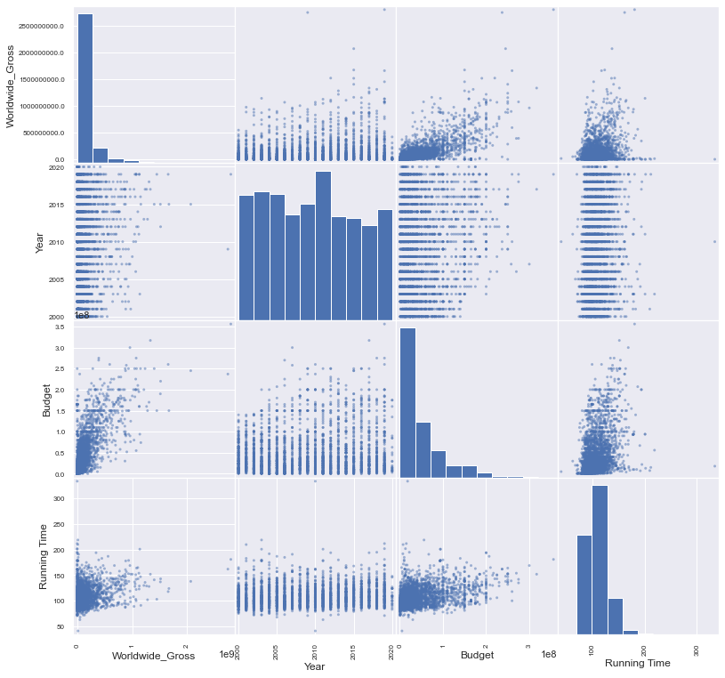


```python
sns.heatmap(df_budgets.corr(), cmap='Oranges', annot=True);
```


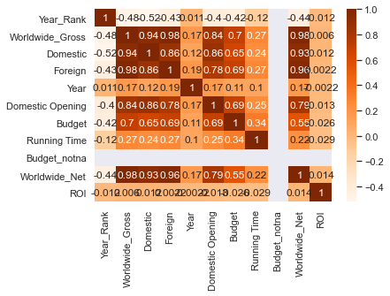


## Movies that made the most in total gross, total over budget, and total ROI


```python
top_25_gross = df.sort_values('Worldwide_Gross', ascending=False)[:25]
top_25_net = df_budgets.sort_values('Worldwide_Net', ascending=False)[:25]
top_25_ROI = df_budgets.sort_values('ROI', ascending=False)[:25]
```


```python
gross_titles = top_25_gross['Title']
gross_amounts = top_25_gross['Worldwide_Gross']
net_titles = top_25_net['Title']
net_amounts = top_25_net['Worldwide_Gross']
ROI_titles = top_25_ROI['Title']
ROI_per = top_25_ROI['ROI']
ROI_gross = top_25_ROI['Worldwide_Gross']
```


```python
fig, ax = plt.subplots(figsize=(20,40))
ax_gross = fig.add_subplot(411)
ax_gross.bar(gross_titles, gross_amounts)
ax_net = fig.add_subplot(412)
ax_net.bar(net_titles, net_amounts)
ax_ROI_per = fig.add_subplot(413)
ax_ROI_per.bar(ROI_titles, ROI_per)
ax_ROI_gross = fig.add_subplot(414)
ax_ROI_gross.bar(ROI_titles, ROI_gross)

ax_gross.set_title('Top 25 Worldwide Grossing Movies')
ax_net.set_title('Top 25 Worldwide Netting Movies')
ax_ROI_per.set_title('Top 25 Return Over Budget Movies (by percent)')
ax_ROI_gross.set_title('Top 25 Return Over Budget Movies (by worldwide gross)')

ax_gross.set_xlabel('Movie Title')
ax_net.set_xlabel('Movie Title')
ax_ROI_per.set_xlabel('Movie Title')
ax_ROI_gross.set_xlabel('Movie Title')

ax_gross.set_ylabel('USD')
ax_net.set_ylabel('USD')
ax_ROI_per.set_ylabel('Percent of Budget')
ax_ROI_gross.set_ylabel('USD')

ax_gross.tick_params(axis='x', rotation=45)
ax_net.tick_params(axis='x', rotation=45)
ax_ROI_per.tick_params(axis='x', rotation=45)
ax_ROI_gross.tick_params(axis='x', rotation=45)

plt.show();
```


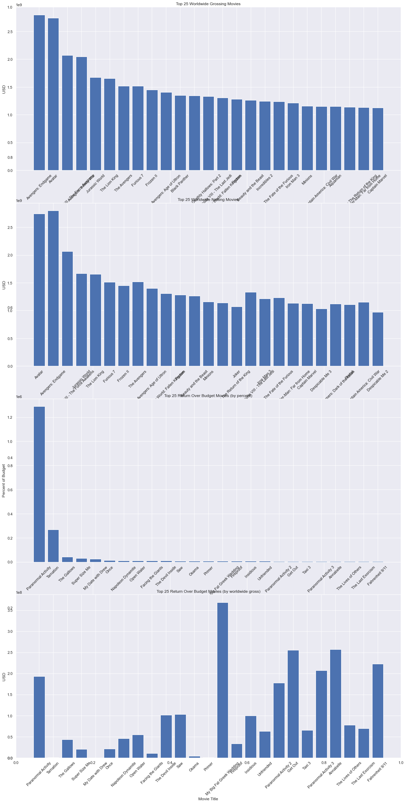


```python
df_budgets.sort_values('ROI', ascending=False).head(10)
```


<div>
<style scoped>
    .dataframe tbody tr th:only-of-type {
        vertical-align: middle;
    }

    .dataframe tbody tr th {
        vertical-align: top;
    }

    .dataframe thead th {
        text-align: right;
    }
</style>
<table border="1" class="dataframe">
  <thead>
    <tr style="text-align: right;">
      <th></th>
      <th>Year_Rank</th>
      <th>Title</th>
      <th>Worldwide_Gross</th>
      <th>Domestic</th>
      <th>Percent_Domestic</th>
      <th>Foreign</th>
      <th>Percent_Foreign</th>
      <th>Year</th>
      <th>Domestic Distributor</th>
      <th>Domestic Opening</th>
      <th>Budget</th>
      <th>Earliest Release Date</th>
      <th>MPAA</th>
      <th>Running Time</th>
      <th>Genres</th>
      <th>Budget_notna</th>
      <th>Earliest Release Month</th>
      <th>Worldwide_Net</th>
      <th>ROI</th>
    </tr>
  </thead>
  <tbody>
    <tr>
      <td>9885</td>
      <td>32</td>
      <td>Paranormal Activity</td>
      <td>193355800</td>
      <td>107918810</td>
      <td>55.8%</td>
      <td>85436990</td>
      <td>44.2%</td>
      <td>2009</td>
      <td>Paramount PicturesSee full company information...</td>
      <td>77873</td>
      <td>15000</td>
      <td>September 25, 2009\n            (Domestic)</td>
      <td>R</td>
      <td>86</td>
      <td>[Horror, Mystery, Thriller]</td>
      <td>True</td>
      <td>September</td>
      <td>193340800</td>
      <td>1.289039e+06</td>
    </tr>
    <tr>
      <td>12481</td>
      <td>309</td>
      <td>Tarnation</td>
      <td>592014</td>
      <td>592014</td>
      <td>100%</td>
      <td>0</td>
      <td>-</td>
      <td>2004</td>
      <td>Wellspring MediaSee full company information\n\n</td>
      <td>12740</td>
      <td>220</td>
      <td>October 6, 2004\n            (Domestic)</td>
      <td>NaN</td>
      <td>88</td>
      <td>[Biography, Documentary]</td>
      <td>True</td>
      <td>October</td>
      <td>591794</td>
      <td>2.690973e+05</td>
    </tr>
    <tr>
      <td>6777</td>
      <td>130</td>
      <td>The Gallows</td>
      <td>42964410</td>
      <td>22764410</td>
      <td>53%</td>
      <td>20200000</td>
      <td>47%</td>
      <td>2015</td>
      <td>Warner Bros.See full company information\n\n</td>
      <td>9808463</td>
      <td>100000</td>
      <td>July 9, 2015\n            (4 markets)</td>
      <td>R</td>
      <td>81</td>
      <td>[Horror, Mystery, Sci-Fi, Thriller]</td>
      <td>True</td>
      <td>July</td>
      <td>42864410</td>
      <td>4.296441e+04</td>
    </tr>
    <tr>
      <td>12307</td>
      <td>135</td>
      <td>Super Size Me</td>
      <td>20645757</td>
      <td>11536423</td>
      <td>55.9%</td>
      <td>9109334</td>
      <td>44.1%</td>
      <td>2004</td>
      <td>IDP DistributionSee full company information\n\n</td>
      <td>516641</td>
      <td>65000</td>
      <td>May 7, 2004\n            (Domestic)</td>
      <td>PG-13</td>
      <td>100</td>
      <td>[Documentary]</td>
      <td>True</td>
      <td>May</td>
      <td>20580757</td>
      <td>3.176270e+04</td>
    </tr>
    <tr>
      <td>7718</td>
      <td>341</td>
      <td>My Date with Drew</td>
      <td>262770</td>
      <td>181041</td>
      <td>68.9%</td>
      <td>81729</td>
      <td>31.1%</td>
      <td>2005</td>
      <td>Slowhand Cinema ReleasingSee full company info...</td>
      <td>85223</td>
      <td>1100</td>
      <td>August 5, 2005\n            (Domestic)</td>
      <td>PG</td>
      <td>90</td>
      <td>[Documentary]</td>
      <td>True</td>
      <td>August</td>
      <td>261670</td>
      <td>2.388818e+04</td>
    </tr>
    <tr>
      <td>8720</td>
      <td>158</td>
      <td>Once</td>
      <td>20936722</td>
      <td>9439923</td>
      <td>45.1%</td>
      <td>11496799</td>
      <td>54.9%</td>
      <td>2007</td>
      <td>Fox Searchlight PicturesSee full company infor...</td>
      <td>61901</td>
      <td>150000</td>
      <td>March 23, 2007\n            (United Kingdom)</td>
      <td>R</td>
      <td>86</td>
      <td>[Drama, Music, Romance]</td>
      <td>True</td>
      <td>March</td>
      <td>20786722</td>
      <td>1.395781e+04</td>
    </tr>
    <tr>
      <td>12269</td>
      <td>97</td>
      <td>Napoleon Dynamite</td>
      <td>46118097</td>
      <td>44540956</td>
      <td>96.6%</td>
      <td>1577141</td>
      <td>3.4%</td>
      <td>2004</td>
      <td>Fox Searchlight PicturesSee full company infor...</td>
      <td>116666</td>
      <td>400000</td>
      <td>June 11, 2004\n            (Domestic)</td>
      <td>PG</td>
      <td>96</td>
      <td>[Comedy]</td>
      <td>True</td>
      <td>June</td>
      <td>45718097</td>
      <td>1.152952e+04</td>
    </tr>
    <tr>
      <td>12264</td>
      <td>92</td>
      <td>Open Water</td>
      <td>54683487</td>
      <td>30610863</td>
      <td>56%</td>
      <td>24072624</td>
      <td>44%</td>
      <td>2004</td>
      <td>LionsgateSee full company information\n\n</td>
      <td>1100943</td>
      <td>500000</td>
      <td>August 6, 2004\n            (Domestic)</td>
      <td>R</td>
      <td>79</td>
      <td>[Adventure, Drama, Horror, Thriller]</td>
      <td>True</td>
      <td>August</td>
      <td>54183487</td>
      <td>1.093670e+04</td>
    </tr>
    <tr>
      <td>8130</td>
      <td>198</td>
      <td>Facing the Giants</td>
      <td>10243159</td>
      <td>10178331</td>
      <td>99.4%</td>
      <td>64828</td>
      <td>0.6%</td>
      <td>2006</td>
      <td>IDP DistributionSee full company information\n\n</td>
      <td>1389000</td>
      <td>100000</td>
      <td>September 29, 2006\n            (Domestic)</td>
      <td>PG</td>
      <td>111</td>
      <td>[Drama, Fantasy, Sport]</td>
      <td>True</td>
      <td>September</td>
      <td>10143159</td>
      <td>1.024316e+04</td>
    </tr>
    <tr>
      <td>4595</td>
      <td>71</td>
      <td>The Devil Inside</td>
      <td>101758490</td>
      <td>53261944</td>
      <td>52.3%</td>
      <td>48496546</td>
      <td>47.7%</td>
      <td>2012</td>
      <td>Paramount PicturesSee full company information...</td>
      <td>33732515</td>
      <td>1000000</td>
      <td>January 6, 2012\n            (Domestic)</td>
      <td>R</td>
      <td>83</td>
      <td>[Horror]</td>
      <td>True</td>
      <td>January</td>
      <td>100758490</td>
      <td>1.017585e+04</td>
    </tr>
  </tbody>
</table>
</div>


```python
df_budgets.shape
```


    (2817, 19)


## Removing Outliers


```python
# q1_net = np.percentile(df_budgets['Worldwide_Net'], 25)
# q3_net = np.percentile(df_budgets['Worldwide_Net'], 75)
# IQR_net = q3_net - q1_net
# minimum_net = q1_net - (IQR_net * 1.5)
# maximum_net = q3_net + (IQR_net * 1.5)
```


```python
# df_net_fixed = df_budgets[(df_budgets['Worldwide_Net'] >= minimum_net) & (df_budgets['Worldwide_Net'] <= maximum_net)]
```


```python
# df_net_fixed.sort_values('Worldwide_Net', ascending=False).head()
```


```python
# df_net_fixed.shape
```


```python
# df_budgets_fixed = pd.merge(df_net_fixed, df_roi_fixed, on=['Year_Rank','Title', 'Worldwide_Gross', 'Domestic', 
#                                                             'Percent_Domestic', 'Foreign', 'Percent_Foreign', 'Year', 
#                                                             'Domestic Distributor', 'Domestic Opening', 'Budget', 
#                                                             'Earliest Release Date', 'MPAA', 'Running Time', 
#                                                             'Budget_notna', 'Earliest Release Month', 
#                                                             'Worldwide_Net', 'ROI'], how='inner')

```


```python
# df_budgets_fixed.head(10)
```


```python
# df_budgets_fixed.shape
```


```python
# df_budgets_fixed.columns
```


```python
# df_budgets_fixed.drop(columns='Genres_y', inplace=True)
# df_budgets_fixed.rename(columns={'Genres_x': 'Genres'}, inplace=True)
```


```python
# df_budgets_fixed.head()
```

# Q1: What should the budget be?

## Looking at ROI and Worldwide Net

Return on investment(ROI) is a more meaningful metric than strict gross income of the movie as it is possible to have a movie that does well but doesn't actually make any money. However, it is still important to look at how much the movie made in general. A movie with a large ROI but a small budget overall doesn't return that much money when looking at bulk of dollars. Ideally you would want to maximize your ROI and also the net amount that you make off of the movie.

I started by look at the trend between Budget and the total net of the movies.


```python
g = sns.lmplot(x="Budget", y="Worldwide_Net",
               height=5, data=df_budgets)
```


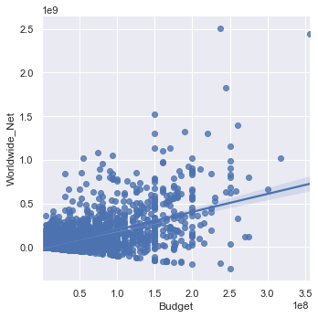


Then I looked at the trend between budget and ROI.


```python
g = sns.lmplot(x="Budget", y="ROI",
               height=5, data=df_budgets)
```


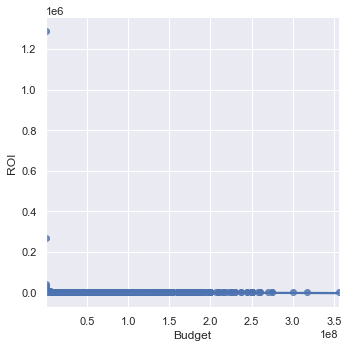


There are some extreme outliers in the ROI category so I updated my DataFrame to remove them.


```python
q1_roi = np.percentile(df_budgets['ROI'], 25)
q3_roi = np.percentile(df_budgets['ROI'], 75)
IQR_roi = q3_roi - q1_roi
minimum_roi = q1_roi - (IQR_roi * 1.5)
maximum_roi = q3_roi + (IQR_roi * 1.5)
```


```python
df_roi_fixed = df_budgets[(df_budgets['ROI'] >= minimum_roi) & (df_budgets['ROI'] <= maximum_roi)]
```

I checked the shape to see how many values I lost. I still have a hearty amount of values.


```python
df_roi_fixed.shape
```


    (2621, 19)


Looking at the ROI column now I can see that these values are much more reasonable to work with.


```python
df_roi_fixed.sort_values('ROI', ascending=False).head()
```


<div>
<style scoped>
    .dataframe tbody tr th:only-of-type {
        vertical-align: middle;
    }

    .dataframe tbody tr th {
        vertical-align: top;
    }

    .dataframe thead th {
        text-align: right;
    }
</style>
<table border="1" class="dataframe">
  <thead>
    <tr style="text-align: right;">
      <th></th>
      <th>Year_Rank</th>
      <th>Title</th>
      <th>Worldwide_Gross</th>
      <th>Domestic</th>
      <th>Percent_Domestic</th>
      <th>Foreign</th>
      <th>Percent_Foreign</th>
      <th>Year</th>
      <th>Domestic Distributor</th>
      <th>Domestic Opening</th>
      <th>Budget</th>
      <th>Earliest Release Date</th>
      <th>MPAA</th>
      <th>Running Time</th>
      <th>Genres</th>
      <th>Budget_notna</th>
      <th>Earliest Release Month</th>
      <th>Worldwide_Net</th>
      <th>ROI</th>
    </tr>
  </thead>
  <tbody>
    <tr>
      <td>199</td>
      <td>40</td>
      <td>The Addams Family</td>
      <td>203044905</td>
      <td>100044905</td>
      <td>49.3%</td>
      <td>103000000</td>
      <td>50.7%</td>
      <td>2019</td>
      <td>United Artists ReleasingSee full company infor...</td>
      <td>30300007</td>
      <td>24000000</td>
      <td>October 11, 2019\n            (Domestic, EMEA)</td>
      <td>PG</td>
      <td>86</td>
      <td>[Animation, Comedy, Family, Fantasy, Horror]</td>
      <td>True</td>
      <td>October</td>
      <td>179044905</td>
      <td>846.020437</td>
    </tr>
    <tr>
      <td>2594</td>
      <td>13</td>
      <td>Sing</td>
      <td>634151679</td>
      <td>270395425</td>
      <td>42.6%</td>
      <td>363756254</td>
      <td>57.4%</td>
      <td>2016</td>
      <td>Universal PicturesSee full company information...</td>
      <td>35258145</td>
      <td>75000000</td>
      <td>December 2, 2016\n            (Norway)</td>
      <td>PG</td>
      <td>108</td>
      <td>[Animation, Comedy, Family, Musical]</td>
      <td>True</td>
      <td>December</td>
      <td>559151679</td>
      <td>845.535572</td>
    </tr>
    <tr>
      <td>6648</td>
      <td>1</td>
      <td>Star Wars: Episode VII - The Force Awakens</td>
      <td>2068223624</td>
      <td>936662225</td>
      <td>45.3%</td>
      <td>1131561399</td>
      <td>54.7%</td>
      <td>2015</td>
      <td>Walt Disney Studios</td>
      <td>247966675</td>
      <td>245000000</td>
      <td>December 16, 2015\n            (EMEA, APAC)</td>
      <td>PG-13</td>
      <td>138</td>
      <td>[Action, Adventure, Sci-Fi]</td>
      <td>True</td>
      <td>December</td>
      <td>1823223624</td>
      <td>844.172908</td>
    </tr>
    <tr>
      <td>12205</td>
      <td>33</td>
      <td>Dodgeball</td>
      <td>168423227</td>
      <td>114326736</td>
      <td>67.9%</td>
      <td>54096491</td>
      <td>32.1%</td>
      <td>2004</td>
      <td>Twentieth Century FoxSee full company informat...</td>
      <td>30070196</td>
      <td>20000000</td>
      <td>June 18, 2004\n            (Domestic)</td>
      <td>PG-13</td>
      <td>92</td>
      <td>[Comedy, Sport]</td>
      <td>True</td>
      <td>June</td>
      <td>148423227</td>
      <td>842.116135</td>
    </tr>
    <tr>
      <td>7517</td>
      <td>140</td>
      <td>Hustle &amp; Flow</td>
      <td>23563727</td>
      <td>22202809</td>
      <td>94.2%</td>
      <td>1360918</td>
      <td>5.8%</td>
      <td>2005</td>
      <td>Paramount ClassicsSee full company information...</td>
      <td>8017808</td>
      <td>2800000</td>
      <td>July 22, 2005\n            (Domestic)</td>
      <td>R</td>
      <td>116</td>
      <td>[Crime, Drama, Music]</td>
      <td>True</td>
      <td>July</td>
      <td>20763727</td>
      <td>841.561679</td>
    </tr>
  </tbody>
</table>
</div>


## ROI vs Net


```python
g = sns.lmplot(x="Budget", y="Worldwide_Net",
               height=5, data=df_roi_fixed)
```


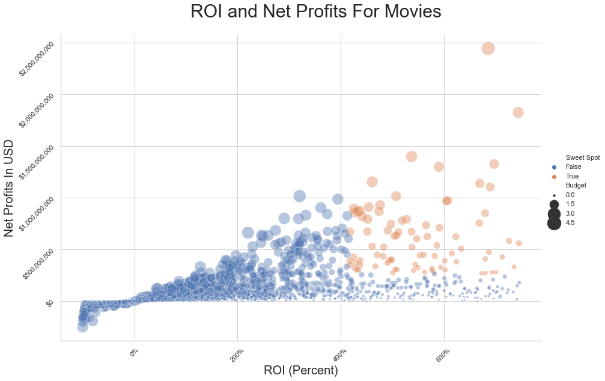


```python
g = sns.lmplot(x="Budget", y="ROI",
               height=5, data=df_roi_fixed)
```


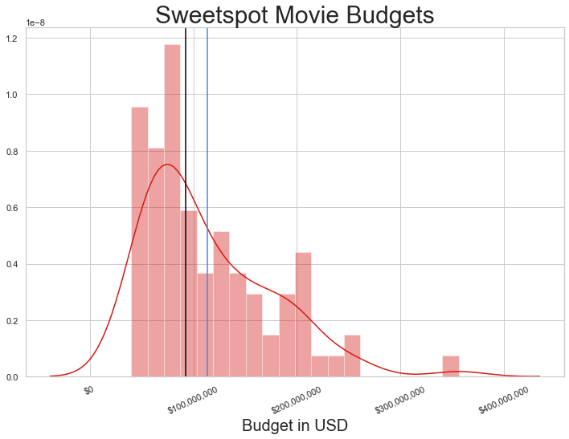


The ultimate goal is for movies to maximize ROI and net. There is a positive trend between ROI increasing and the total the movie nets.


```python
g = sns.lmplot(x="ROI", y="Worldwide_Net",
               height=5, data=df_roi_fixed)
```


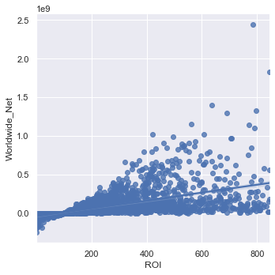


I decided to take a slice of the top right of this graph and look at the movies that are in the 90th percentile for both ROI and Net


```python
roi_90 = np.percentile(df_roi_fixed['ROI'], 90)
net_90 = np.percentile(df_roi_fixed['Worldwide_Net'], 90)
roi_median = df_roi_fixed['ROI'].median()
net_median = df_roi_fixed['Worldwide_Net'].median()
```


```python
df_sweetspot = df_roi_fixed[(df_roi_fixed['ROI'] > roi_90) & (df_roi_fixed['Worldwide_Net'] > net_90)]
df_sweetspot.shape
```


    (91, 19)


```python
df_sweetspot.describe()
```


<div>
<style scoped>
    .dataframe tbody tr th:only-of-type {
        vertical-align: middle;
    }

    .dataframe tbody tr th {
        vertical-align: top;
    }

    .dataframe thead th {
        text-align: right;
    }
</style>
<table border="1" class="dataframe">
  <thead>
    <tr style="text-align: right;">
      <th></th>
      <th>Year_Rank</th>
      <th>Worldwide_Gross</th>
      <th>Domestic</th>
      <th>Foreign</th>
      <th>Year</th>
      <th>Domestic Opening</th>
      <th>Budget</th>
      <th>Running Time</th>
      <th>Worldwide_Net</th>
      <th>ROI</th>
    </tr>
  </thead>
  <tbody>
    <tr>
      <td>count</td>
      <td>91.000000</td>
      <td>9.100000e+01</td>
      <td>9.100000e+01</td>
      <td>9.100000e+01</td>
      <td>91.000000</td>
      <td>9.100000e+01</td>
      <td>9.100000e+01</td>
      <td>91.000000</td>
      <td>9.100000e+01</td>
      <td>91.000000</td>
    </tr>
    <tr>
      <td>mean</td>
      <td>10.054945</td>
      <td>7.062731e+08</td>
      <td>2.745657e+08</td>
      <td>4.317074e+08</td>
      <td>2011.274725</td>
      <td>7.881276e+07</td>
      <td>1.101319e+08</td>
      <td>120.626374</td>
      <td>5.961412e+08</td>
      <td>649.754703</td>
    </tr>
    <tr>
      <td>std</td>
      <td>8.003281</td>
      <td>4.242949e+08</td>
      <td>1.508131e+08</td>
      <td>2.936781e+08</td>
      <td>6.000122</td>
      <td>5.810028e+07</td>
      <td>6.217113e+07</td>
      <td>21.913288</td>
      <td>3.654862e+08</td>
      <td>95.060079</td>
    </tr>
    <tr>
      <td>min</td>
      <td>1.000000</td>
      <td>2.699582e+08</td>
      <td>2.683007e+07</td>
      <td>7.921172e+07</td>
      <td>2000.000000</td>
      <td>0.000000e+00</td>
      <td>3.300000e+07</td>
      <td>81.000000</td>
      <td>2.369582e+08</td>
      <td>517.701270</td>
    </tr>
    <tr>
      <td>25%</td>
      <td>3.500000</td>
      <td>3.891509e+08</td>
      <td>1.707149e+08</td>
      <td>2.390989e+08</td>
      <td>2006.000000</td>
      <td>3.981614e+07</td>
      <td>6.100000e+07</td>
      <td>105.000000</td>
      <td>3.288436e+08</td>
      <td>568.953578</td>
    </tr>
    <tr>
      <td>50%</td>
      <td>8.000000</td>
      <td>5.423514e+08</td>
      <td>2.428293e+08</td>
      <td>3.412000e+08</td>
      <td>2012.000000</td>
      <td>6.278534e+07</td>
      <td>9.000000e+07</td>
      <td>118.000000</td>
      <td>4.614143e+08</td>
      <td>638.166429</td>
    </tr>
    <tr>
      <td>75%</td>
      <td>15.000000</td>
      <td>9.123409e+08</td>
      <td>3.447632e+08</td>
      <td>5.399464e+08</td>
      <td>2017.000000</td>
      <td>1.029687e+08</td>
      <td>1.500000e+08</td>
      <td>138.000000</td>
      <td>7.670566e+08</td>
      <td>711.337012</td>
    </tr>
    <tr>
      <td>max</td>
      <td>31.000000</td>
      <td>2.797801e+09</td>
      <td>9.366622e+08</td>
      <td>1.939428e+09</td>
      <td>2019.000000</td>
      <td>3.571150e+08</td>
      <td>3.560000e+08</td>
      <td>181.000000</td>
      <td>2.441801e+09</td>
      <td>845.535572</td>
    </tr>
  </tbody>
</table>
</div>


```python
df_sweetspot['Budget'].mean()
```


    110131868.13186814


```python
df_roi_fixed['Budget'].mean()
```


    50811204.94048073


```python
df_sweetspot['Budget'].median()
```


    90000000.0


```python
df_roi_fixed['Budget'].median()
```


    33000000.0


## Add a plotly graph for showing the sweetspot entries


```python
g = sns.lmplot(x="Budget", y="Worldwide_Net",
               height=5, data=df_sweetspot)
```


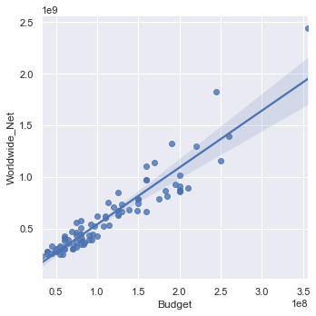


```python
g = sns.lmplot(x="Budget", y="ROI",
               height=5, data=df_sweetspot)
```


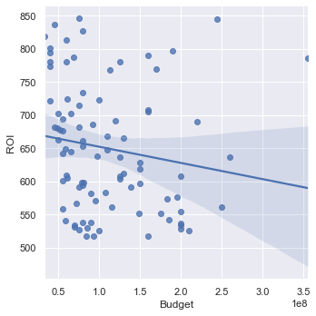


## Recommendation: Budget should be between 90 million and 110 million USD

For movies in the 90th percentile for both ROI and net, the median budgets were 90 million and the average budgets were 110 million. So to maximize the chances of having high ROI and net, that range is your best bet.

# Q2: What genre should the movie be?


```python
# df_budgets
# df_roi_fixed
```


```python
df_budgets.columns
```


    Index(['Year_Rank', 'Title', 'Worldwide_Gross', 'Domestic', 'Percent_Domestic',
           'Foreign', 'Percent_Foreign', 'Year', 'Domestic Distributor',
           'Domestic Opening', 'Budget', 'Earliest Release Date', 'MPAA',
           'Running Time', 'Genres', 'Budget_notna', 'Earliest Release Month',
           'Worldwide_Net', 'ROI'],
          dtype='object')


```python
df_genres_net = df_budgets.explode('Genres')
df_genres_roi = df_roi_fixed.explode('Genres')
```


```python
df_genres_net.head()
```


<div>
<style scoped>
    .dataframe tbody tr th:only-of-type {
        vertical-align: middle;
    }

    .dataframe tbody tr th {
        vertical-align: top;
    }

    .dataframe thead th {
        text-align: right;
    }
</style>
<table border="1" class="dataframe">
  <thead>
    <tr style="text-align: right;">
      <th></th>
      <th>Year_Rank</th>
      <th>Title</th>
      <th>Worldwide_Gross</th>
      <th>Domestic</th>
      <th>Percent_Domestic</th>
      <th>Foreign</th>
      <th>Percent_Foreign</th>
      <th>Year</th>
      <th>Domestic Distributor</th>
      <th>Domestic Opening</th>
      <th>Budget</th>
      <th>Earliest Release Date</th>
      <th>MPAA</th>
      <th>Running Time</th>
      <th>Genres</th>
      <th>Budget_notna</th>
      <th>Earliest Release Month</th>
      <th>Worldwide_Net</th>
      <th>ROI</th>
    </tr>
  </thead>
  <tbody>
    <tr>
      <td>0</td>
      <td>1</td>
      <td>Bad Boys for Life</td>
      <td>419074646</td>
      <td>204417855</td>
      <td>48.8%</td>
      <td>214656791</td>
      <td>51.2%</td>
      <td>2020</td>
      <td>Sony Pictures Entertainment (SPE)See full comp...</td>
      <td>62504105</td>
      <td>90000000</td>
      <td>January 15, 2020\n            (LATAM, APAC)</td>
      <td>R</td>
      <td>124</td>
      <td>Action</td>
      <td>True</td>
      <td>January</td>
      <td>329074646</td>
      <td>465.638496</td>
    </tr>
    <tr>
      <td>0</td>
      <td>1</td>
      <td>Bad Boys for Life</td>
      <td>419074646</td>
      <td>204417855</td>
      <td>48.8%</td>
      <td>214656791</td>
      <td>51.2%</td>
      <td>2020</td>
      <td>Sony Pictures Entertainment (SPE)See full comp...</td>
      <td>62504105</td>
      <td>90000000</td>
      <td>January 15, 2020\n            (LATAM, APAC)</td>
      <td>R</td>
      <td>124</td>
      <td>Comedy</td>
      <td>True</td>
      <td>January</td>
      <td>329074646</td>
      <td>465.638496</td>
    </tr>
    <tr>
      <td>0</td>
      <td>1</td>
      <td>Bad Boys for Life</td>
      <td>419074646</td>
      <td>204417855</td>
      <td>48.8%</td>
      <td>214656791</td>
      <td>51.2%</td>
      <td>2020</td>
      <td>Sony Pictures Entertainment (SPE)See full comp...</td>
      <td>62504105</td>
      <td>90000000</td>
      <td>January 15, 2020\n            (LATAM, APAC)</td>
      <td>R</td>
      <td>124</td>
      <td>Crime</td>
      <td>True</td>
      <td>January</td>
      <td>329074646</td>
      <td>465.638496</td>
    </tr>
    <tr>
      <td>0</td>
      <td>1</td>
      <td>Bad Boys for Life</td>
      <td>419074646</td>
      <td>204417855</td>
      <td>48.8%</td>
      <td>214656791</td>
      <td>51.2%</td>
      <td>2020</td>
      <td>Sony Pictures Entertainment (SPE)See full comp...</td>
      <td>62504105</td>
      <td>90000000</td>
      <td>January 15, 2020\n            (LATAM, APAC)</td>
      <td>R</td>
      <td>124</td>
      <td>Thriller</td>
      <td>True</td>
      <td>January</td>
      <td>329074646</td>
      <td>465.638496</td>
    </tr>
    <tr>
      <td>1</td>
      <td>2</td>
      <td>Sonic the Hedgehog</td>
      <td>306766470</td>
      <td>146066470</td>
      <td>47.6%</td>
      <td>160700000</td>
      <td>52.4%</td>
      <td>2020</td>
      <td>Paramount PicturesSee full company information...</td>
      <td>58018348</td>
      <td>85000000</td>
      <td>February 12, 2020\n            (APAC, EMEA)</td>
      <td>PG</td>
      <td>99</td>
      <td>Action</td>
      <td>True</td>
      <td>February</td>
      <td>221766470</td>
      <td>360.901729</td>
    </tr>
  </tbody>
</table>
</div>


```python
df_genres_net['Genres'].value_counts()
```


    Drama          1344
    Comedy         1110
    Action          840
    Thriller        840
    Adventure       706
    Romance         596
    Crime           500
    Fantasy         467
    Family          430
    Sci-Fi          416
    Mystery         344
    Horror          325
    Animation       211
    Biography       179
    Music           114
    War             110
    History         110
    Musical         100
    Sport            97
    Documentary      36
    Western          36
    News              2
    Short             1
    Name: Genres, dtype: int64


```python
df_genres_net = df_genres_net[(df_genres_net['Genres'] != 'Short')]
df_genres_net = df_genres_net[(df_genres_net['Genres'] != 'News')]
df_genres_net = df_genres_net[(df_genres_net['Genres'] != 'Western')]
df_genres_net = df_genres_net[(df_genres_net['Genres'] != 'Documentary')]
df_genres_net = df_genres_net[(df_genres_net['Genres'] != 'Sport')]
df_genres_net = df_genres_net[(df_genres_net['Genres'] != 'Musical')]
df_genres_net = df_genres_net[(df_genres_net['Genres'] != 'War')]
df_genres_net = df_genres_net[(df_genres_net['Genres'] != 'History')]
df_genres_net = df_genres_net[(df_genres_net['Genres'] != 'Music')]
df_genres_net = df_genres_net[(df_genres_net['Genres'] != 'Biography')]
```


```python
df_genres_net['Genres'].value_counts()
```


    Drama        1344
    Comedy       1110
    Action        840
    Thriller      840
    Adventure     706
    Romance       596
    Crime         500
    Fantasy       467
    Family        430
    Sci-Fi        416
    Mystery       344
    Horror        325
    Animation     211
    Name: Genres, dtype: int64


```python
df_genres_roi = df_genres_roi[(df_genres_roi['Genres'] != 'Short')]
df_genres_roi = df_genres_roi[(df_genres_roi['Genres'] != 'News')]
df_genres_roi = df_genres_roi[(df_genres_roi['Genres'] != 'Western')]
df_genres_roi = df_genres_roi[(df_genres_roi['Genres'] != 'Documentary')]
df_genres_roi = df_genres_roi[(df_genres_roi['Genres'] != 'Sport')]
df_genres_roi = df_genres_roi[(df_genres_roi['Genres'] != 'Musical')]
df_genres_roi = df_genres_roi[(df_genres_roi['Genres'] != 'War')]
df_genres_roi = df_genres_roi[(df_genres_roi['Genres'] != 'History')]
df_genres_roi = df_genres_roi[(df_genres_roi['Genres'] != 'Music')]
df_genres_roi = df_genres_roi[(df_genres_roi['Genres'] != 'Biography')]
```


```python
df_genres_roi['Genres'].value_counts()
```


    Drama        1246
    Comedy       1050
    Action        816
    Thriller      773
    Adventure     676
    Romance       556
    Crime         487
    Fantasy       442
    Family        412
    Sci-Fi        393
    Mystery       299
    Horror        261
    Animation     200
    Name: Genres, dtype: int64


```python
# line 1 points
x1 = [10,20,30]
y1 = [20,40,10]
# plotting the line 1 points 
plt.plot(x1, y1, label = "line 1")
# line 2 points
x2 = [10,20,30]
y2 = [40,10,30]
# plotting the line 2 points 
plt.plot(x2, y2, label = "line 2")
plt.xlabel('x - axis')
# Set the y axis label of the current axis.
plt.ylabel('y - axis')
# Set a title of the current axes.
plt.title('Two or more lines on same plot with suitable legends ')
# show a legend on the plot
plt.legend()
# Display a figure.
plt.show()

```


```python
fig, ax = plt.subplots(figsize=(15,10))
sns.lineplot(x='Year', y='Worldwide_Net', hue='Genres', 
             data=df_genres_net, err_style=None);
```


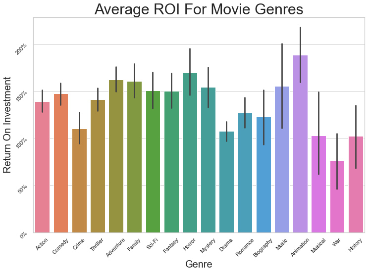


```python
q1_gen = np.percentile(df_genres_net['Worldwide_Net'], 25)
q3_gen = np.percentile(df_genres_net['Worldwide_Net'], 75)
IQR_gen = q3_gen - q1_gen
minimum_gen = q1_gen - (IQR_gen * 1.5)
maximum_gen = q3_gen + (IQR_gen * 1.5)
```


```python
df_gen_fixed = df_genres_net[(df_genres_net['Worldwide_Net'] >= minimum_gen) 
                             & (df_genres_net['Worldwide_Net'] <= maximum_gen)]
```


```python
fig, ax = plt.subplots(figsize=(15,10))
sns.boxplot(x="Genres", y="Worldwide_Net",
            hue="Genres", palette=["m", "g"],
            data=df_gen_fixed);
```


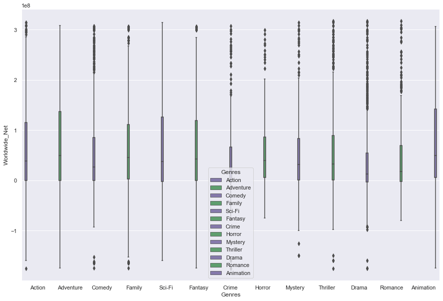


```python
df_genres_net.groupby(['Year','Genres'])['Worldwide_Net'].mean()
```


    Year  Genres   
    2000  Action        63590945.175
          Adventure     86580084.676
          Animation     58156832.636
          Comedy        34500077.842
          Crime         20635957.743
          Drama         30741237.205
          Family        58569030.278
          Fantasy       60181910.368
          Horror        48672078.923
          Mystery       49346495.769
          Romance       42343998.833
          Sci-Fi        27658289.947
          Thriller      45122037.578
    2001  Action        78016655.744
          Adventure    143981290.500
          Animation    104583219.556
          Comedy        43723152.239
          Crime         37702453.629
          Drama         43049348.000
          Family       135073640.118
          Fantasy      158779241.381
          Horror        35791466.154
          Mystery       25198365.864
          Romance       38296189.462
          Sci-Fi        52046512.950
          Thriller      60986603.933
    2002  Action        77223756.070
          Adventure    136667254.526
          Animation     64439490.091
          Comedy        52214095.952
          Crime         43963785.088
          Drama         48268846.800
          Family        82712643.760
          Fantasy      154302699.762
          Horror        43939497.154
          Mystery       92328375.304
          Romance       41389909.375
          Sci-Fi        98150475.640
          Thriller      38560177.418
    2003  Action        93017466.326
          Adventure    103868181.212
          Animation    155016920.000
          Comedy        66319818.123
          Crime         39740637.216
          Drama         49128627.373
          Family        94081699.318
          Fantasy      132177066.600
          Horror        42311685.750
          Mystery       73324187.300
          Romance       30713097.829
          Sci-Fi       111403238.267
          Thriller      49426654.923
    2004  Action        84112546.875
          Adventure    141795147.500
          Animation    253297614.500
          Comedy        58595825.530
          Crime         35848594.440
          Drama         52936619.061
          Family       124659252.826
          Fantasy      128634930.368
          Horror        42443311.944
          Mystery       73398500.550
          Romance       55214705.326
          Sci-Fi        79118843.409
          Thriller      64046119.878
    2005  Action        73550218.968
          Adventure    123368628.970
          Animation     71797780.857
          Comedy        51399711.333
          Crime         43539536.448
          Drama         24059367.247
          Family        81037555.500
          Fantasy      145259615.273
          Horror        47956040.059
          Mystery       64098831.652
          Romance       55501295.071
          Sci-Fi       118175484.059
          Thriller      49500809.553
    2006  Action        98251066.607
          Adventure    109136573.719
          Animation    105919480.154
          Comedy        56272114.328
          Crime         39576973.261
          Drama         34567185.392
          Family        76915582.500
          Fantasy      104074428.957
          Horror        45034069.389
          Mystery       81157523.312
          Romance       43316307.242
          Sci-Fi        49712142.357
          Thriller      68488314.932
    2007  Action       155634017.633
          Adventure    253843847.810
          Animation    224340420.100
          Comedy        93059433.789
          Crime         30549595.000
          Drama         41409470.831
          Family       219319256.917
          Fantasy      173950755.952
          Horror        27070135.214
          Mystery      111851591.077
          Romance       54198480.400
          Sci-Fi       180275674.909
          Thriller      60377518.658
    2008  Action       131988825.690
          Adventure    136321588.500
          Animation    140507301.364
          Comedy        71836704.121
          Crime         69411151.091
          Drama         64743993.104
          Family       107964257.909
          Fantasy      108233944.304
          Horror        88596298.000
          Mystery       56761729.500
          Romance       88945039.703
          Sci-Fi        91317062.842
          Thriller      87125731.184
    2009  Action       167532971.690
          Adventure    232038673.459
          Animation    163651577.714
          Comedy        80823077.906
          Crime         20791024.385
          Drama         43302251.057
          Family       125907428.185
          Fantasy      208026271.724
          Horror        54141685.154
          Mystery       84906083.091
          Romance       61826364.750
          Sci-Fi       224402161.708
          Thriller      59177532.231
    2010  Action        90976498.154
          Adventure    221495710.750
          Animation    279229904.300
          Comedy        67859130.733
          Crime         26781593.273
          Drama         36548401.457
          Family       181494196.222
          Fantasy      150578568.697
          Horror        45373991.778
          Mystery       54126242.353
          Romance       58673169.683
          Sci-Fi       121886520.200
          Thriller      63470359.060
    2011  Action       123297210.596
          Adventure    176839112.225
          Animation    194311375.077
          Comedy        81985097.638
          Crime         81484252.500
          Drama         30909137.519
          Family       134120348.435
          Fantasy      126968892.786
          Horror        42659353.353
          Mystery       79898270.737
          Romance       73489510.278
          Sci-Fi       131567253.200
          Thriller      89488336.432
    2012  Action       174615568.372
          Adventure    266389268.919
          Animation    197957550.357
          Comedy       120194660.500
          Crime         53077835.917
          Drama         93065681.843
          Family       148332230.000
          Fantasy      191885397.409
          Horror        70886465.833
          Mystery       69178170.000
          Romance      116858748.300
          Sci-Fi       207141987.200
          Thriller     116440962.306
    2013  Action       157097344.907
          Adventure    235505559.868
          Animation    304307162.091
          Comedy       115529827.227
          Crime         72873270.400
          Drama         67293181.220
          Family       233033832.062
          Fantasy      181299278.217
          Horror        92773520.111
          Mystery      191949769.000
          Romance       39172069.812
          Sci-Fi       236596844.346
          Thriller     110151185.773
    2014  Action       233068296.848
          Adventure    261375894.000
          Animation    183850494.083
          Comedy       124249563.000
          Crime         69395723.227
          Drama         80671240.053
          Family       162136616.500
          Fantasy      113975026.227
          Horror        61101626.000
          Mystery       95405197.118
          Romance       82568859.435
          Sci-Fi       283304413.577
          Thriller     154475732.167
    2015  Action       256037536.891
          Adventure    334530600.000
          Animation    296263196.889
          Comedy       109266760.745
          Crime         44228832.350
          Drama         88449367.650
          Family       220842329.533
          Fantasy      140260033.278
          Horror        64861038.000
          Mystery       50965366.864
          Romance       91870651.867
          Sci-Fi       343197631.577
          Thriller     171667983.610
    2016  Action       182082346.489
          Adventure    271871117.784
          Animation    246405344.000
          Comedy       127412375.098
          Crime         64243162.286
          Drama         79039521.271
          Family       229549312.150
          Fantasy      199422328.042
          Horror        91641338.105
          Mystery       74752343.188
          Romance      111893063.533
          Sci-Fi       305855236.476
          Thriller      89710367.778
    2017  Action       259014959.114
          Adventure    292094553.171
          Animation    172546930.700
          Comedy       167127775.441
          Crime        107489930.478
          Drama         73875659.556
          Family       230207874.286
          Fantasy      297942956.480
          Horror       105937115.850
          Mystery       87515404.765
          Romance      112239449.500
          Sci-Fi       243219227.571
          Thriller     152146336.171
    2018  Action       145490786.744
          Adventure    182207143.564
          Animation    192678020.750
          Comedy       109683058.359
          Crime         50564483.773
          Drama         78617818.711
          Family       146264328.850
          Fantasy      126307443.524
          Horror        98032991.200
          Mystery       55659084.400
          Romance       65255342.909
          Sci-Fi       220299167.955
          Thriller      95326140.512
    2019  Action       212204031.762
          Adventure    322055858.500
          Animation    398534241.667
          Comedy       139477868.065
          Crime         86208768.095
          Drama        130306405.250
          Family       264667106.200
          Fantasy      243345517.393
          Horror        76842153.962
          Mystery       83023099.455
          Romance       98760604.000
          Sci-Fi       310110920.667
          Thriller     121920481.289
    2020  Action        39115841.444
          Adventure      -162627.111
          Animation   -174660000.000
          Comedy        52518503.250
          Crime        223216553.500
          Drama        -22863319.091
          Family        17365895.500
          Fantasy      -23989607.400
          Horror        25311159.000
          Mystery       26492666.600
          Romance        1999776.500
          Sci-Fi        21198910.400
          Thriller      24746581.667
    Name: Worldwide_Net, dtype: float64


```python
df_genres_net.groupby(['Genres'])['Worldwide_Net'].mean()
```


    Genres
    Action      144422260.880
    Adventure   202908646.373
    Animation   190050921.986
    Comedy       81303716.817
    Crime        49758373.718
    Drama        55672615.414
    Family      145289940.319
    Fantasy     158670067.619
    Horror       61698920.914
    Mystery      73893149.802
    Romance      61872624.968
    Sci-Fi      180244187.899
    Thriller     85033491.431
    Name: Worldwide_Net, dtype: float64


```python
y = df_genres_net.groupby(['Genres'])['Worldwide_Net'].mean()
x = ['Action', 'Adventure', 'Animation', 'Comedy', 
     'Crime', 'Drama', 'Family', 'Fantasy', 'Horror', 'Mystery', 
     'Romance', 'Sci-Fi', 'Thriller']
fig, ax = plt.subplots(figsize=(15,10))
sns.barplot(x=x, y=y, palette="deep");

# sns.despine(bottom=True)
# plt.setp(f.axes, yticks=[])
# plt.tight_layout(h_pad=2)
```


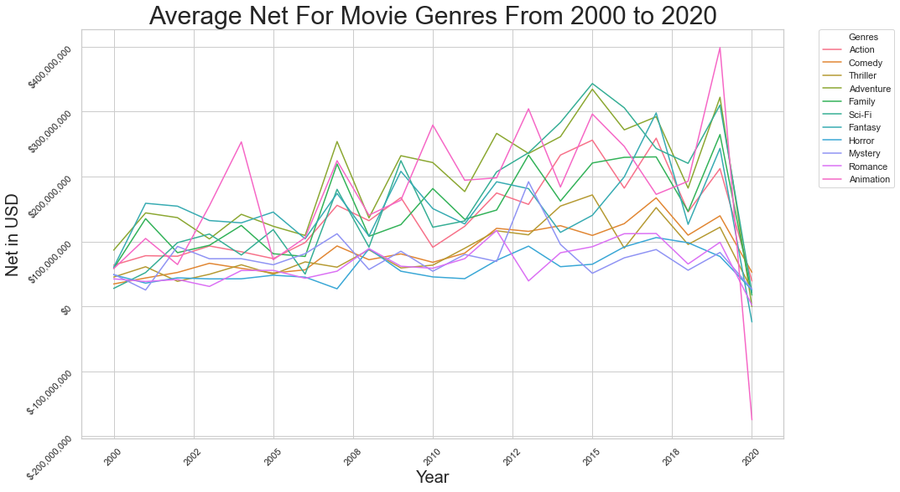


```python
fig, ax = plt.subplots(figsize=(15,10))
sns.lineplot(x='Year', y='ROI', hue='Genres', 
             data=df_genres_roi, err_style=None);
```


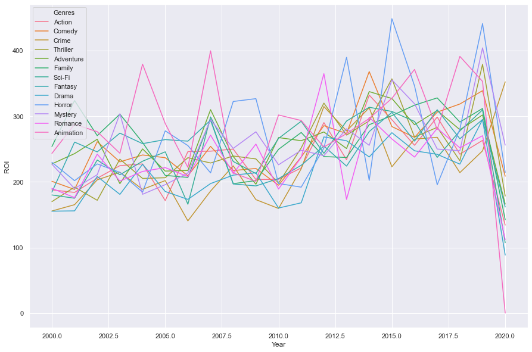


```python
fig, ax = plt.subplots(figsize=(15,10))
sns.boxplot(x="Genres", y="ROI",
            hue="Genres", palette=["m", "g"],
            data=df_genres_roi);
```


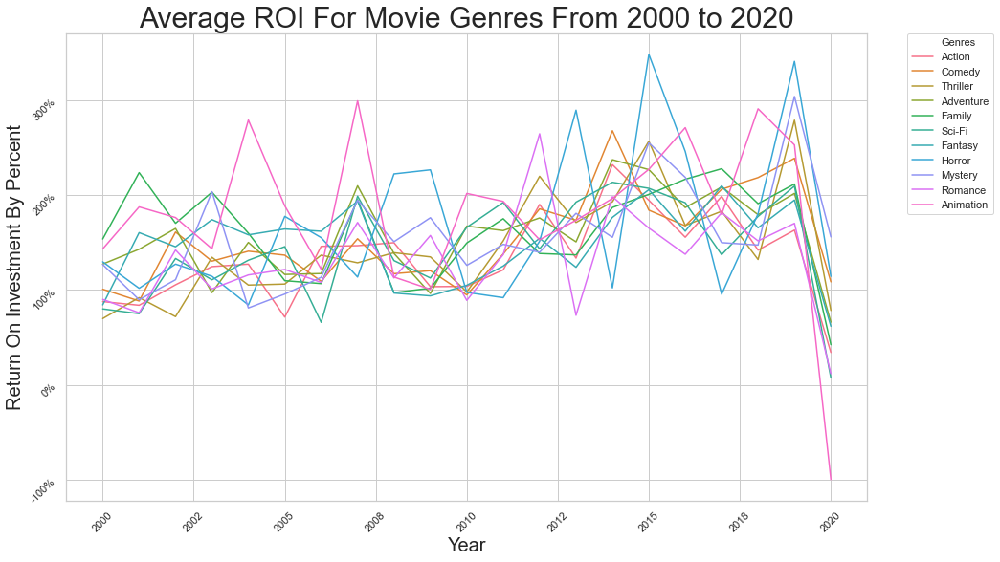


```python
df_genres_roi.groupby(['Year','Genres'])['ROI'].mean()
```


    Year  Genres   
    2000  Action      187.752
          Adventure   227.325
          Animation   243.347
          Comedy      200.822
          Crime       155.605
          Drama       155.316
          Family      253.759
          Fantasy     184.308
          Horror      229.684
          Mystery     226.855
          Romance     190.091
          Sci-Fi      180.040
          Thriller    169.880
    2001  Action      183.897
          Adventure   242.981
          Animation   287.602
          Comedy      188.378
          Crime       165.205
          Drama       155.784
          Family      323.778
          Fantasy     260.494
          Horror      201.800
          Mystery     189.712
          Romance     175.926
          Sci-Fi      175.039
          Thriller    191.980
    2002  Action      205.470
          Adventure   264.856
          Animation   276.375
          Comedy      261.125
          Crime       203.014
          Drama       208.181
          Family      270.332
          Fantasy     245.599
          Horror      227.295
          Mystery     210.834
          Romance     242.189
          Sci-Fi      233.244
          Thriller    171.914
    2003  Action      224.662
          Adventure   197.226
          Animation   243.498
          Comedy      230.387
          Crime       214.598
          Drama       180.899
          Family      303.130
          Fantasy     274.178
          Horror      214.450
          Mystery     303.666
          Romance     201.123
          Sci-Fi      210.741
          Thriller    234.532
    2004  Action      227.264
          Adventure   250.167
          Animation   379.189
          Comedy      240.915
          Crime       188.576
          Drama       226.772
          Family      259.954
          Fantasy     258.167
          Horror      184.239
          Mystery     181.042
          Romance     215.859
          Sci-Fi      231.405
          Thriller    205.205
    2005  Action      171.459
          Adventure   216.382
          Animation   288.759
          Comedy      236.755
          Crime       201.857
          Drama       185.296
          Family      209.824
          Fantasy     264.330
          Horror      277.640
          Mystery     195.692
          Romance     221.648
          Sci-Fi      245.715
          Thriller    206.264
    2006  Action      246.036
          Adventure   217.332
          Animation   221.965
          Comedy      209.194
          Crime       140.569
          Drama       173.260
          Family      206.740
          Fantasy     261.970
          Horror      255.202
          Mystery     213.397
          Romance     207.998
          Sci-Fi      165.870
          Thriller    236.779
    2007  Action      246.740
          Adventure   309.876
          Animation   399.487
          Comedy      254.054
          Crime       185.921
          Drama       197.350
          Family      295.290
          Fantasy     293.781
          Horror      213.636
          Mystery     294.595
          Romance     271.187
          Sci-Fi      298.897
          Thriller    228.697
    2008  Action      249.875
          Adventure   238.560
          Animation   213.654
          Comedy      217.181
          Crime       224.424
          Drama       210.204
          Family      197.168
          Fantasy     196.763
          Horror      322.373
          Mystery     250.909
          Romance     212.732
          Sci-Fi      230.994
          Thriller    239.336
    2009  Action      203.511
          Adventure   196.359
          Animation   200.716
          Comedy      220.372
          Crime       172.912
          Drama       213.763
          Family      201.953
          Fantasy     193.793
          Horror      326.665
          Mystery     276.239
          Romance     257.518
          Sci-Fi      212.629
          Thriller    234.913
    2010  Action      203.818
          Adventure   267.396
          Animation   301.803
          Comedy      194.844
          Crime       159.451
          Drama       160.107
          Family      249.550
          Fantasy     204.940
          Horror      197.451
          Mystery     226.003
          Romance     189.044
          Sci-Fi      266.133
          Thriller    197.907
    2011  Action      221.201
          Adventure   262.642
          Animation   293.390
          Comedy      237.935
          Crime       219.950
          Drama       168.058
          Family      275.156
          Fantasy     225.226
          Horror      191.902
          Mystery     248.129
          Romance     237.298
          Sci-Fi      292.292
          Thriller    251.716
    2012  Action      290.208
          Adventure   275.971
          Animation   252.944
          Comedy      285.555
          Crime       314.731
          Drama       268.382
          Family      238.503
          Fantasy     254.476
          Horror      251.487
          Mystery     239.827
          Romance     364.717
          Sci-Fi      243.399
          Thriller    319.914
    2013  Action      233.651
          Adventure   250.761
          Animation   273.491
          Comedy      273.543
          Crime       277.578
          Drama       262.578
          Family      237.028
          Fantasy     223.947
          Horror      389.609
          Mystery     280.839
          Romance     173.292
          Sci-Fi      292.614
          Thriller    271.159
    2014  Action      332.142
          Adventure   337.410
          Animation   296.475
          Comedy      367.939
          Crime       312.812
          Drama       237.863
          Family      287.012
          Fantasy     276.594
          Horror      202.207
          Mystery     255.570
          Romance     298.340
          Sci-Fi      313.564
          Thriller    292.945
    2015  Action      294.586
          Adventure   326.891
          Animation   327.184
          Comedy      284.173
          Crime       222.936
          Drama       274.844
          Family      300.803
          Fantasy     305.761
          Horror      448.426
          Mystery     355.209
          Romance     265.284
          Sci-Fi      307.177
          Thriller    356.871
    2016  Action      255.648
          Adventure   286.942
          Animation   371.168
          Comedy      267.678
          Crime       265.112
          Drama       247.277
          Family      316.773
          Fantasy     262.024
          Horror      346.030
          Mystery     318.815
          Romance     237.698
          Sci-Fi      291.987
          Thriller    268.077
    2017  Action      298.722
          Adventure   308.570
          Animation   279.673
          Comedy      306.194
          Crime       267.831
          Drama       241.890
          Family      327.825
          Fantasy     309.811
          Horror      195.556
          Mystery     249.921
          Romance     281.500
          Sci-Fi      237.241
          Thriller    283.010
    2018  Action      242.078
          Adventure   279.391
          Animation   391.047
          Comedy      318.543
          Crime       214.039
          Drama       226.983
          Family      291.033
          Fantasy     265.598
          Horror      280.423
          Mystery     247.392
          Romance     251.780
          Sci-Fi      277.571
          Thriller    232.157
    2019  Action      263.151
          Adventure   301.845
          Animation   352.971
          Comedy      338.835
          Crime       247.215
          Drama       294.862
          Family      311.727
          Fantasy     294.837
          Horror      441.050
          Mystery     404.050
          Romance     270.275
          Sci-Fi      309.580
          Thriller    379.030
    2020  Action      134.142
          Adventure   166.068
          Animation     0.194
          Comedy      208.562
          Crime       352.262
          Drama        88.528
          Family      142.308
          Fantasy     161.725
          Horror      214.359
          Mystery     255.963
          Romance     111.818
          Sci-Fi      107.317
          Thriller    178.383
    Name: ROI, dtype: float64


```python
df_genres_roi.groupby(['Genres'])['ROI'].mean()
```


    Genres
    Action      238.938
    Adventure   262.518
    Animation   288.719
    Comedy      247.386
    Crime       210.357
    Drama       207.488
    Family      260.928
    Fantasy     250.268
    Horror      269.634
    Mystery     254.253
    Romance     226.971
    Sci-Fi      250.559
    Thriller    241.377
    Name: ROI, dtype: float64


```python
y = df_genres_roi.groupby(['Genres'])['ROI'].mean()
x = ['Action', 'Adventure', 'Animation', 'Comedy', 
     'Crime', 'Drama', 'Family', 'Fantasy', 'Horror', 'Mystery', 
     'Romance', 'Sci-Fi', 'Thriller']
fig, ax = plt.subplots(figsize=(15,10))
sns.barplot(x=x, y=y, palette="deep");
```


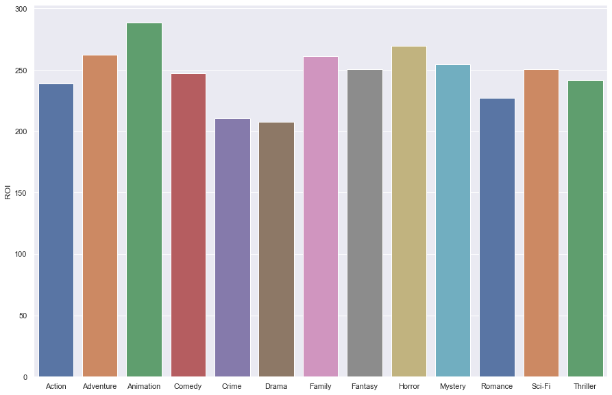


```python
df_genres_sub = df_genres_net[(df_genres_net['Genres'] == 'Sci-Fi') | (df_genres_net['Genres'] == 'Adventure')
                             | (df_genres_net['Genres'] == 'Animation') | (df_genres_net['Genres'] == 'Action')
                             | (df_genres_net['Genres'] == 'Family') | (df_genres_net['Genres'] == 'Fantasy')]

```


```python
fig, ax = plt.subplots(figsize=(15,10))
sns.lineplot(x='Year', y='Worldwide_Net', hue='Genres', 
             data=df_genres_sub, err_style=None);
```


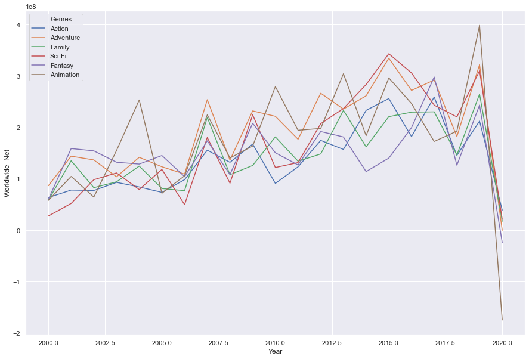


```python
q1_gen = np.percentile(df_genres_sub['Worldwide_Net'], 25)
q3_gen = np.percentile(df_genres_sub['Worldwide_Net'], 75)
IQR_gen = q3_gen - q1_gen
minimum_gen = q1_gen - (IQR_gen * 1.5)
maximum_gen = q3_gen + (IQR_gen * 1.5)
```


```python
df_gen_fixed = df_genres_sub[(df_genres_sub['Worldwide_Net'] >= minimum_gen) 
                             & (df_genres_sub['Worldwide_Net'] <= maximum_gen)]
```


```python
fig, ax = plt.subplots(figsize=(15,10))
sns.boxplot(x="Genres", y="Worldwide_Net",
            hue="Genres", palette=["m", "g"],
            data=df_gen_fixed);
```


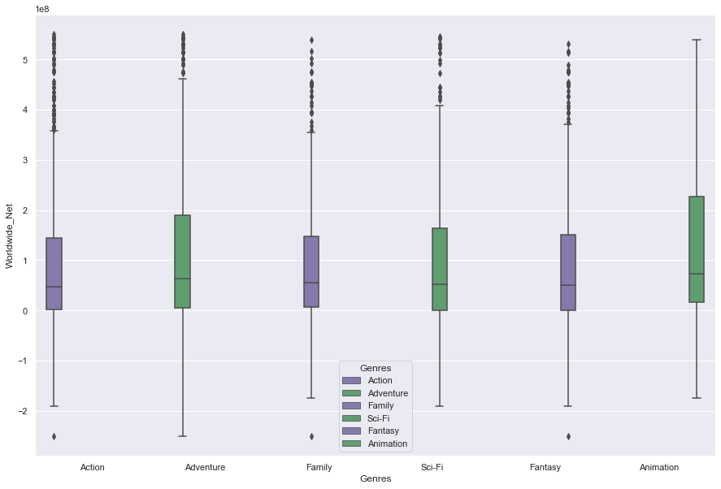


## Stacked bar chart showing different genres over the years based on net gross

# Q3: What is the best release month?


```python
df.head()
```


<div>
<style scoped>
    .dataframe tbody tr th:only-of-type {
        vertical-align: middle;
    }

    .dataframe tbody tr th {
        vertical-align: top;
    }

    .dataframe thead th {
        text-align: right;
    }
</style>
<table border="1" class="dataframe">
  <thead>
    <tr style="text-align: right;">
      <th></th>
      <th>Year_Rank</th>
      <th>Title</th>
      <th>Worldwide_Gross</th>
      <th>Domestic</th>
      <th>Percent_Domestic</th>
      <th>Foreign</th>
      <th>Percent_Foreign</th>
      <th>Year</th>
      <th>Domestic Distributor</th>
      <th>Domestic Opening</th>
      <th>Budget</th>
      <th>Earliest Release Date</th>
      <th>MPAA</th>
      <th>Running Time</th>
      <th>Genres</th>
      <th>Budget_notna</th>
      <th>Earliest Release Month</th>
    </tr>
  </thead>
  <tbody>
    <tr>
      <td>0</td>
      <td>1</td>
      <td>Bad Boys for Life</td>
      <td>419074646</td>
      <td>204417855</td>
      <td>48.8%</td>
      <td>214656791</td>
      <td>51.2%</td>
      <td>2020</td>
      <td>Sony Pictures Entertainment (SPE)See full comp...</td>
      <td>62504105</td>
      <td>90000000</td>
      <td>January 15, 2020\n            (LATAM, APAC)</td>
      <td>R</td>
      <td>124</td>
      <td>[Action, Comedy, Crime, Thriller]</td>
      <td>True</td>
      <td>January</td>
    </tr>
    <tr>
      <td>1</td>
      <td>2</td>
      <td>Sonic the Hedgehog</td>
      <td>306766470</td>
      <td>146066470</td>
      <td>47.6%</td>
      <td>160700000</td>
      <td>52.4%</td>
      <td>2020</td>
      <td>Paramount PicturesSee full company information...</td>
      <td>58018348</td>
      <td>85000000</td>
      <td>February 12, 2020\n            (APAC, EMEA)</td>
      <td>PG</td>
      <td>99</td>
      <td>[Action, Adventure, Comedy, Family, Sci-Fi]</td>
      <td>True</td>
      <td>February</td>
    </tr>
    <tr>
      <td>2</td>
      <td>3</td>
      <td>Dolittle</td>
      <td>224752486</td>
      <td>77047065</td>
      <td>34.3%</td>
      <td>147705421</td>
      <td>65.7%</td>
      <td>2020</td>
      <td>Universal PicturesSee full company information...</td>
      <td>21844045</td>
      <td>175000000</td>
      <td>January 8, 2020\n            (South Korea)</td>
      <td>PG</td>
      <td>101</td>
      <td>[Adventure, Comedy, Family, Fantasy]</td>
      <td>True</td>
      <td>January</td>
    </tr>
    <tr>
      <td>3</td>
      <td>4</td>
      <td>Birds of Prey: And the Fantabulous Emancipatio...</td>
      <td>201858461</td>
      <td>84158461</td>
      <td>41.7%</td>
      <td>117700000</td>
      <td>58.3%</td>
      <td>2020</td>
      <td>Warner Bros.See full company information\n\n</td>
      <td>33010017</td>
      <td>84500000</td>
      <td>February 5, 2020\n            (APAC, EMEA)</td>
      <td>R</td>
      <td>109</td>
      <td>[Action, Adventure, Crime]</td>
      <td>True</td>
      <td>February</td>
    </tr>
    <tr>
      <td>4</td>
      <td>5</td>
      <td>The Invisible Man</td>
      <td>128251913</td>
      <td>64914050</td>
      <td>50.6%</td>
      <td>63337863</td>
      <td>49.4%</td>
      <td>2020</td>
      <td>Universal PicturesSee full company information...</td>
      <td>28205665</td>
      <td>7000000</td>
      <td>February 26, 2020\n            (EMEA, APAC)</td>
      <td>R</td>
      <td>124</td>
      <td>[Horror, Mystery, Sci-Fi, Thriller]</td>
      <td>True</td>
      <td>February</td>
    </tr>
  </tbody>
</table>
</div>


```python
df_budgets.head()
```


<div>
<style scoped>
    .dataframe tbody tr th:only-of-type {
        vertical-align: middle;
    }

    .dataframe tbody tr th {
        vertical-align: top;
    }

    .dataframe thead th {
        text-align: right;
    }
</style>
<table border="1" class="dataframe">
  <thead>
    <tr style="text-align: right;">
      <th></th>
      <th>Year_Rank</th>
      <th>Title</th>
      <th>Worldwide_Gross</th>
      <th>Domestic</th>
      <th>Percent_Domestic</th>
      <th>Foreign</th>
      <th>Percent_Foreign</th>
      <th>Year</th>
      <th>Domestic Distributor</th>
      <th>Domestic Opening</th>
      <th>Budget</th>
      <th>Earliest Release Date</th>
      <th>MPAA</th>
      <th>Running Time</th>
      <th>Genres</th>
      <th>Budget_notna</th>
      <th>Earliest Release Month</th>
      <th>Worldwide_Net</th>
      <th>ROI</th>
    </tr>
  </thead>
  <tbody>
    <tr>
      <td>0</td>
      <td>1</td>
      <td>Bad Boys for Life</td>
      <td>419074646</td>
      <td>204417855</td>
      <td>48.8%</td>
      <td>214656791</td>
      <td>51.2%</td>
      <td>2020</td>
      <td>Sony Pictures Entertainment (SPE)See full comp...</td>
      <td>62504105</td>
      <td>90000000</td>
      <td>January 15, 2020\n            (LATAM, APAC)</td>
      <td>R</td>
      <td>124</td>
      <td>[Action, Comedy, Crime, Thriller]</td>
      <td>True</td>
      <td>January</td>
      <td>329074646</td>
      <td>465.638</td>
    </tr>
    <tr>
      <td>1</td>
      <td>2</td>
      <td>Sonic the Hedgehog</td>
      <td>306766470</td>
      <td>146066470</td>
      <td>47.6%</td>
      <td>160700000</td>
      <td>52.4%</td>
      <td>2020</td>
      <td>Paramount PicturesSee full company information...</td>
      <td>58018348</td>
      <td>85000000</td>
      <td>February 12, 2020\n            (APAC, EMEA)</td>
      <td>PG</td>
      <td>99</td>
      <td>[Action, Adventure, Comedy, Family, Sci-Fi]</td>
      <td>True</td>
      <td>February</td>
      <td>221766470</td>
      <td>360.902</td>
    </tr>
    <tr>
      <td>2</td>
      <td>3</td>
      <td>Dolittle</td>
      <td>224752486</td>
      <td>77047065</td>
      <td>34.3%</td>
      <td>147705421</td>
      <td>65.7%</td>
      <td>2020</td>
      <td>Universal PicturesSee full company information...</td>
      <td>21844045</td>
      <td>175000000</td>
      <td>January 8, 2020\n            (South Korea)</td>
      <td>PG</td>
      <td>101</td>
      <td>[Adventure, Comedy, Family, Fantasy]</td>
      <td>True</td>
      <td>January</td>
      <td>49752486</td>
      <td>128.430</td>
    </tr>
    <tr>
      <td>3</td>
      <td>4</td>
      <td>Birds of Prey: And the Fantabulous Emancipatio...</td>
      <td>201858461</td>
      <td>84158461</td>
      <td>41.7%</td>
      <td>117700000</td>
      <td>58.3%</td>
      <td>2020</td>
      <td>Warner Bros.See full company information\n\n</td>
      <td>33010017</td>
      <td>84500000</td>
      <td>February 5, 2020\n            (APAC, EMEA)</td>
      <td>R</td>
      <td>109</td>
      <td>[Action, Adventure, Crime]</td>
      <td>True</td>
      <td>February</td>
      <td>117358461</td>
      <td>238.886</td>
    </tr>
    <tr>
      <td>4</td>
      <td>5</td>
      <td>The Invisible Man</td>
      <td>128251913</td>
      <td>64914050</td>
      <td>50.6%</td>
      <td>63337863</td>
      <td>49.4%</td>
      <td>2020</td>
      <td>Universal PicturesSee full company information...</td>
      <td>28205665</td>
      <td>7000000</td>
      <td>February 26, 2020\n            (EMEA, APAC)</td>
      <td>R</td>
      <td>124</td>
      <td>[Horror, Mystery, Sci-Fi, Thriller]</td>
      <td>True</td>
      <td>February</td>
      <td>121251913</td>
      <td>1832.170</td>
    </tr>
  </tbody>
</table>
</div>


```python
counts = df['Earliest Release Month'].value_counts()
counts_df = counts.to_frame().reset_index()
```


```python
counts_df.columns = ['Month', 'Number of Movies']
counts_df.set_index('Month').plot(kind='bar')
```


    <matplotlib.axes._subplots.AxesSubplot at 0x24b21ebb5c0>


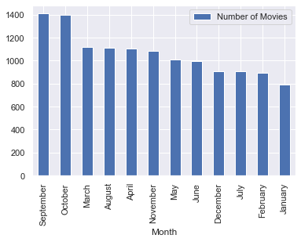


```python
month_order = ['January', 'February', 'March', 'April', 'May', 'June', 'July', 'August',
              'September', 'October', 'November', 'December']
fig, ax = plt.subplots(figsize=(10,8))
sns.barplot(data=counts_df, x='Month', y='Number of Movies', order=month_order);
```


    <matplotlib.axes._subplots.AxesSubplot at 0x24b2205f128>


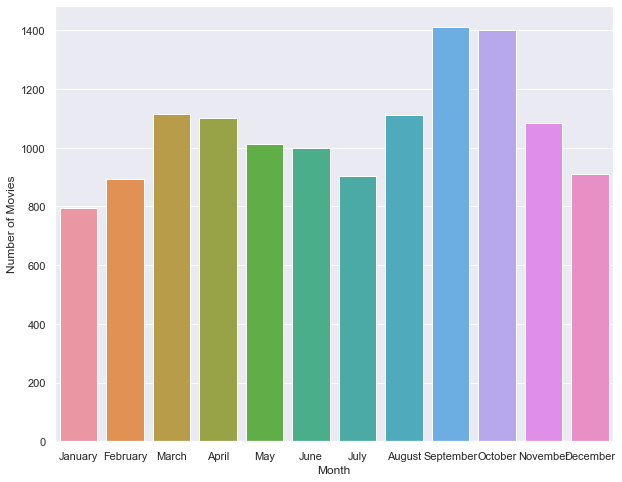


```python
counts_sub = df_budgets['Earliest Release Month'].value_counts()
counts_sub_df = counts_sub.to_frame().reset_index()
counts_sub_df.columns = ['Month', 'Number of Movies']
counts_sub_df.set_index('Month')
```


<div>
<style scoped>
    .dataframe tbody tr th:only-of-type {
        vertical-align: middle;
    }

    .dataframe tbody tr th {
        vertical-align: top;
    }

    .dataframe thead th {
        text-align: right;
    }
</style>
<table border="1" class="dataframe">
  <thead>
    <tr style="text-align: right;">
      <th></th>
      <th>Number of Movies</th>
    </tr>
    <tr>
      <th>Month</th>
      <th></th>
    </tr>
  </thead>
  <tbody>
    <tr>
      <td>October</td>
      <td>307</td>
    </tr>
    <tr>
      <td>September</td>
      <td>268</td>
    </tr>
    <tr>
      <td>December</td>
      <td>267</td>
    </tr>
    <tr>
      <td>August</td>
      <td>245</td>
    </tr>
    <tr>
      <td>November</td>
      <td>238</td>
    </tr>
    <tr>
      <td>June</td>
      <td>237</td>
    </tr>
    <tr>
      <td>April</td>
      <td>235</td>
    </tr>
    <tr>
      <td>March</td>
      <td>225</td>
    </tr>
    <tr>
      <td>February</td>
      <td>211</td>
    </tr>
    <tr>
      <td>July</td>
      <td>211</td>
    </tr>
    <tr>
      <td>May</td>
      <td>207</td>
    </tr>
    <tr>
      <td>January</td>
      <td>166</td>
    </tr>
  </tbody>
</table>
</div>


```python
month_order = ['January', 'February', 'March', 'April', 'May', 'June', 'July', 'August',
              'September', 'October', 'November', 'December']
fig, ax = plt.subplots(figsize=(10,8))
sns.barplot(data=counts_sub_df, x='Month', y='Number of Movies', order=month_order);
```


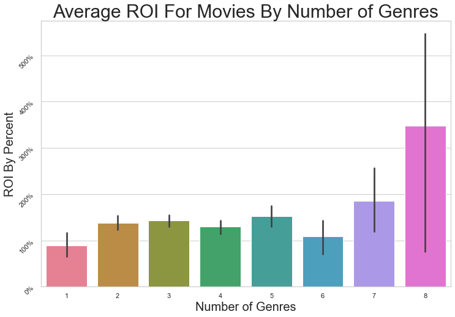


```python
sns.catplot(x="Earliest Release Month", y="ROI", data=df_roi_fixed);
```


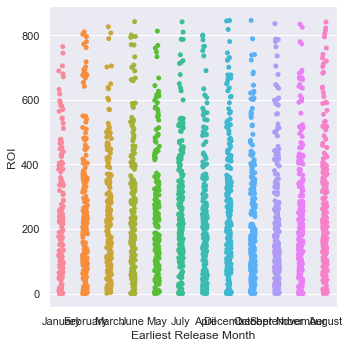


```python
month_order = ['January', 'February', 'March', 'April', 'May', 'June', 'July', 'August',
              'September', 'October', 'November', 'December']
fig, ax = plt.subplots(figsize=(12,8))
sns.barplot(x='Earliest Release Month', y='Worldwide_Net', data=df_budgets, ci=68, order=month_order, palette="deep");
```


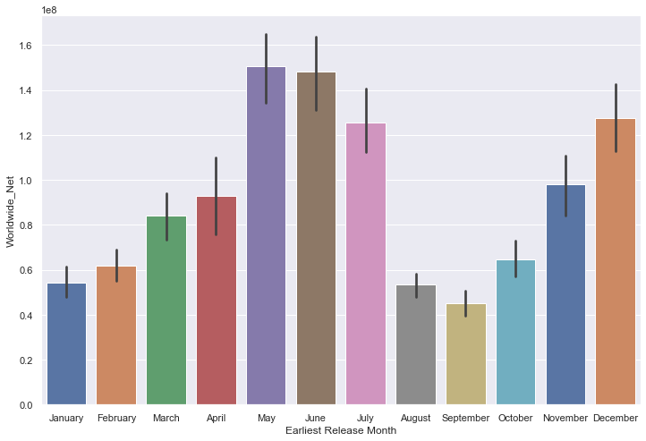


```python
fig, ax = plt.subplots(figsize=(15,10))
sns.lineplot(x='Earliest Release Month', y='Worldwide_Net', hue='Genres', 
             data=df_genres_net, err_style=None);
```


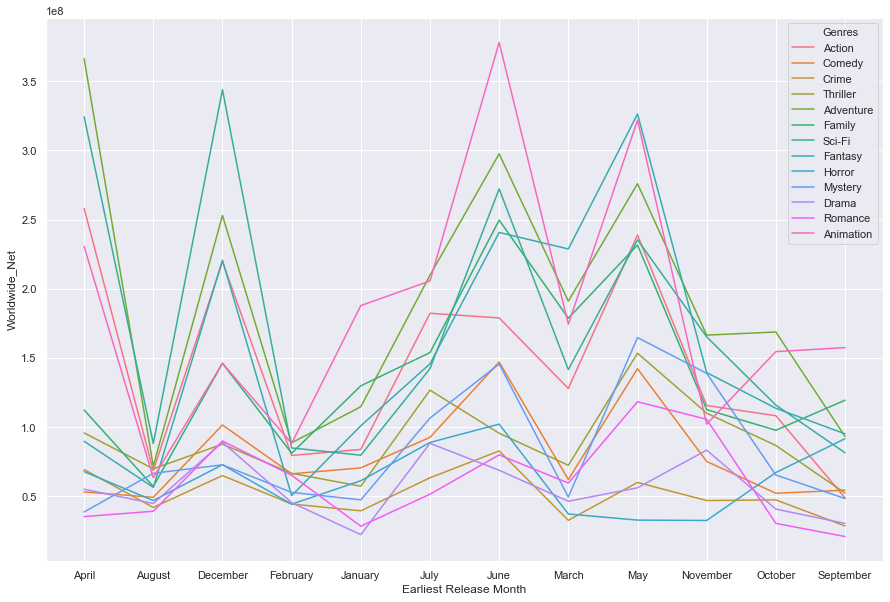


```python
fig, ax = plt.subplots(figsize=(15,10))
sns.lineplot(x='Earliest Release Month', y='Worldwide_Net', hue='Genres', 
             data=df_genres_sub, err_style=None);
```


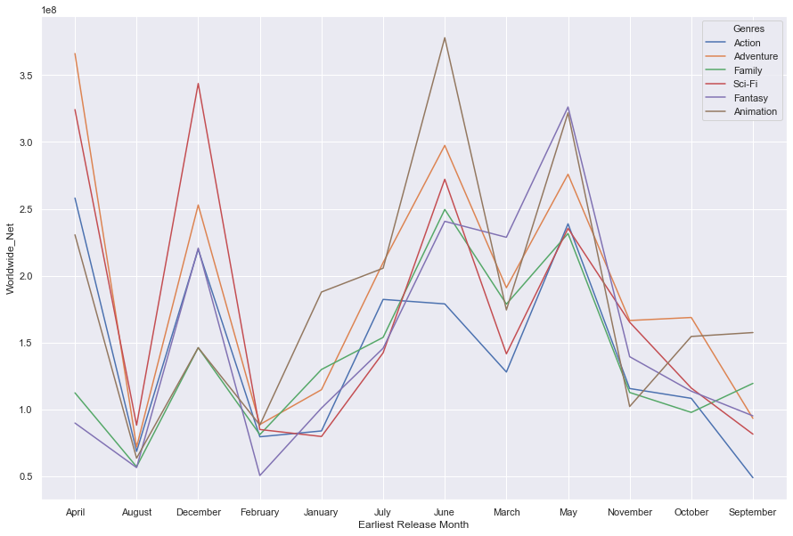


```python
y = df_roi_fixed.groupby(['Earliest Release Month'])['ROI'].mean()
x = ['April', 'August', 'December', 'February', 'January', 'July', 
     'June', 'March', 'May', 'November', 'October', 'Septebmer']
fig, ax = plt.subplots(figsize=(15,10))
sns.barplot(x=x, y=y, palette="deep");
```


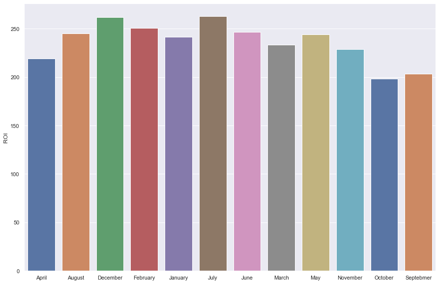


```python
fig, ax = plt.subplots(figsize=(15,10))
sns.lineplot(x='Earliest Release Month', y='ROI', hue='Genres', 
             data=df_genres_roi, err_style=None);
```


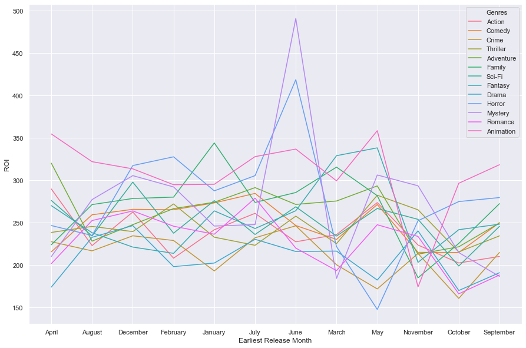


```python
fig, ax = plt.subplots(figsize=(15,10))
sns.lineplot(x='Earliest Release Month', y='Worldwide_Net', hue='Genres', 
             data=df_genres_sub, err_style=None);
```


## Release month recommendations

Once again we see Adventure, Sci-Fi, Animation, Action, Family, and Fantasy genres top the list in the net gross categories for every month. 

From a net perspective, the worst month to release a movie is September. The best month would be May or June.

From an ROI perspective June is a good month to release a horror or mystery film. 

The best month by genre: 

Action - April

Adventure - April

Animation - June

Family - June

Fantasy - May

Sci-Fi - December


# Q4: What MPAA rating should the movie be?


```python
sns.relplot(x="ROI", y="Worldwide_Net", hue="MPAA",
            sizes=(40, 400), alpha=.5, palette="muted",
            height=6, data=df_roi_fixed, size=6, aspect=2);
```


    <seaborn.axisgrid.FacetGrid at 0x24b2199d320>


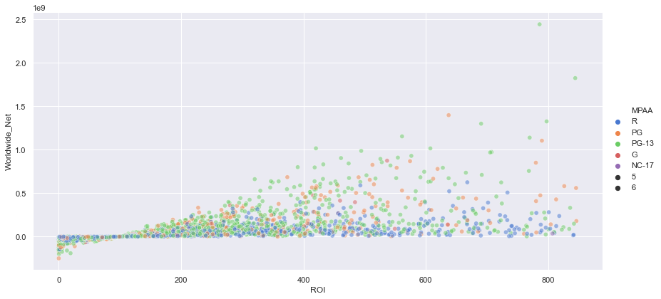


```python
fig, ax = plt.subplots(figsize=(15,10))
sns.boxplot(x="MPAA", y="ROI",
            hue="MPAA", palette=["m", "g"],
            data=df_roi_fixed);
```


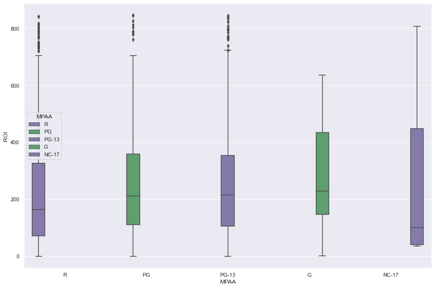


```python
fig, ax = plt.subplots(figsize=(15,10))
sns.boxplot(x="MPAA", y="Worldwide_Net",
            hue="MPAA", palette=["m", "g"],
            data=df_budgets);
```


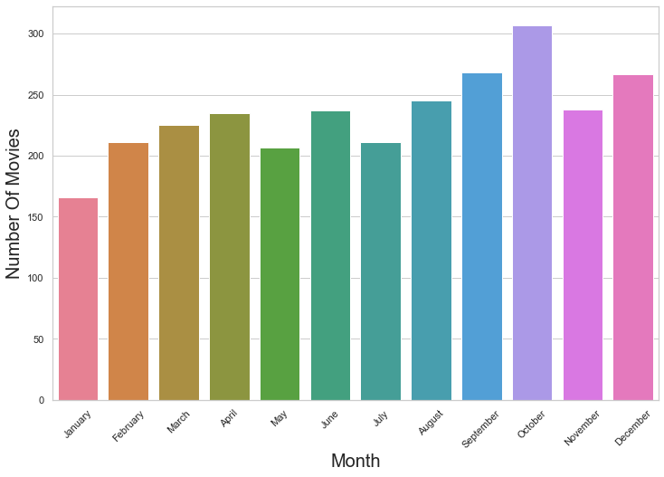


```python
f, ax = plt.subplots(figsize=(20, 10))
sns.despine(f, left=True, bottom=True)
sns.scatterplot(x="Year", y="ROI",
                hue="MPAA",
                palette="husl",
                sizes=(1, 8), linewidth=0,
                data=df_roi_fixed, ax=ax);
```


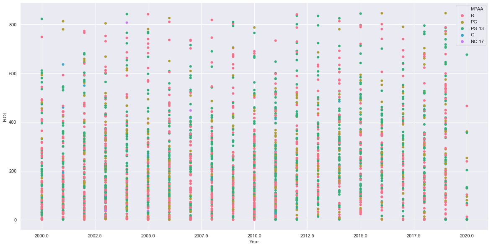


```python
sns.swarmplot(x="ROI", y="Worldwide_Net", hue="MPAA",
              palette=["r", "c", "y"], data=df_roi_fixed)
```


    ---------------------------------------------------------------------------

    TypeError                                 Traceback (most recent call last)

    ~\anaconda3\envs\learn-env\lib\site-packages\pandas\core\series.py in __setitem__(self, key, value)
       1013         try:
    -> 1014             self._set_with_engine(key, value)
       1015         except com.SettingWithCopyError:
    

    ~\anaconda3\envs\learn-env\lib\site-packages\pandas\core\series.py in _set_with_engine(self, key, value)
       1053         try:
    -> 1054             self.index._engine.set_value(values, key, value)
       1055             return
    

    pandas\_libs\index.pyx in pandas._libs.index.IndexEngine.set_value()
    

    pandas\_libs\index.pyx in pandas._libs.index.IndexEngine.set_value()
    

    pandas\_libs\index.pyx in pandas._libs.index.IndexEngine.get_loc()
    

    TypeError: '5342    True
    Name: MPAA, dtype: bool' is an invalid key

    
    During handling of the above exception, another exception occurred:
    

    KeyboardInterrupt                         Traceback (most recent call last)

    <ipython-input-74-ec24c1d15721> in <module>
          1 sns.swarmplot(x="ROI", y="Worldwide_Net", hue="MPAA",
    ----> 2               palette=["r", "c", "y"], data=df_roi_fixed)
    

    ~\anaconda3\envs\learn-env\lib\site-packages\seaborn\categorical.py in swarmplot(x, y, hue, data, order, hue_order, dodge, orient, color, palette, size, edgecolor, linewidth, ax, **kwargs)
       2986                        linewidth=linewidth))
       2987 
    -> 2988     plotter.plot(ax, kwargs)
       2989     return ax
       2990 
    

    ~\anaconda3\envs\learn-env\lib\site-packages\seaborn\categorical.py in plot(self, ax, kws)
       1438     def plot(self, ax, kws):
       1439         """Make the full plot."""
    -> 1440         self.draw_swarmplot(ax, kws)
       1441         self.add_legend_data(ax)
       1442         self.annotate_axes(ax)
    

    ~\anaconda3\envs\learn-env\lib\site-packages\seaborn\categorical.py in draw_swarmplot(self, ax, kws)
       1383 
       1384                 swarm_data = np.asarray(group_data[hue_mask])
    -> 1385                 point_colors = np.asarray(self.point_colors[i][hue_mask])
       1386 
       1387                 # Sort the points for the beeswarm algorithm
    

    ~\anaconda3\envs\learn-env\lib\site-packages\seaborn\categorical.py in point_colors(self)
       1105                     # hue_color = self.colors[j]
       1106                     if group_data.size:
    -> 1107                         group_colors[self.plot_hues[i] == level] = j
       1108 
       1109             point_colors.append(group_colors)
    

    ~\anaconda3\envs\learn-env\lib\site-packages\pandas\core\series.py in __setitem__(self, key, value)
       1035                 key = check_bool_indexer(self.index, key)
       1036                 try:
    -> 1037                     self._where(~key, value, inplace=True)
       1038                     return
       1039                 except InvalidIndexError:
    

    ~\anaconda3\envs\learn-env\lib\site-packages\pandas\core\generic.py in _where(self, cond, other, inplace, axis, level, errors, try_cast)
       8664         # make sure we are boolean
       8665         fill_value = bool(inplace)
    -> 8666         cond = cond.fillna(fill_value)
       8667 
       8668         msg = "Boolean array expected for the condition, not {dtype}"
    

    ~\anaconda3\envs\learn-env\lib\site-packages\pandas\core\series.py in fillna(self, value, method, axis, inplace, limit, downcast)
       4157             inplace=inplace,
       4158             limit=limit,
    -> 4159             downcast=downcast,
       4160         )
       4161 
    

    ~\anaconda3\envs\learn-env\lib\site-packages\pandas\core\generic.py in fillna(self, value, method, axis, inplace, limit, downcast)
       6214 
       6215                 new_data = self._data.fillna(
    -> 6216                     value=value, limit=limit, inplace=inplace, downcast=downcast
       6217                 )
       6218 
    

    ~\anaconda3\envs\learn-env\lib\site-packages\pandas\core\internals\managers.py in fillna(self, **kwargs)
        574 
        575     def fillna(self, **kwargs):
    --> 576         return self.apply("fillna", **kwargs)
        577 
        578     def downcast(self, **kwargs):
    

    ~\anaconda3\envs\learn-env\lib\site-packages\pandas\core\internals\managers.py in apply(self, f, filter, **kwargs)
        440                 applied = b.apply(f, **kwargs)
        441             else:
    --> 442                 applied = getattr(b, f)(**kwargs)
        443             result_blocks = _extend_blocks(applied, result_blocks)
        444 
    

    ~\anaconda3\envs\learn-env\lib\site-packages\pandas\core\internals\blocks.py in fillna(self, value, limit, inplace, downcast)
        411         inplace = validate_bool_kwarg(inplace, "inplace")
        412 
    --> 413         mask = isna(self.values)
        414         if limit is not None:
        415             limit = libalgos._validate_limit(None, limit=limit)
    

    ~\anaconda3\envs\learn-env\lib\site-packages\pandas\core\dtypes\missing.py in isna(obj)
        124     Name: 1, dtype: bool
        125     """
    --> 126     return _isna(obj)
        127 
        128 
    

    ~\anaconda3\envs\learn-env\lib\site-packages\pandas\core\dtypes\missing.py in _isna_new(obj)
        150         ),
        151     ):
    --> 152         return _isna_ndarraylike(obj)
        153     elif isinstance(obj, ABCGeneric):
        154         return obj._constructor(obj._data.isna(func=isna))
    

    ~\anaconda3\envs\learn-env\lib\site-packages\pandas\core\dtypes\missing.py in _isna_ndarraylike(obj)
        260         result = values.view("i8") == iNaT
        261     else:
    --> 262         result = np.isnan(values)
        263 
        264     # box
    

    KeyboardInterrupt: 


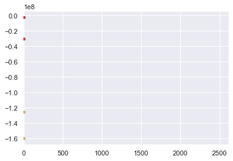


```python
df_roi_fixed['MPAA'] = df_roi_fixed['MPAA'].astype('str')
```

    C:\Users\drudi\anaconda3\envs\learn-env\lib\site-packages\ipykernel_launcher.py:1: SettingWithCopyWarning: 
    A value is trying to be set on a copy of a slice from a DataFrame.
    Try using .loc[row_indexer,col_indexer] = value instead
    
    See the caveats in the documentation: https://pandas.pydata.org/pandas-docs/stable/user_guide/indexing.html#returning-a-view-versus-a-copy
      """Entry point for launching an IPython kernel.
    
